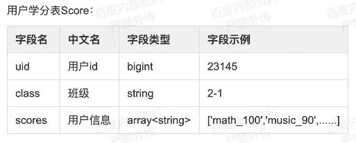

# 1 头条面试题

## **1.1** 学长 **1**

1.  技术部分

    1.  WordCount 的实现过程

    2.  MR 与 Spark 的区别

    3.  Spark 在 Client 与在集群运行的区别

    4.  相同的 SQL 在 HiveSql 与 SparkSQL 的实现中，为什么 Spark 比 Hadoop 快

    5.  自定义 UDF

    6.  设计 HBase 表需要注意的点

    7.  HBase 的 hlog

    8.  数据同样存在 HDFS，为什么 HBase 支持在线查询

    9.  数据从 Hive 中用 SparkSql 进行操作有遇到什么问题？类似兼容性的问题。

    10. SparkStream 与 Strom，Flink 与什么区别

    11. 有三个 map，一个 reduce 来做 top10，哪种方法最优。数据量特别大。

2.  项目的架构

    1.  数据仓库的模型设计

    2.  数据仓库的数据清洗

    3.  业务建模、数据分析方法。

    4.  数据仓库是怎么设计的

    5.  数仓规范设计哪些方面(字段、维度，存储压缩、数据保留机制)

    6.  数仓质量怎么监控(数据质量管理系统，主键唯一、非空、数据波动)

    7.  数仓主题分哪些(按照公司业务归类：申请单、客户信息、合同信息、放款、还款、余额、逾期等)

    8.  数仓拉链表的原理

    9.  有没有遇到数据倾斜的问题（场景、解决方式）

    10. 数仓重点调度任务的保障方式（调度系统优先级）

    11. 数仓任务报错和监控（调度系统捕捉错误，电话短信告之值班人员）

## **1.2** 学长 **2**

1.  技术部分

    1.  自我介绍

    2.  写 map-reduce，两份数据，一份是设备 id+用户 id，一份是设备
        id+点击的广告+ 点击时间，找出每个用户 id 每天 10 条最新的广告点击记录

    3.  说下多线程和多进程

    4.  fork 命令

2.  算法部分

    1.  hashmap 和 map，hash 实现原理（hashmap 基于哈希，查找 O（1）；map
        基于树，

查找 O（logn）；hash 实现采用数组，偏移地址使得查找满足
O（1），无论是再哈希还是链表法解决冲突，都需要存储 key 和 value）

## **1.3** 学长 **3**

1.  MySQL 引擎是什么，常用的是哪个 innodb，知道原理吗

2.  MySQL 优化，怎么建索引？选择合适的字段属性。对于某些文本字段可以设成

ENUM 类型（MySQL 中被当做数值型数据来处理）。使用连接 join 代替子查询
。使用索引：innodb 支持哈希索引、b+树索引、全文索引。

>   BTree 和 B+Tree

1.  手写 sql...

user_id login_date

1 20200325

>   查询出用户连续三天登录的用户

>   表 A 字段 a 值 1234 表 B 字段 b 值 11235

>   Join 输出的结果

>   Left join 输出的结果

1.  Sqoop 导入数据是增量怎么实现

2.  Flume 事务实现

3.  Kafka 消费者角度考虑是拉取数据还是推送数据

4.  Kafka 中的数据是有序的吗

5.  Kafka 数据推送失败怎么处理

6.  Kafka 保证生产者精准一次

7.  没有接受到 ack 才会出现声明情况

8.  Kafka 数据重复怎么处理

9.  Spark Streaming 怎么里面实现精准一次消费

10. 如果 offset 没有发送成功数据会怎样

11. Hive 的优化，项目中怎么优化的(我说了 join 的一些优化)

12. 然后就问了用 MR 怎么实现 join,手写代码

13. 数据倾斜怎么处理的，

14. 碰到过 oom 情况吗，什么原因导致的，怎么处理的

15. Hbase 有那些组件，

16. 什么场景会用到 Hbase

17. Hbase 的读写流程，大概说一下

18. Spark,任务提交的流程，

19. Spark 的两种核心 Shuffle，未优化的和优化的

20. 常用的数据结构都有哪些，怎么实现一个 list, 怎么实现一个 map

    map 一般什么场景使用

    用过树这种结构吗，什么场景用到的

21. 算法

    字符串中第一个出现三次且仅出现三次反转一个链表

    两个链表第一次交叉的节点，

22. 用 Cannal 监控 mysql 之后，Scala 怎么通过 SparkStreaming 去消费的

23. 你们这个项目 spark 计算完之后存 HBase 怎么设计的

24. HBase 你们在项目中怎么设计 rowkey 的

## **1.4** 学长 **4**

一面

1.  算法：给 2 个有序数组，合并成一个有序数组

    延伸：给 n 个有序数组，合并成一个有序数组

2.  sql:

    班级 学号 科目 分数

    求某个班级总分最高的前五名其他：

3.  精准一次性消费

4.  数据倾斜二面

5.  主要问项目中是否丢数据，怎么做的数据治理，监控，问了一个算法，一个 SQL

6.  算法是有序数组查找目标值，我的做法是二分查找

7.  sql 是给用户的观看视频的时长，统计观看时间在 0-1 分钟的用户数，1-10 分钟的

用户数

三面：

1.  选型为什么是 spark 而不是 Flink，有哪些优缺点（我项目上写的 spark）

2.  HBASE 为什么快（列式存储，内存，lsm 树）

3.  消费不到 kafka 数据怎么办

4.  kafka 怎么监控，重分区

5.  g1 回收器和 cms 区别

6.  jvm 调整过没有

## **1.5** 学长 **5**

>   一面

1.  讲述项目；

2.  rdd 手写 key 的 top10, 比如 user_id, score， 求成绩的 top10；

3.  spark-sql 手写个 dateframe 的 demo

    sql 题目

    字段：department_id, user_id, amount

    求出来每个部门，每个人的薪资占部门薪资的比例，
    一个简单的开窗函数实现的手写个 udf 函数？

表的字段 report_date, map_info(map 类型的数据类型， key 是时间，value
是金额)，计算大于当前 report_date 的所有金额增加字段 report_date,
map_info，count 增加计算个 count 数量 又怎么处理？

>   然后，说那你能写个 UDF 函数实现吗？

>   算法题： 最长回文子串. 给定一个字符串 s，找到 s 中最长的回文子串答案：

>   def get_longest_str(s):

>   n = len(s) dp = [[False] \* n for \_ in range(n)] res_str = ""

>   for ele in range(n): \# ele 代表 i 和 j 的间隔 for i in range(n): \#通过
>   j=i+ele 得到子串的结束位置，对角线斜着一行一行的

处理

>   j = i + ele if j \>= n: break if ele == 0:

dp[i][j] = True \# 单个元素为 true

>   elif ele == 1:

dp[i][j] = (s[i] == s[j]) \# 两个元素 判断两个值是否相等

>   else:

dp[i][j] = (dp[i + 1][j - 1] and s[i] == s[j]) \# 如果当前元素相等, 则比

较之前的元素

if dp[i][j] and ele + 1 \> len(res_str): \# 上次 ans 就是上次的 j-i 的长度

res_str = s[i:j + 1]

>   return res_str

### 1.6 头条猎头

>   1.数据仓库的基础理论:建模,分层

>   2.flink 容错机制

>   3.spark 调优，数据倾斜的处理方式

>   4.sql 编程考察

>   5.算法:聚类 kmeans

>   6.二叉树算法

>   7.Java 线程问题，包括线程安全，锁，和线程池，问得很细。

>   8.Hbasse 和 mysql 区别和存储原理

>   9.kafka 的底层原理，kafka 如何保证全局消费数据有序

>   10.redis 底层原理，如何预估数据量

>   11.yarn 底层原理，执行流程和，yarn 底层使用的算法

>   12.算法基础建模有哪些，如何进行数据挖掘

>   13.链表反转排序 leetcode 原题

>   14.sql 连续日期活跃用户

>   15.hive udf udaf udtf spark

>   16.任务提交过程

>   17.回文函数

>   18.hive 数据倾斜

>   19.redis 跳表

>   20.spring ioc

>   21.spring 需要单例设置的参数

>   22.线程池几个配置参数含义

>   23.mysql 事务 a b 客户端提交事务处理

>   24.storm 实时

>   25.java 并发包

>   26.hive 如何转 mr

>   27.线程 可重入理解

>   28.算法题 一个 LRU 一个深度优先搜索

29.flink 的 watermark shardGroup 的概念

>   30.kafka 如何保证消息的有序行高可用

>   31.数据倾斜如何处理

>   32.flink watermark 和 barries 和 checkpoint

>   33.flink 和 spark 的区别

>   34.jvm 常见的垃圾回收算法

>   35.heap 怎么分带的

>   36.kafka 调优

# 2 腾讯面试题

## **2.1** 学长 **1**

**1**）笔试部分

1.  有一表名 t_sh_mtt_netdisk_log，从表名可以看出该表是什么业务的，是什么周期

粒度的表。

1.  怎么查看表结构，表创建语句？怎么查看表有哪些分区？怎么查看分区对应 hdfs
    路径？怎么计算某个分区的数据量大小？怎么计算某个分区的文件总数？

2.  有一 hive sql，怎么计算这个 sql 会产生多少个 map 数？

3.  怎么查看 hive 有什么自带函数？怎么查看函数的详细信息？

4.  Hive 支持哪些基木数据类型？

5.  请指出下面两个语句读取分区 ds 数据的不同

    Select \* from t where ds=20150101 and province='gd' or province='ex'

    Select x fromt where ds 20150101 and（province='gd' or province='ex'）

6.  将字符串"keyl=valuel&key2=value2...keyn=valuen"进行分割放到一个字段里面，可

以查出任意一个 keyx 对应的 valuex 值。请写出查询语句，并计算总共有多少个 key
值。

1.  用一个字符串比如"alblc"来测试某个函数比如
    split（用\|分隔符将字符串进行分割）的语句

    （9）a 表和 b 表内连接，a 表为小表，只有 2000 行记录

    select a.\*from a Join b on a.key=b.key

    可以进行怎样的优化

    （10）a 表 left join b 表，b 表为小衣，可以进行怎样优化？

    scleet a.\*from a left join Join b ona.key=b.key

    如果 a 为小表，可以怎样优化？（11）请指出下面 sql 语句的区别

    select a.\* from a left Join b on a.key = b.key and a.ds=xxx and b.ds=xxx
    sclect a.\* from a lef Join b on a.key = b.key and b.ds=xxx select a.\* from
    a lef Join b on a.key = b.key and b.ds=xxx where a.ds=xxx

    Select a.\* from a left Join b on a.key = b.key where a.ds=xxx and b.ds=xxx

2.  多表连按的写法：a,.b,c 三个表内连接，连接字段都是 key，怎样写连接语句？

3.  两大表连接，发生了数据倾斜，有几个 reduce
    无法完成，怎么查找发生数据领斜的原因？应该怎样优化？

    语句：select t1.\*,nvl(t2.x,1) from t1 left join t2 on t1.guid=t2.guid

4.  两大表连接，发生了数据倾斜。有一个 reduce 无法完成，检直发现 t1 中 guid="
    的记录有很多，其他 guid 都不重复，这条语句该怎样优化？

    语句：select t1.\*,nvl(t2.x,1) from t1 left join t2 on t1.guid = t2.guid

5.  如何用 hive q！实现 sqL 中的 exist/in 子句 mysql 语句如下：

    SEL ECT a\* FROM a where a.key in（select dstinct key from b where key like
    ‘filter%’）

6.  sort by、distribute by、cluster by 和 order by 区别

    注：可参考数据工厂的“帮助中心》集群 hive》hive 使用优化》hive 使用注意事项”

## **2.2** 学长 **2**

**1**）笔试题

### 用 HiveSQL 实现

1.  全量用户登员日志表 t_login_all，字段信息
    ftime（登录日期）、openid（登录帐号）新增用户登录日志表
    t_login_new，字段信息
    ftime（登录日期）、openid（登录帐号）求每天新增用户次日、7 天、30 天留存率。

    （说明：7 天留存是指当天有登录且第 7 天还登录的用户）

2.  消息流水表 t_chat all，字段信息：

Ftime（日期）、send_user id（发消息用户 id）、receive.user id（接收消息用户
id）、 chat id（消息 id）、send.time（发消息时间）用户登录流水日志表
t_login_all，字段信息：

>   Ftime（日期）、user_id（用户 id）、login_id（登录
>   id）、login_loc（登录区服）、login_time

（登录时间）

>   求：每天有收发消息用户最近登录时间、登录区服，输出
>   ftime，user_id，login_loc，

login_time

### 用 Spark core 实现，写 Scala 脚本

1.  reduceByKey()、groupByKey()有什么区别？

2.  DataFrame 和 RDD 有什么区别？

3.  使用累加器，对数组
    Array(1,2,3,4)每个元素实现累加操作，最后打印输出求和结果。

4.  现有文件 file.txt，文件格式如下

    Order_id，user_id，payment，productid

5.  1768，50，155

6.  1218，600，211

7.  2239，788，242

8.  3101，288，599 5、4899，25，230 6、2311，890，981

    。。。。。。

    求 Top10 个 payment 字段的值

## **2.3** 学长 **3**

1.  技术部分

    1.  我看你上面写了你会 Spark，那你用 Spark 写一下刚刚那道题的代码（第 6
        题），

不能用 Spark SQL

1.  我看你上面有写到熟悉 Hive 原理和优化，你说一下怎么优化

    1.  优化有说到语句优化，然后又说回到 pv 和 uv 那个问题，假如说让你优化你怎么

优化（我代码里面有 count(distinct id) uv,）

1.  问了一些 Kafka
    的，我只记得一点点，问我数据会不会重复消费，什么情况下会重复消费

    1.  在 Hive 执行语句的时候如果很慢，什么原因造成

        我有提到数据倾斜的问题，他又问怎么解决数据倾斜

2.  项目部分

    1.  让你挑一个比较有亮点的项目详细说

    2.  你负责了什么，数仓中统计了哪些指标，

    3.  刚刚听你说项目里面有提到分层，如果我要你求每天商品的 pv，uv，从 ods 层到

dm 层它的具体流向，各层都统计了什么（后来让写求 pv，uv 的 sql 语句）

1.  场景部分

    1.  有一个分区表，表名 T，字段 qq，age，按天分区，让写出创建表的语句

    2.  刚刚的分区表，求 20200221 这个分区中，年龄第 N 大的 qq 号列表

    3.  有一个表，两个字段，分别是 qqa 和 qqb，数据如下：

        12,34 12,56 12,78 34,56 34,12

        找出所有互相关注的 qq 对

2.  手写部分

    1.  三个字段，timestamp，user_id，product_id，让求 pv
        最大的商品，写了之后又叫用 Scala 代码写一遍，然后又问，假如说只让你求 pv
        数大于 100 的 top3 呢，代码又怎么写

## **2.4** 学长 **4**

1.  技术部分

    1.  你们数仓用什么建模方法，说出常见的建模方法？

    2.  维度建模有什么好处？
        为什么选择这个？比如最后业务需求要增加一个维度，我们需要做什么工作？

    3.  怎么判断一个需求能不能实现，你们的判断标准是什么？需求变更要做什么

    4.  增加一个维度后发现查询的速度变得非常慢，是什么原因导致的？

    5.  你们 ADS 层的数据量每天的数据量有多大？ADS 层再 MySQL
        中的表是怎么创建的？有什么注意事项？索引怎么创建的？

    6.  你知道 Spark 的宽窄依赖吗？ 有没有把宽依赖转化为窄依赖的例子？

    7.  Spark 参数调优做了些什么 ？

2.  算法部分

    1.  一个 list [1,5,5,7,9] 去重，并计算时间空间复杂度

    2.  单链表的反转

# 3 阿里面试题

## **3.1** 学长 **1**

1.  技术部分

    1.  Spark 提交 job 流程

    2.  提交脚本中-jar 什么意思

    3.  Excutor 怎么获取 Task

    4.  详解 Hadoop 的 WordCount

    5.  Spark 做过哪些优化，（优化说完会问你为什么？原理是什么？）

    6.  Spark 内存管理

2.  算法部分

    1.  单向链表反转

    2.  实现堆栈 push Pop Min 复杂度 0（1）

    3.  实现一个队列，男女均衡最长的队列 复杂度 0（N）

## **3.2** 学长 **2**

阿里三面

第一题，亿级的交易订单量，每笔都有金额，快速找出
top1000，要求不是简单的排序然后求出 top1000，代码要有健壮性；提示注意是 top1000
不是 top10。Map 和 Reduce 分别做 Treemap

第二题：有两个约 1000 万行记录的 4 到 5G 文件，JVM 只有
32M，在内存不溢出的情况下，找出相似的条数并打印出来。布隆过滤器

>   第三题，有一个双十一的天猫场景，我要做实时和离线两种分析方向，从数据建模、计

算性能、元数据管理、数据质量上讲一讲基本架构设计成什么样子。

阿里四面

>   第一题，岛上有 100
>   个囚犯，他们都是蓝眼睛，但是他们都只能看到别人眼睛的颜色，

并不能知道自己的眼睛颜色，而且他们之间不能去谈论眼睛颜色的话题，规定每天晚上都可以有一个人去找守卫说出自己的眼睛颜色，如果错了被杀死，如果对了被释放。但是大家在没有十足的把握前都不敢去找守卫，有一天，一个医生对他们说你们之中至少有一个蓝眼睛，然后
N 天，这些人都获救了，为什么？这句话对他们有什么影响？

第二题，有 100
层楼梯，从其中一层摔下鸡蛋的时候鸡蛋会碎，并且次层之上的都会碎，次层之下的都不会碎，如果你有一个鸡蛋、两个鸡蛋、三个鸡蛋，你会怎么去找出这个楼层，最多要试多少次

### 3.3 学长 3（杭州）

1.  自我介绍

2.  技术部分

    1.  对未来的职业规划是怎样的？

    2.  数仓的流程？你所做的事情？

    3.  能讲一下做 DW 层的案例吗？如何建模的？

    4.  讲一下交易的例子吧？

    5.  做交易的话模型怎么设计的？

    6.  物流的信息，链路的跟踪在不在你的交易表里边？

    7.  退款的数据放在哪个表里？

    8.  数仓的模型 是怎么建模的？

    9.  记录交易的，整体的链路，到底设计了几张表？

    10. 拉链表的原理？

    11. 拉链表整合的方式？

    12. 你在之前的公司遇到的痛点有哪些？（我讲的数据倾斜）

    13. 数据倾斜怎么解决的啊？

    14. Join 的等倾斜，Join 的 key，关联键，如果倾斜的话，能直接打散，如果 Map
        端解决不了呢？Mapjoin 解决不了怎么办？两个都是大表怎么解决数据倾斜？

    15. MR 原理？

    16. Map 端做的最重要的事情是什么？

    17. 有没有其他你特别擅长的？

    18. 怎么提前你 SQL 写的特别好呢？

    19. 建索引要注意哪些事情？

    20. 你有啥要问我的吗？

# 4 百度面试题

## **4.1** 学长 **1**

1.  笔试部分

    1.  你可以得到网站访问记录，没条记录有 user
        IP，设计一个程序，要随时能计算出过去 5 分钟内访问次数最多的 1000 个 IP

    2.  简述 Paxos 协议

    3.  编程简单实现一个阻塞队列

    4.  简单实现一个 LRU 算法

    5.  有一个 5000 万的用户文件(user_id,name,age),一个 2
        亿记录的用户看电影的记录文

件(user_id,url),根据年龄段观看电影的次数进行排序？

1.  技术部分

    1.  Java 的 NIO 是否了解

    2.  Java 多线程（什么 wait、notify）

    3.  MapReduce 的 shuffle 过程（手画，边画边介绍），reduce 是怎么到 map
        端获取数据的（RPC 通信是否了解）

    4.  一句话介绍 MapReduce

    5.  Spark 做缓存时缓存在哪里

    6.  百度不用 Spark，只用 Hadoop 和
        MapReduce（至少这个部门是这样，这个部门的主要业务是做用户画像），把
        MapReduce 工作的各个阶段过程吃透

    7.  是否看过 Hadoop 源码

    8.  Linux 系统（常用命令啥的）

    9.  除了这些平时还接触或者学习哪些技术

2.  项目部分

    1.  业务架构

    2.  根据项目业务介绍技术

    3.  MapReduce 数据倾斜和内存溢出怎么办

3.  算法部分

    1.  手写归并排序

    2.  用递归实现斐波那契数列第 100 项的值（第一项和第二项分别为 0 和 1），手写

    3.  算法和数据结构了解到什么程度、知道多少

    4.  Java 中的数据结构，ArrayList 和 LinkedList 的区别，ArrayList
        为什么查询快（为什么用数组就快）、LinkedList 为什么增删快，哪些 Map
        是线程安全的

4.  手写代码部分

    1.  手写 MapReduce 的 WordCount（导入的包最好能记住）

5.  场景部分

    1.  遇到垃圾日志怎么办（假如说有人恶意制造日志，怎么处理。我说的黑名单机制，那个面试官貌似还挺满意）

## **4.2** 学长 **2**

1.  基本信息介绍

    1.  百度：视频面试

    2.  面试周期：5 天

    3.  面试次数：6 次

    4.  面试总时长：3 小时

2.  百度一面二面（印象中的一些问题）：

    1.  自定义 UDF、UDTF

    2.  如何确定计算数据的准确性？

    3.  建立数仓的目的

    4.  自定义拦截器步骤

    5.  SpringMVC

    6.  设计网站前后端交互问题

    7.  Linux 常用命令

3.  百度三面（部门负责人）：

    1.  在没有 PM 的情况下如何对指标做拆分去分析？

    2.  介绍了他们部门的工作内容

4.  百度四面 **hrbp:**

    1.  介绍工作经历+工作遇到的困难+对所应聘职位的理解+分析指标提出时间和原因+

离职原因等问题

1.  百度五面业务总裁：

    1.  某一天日活下降 10%，需要从哪些维度分析，如何分析?不用说技术

2.  百度六面 **Recuriter** 面：

    1.  上家薪资+期望薪资+职级+对数据分析和指标分析的理解+职业规划等问题。

## **4.3** 学长 **3**

1.  基本信息介绍

    （1）11 月 17 号度小满金融（原百度金融，A 轮公司）

    1.  面试地点：西北旺百度科技园旁

    2.  面试时长：2 个半小时

    3.  面试次数：3 次

2.  一面：

    1.  一面中规中距，有手写 SQL 环节，还有 SparkStreaming
        常用算子解决实际问题。

大概 1 个多小时。

1.  手写 SQL 考的是：

三个字段： area、year、temperature，统计每个地区的温度最高的对应的年份。

>   写的用 rank 函数，一个子查询，险过。

1.  二面：

    因为面的是架构师，所以二面问的是几个组件的版本号和几个大数据组件的安装过程和

配置文件细节，还有 HA 的几个进程的作用，比较难。大概 20 分钟

1.  三面：

    问了自定义 UDAF，UDTF，和数仓开放性问题

。

## **4.4** 学长 **4**

1.  笔试

1.  写出用户表 tb_cuid_1d 的 20200401 的次日、次 7 日留存的具体 HQL ：一条 sql
    统计出以下指标 （4.1 号 uv，4.1 号在 4.2 号的留存 uv，4.1 号在 4.8 号的留存
    uv）(一条 sql 写完)

    1.  统计当天不同平台、版本下的 uv、pv

    2.  解析 ext 中所有的"type"( lateral view explode)

2.  二面：

    t_a (uid,os,day)，t_b(uid,os,day)，15 号在 t_a，但是不在 t_b 的用户 ut 格式:
    机型\_app 版本\_xxx_xxx\_厂商，如 iphone 6s_10.0.0.1_sdk12.1_baidu_iphone：

解析 ；12.1

>   

>   t_a (uid,os,day)

>   最近 30 内，所有用户末次活跃日期最近 30
>   内，所有用户末次活跃日期和倒数第二次的差值

## **4.5** 学长 **5**

>   一面：

>   讲项目

>   kafka 精确一次性数据量

>   log 日志类型，存的什么数据 spark streaming 怎么做的实时 hbase rowkey
>   你是怎么设计的 namenode 重启流程

>   hdfs 读流程

>   flume 拦截器怎么写的 flume 结构两道算法：窗口求中位数，
>   说流式处理底层求热点问题常用到

>   一个树形结构，一个节点可以监听它的父节点和子节点，问最小监听数量

# 5 京东面试题

## **5.1** 学长 **1**

**1**）笔试部分

1.  列举几种数据倾斜的情况，并解释为什么会倾斜，以及如何解决？

2.  解释一下 SQL 运行步骤，是否有优化空间，如果有，如何优化：

    SELECT a.id, b.name FROM a LEFT OUTER JOIN b ON a.id = b.id WHERE a.dt =

‘2016-01-01’ AND b.dt = ‘2016-01-01’;

1.  已知表 a 是一张内部表，如何将它转换成外部表？请写出相应的 Hive 语句

2.  用 select 做查询是，用哪个函数给值喂 null 的数据设置默认值？

3.  Hive
    中，建的表为压缩表，但是输入文件为非压缩格式，会产生怎样的现象或者结果？

4.  订单详情表 ord_det(order_id 订单号，sku_id 商品编号，sale_qtty 销售数量，dt
    日期分区)任务计算 2016 年 1 月 1 日商品销量的 Top100，并按销量降级排序

5.  某日志的格式如下：

    pin\|-\|request_tm\|-url\|-\|sku_id\|-\|amount

    分隔符为‘\|-\|’, 数据样例为:

    张三\|-\|q2013-11-23 11:59:30\|-\|www.jd.com\|-\|100023\|-\|110.15

    假设本地数据文件为 sample.txt,先将其导入到 hive 的 test 库的表 t_sample
    中，并

    计算每个用户的总消费金额，写出详细过程包括表结构

6.  test.log 日志中内容如下左列所示，使用 awk 输出右列 4 行数据

    10-3-jd-dv

2-4-jd-dv 10-4-jd-dv

>   5-7-pv-click5-7-pv-click

1.  24-pv-uv

    1.  24-pv-uv37-24-pv-uv

        24-3-uv-mq 24-3-uv-mq

2.  Storm 的分组策略有哪些？

## **5.2** 学长 **2**

**1**）笔试部分

1.  HiveSQL 语句中 select from where group by having order by 的执行顺序

2.  Hive 中 MapJoin 的原理和实际应用

3.  写出你常用的 HDFS 命令

4.  使用 Linux 命令查询 file1 里面空行的所在行号

5.  有文件 chengji.txt 内容如下:

    张三 40 李四 50 王五 60

    请使用 Linux 命令计算第二列的和并输出

6.  在 Linux 环境下有文件/home/dim_city.txt 如何加载 dim_city 外部表中，HDFS 路

径/user/dim/dim_city

1.  请列出正常工作的 hadoop 集群中 hadoop
    都分别需要启动哪些进程，他们的作用分别是什么，尽可能写的全面些

2.  数据仓库的整体架构是什么，其中最重要的是哪个环节

## **5.3** 学长 **3**

**1**）笔试部分（京东金融）

1.  数据按照业务含义可以分为时点数和时期数，在一般情况下，下列哪些数据属于时点数？

| A.昨天的订单量 | B.昨天的库存量   |
|----------------|------------------|
| C.昨天的点击量 | D.昨天的访问次数 |

1.  About hadoop map/reduce，The right answer is？

    A.reduce 的数量必须大于零

    B.reduce 总是在所有 map 完成之后再执行

    C.combiner 过程实际也是 reduce 过程

    D.Mapper 的数量由输入的文件个数决定

2.  Hive 中的元数据不包括？

    A.表的名字 B.表的外键

C.表的列 D.分区及其属性

1.  Hive 中如何限制查询条数？

    1.  TOP B、limit C、rownum D、only

2.  关于 hivesql 以下说法正确的是：

    A.cluster by 不会对字段进行排序

    1.  order by 只保证每个 reducer 的输出有序，不保证全局有序

    2.  sortby 是全局有序

    3.  distribute by 制定规则字段，将相同组数据分发到同一 reducer

3.  下面 SQL 的运行结果是什么？

Select a.id,b.name from (select id from table_id) a left semi join (select id,
name from table_nm) b on a.id=b.id

| table_id |      |
|----------|------|
| id       |      |
| 1        |      |
| 2        |      |
| table_id |      |
| id       | name |
| 1        | wzb  |

###  A 、(a,ok) B、(2,null) C、(1,ok & & 2,null) D、以上结果均不对

1.  你处理过的最大数据量是多少？处理时是否遇到问题，采取了哪些优化的方案？

2.  列举 Hive 几种数据倾斜的场景以及解决方案？

## **5.4** 学长 **4**

**1**）技术部分

1.  你们 Spark 哪个版本

2.  SparkStreaming 如何和 Kafka 对接

3.  Kafka 消费过的消息如何再消费

4.  Redis 版本多少

5.  CDH 版本多少

6.  集群怎么部署的

7.  数据倾斜怎么处理

8.  MR 和 Spark 的 Shuffle 的区别

9.  MR 环形数组怎么设置最大能设置多大

10. Redis 分布式锁怎么实现

11. Rdd 和 dateset 的区别

12. 说说 Scala 伴生对象

13. 解释 Scala 的模式匹配

14. 谈谈 Scala 隐士转换

15. Yarn 的组件说说他们的功能

16. Spark 一个 Excutor 给多大内存

17. Spark 几种部署模式还有他们的区别

18. 你运行程序是 client 还是 cluster 为什么

19. 说出 git 的几个常用命名

20. git 如何切换分支

21. 对 Hive 的理解做过哪些优化

22. 算法部分

    1.  用 Idea 写快速排序

23. 手写代码部分

    1.  手写 Spark WordCount

24. 项目部分

    1.  整个业务数据的流向

25. 场景部分

    1.  现有两张大表所有字段都得保留不能再过滤了 join 操作就发生 OOM 怎么解决

    2.  Session 日志分析如何求出用户访问的 Page 路径

    3.  三表的 join 求销量，order——id 的统计（记得不了）就是三表 join 求统计吧

## **5.5** 学长 **5**

1.  一面

    1.  HDFS、MR、Yarn 的理解

    2.  MR 的 WordCount 简单描述

    3.  Kafka 快的原因，零拷贝的原理

    4.  Redis 的数据类型

    5.  Kafka 的 isr 队列

    6.  Spark 的运行模式，WordCount 的简单描述

    7.  基本上是简历的东西

2.  二面

    基本上和简历无关，问的算法，我不懂，没办法整理

## **5.6** 学长 **6**

**1**）京东数科二面

1.  最近一两年内你做过感觉最有趣或者让你记忆深刻的项目，挑一个说一说。我说的是
    SparkStreaming
    实时计算（李老师讲的在线教育那个项目，我给稍微改了改成电商项目了）。

2.  有关于 Spark、Kafka、MySQL 的项目你感觉那个比较熟练一点。我回答我的是对
    spark 比较感兴趣。

3.  做这个项目用的是 Spark 的哪个版本？

4.  这个版本里用 Kafka 用的是那种消费方式。

5.  可以简单讲一下direct大概的一个设计套路。

6.  如果说我每隔一百条或者一千条，记录偏移量，如果跑到八百条宕掉了，有可能重复消费，针对receiver优势能不能解决这一点？

7.  如果dsteam方式去拉取Reduce拉取出去，那有多少个线程从Kafka里拖数据？

8.  平时除了用Spark比较多，用Hive也不少，平时会涉及到调参优化方面有哪些？

9.  你能介绍一下Flume的架构或者设计。

10. 用代码实现一个类似于Flink水位线的机制。

11. 有做过依赖调解的工作吗？比如说有没有碰到问题说引用自己一个依赖，但是在别的地方用了一个其他的依赖由于版本不统一，不能兼容该怎么办

12. 最近为什么会想到说换一个工作。（离职原因）

13. 你有什么想问我们的。

# 6 58 面试题

## **6.1** 学长 **1**

1.  笔试部分（基础题）

    1.  请用图形的方式表示出 Java 运行时数据区

    2.  以上哪些数据区在空间不足的情况下会抛出异常？

    3.  Java 工程出现内存泄露如何排查？请写出你知道的排查工具以及方法

    4.  以下代码的输出结果是什么？

        String str1=new StringBuilder("58").append("ganji").toString();

        System.out.println(str1.intern == str1);

        String str2=new StringBuilder("ja").append("va").toString();

        System.out.println(str2.intern == str2);

    5.  在 Scala 中有一种函数其参数可以为参数，这样的函数称为高阶函数，请参照
        scala 中常见 map 函数实现一个名为 mymap 的高阶函数，mymap
        接收两个参数值，第一个函数（x:Int）=\>3\*x，第二个为 Int 型数据。在
        mymap 函数体内将第一个参数作用于第二个参数。

2.  笔试部分（算法）

    1.  给定两个只含有 0 和 1 字符的字符串，实现二进制加法。如：

        String str1 = "101" String str2 = "11"

        实现 binarySum(String s1,String s2),使得输入以上字符时返回字符串"1000"。

    2.  给定一个整型数组 array（没有重复元素），再给出一个目标值 target，数组
        array 中有两个元素的加和等于 target，要求返回这两个元素的下标。如 array
        = {1,2,4,6,3} target = 8，则返回[1,3]。

3.  笔试部分（大数据相关）

    1.  现有一张 Hive 表，表里面有两个字段 uuid 和 ts，分隔符为\\001
        分别表示用户唯一标识和用户来访的时间戳。

        有如下需求

    2.  要求计算每个用户的最后一次来访时间，用 MapReduce 实现（写完整的代码）

    3.  你所写的代码有没有优化的空间？如果有，请写出优化方法。

    4.  用 Spark 实现 WordCount。

    5.  Spark-Streaming+Kafka 实现实时计算这种方案中通过什么方式保证数据的准确

性？

1.  分别列举 Hadoop 和 Spark 中的文件缓存方式。

    1.  HDFS 的一致性是指什么？有几种语义？

    2.  基于 Yarn 的推测执行是怎么实现的？描述其大致算法。

        QUESTION NO:1

        publicclass Test1{ public static void changeStr(String str){
        str="welcome";

        } public static void main(String[] args)( String str="1234";
        changeStr(str);

        System. out. println(str);

        }

        }

        输出结果：

        QUESTION NO:2

        public class Test2{ static boolean foo(char c){ System out print(c);
        return true；

        } public static void main(String[] argv）{ int i=0；

        for(foo('A');foo('B') &&(i\< 2);foo('C')){

        i++；

        foo('D')；

        输出结果：

## **6.2** 学长 **2**

**1**、一面（学长面）

1.  技术部分

    1.  HashMap 如何遍历。（这个忘了，百度了一下是用 EntrySet）

    2.  SparkStreaming 窗口操作的 3
        个时段设定分别是什么，问到倍数这块（第二轮也问到了）

2.  项目部分

    1.  讲了一下推荐项目怎么回事

    2.  因为是招数仓这块的，所以三轮数仓都问了（第二轮的数仓问题比较偏，我写到第二轮总结里）

3.  算法部分

    1.  快排或冒泡排序，我讲的是快排

4.  情景部分

    1.  设定了一个情景，手写 SQL，比较简单吧

**2**、二面

1.  技术部分

    1.  flatMap 和 map 的区别

        （2）A 表 joinB 表，用 MR
        是如何处理的（这个真没看过，百度了之后才知道的）

    2.  Yarn 的资源调度

    3.  Hbase 有 put 方法，那如何批量 put 数据进 hbase
        里，用什么方法（这个也没答上，面试的时候想不起来了）

    4.  NameNode 的
        HA，一台挂掉之后，另一台会丢失数据吗，挂掉之前有一部分日志为更新（这个我答的是
        edits 会保存下来，和之前的镜像一起加载，所以不会丢）

    5.  问了 Kafka 的消费速度（这个我说的几十兆每秒，群里已经发了，是 1G
        每秒，可自由发挥）

    6.  Kafka 分区（我说的 5 个，有点多了，应该说 2 个或者 3 个吧）

    7.  问了 HDFS 的块你们设置的是多大（我说的 128M，他有疑惑，我说默认是
        128M，他也表示疑惑）

    8.  问了 Spark 版本，说一直是这个版本吗（我说现在用的是 2.0，之前用的 1.6）

    9.  Sparksql 什么时候不能读到 Hive 的数据（这个也没答上来）

2.  项目部分

    1.  你们数仓之间的数据是怎么调度的

3.  情景部分

    1.  设置了一个情景，让写 SQL，也相对简单吧

**3**、三面

>   项目组负责人

1.  要招数仓和算法的，所以主要问了数仓。

2.  数仓的 DM 为何不由数据组来设计封装，你觉得是数据组封装有什么不妥吗

3.  HBase 里面你们都存了具体哪些业务数据，他说这些数据我觉得存到 redis 或者
    mysql 中也行呀，为什么要非要用 HBase，然后问了我你认为多少的数据量适合用
    HBase

4.  结合你这个 HBase 里存储的数据，说一下你们的 rowkey 怎么设计的

## **6.3** 学长 **3**

1.  技术部分

    1.  对 Hadoop 各组件之间通信 RPC 协议了解

    2.  Hadoop 的读数据流程

    3.  传输过程中 DataNode 挂掉怎么办

    4.  HBase 源码

    5.  HBase 构建二级索引如何保证索引与数据的一致

    6.  JVM 架构，堆内存，GC 算法，问平时会不会调 GC 算法

    7.  \-Xms 和-Xmx 设置一个和设置两个而且两个设置的都是一样有什么区别吗

    8.  查看当前 Java 内存各个代的内存比例

    9.  查看线程堆栈的命令

    10. 查看 Java 进程里边对象的大小，

    11. 堆内存泄露怎么看，除了 Dump 出来用 MAT 还有什么简单的方法

    12. Java 进程用户反馈请求服务很慢，但是代码不是你开发的你怎么排查问题，

        多线程，实现线程同步的方法

2.  算法部分

    1.  问对数据结构和算法了解吗，堆栈和链表什么的

## **6.4** 学长 **4**

>   一面：

>   sparkstreaming 用了哪些算子

>   flatmap 与 map 的区别

>   dwd 的是啥 dws s 是啥， dwt t 是什么你们获取 kafka Offset 的 API 是什么

>   HBase 创建表时，rowkey 的设计

>   ODS 层干了什么

>   yarn 工作机制说一下 kylin 怎么用的

>   superset 怎么用的

>   说一下 JVM 重用的参数

>   你们合并文件用的哪个参数 merge.mapred.files

>   Hive 使用时遇到过什么困难

>   sparkstream 如果进行精确一次性消费

## **7** 新浪面试题

### 7.1 学长 1

#### 7.1.1 一面

1.  技术部分

    1.  让我介绍下 Sqoop，说他没见过

        我说 Sqoop 我用的不熟，知道怎么用，可以简单地给他介绍一下。然后就说
        Sqoop 是

HDFS、关系型数据、HBase 它们三者之间传输数据用的，很方便。

1.  让我介绍 MapReduce 的运行过程

二话不说要笔要纸，手绘 MapReduce 从 InputFormat 到 OutputFormat
的流程，一边画图一边说。

1.  项目部分

    1.  让我介绍项目我都是给他要笔要纸，手绘架构图。

        离线：data-\>flume-\>kafka-\>hdfs-\>hadoop/spark-\>mysql-\>前端展示

        实时：data-\>flume-\>kafka-\>Spark Streaming-\>mysql-\>前端展示 kafka 到
        hdfs 是自定义的 consumer

    2.  为什么要使用 Kafka，可不可以用 Flume 直接将数据放在 HDFS 上

    3.  让我介绍下项目中的指标，都是怎么实现的

2.  手写算法部分

    1.  让我写链表的反转

    2.  接下来让我手写单例

3.  是否有问题问面试官

    1.  最后说有没有问题要问他问
        1：我就问他们大数据是做什么，一天的数据量有多大答
        1：他给我说他们是做反垃圾的，一天的数据量上 T 了问
        2：我就又问他们怎么定义的垃圾数据

答
2：他就给我说一切影响用户体验的数据都是垃圾数据，比如说在用户的评论下面打广告之类的

#### 7.1.2 二面

1.  技术部分

    1.  介绍 MapReduce 的运行过程

        还是上面的一套。不过在我一边画图一边说的时候有人给他发消息，貌似挺着急，然后

我就停下来了，他说不好意思他回个消息，我就说不着急，等您忙完咱再聊。

1.  项目部分

    1.  项目框架介绍

    2.  问我写的公司做什么的

    3.  他又问具体都卖什么

    4.  问我上家公司做大数据的有多少人

    5.  问我公司在哪

    6.  问我一天的数据量有多大

    7.  又问我一天的访问量有多少

2.  手写算法部分

    1.  手写二分查找

二分是基于一个排好序的数组，我就问他数组排序用不用写，他说不用，然后就分分钟写完，最后我还说用不用手写
MapReduce 的 WordCount 以及 Spark 的 WordCount 的，一点问题没有。

1.  让我用 Shell 写一个脚本，对文本中无序的一列数字排序

#### 7.1.3 三面

1.  技术部分

    1.  问我 Kafka 用的那个版本

    2.  问我 ZooKeeper 的常用命令

    3.  问我 myisam 和 innodb 的区别

    4.  他又问我一句如果单线程访问，myisam 和 innodb 那个性能好一点

    5.  问我 Redis 常用的命令

    6.  问我为什么要用 Redis

    7.  问我了解 HBase 不

    8.  然后问我机械硬盘和 SSD 硬盘的差别了解不

    9.  然后他又问我机械硬盘每秒读取次数多少知道不

2.  项目部分

    1.  问我一天的数据量有多大

    2.  问我 Azkaban 一天调度多少个任务

    3.  然后他问我这么一个问题，他说你做这些项目需要埋点日志的对吧，然后说如果

后台的人不愿意给你加这个埋点，嫌麻烦，你怎么办

1.  场景题，手写 **SQL**

    场景 1：是这样的，一张表三个字段，分别是学生名字、科目名字、科目得分，让我用

sql 把总分最高的找出来

1.  平时学习习惯

    CSDN、博客园、Apache 官网

#### 7.1.4 四面

1.  技术部分

    1.  介绍 MapReduce 的运行流程

    2.  让我说下 myisam 和 innodb 的区别

    3.  然后看着简历说你知道 HDFS 的存储过程，我说需不需要我说一下

2.  项目部分

    介绍项目

3.  平时学习习惯

### 7.2 学长 2

1.  技术部分

    1.  Kafka 吞吐量怎么优化

    2.  Hive 底层，SQL、表关联、窗口函数、聚合函数、一堆场景题

    3.  Join 对应的 MR

    4.  一张小表 Join 一张大表 在 MR 上怎么 JOIN

    5.  map()阶段聚合

    6.  Spark job 流程

2.  项目部分

    1.  上个月用户访问次数最大的 IP

    2.  TopN

    3.  日活实时统计

    4.  SparkStreaming 的活动窗口大小，数据重复怎么办？

    5.  数据仓库 ODS -》 DWD 用什么写的脚本？

3.  算法部分

    1.  二分查找

    2.  字符串反转

### 7.3 学长 3

1.  技术部分

    1.  HDFS 的小文件处理。

    2.  Hive 调优，数据倾斜问题

    3.  Spark 任务提交流程

    4.  MR 任务提交 Yarn 流程

    5.  HDFS 的读写流程，Shuffle 流程，Shuffle 过程的归并排序具体怎么做。

    6.  是否用了 currenthashmap，高并发问题就高枕无忧了

    7.  线程池了解吗？

    8.  怎么判断一个 Kafka 消费者挂了

    9.  了解 Redis，MySQL 吗，MySQL 的索引了解吗？

    10. select。。。for update 是什么锁？

    11. MySQL 底层文件存储

    12. 读过哪些框架的源码？

    13. JVM 底层原理

    14. Spark 的 distinct()算子底层

    15. 布隆过滤器

    16. Zookeeper 的作用，Zookeeper 单独的事务，Nginx 的作用，只做收集数据吗？

    17. 说一下 Kafka 的架构，描述 hw leo，Kafka 的优化，怎么做幂等，你们做业务幂

等性，为什么消费者怎么看到 hw。消息的一致性能解决什么问题，kafka
事务怎么理解。（18）Spark 的 Shuffle 过程

1.  HBase 怎么预分区

    1.  Redis 有多少曹，Redis 的持久化，你们在项目中怎么用 Redis
        的，如何防止雪崩。

    2.  mysql update 一条语句，需要走那些流程。

    3.  了解 ES 吗？

    4.  Yarn 执行一个任务用了多少 core

    5.  produce 给 Kafka 的一个 topic 发送消息，topic
        的一个分区挂掉，他的副本也全部挂掉，这个 topic 还能用吗

    6.  有没有用 JavaAPI 去读 Kafka 的数据

    7.  Spark 读取 Kafka 数据的方式？

    8.  Hive 的内表和外表的区别，Hive 为什么要做分区，Hive 的元数据存在哪？

    9.  列式存储和关系型数据库的区别（29）Java 中正则表达式用到哪些类？

    10. unlock 和 synchronzed 的区别？

    11. 编写 SparkSQL 的步骤？

2.  项目部分

    1.  写实时项目遇到了哪些问题

    2.  拉链表的创建，连续三天登陆

    3.  你们公司日活，月活，留存多少？你们团队多少人？

    4.  为什么加最后一层 Flume，不能直接 Flume 到 HDFS 吗？

    5.  分析指标，对 APP 有什么影响。提升了百分之多少？

    6.  有没有访问 Kafka 的所有 Topic 的权限

    7.  有没有做 Hive 表的权限管理。

3.  算法部分

    1.  归并排序

    2.  删除单链表的一个节点

4.  情景题：

    1.  Spark：如果消费 Kafka
        中的数据时，某个分区内数据因为种种原因丢失了一条(也

可理解成因为某些条件被过滤了)，现在需要重新把这条数据纳入计算结果中。怎么解决？

（2）a left join b on a.id = b.id and b.age = 20

>   a left join b on a.id = b.id where b.age = 20

>   的结果有什么区别

1.  平时学习习惯

    你最近在研究什么？

### 7.4 学长 4

1.  项目介绍

    介绍一下项目，你主要负责哪部分，最精通什么

2.  技术部分

    1.  HDFS 读写机制，DataNode 怎么保证数据可靠性，原理是什么（答副本，说不对）

    2.  MR 的过程详细说一下

    3.  使用 MR 写出 Join 过程

    4.  日常开发哪里用到 Java 多线程，怎么写

    5.  说一下并发和同步，单例必须加同步锁么？为什么

    6.  说一下 MR 的底层源码，你研究了哪部分？

    7.  说说 Spark 的底层源码吧

## **8** 搜狐面试题

1.  笔试部分

    1.  HDFS 原理，以及各个模块的职责

    2.  MR 的工作原理

    3.  Shell 脚本里如何检查文件是否存在，如果不存在该如何处理？Shell
        里如何检查一个变量是否是空？

    4.  Shell 脚本里如何统计一个目录下（包含子目录）有多少个 Java
        文件？如何取得每一个文件的名称（不包含路径）

    5.  哪个程序同城与 NN 在一个节点启动？哪个程序和 DN
        在一个节点？如果一个节点脱离了集群应该怎么处理？

    6.  列出几个配置文件优化 Hadoop，怎么做数据平衡？列出步骤

    7.  有序数组的二分查找

    8.  编写快速排序(QuickSort)或者归并排序(MergeSort)

    9.  整数数组寻找满足条件的点对

    10. 给定整数数组 A[N]，求两个下标(i, j)且 0\<=i\<j=N-1,
        注意：数组中有正整数或者负整数或者 0。

    11. 该(i, j),使得 A[i] + A[i] + … + A[j] 最大

    12. 要求：时间复杂度尽量低，空间复杂度 O(1)

    13. 请：1.写出思路的简要描述 2.用你熟悉的语言，定义函数，完成编码和测试用例

2.  项目部分

    搜狐面试的小伙伴注意，广告变现的业务，会问到 Flume 监控的问题，必问，二面理

论比较强，居然问缓慢变化维，我问一下数据仓库有拉链表么？

# 9 360 面试题

## **9.1** 学长 **1**

1.  技术部分

    1.  常用的 Linux 命令，Shell 的 awk、sed、sort、cut 是用来处理什么问题的？

    2.  Hive 有自带的解析 json 函数，为什么还要自定义 UDF、UDTF

    3.  Json 的格式，Json 存的具体数据

    4.  MapReduce 过程

    5.  Shuffle 源码？其中 Reduce 的分区是怎么设置的，针对每个
        key，怎么把它放到对应的分区中？

    6.  你了解的 Hadoop 生态圈的框架，及其大概在怎样的一个位置？

    7.  MapReduce、Tez 和 Spark 的区别？

    8.  Spark 读取文件如果内存不够的话，怎么处理？

2.  手写部分

    1.  自己写过 MapReduce 吗？怎么写的？

    2.  最近七天连续三天活跃用户怎么实现的？手写一个各区域 top10 商品统计程序？

    3.  平时遇到的数据倾斜的问题，怎么解决的？

    4.  大表 join 大表怎么解决？

    5.  每一层大概有多少张表？表的字段也需要记

    6.  UDF、UDTF、UDAF 区别？

3.  算法部分

    1.  二叉树的前中后序遍历？

    2.  排序算法了解过吗？

    3.  快排的时间空间复杂度？快排原理

    4.  冒泡的时间空间复杂度？原理

4.  情景部分

| 写一个程序获取ip（123.123.123.123）的地理位置信息，读取配置文件，返回结果ip \\t loc_nation \\t loc_pro \\t loc_city ip_num_start ip_num_end loc_nation loc_pro loc_city ISP 1910946943 1910946945 中国 辽宁 沈阳 联通 1910946947 1910946949 中国 辽宁 沈阳 联通 1910946950 中国 辽宁 鞍山 联通 1910946953 中国 辽宁 沈阳 联通 1910946959 1910946965 中国 辽宁 沈阳 联通 1910946966 中国 辽宁 盘锦 联通 1910946985 中国 辽宁 沈阳 联通 1910946986 1910946986 中国 辽宁 大连 联通 1910946995 1910947033 中国 辽宁 沈阳 联通 sc.read("input/.txt") .mapPartition(data=\>{ val splitdata = data.split("\\t") ip_num_start = splitdata(0) ip_num_end = splitdata(1) loc_nation = splitdata(2) loc_pro = splitdata(3) loc_city = splitdata(4) ISP = splitdata(5) (ip_num_start, ip_num_end, loc_nation, loc_pro, loc_city) }) .map(data=\>{ if(ip ){ (data.loc_nation,data.loc_pro,data.loc_city) } }) |
|--------------------------------------------------------------------------------------------------------------------------------------------------------------------------------------------------------------------------------------------------------------------------------------------------------------------------------------------------------------------------------------------------------------------------------------------------------------------------------------------------------------------------------------------------------------------------------------------------------------------------------------------------------------------------------------------------------------------------------------------------------------------------------------------------------------------------------------------------------------------------------------------------|

>   针对上面代码的一些问题：

1.  上面那段代码中，如果文件是一个很大的文件，Spark
    读取的时候用一个任务处理（单机），怎样可以让它读取的效率更高一点？

    1.  MapPartition 的原理是什么？

## **9.2** 学长 **1**

1.  常用的 Linux 命令，Shell 的 awk、sed、sort、cut 是用来处理什么问题的？

2.  Hive 有自带的解析 json 函数，为什么还要自定义 UDF、UDTF

3.  json 的格式，json 存的具体数据

4.  写一段代码：

| 写一个程序获取ip（123.123.123.123）的地理位置信息，读取配置文件，返回结果ip \\t loc_nation \\t loc_pro \\t loc_city ip_num_start ip_num_end loc_nation loc_pro loc_city ISP 1910946943 1910946945 中国 辽宁 沈阳 联通 1910946947 1910946949 中国 辽宁 沈阳 联通 1910946950 中国 辽宁 鞍山 联通 1910946953 中国 辽宁 沈阳 联通 1910946959 1910946965 中国 辽宁 沈阳 联通 1910946966 中国 辽宁 盘锦 联通 1910946985 中国 辽宁 沈阳 联通 1910946986 1910946986 中国 辽宁 大连 联通 1910946995 1910947033 中国 辽宁 沈阳 联通 sc.read("input/.txt") .mapPartition(data=\>{ val splitdata = data.split("\\t") ip_num_start = splitdata(0) ip_num_end = splitdata(1) loc_nation = splitdata(2) loc_pro = splitdata(3) loc_city = splitdata(4) ISP = splitdata(5) (ip_num_start, ip_num_end, loc_nation, loc_pro, loc_city) }) .map(data=\>{ if(ip ){ (data.loc_nation,data.loc_pro,data.loc_city) } }) |
|--------------------------------------------------------------------------------------------------------------------------------------------------------------------------------------------------------------------------------------------------------------------------------------------------------------------------------------------------------------------------------------------------------------------------------------------------------------------------------------------------------------------------------------------------------------------------------------------------------------------------------------------------------------------------------------------------------------------------------------------------------------------------------------------------------------------------------------------------------------------------------------------------|

针对上面代码的一些问题：

1.  上面那段代码中，如果文件是一个很大的文件，spark读取的时候用一个任务处理（单机），怎样可以让它读取的效率更高一点？答：提高并行度？

2.  MapPartition的原理是什么？

    1.  MapReduce 过程

    2.  自己写过 MapReduce 吗？怎么写的？

    3.  Shuffle 源码？其中 Reduce 的分区是怎么设置的，针对每个
        key，怎么把它放到对应的分区中？

    4.  你了解的 Hadoop 生态圈的框架，及其大概在怎样的一个位置？

    5.  MapReduce、Tez 和 Spark 的区别？

    6.  Spark 读取文件如果内存不够的话，怎么处理？

    7.  最近七天连续三天活跃用户怎么实现的？手写一个各区域 top10
        商品统计程序？（12）平时遇到的数据倾斜的问题，怎么解决的？

    8.  大表 join 大表怎么解决？

    9.  每一层大概有多少张表？表的字段也需要记

    10. UDF、UDTF、UDAF 区别？

    11. 二叉树的前中后序遍历？

    12. 排序算法了解过吗？

    13. 快排的时间空间复杂度？快排原理

    14. 冒泡的时间空间复杂度？原理

## **10** 小米面试题

### 10.1 学长 1

>   一面：问两个有序大数组合并成一个数组的最佳方法，还有快排，问了所有项目。

二面：是问推荐算法的业务实现，还有如果你自己做一个推荐，你会怎么选择模型、算法。

>   三面：数据结构的查找，新增，删除的时间复杂度、还有各种数学问题，然后写了二叉

树的查找、还有根据算法题写了一个递归，差不多就这样就过了

**1**）技术部分

1.  Java8 的新特性？

2.  Java8 的 hashMap 为什么采用数组+链表+红黑树？

3.  垃圾回收的算法，CMS 和 G1 的比较，用什么监控 JVM？

4.  Kafka 对接 SparkStreaming？

5.  线程池好处是什么，什么场合用？

6.  Zookeeper 的选举机制，以及我们还可以用 Zookeeper 做些什么？

7.  Flume
    采集数据的优缺点，还有什么可以代替它，也可以通过自己公司的业务情况自己开发。

8.  Spark Streaming 和 Storm，Flink 的比较，以及各自的优势？

9.  怎么从 10 亿条数据中计算 TOPN？

### 10.2 学长 2

1.  一面（下午 **3** 点 **30** 分到 **4** 点 **10** 分）**:**

    1.  自我介绍

    2.  Spark Streaming 和 Flink 区别

    3.  MR 和 Spark 引擎的区别

    4.  引起 Shuffle 的算子有哪些？

    5.  Flink+Kafka 保证精确一次消费相关问题

    6.  Zookeeper 的应用

    7.  Java 中 HashMap 和 TreeMap 区别（记不清是不是这个问题了）

    8.  SparkStreaming 保证精确一次消费

    9.  给出数据倾斜解决方案

    10. 被问到任务划分的源码(DAGScheduler 划分)

    11. 给一个整形数组，找出最大的连续子集

    12. 给一个数组，一个值，找出第一次出现的两个数的和等于这个值的下标并存入

List 中（好像 Letcode 第一道题，双层 for 循环）

1.  Spark 中划分宽窄依赖的底层原理：只说 Shuffle 划分 Stage 没用

2.  二面（下午 **4** 点 **25** 分到 **5** 点 **10** 分）：

    1.  自我介绍

    2.  手写 SQL:

        表 t1

| 页面 id 点击 浏览                     | 日期 |
|---------------------------------------|------|
| page_id view visiable 0/1 0/1 0/1 0/1 | date |

>   ...

>   表 t2

>   品类 id 页面 id border_id page_id a 0 b 1 a 3

1.  4

    1.  0

        ...

找出各个 border_id 的 view，visable 个数 (join group by where count(if)......)

1.  JVM 内存和调优

    1.  Redis 数据类型，事务(凭印象说的
        multi,exec,watch)，持久化方式和区别，Redis 中 zSet 底层实现是什么？

    2.  Redis 问的很细

    3.  跑任务用的什么（Azkaban）？定点定时跑还是周期性跑？

    4.  手画星座模型

    5.  业务过程，维度，事实

    6.  手写单例模式

    7.  实时统计过的指标

    8.  如何从 0 到 1 搭建数据平台？

2.  三面（下午 **5** 点 **10** 分到 **5** 点 **30** 分）：

    1.  自我介绍

    2.  B+树和 B 树底层，与二叉树的区别(手画) 不太会

    3.  给你两个矩阵(txt 文件，以\\t 分隔)，让你用 MapReduce
        实现两个矩阵相加并输出

（每行打行号标记）

>   ... ...

### 10.3 学长 3

1.  笔试：

    1.  链表两两反转(搞定)

    2.  验证二叉树是否符合以下条件：一个二叉树每个节点
        的左右两个子树的高度差的绝对值不超过 1。(我说我对二叉树不咋熟悉)

    3.  求一个序列中的最长上升子序列的长度(搞定)

2.  面试：

    1.  Flink 的状态后端

    2.  说说 rockDB 状态后端，rockDB 做状态后端有啥好处和缺点

    3.  说说 HDFS 状态后端，它是怎么存储的状态的

    4.  说说 Flink 中的 keyState 包含哪些数据结构

    5.  Redis 常用数据类型

    6.  SparkStreaming 是如何处理数据积压的，说说反压机制的令牌桶算法

    7.  简单谈谈 JVM 辣鸡处理的算法，了解多少，分别是什么

    8.  谈谈 JVM 内存的分布，方法区中都存些什么

### 10.4 学长 4

1.  语言基础：

    1.  String 类可以被继承吗？为什么？

    2.  HashMap，HashTable，ConcurrentHashMap 的异同？

    3.  Java 单例模式，Scala 语言如何实现？

    4.  实现快速排序算法

    5.  设计 4 个线程，其中两个线程每次对 j 增加 1，另外两个线程对 j 每次减少
        1。写

出程序。

1.  **Hive**

    1.  把每科最高分前三名统计出来 --成绩表 Score

        （student_name,student_no,subject_no,score）

    2.  找出单科成绩高于该科平均成绩的同学名单（无论该学生有多少科，只要有一科满足即可）
        \--成绩表 Score（student_name,student_no,subject_no,score）

    3.  一个表 test(name,price)，构建一个新表，将 name 相同的，price
        所有价格合并到一个字段里面

    4.  如何将题 3 中 price 合并后的 prices 字段再拆分为多条记录？

2.  **Spark**

    1.  用户访问日志文件有两列，分别为日期和用户 ID：（date，user_id），使用
        Spark 统计每天的访问的记录数和用户数。

    2.  在 Spark 中，代码的执行位置:

        dstream.foreachRDD { rdd =\>

        val where1 = "执行位置 1"

        rdd.foreachPartition { partition =\>

        val where2= "执行位置 2"

        partition.foreach { record =\>

        val where2 = "执行位置 3"

        }

        }

        }

### 10.5 学长 5

>   **1**）笔试：语言基础：

1.  String 类可以被继承吗？为什么？

2.  HashMap，HashTable，ConcurrentHashMap 的异同？

3.  Java 单例模式 Scala 语言如何实现？

4.  实现快速排序算法

5.  设计 4 个线程，其中两个线程每次对 j 增加 1，另外两个线程对 j 每次减少
    1。写出程序。

#### Hive

1.  把每科最高分前三名统计出来 --成绩表 Score

    （student_name,student_no,subject_no,score）

2.  找出单科成绩高于该科平均成绩的同学名单（无论该学生有多少科，只要有一科

    满足即可） --成绩表 Score（student_name,student_no,subject_no,score）

3.  一个表 test(name,price),构建一个新表,将 name 相同的,price 所有价格合并到一个

    字段里面

4.  如何将题 3 中 price 合并后的 prices 字段再拆分为多条记录？

#### Spark

1.  用户访问日志文件有两列，分别为日期和用户 ID：（date，user_id）,使用 Spark

    统计每天的访问的记录数和用户数。

2.  在 Spark 中,代码的执行位置:

    dstream.foreachRDD { rdd =\>

    val where1 = "执行位置 1"

    rdd.foreachPartition { partition =\>

    val where2= "执行位置 2"

    partition.foreach { record =\>

    val where2 = "执行位置 3"

    }

    }

    }

**2**）面试：

1.  Scala 中以下几个的区别

    

2.  Spark UDF 与 Hive UDF 区别

3.  Spark 广播出去的信息可以修改吗？比如我广播的是配置信息，怎么改呢。

## **11** 顺丰面试题

### 11.1 学长 2

1.  技术部分

    1.  Kafka 原理，数据怎么平分到消费者

    2.  Flume HDFS Sink 小文件处理

    3.  Flink 与 Spark Streaming 的差异，具体效果

    4.  Spark 背压机制具体原理实现

    5.  Spark 执行内存如何分配，执行任务时给多大内存

    6.  SparkSQL 做了哪些功能

    7.  讲一下 Flink

    8.  状态编程有哪些应用

    9.  端到端 exactly-once 如何保证

    10. Flink checkpoint 机制

    11. Yarn 调度策略

2.  项目部分

    1.  离线指标、数据量、用户量

    2.  介绍一下实时项目，哪些指标，怎么算的

    3.  SparkStreaming 遇到什么问题，如何解决

    4.  SparkStreaming 实现什么指标，怎么算的

    5.  实时当天日活怎么累加

    6.  集群规模

    7.  一天的指标会用 SparkSQL 吗

    8.  Spark 手动设置偏移量，如果数据处理完后，offset
        提交失败，造成重复计算怎么办

    9.  项目中 ES 做了哪些工作、ES 实现原理、ES 倒排索引怎么生成

    10. 任务调度

    11. 讲一下 HBase、项目中哪些地方用了 HBase、HBase
        写入流程、不同列族之间文件怎么划分

    12. Kerberos 安全认证过程

### 11.2 学长 2

1.  问一下，数仓建模有没有更详细的文档说明？

2.  还有 HBase 的 rowkey 在生产环境下怎么设计？HBase
    三个原则：唯一性、长度原则、散列原则

3.  HBase 表做预分区，评估半年到一年的数据量

4.  一年之内不能自动切分 （10g 数据）

5.  求出分区数量

6.  最后再设计自己的分区键值 01\| 02\| 03\|

7.  rowkey 前缀（分区号） 01\_ 02\_ 03\_

8.  后面拼接常用字段 或者 时间戳

9.  在一个分区内 先查询什么字段，就要把那个字段拼接到前面 分区号\_要查询的

字段\_时间戳（保证唯一性）

# 12 OPPO 面试题

## **12.1** 学长 **1**

1.  技术部分

    1.  SparkStreaming 消费方式及区别，Spark 读取 HDFS 的数据流程

    2.  Kafka 高性能

    3.  Hive 调优，数据倾斜

    4.  Zookeeper 怎么避免脑裂，什么是脑裂。

    5.  Redis 的基本类型，并介绍一下应用场景

    6.  最后会问一些 Linux 常用命令，比如怎么查进程，查 IO
        运行内存等。还真有人问

啊

1.  项目部分

    1.  Hive 的分层设计

    2.  还有一些 Flume 和 Kafka
        的问题，为什么要把离线和实时搞在一起，可以做成两套系统。

## **12.2** 学长 **2**

1.  介绍你做的所有项目

2.  在项目中你负责什么

3.  数仓的数据量是多少

4.  MapReduce 的 Shuffle 过程

5.  Spark 与 Flink 的区别

6.  平常会自己去学一些技术吗

7.  你们公司的大数据组的人员配置

8.  你为什么离职

9.  工作中遇到哪些困难

10. 怎么使用 Redis 实现分布式锁

11. Zookeeper 的 HA 原理？

12. 两个业务有关联，某个业务的数据量有可能暴增崩溃，怎么保证另外的业务数据

不受影响？

1.  MapReduce 怎么去实现 Hive 中的 mapjoin?

2.  SparkStreaming 中 Kafka 的 offset 保存到 MySQL
    中去实现的精准一次性消费，假如业务逻辑处理完，在提交 offset
    时程序崩溃，处理完的数据怎么解决？

## **12.3** 学长 **3**

1.  讲一讲什么是 CAP 法则？Zookeeper 符合了这个法则的哪两个？

2.  你们的 Flink 怎么提交的？使用的 per-job 模式吗？为什么使用 Yarn-Session
    的模式？有什么好处？

3.  讲一讲 Flink 的分界线对齐原理，有什么作用？

4.  了解过 Flink
    的两阶段提交策略吗？讲讲详细过程。如果第一阶段宕机了会怎么办？第二阶段呢？

5.  如果 Spark 在跑任务的途中，Driver 直接挂掉了，但是 Executor
    还在继续跑，你该如何解决这个问题？

6.  如何查看 Linux 中线程的内存、CPU 占用、磁盘的消耗等？具体的参数讲一下

7.  讲讲 HFile 在 HDFS 中存储的具体格式

8.  讲一讲 Spark 和 Flink 的 Checkpoint 机制异同

## **12.4** 学长 **4**

>   外包

1.  讲讲 flink 与 spark 的区别

2.  flink 的 sql 写得多吗

3.  在实时计算中, 如何将实时数据与一张大表 join

4.  你是如何通过 flink 实现 uv 的

5.  flink 中的双流 join 与 spark 中的双流 join

6.  如何做实时 TopN

7.  如何通过 flink 的 CEP 来实现支付延迟提醒

8.  flink 端到端精准一次的实现过程

9.  flink 的 checkpoint 文件是保存在哪里, 可以选择哪些

10. flink 中你最常用的算子有哪些数仓

11. 数仓分层

12. 数仓建模

13. hive 与 mysql 的区别

14. hive 中发生数据倾斜怎么处理

# 13 VIVO 面试题

## **13.1** 学长 **1**

>   面试的数仓岗

**1**、一面

1.  项目部分

    1.  大概介绍一下你之前的工作

    2.  做过哪些指标，怎么实现的(说出去的指标一定要会写
        SQL，会一个个问你怎么实现的）

    3.  有没有做过留存用户，比如一个月，1 到 30 天的留存用户

    4.  Hive 优化

    5.  统计一个月内，连续登陆 7 天用户

2.  情景部分

    现场出了个 SQL 题 uid event dt

    1.  点击 t1 2 收藏 t2

        ...... ..... ....

        统计会话 Session ：同一个用户事件时间间隔小于 1 分钟，算一次会话

**2**、二面

>   **1**）项目部分

1.  从数据源头开始问

2.  你们的数据源是什么，怎么埋点的，数据的格式是怎么样的

3.  是一次点击生成一个日志？，事件日志为什么会出现套 Json

4.  启动日志和行为日志是怎么区分的

5.  多次点击是算一个事件还是多个，比如多次点赞，有没有做过类似点击次数的统计，你通过这个日志做了哪些指标，

6.  除了用户方面的，事件类的指标做过哪些，这些指标是怎么做的

7.  工作中有什么指标很难的，怎么实现的

## **13.2** 学长 **2**

>   **1**）项目部分

1.  先介绍你的项目，我介绍采集平台，刚说到 Kafka。问双层 Flume，第二层 Flume
    怎么对日志类型分类，分多少个类。如果一层 Flume 新增了一个 Topic，怎么处理。

2.  Hive 表中的每层的血缘关系怎么查询

3.  每天业务量，问简历上的指标是怎么做的。

4.  Hive 中用什么写 SQL，Hue。

5.  case class 和 class 的区别

    （ 6 ） SparkStreaming 精准一次性消费，会问到你们用的什么版本的 Kafka 和

SparkStreaming 。然后就是根据版本，这里 offset 的问题会展开详聊。

1.  写了 Redis 缓存，会问你缓存机制。

2.  写了 Hive 配置 MySQL 高可用，会问你怎么配置的。

## **13.3** 学长 **3 VIVO** 外包

## **13.4** 学长 **4**

1.  想要考察我Java基础，但是说了用的Scala，他就虐我Scala了

2.  Scala创建多线程的方式？

3.  Scala闭包的概念、应用？

4.  Spark并行度由什么决定的，引导我好久，我的回答他都不满意。。。

5.  blackmanager是什么？

6.  Flink实现实时uv统计怎么实现，全流程代码解析包括数据读取算子使用这种

7.  Flink有哪几种窗口（5种），分别是什么

8.  想考察我flinksql但是没用，就考察了几个hiveSQL，比较常规

## **13.5** 学长 **5**

1.  生产环境中谁提需求，谁验收数据，具体的业务需求流程是什么样的？

2.  曝光量有多少、

3.  实时计算男女比例和年龄比例有什么用，这种指标用离线计算一天统计一次不是更好吗？

4.  实时统计热门商品topN的意义在哪里呢？

5.  类加载器的种类，有什么机制，机制有何用处

6.  垃圾回收g1和cms怎么选择

7.  flink的精准一次消费

8.  flink的五种窗口

## **13.6** 学长 **6-**外包

**1**）**1** 面：

1.  给了任务指标，不知道表的结构的情况下，如何进行分析，解决

2.  你们数仓怎么怎么建模的，举一个具体指标说明一下？

2）2面：

>   （1）给了很多指标，很相似，很多任务，如何做一个有效率的管理这些指标

## **13.7** 学长 **7-AI** 项目外包

1.  数仓中分了哪些主题?

2.  请谈谈你对数仓的理解，它有什么优势？

3.  如果让你来设计数仓，你有什么思路？为什么这样做？

4.  谈谈你对sparkstreaming的理解，对spark的理解，对hive的理解

## **13.8** 法本信息，**vivo** 外包

1.  你说开启 mapjoin,怎么确定小表小于 32M。

2.  你用 UDF 函数解析公共字段，要是海量数据怎么处理。

3.  Spark 手动提交 offset，怎么实现精准一次性。手动维护偏移量
    保证数据不丢数，提交偏移量代码跟业务处理代码写到一个事务里面去

4.  spark 中，大表 join 大表怎么优化的。 广播 join

5.  怎么确定的维度表，要是后期业务增加了怎么办。

## **14** 华为面试题

### 14.1 学长 1

1.  华为非外包岗位，比较看重学历，要求 985，如果学历过了，技术基本不怎么卡。

2.  外包总部 d1 区：

    1.  namenode 内存满了，如何进行扩容，调什么参数。

    2.  linux 命令怎么查看 mr 任务的 jobid

    3.  kafka 消费者消费数据的流程，细节到进程和线程这一层。

    4.  生产中遇到过哪些 OM 的情况，怎么解决

    5.  namenode 设置多目录，在哪个配置文件里面设置，设置哪个参数？

### 14.2 学长 2

>   介绍一下最近做了两个项目，你主要做了什么？

>   回答：回答了实时的组件和离线的组件，自己主要负责 hql 和 sql 的指标书写

### 14.3 华为-西安

1.  数据分析怎样呈现

2.  什么样的报表 具体到指标

3.  hdfs 用开源的还是别的公司

4.  平台监控用什么 开源的还是其他的

5.  服务器规模有多大

6.  离线数仓负责什么

7.  实时项目介绍

8.  sparkstreaming 和 flink 有什么差异

9.  有没有接触过 EE 的项目

10. hive 实现原理

11. hive 元数据管理 hive 有两个进程 你了解吗

12. hbase 和 hvie 有什么区别 使用场景有什么区别

13. 实时项目 redis 在做什么 哪个进程在访问 redis

#### 14.4 华为外包 智慧园区项目

>   软通动力 华为外包面试题

>   flink 维表关联怎么做的（应该是开发必做，建议提前准备）
>   https://blog.csdn.net/u012554509/article/details/100533749 redis
>   支持的数据类型 flink 支持的数据类型

>   flink 数据倾斜是怎么解决的

>   checkpoint 大小 多少， 怎么监控的 flink CEP 案例

>   flink 用 rocksDB 状态后端会有什么 bug（）？

#### 14.4 华为，吉贝克面试题

>   1.spark 内存管理

>   2.hive 分区表中，单值分区和范围分区的区别

>   3.你们公司执行 spark 任务时，资源怎么设置的（需要直接说出来）

>   4.介绍一下 kafka 水位线（其实就是 leo 和 Hw）

>   5.说几个指标，分别从什么数据层拿取了数据，需要直接说出来

>   6.数仓采用了什么模型？为什么？

>   7.hive 分区表，单值分区和范围分区的区别

>   8.spark 任务切分，怎么判断有没有执行 shuffle

>   9.你们公司拉链表都有什么字段，拉链表出错怎么办

>   10.列举几张表的同步策略

>   11.flink Sql 了解吗

# 15 boss 直聘面试题

1.  技术部分

    1.  hadoop 二次排序

    2.  小表关联大表怎么实现的\|切片，shuffle，reduce 阶段，map 阶段，Yarn 流程

    3.  combiner 使用场景 \| 环形缓冲区为什么是环形的 \| ETL 细节\| reduce
        阶段是怎么下载到本地

    4.  hadoop 实现 TopN

    5.  kvBuffer

    6.  说一下你了解的 JVM 模型算法。为什么要使用复制算法(优势，劣势) 怎么查看
        full gc 日志出现的问题。什么时候发生 full
        Gc。栈存储索引的大小。如何查看当前进程的

GC

1.  full GC 和 old GC 区别

    1.  javaEE 说一下你擅长的框架

2.  算法部分

    1.  sort 快排手写

    2.  io 模式 算法

    3.  设计模式：单例模式、工厂、代理，代理与装饰模式区别，适用场景以及理解

    4.  手写：冒泡、二分法

3.  项目部分

    1.  你的项目的亮点

## **16** 搜狗金融面试题

1.  技术部分

    1.  RDD 是什么？

    2.  MySQL 的索引如何理解？常用引擎是什么？有什么区别？比较 Redis 和 MySQL

的区别？说一下各自的持久化机制...

1.  项目部分

    1.  Kafka 的 offset、Flume 的组成，项目中为什么用了两层？如何实时统计 pv 和
        uv？

    2.  给定一款产品，如何评价它的性能？

    3.  对于自己统计出来的结果，如何评价结果的正确性？

    4.  介绍主要的业务线，现在有没有
        offer，职业规划是什么，对加班的看法，是否能接受数仓的工作....

2.  手写部分

    1.  手写代码 1：将两个无序数组合并，并保证合并后的数组有序，不允许用 Arrays
        的方法

    2.  手写代码 2：手写 WordCount，然后比较 Flatmap 和 Map 的区别、groupByKey
        和 reduceByKey 的区别

    3.  手写 HQL：给定两个表，查找 a 中有，但是 b 中没有的元素

        （select \* from a left join b on a.id=b.id where b.id is
        null）说明上述方式产生了几个 job？

3.  算法部分

    1.  将一个栈变成一个队列，至少用几个栈？

## **17** 瓜子二手车面试题

1.  技术部分

    1.  优化必问 hive/spark

    2.  为什么 kafka 可以实现高吞吐？单节点 kafka
        的吞吐量也比其他消息队列大，为什么？

    3.  如果写了 JVM 调优：堆内存溢出如何查看解决，用的那些命令工具；CMS 和 G1
        有什么不同？

    4.  Hive 自定义那些 UDF 函数

    5.  Spark 那些算子是在 map 端聚合的

    6.  Kafka 的偏移量 offset 存放在哪儿，为什么？

    7.  Linux 命令 查看内存、磁盘、IO、端口、进程

2.  算法部分

    1.  链表转置/二叉树转置

3.  情景部分

    1.  一个字符串"jasonbbtomccjackddfftomkk"，如果相邻两个字符相同视为一个切分点，

实现 WordCount(注意会有多个连续相同的情况如
aabbccdd，还有要问清出现三个或者多个怎么算)

## **18** 猎豹移动面试题

1.  技术部分

    1.  对 Java 的理解

    2.  Java 线程的理解

    3.  对池的了解（线程池、数据库连接池），Java 线程池是怎么实现的，Java
        线程池都有哪些组件，具体作用是什么

    4.  对 Spring 框架的理解

    5.  WebServer 端收集的日志放在哪里

2.  项目部分

    1.  介绍下项目，项目中用的那些技术点

3.  手写部分（1）手绘 Hadoop 架构

## **19** 快手面试题

### 19.1 学长 1

1.  一面**:50** 分钟

    1.  介绍项目

    2.  Flink 为什么用 aggregate()不用 process()

    3.  自定义 UDF,UDTF 实现步骤，有哪些方法？UDTF 中的 ObjectInspector 了解吗？

    4.  Flume 丢不丢数据？PUT,TAKE 事务

    5.  SQL 题:

        1.  id department salary manager_id 找出员工薪水比领导薪水高的人员（单表
            join）

        2.  student course score
            找出哪些学生课程比平均课程成绩高？（记不太清了，用到

子查询）

1.  快手的数仓分了 3 层，OLAP 用的是 Druid,数据量每天达到 PB
    级，上千个指标，平均每个人跑几百个指标吧。

2.  二面：**1** 小时

    1.  手撕 SQL

        ①A-天极增量表： uid,module_name,location,date 目标-B 全量表：
        uid,module_name,first_entry_date,first_location

        找出两个第一次插入到 B 表

        ②user:uid,age,date order:order_id,order_money,location,date，其中
        location:{"city","xx"}

        双十一场景，找出北京市双十一年龄范围在 20-25
        岁的人中的人数，人均销售额大

于 1000 的人

③URL: http://www.a.com/home?key1=v1&key2=v2 ？后面的数据做切分，存放到一个 JSON
中返回，要求用 UDF 函数

>   ④找出一个 List 中的最大值和最小值并返回

1.  问到了几个场景题

    ①Flink 设计题

    ②HBase 使用场景

    ③Redis 使用场景

    ④Druid 的一些东西

    1.  最后问到了职业规划，闲聊

### 19.2 学长 2

1.  技术

    1.  自我介绍

    2.  问了下离线数仓的架构

    3.  问了 Hive 四层架构

    4.  问了业务系统 8 张表的更新方式

2.  场景题：

    1.  使用 SQL 或者 SparkRdd 写出代码

        

    2.  两张表，怎么使用 SparkRDD 的方式实现 Join，代码

        Table1

        uid，dept_id Table2 dept_id,dept_name

    3.  使用 MR 或者 Spark 实现 countDistinct（例如求 uid 数量）

### 19.3 学长 3

>   现有一个用户活跃表 user_active、用户注册表 user_regist，表中分区字段都为
>   p_date（yyyy-MM-dd），用户字段均为 user_id；设计一张 1-180
>   天注册活跃留存表；

>   select regist_date

>   ,date_diff

>   ,user_count/regist_count as rate from ( select t1.regist_date

>   ,max(t1.regist_count) as regist_count

>   ,datediff(t2.active_date, t1.regist_date) as date_diff

>   ,count(\*) as user_count from ( select user_id

>   ,regist_date

>   ,count(\*) over(partition by regist_date) as regist_count from user_regist
>   where dt \>= date_sub(current_date(), 180)

>   ) t1 left join ( select user_id

>   ,to_date(active_date) as active_date from user_active

>   where dt \>= date_sub(current_date(), 180) group by user_id,
>   to_date(active_date)

>   ) t2 on t1.user_id = t2.user_id where datediff(t2.active_date,
>   t1.regist_date) \>=1 and datediff(t2.active_date, t1.regist\_date) \<= 180
>   group by t1.regist_date, datediff(t2.active_date, t1.regist_date)

>   ) t

>   二面 下周 1

>   \-- 统计面试几个人，多长时间 ,

>   \-- 日志表

>   \-- 点击开始面试 emp_id, user_id, session_id ,click_time

\-- 点击关闭 emp_id, user_id, session_id ,click_time -一次会话

>   \-- 计算： 点击会出现重复数据, 会有多个点击 点击时间会不一样，求最后一个时间

\-- 关闭的时候，第一个点击时间

>   \-- 每个面试官，每天 多长时间面试

>   select t1.dt as report_date

>   ,t1.emp_id

>   ,sum(unix_timestamp(t2.max_click_time, 'yyyy-MM-dd HH:mm:ss')
>   unix_timestamp(t1.min_click_time, 'yyyy-MM-dd HH:mm:ss')) as inv_time

>   from ( select dt

>   ,emp_id

>   ,session_id

>   ,max(click_time) as min_click_time

>   from start_log group by dt, emp_id, session_id

>   ) t1 left join ( select dt

>   ,emp_id

>   ,session_id

>   ,min(click_time) as max_click_time from end_log group by dt, emp_id,
>   session_id

>   ) t2 on t1.dt = t2.dt and t1.emp_id = t2.emp_id and t1.session_id =
>   t2.session_id group by t1.dt, t1.emp_id

>   \#

## **20** 新美互通面试题

1.  简单的自我介绍一下？

2.  用的什么架构？都用了哪些件？

3.  Flume 你了解得多吗？

4.  是你来维护 Flume 吗？

5.  面试官：我们公司没用过 Flume，以后的话可能会用到，有这个计划。

6.  为什么前面 Flume 不直接到 HDFS 上，中间要用 Kafka 呢？

7.  原始文件在 HDFS 上，那数据应该清洗格式化之后才能放到 Hive 吧？

8.  中间是写的 MR 吗？

9.  HBase 一般放什么数据？

10. 整个流程都是你一个人维护吗？

11. 你们的数据量是多大？

12. HDFS 的集群的物理机有多大？

13. 面试官：我们不做国内的数据，做国外的数据。（14）你有没有做过数据计算方面的任务，统计方面的任务，自己去调研自己的数据是否合理类似于这种计算？

14. 计算资源不够的问题？

15. Spark 计算写的多吗？

16. 你代码写的多吗？还是主要写 SQL？还是写脚本？

17. 你为什么离职呢？

18. 你对下一份工作有什么要求吗？

## **21** 金山云面试题

### 21.1 学长 1

1.  基本介绍

    金山云 2.21 号下午 4 点：电话面试部门主要是做数据平台，二次开发改源代码

    面试时长：1 小时

2.  技术部分：

    1.  HashMap，HashTable，ConcurrentHashMap 区别，HashMap
        扩容；注解的使用和内部原理

    2.  Spark 任务划分，Job 提交流程；

    3.  根据进程名杀死进程；查看端口号占用情况；

    4.  Flume 如何保证数据不丢；TailDir 如何保证数据完整性；记不清了，是读取一个

Postion

1.  Flink 如何保证 exactly-once 语义； Flink 和 Spark 的区别；

    1.  Kylin 和 Druid 的使用场景和原理；CDH 集群监控相关问题；

    2.  介绍调节 Kafka
        速率和开启背压机制；广播变量原理；项目性能调优（调参一直被怼）；一些集群部署的事情

    3.  JVM 的参数调优；GC 种类和算法（讲讲标记-清除原理）；

    4.  两个数组找出中位数；两个线程交替打印递增自然数；

2.  金山云 **2.25** 号上午 **11** 点：电话面试

    1.  介绍一个最擅长得项目，用到哪些大数据组件

    2.  用 Azkaban 和其他调度工具的优劣，如何保证某个 job 挂掉后断点继续跑任务？

    3.  Spark 用过的算子

    4.  Presto 了解吗？

    5.  HashMap 和 HashTable 的区别？ConcurrentHashMap
        了解多少？一面和二面都被问到

    6.  对网络编程，NIO,BIO 等并发相关的理解。

    7.  八个硬币找出最重的(分两组二分查找)

    8.  一个 N 阶楼梯，可以步长为 1/2 的走，有多少种走法？(斐波那契数列)

## **22** 量化派面试题

### 22.1 学长 1

1.  基本信息

    1.  月 9 号:

        面试地点：互联网金融中心-11 层量化派，金融公司。

        面试时长：约 2 个半小时

        面试次数：5 次

2.  一面：（**30** 分钟）

    1.  Spark Core 内容。

    2.  RDD 的容错性，窄依赖，宽依赖怎么进行容错。

    3.  RDD 的数据从哪来？RDD 的五个特性（说不上来）

    4.  Partitioner 的几个：hash 和 ranger？？？

    5.  说说 Hbase 的架构

    6.  手写代码：二分查找

    7.  Java 基础：

        List：ArrayList,LinkedList

        List 调用 add 方法后发生了什么？满了后怎么扩容？

        Map：HashMap 和 TreeMap
        区别红黑树底层（不会）快排，二分以及复杂度（8）OLAP 是否用过这个：doris

        （9）数据一致性

3.  二面：大数据老大（**1** 个小时左右）

    1.  OLAP 中 Presto 和 Druid，Impala 区别等问题

    2.  数仓的整个过程，每层的细节

    3.  实时的指标一些细节

    4.  HBase 设计原则

    5.  HBase 场景题

    6.  手写代码的环节：单例模式

    7.  中序非递归遍历二叉树（只会写递归），我写了递归

4.  三面： 应该是个小主管，聊人生（**20** 分钟）

    1.  月 15 日量化派复试：

5.  四面： 技术负责人（**35** 分钟）

    1.  问了一些 flink 和 spark,分析 Spark TOPN 复杂度问题 答得不好

    2.  元数据管理和数据治理

### 22.2 学长 2

1.  笔试题

    1.  用 Java 写出单例模式（多种方法加分）

    2.  写一种常见的排序算法并分析时间复杂度

    3.  输入字符串输出判断输入是否是一个数字

        例如：3.5-\>true

        Ooo-\>false;

    4.  文本文件 Filef 里面存放公司各个部门人员的工资明细 数据格式如下：

| DeptId | name salary  |
|--------|--------------|
| 1001   | 张三 01 2000 |
| 1002   | 李四 02 2500 |
| 1003   | 张三 05 3000 |
| 1002   | 王五 01 2600 |

>   用 Java 程序写出各个部门的平均工资并倒序输出

1.  面试

    1.  udf 的种类

    2.  reduceByKey 和 groupByKey 的区别

    3.  spark 的 job 的提交，处理过程

    4.  sparkStreaming UpdateStateByKey 底层是如何实现保存数据原来的状态的

    5.  还有一些关于你项目的具体问题

    6.  你是如何实现 flume 数据传输的监控的

    7.  给你一个数组里面有奇数、偶数，写一个算法实现奇数全在最左侧偶数，全在最右侧

        

        写一个算法实现一个二叉树的各层节点的个数

## **23** 泰康保险面试题

### 23.1 学长 1

1.  先做一下自我介绍

2.  你负责那些项目

3.  说自己的项目经历

4.  你对公司的了解

### 23.1 学长 2

1.  之前用 Spark Streaming 后来为什么用 Flink

2.  解释一下 Flink 的水位线，多流 Join 水位线怎么确定

3.  Flink 的 Cep

4.  Flink 的 Join 类算子有哪些，Flink 流处理怎么实现两个流的 Join 的

5.  Flink 的重启策略

6.  Flink1.10 有没有关注，哪些点你比较关注

7.  Flink 用 Scala 写？你 Java 是不是不熟

8.  Spark 的 Join 算子有哪些

9.  kafka producer 产生数据的流程，
    数据顺序怎么保证，场景：要保证一个人的所有信息有序，怎么做

10. Kafka 的 ack

11. flume 的拦截器做了什么

12. HBase 读写流程

13. awk -F 的作用

14. Linux 的 inode 干嘛用的

## **24** 知因智慧面试题

### 24.1 学长 1

1.  自我介绍

2.  Hadoop 是自己搭的吗，用的什么版本？hadoop、flume、kafka、sqoop、spark 版本号

3.  多少台服务器？为什么？

4.  你们公司多少人？大数据组多少人？

5.  离线数据从哪儿来的？

6.  网站访问量多大？

7.  并发峰值多少？大概哪个时间点？

8.  加班多吗？

9.  Hadoop 启动的时候都有哪些进程？

10. namenode、datanode、secondnamenode 怎么协作的？

11. 介绍一下 Java 中的 Map？Map、set 和 list 的区别？

12. GC 垃圾回收？

13. HQL 用的过程中对 SQL 的一些优化、hive 的优化？

14. MapJoin 的底层是怎么做的？

15. 小表 join 大表，多大的表算小表，多大算大表？为什么？

16. SQL 语句做过哪些优化？orderby、sortby 区别？

17. 临时表和视图用过吗？说一下

18. 分区表用过吗？什么情况下用的？

19. 用的是动态分区吗？动态分区的底层原理是什么？

20. 分区和分桶都用了吗？

21. 场景：现在有张码表，需要很多次 join，这个 SQL
    要怎么写？用什么函数来解决这个问题，直接 join 不是最好的解决办法？

22. 用 Spark 做过什么？RDD、dataFrame、dataSet 有什么区别？

23. 你是怎么理解 RDD 的？

24. 在 Spark
    处理过程当中，影响执行效率的参数都有哪些？并行度你们设置的多少，输入的数据量多大？

25. Sqoop 用来做什么？Sqoop 遇到哪些问题？

26. Hive 里边字段的分隔符用的什么？为什么用\\t？有遇到过字段里边有\\t
    的情况吗，怎么处理的？为什么不用 Hive 默认的分隔符，默认的分隔符是什么？

27. ES 怎么用的，用来做什么？为什么用 ES？ES
    最大的优点，最适合解决什么样的问题？ES 集群是几个节点？

28. OLAP 和 OLTP 的区别？

29. impala 用过吗，什么情况下用？知道 impala 为什么快吗？

30. Hive 都用过哪些引擎？Tez 用的时候设置的容量有多大？设置了哪些参数？

31. 未来的规划？数据仓库、数据分析、底层维护、数据的标准化？

32. 为什么离职？期望薪水？

33. 你有什么想要了解的吗？

### 24.1 学长 1

CTO 给面试，

1.  APP40 万的下载量，日活 10 万。

2.  你们一天数据量有多大：行为日志---10G（按 1G/万人）

3.  你们的数据有多少维度：

4.  每个字段有多大：

5.  你们有多少个服务器：27 台有左右

6.  Flume 4-5 Agent 在后台服务器一块

7.  Kafka 4-5 和 Flume Collect 共用，数据保留 7 天

8.  ZK 3 可单独部署也可放在数据节点

9.  Hadoop 12-15 数仓(Hive 分层)

10. Spark 7-8 实时运算的

11. 你们一天数据分配到每个服务器，数据量有多大：

12. Flume 和 kafka 数据能达到 2 到 3G

13. Hadoop 每台数据达到 1G

## **25** 考满分公司面试题

1）技术

1.  Hadoop 是什么

2.  Java 的特性

3.  设计模式

4.  怎么理解 scala 的函数式编程

5.  tcp，udp 的区别

6.  网络七层和网络四层，它们的区别是什么

7.  数据库存储数据的具体文件是什么，有几种

8.  myisam 和 innodb 的区别

9.  数据库锁的类型

10. 数据库 explain 和 show profile 的具体应用

11. redis 的五种基本类型，redis 的 AOF 是什么，redis 的 sentinel 哨兵模式

12. flume 有哪些组件，flume 的 source、channel、sink 具体是做什么的（5.9）

13. kafka 的 balance 是怎么做的（6.18）

14. kafka 的消费者有几种模式（6.19）

15. hadoop 的块大小，从哪个版本开始是 128M

16. Hadoop 数据倾斜问题（1.5.2）

17. ETL 是哪三个单词的缩写（1.3.22）

18. RDD、DataFrame、DataSet 的区别

19. spark 中 driver 和 worker 的通信框架

20. akka 和 netty 通信框架的区别

21. spark 算子类型，它的工作机制

22. Linux 常用命令（12.2）

23. CentOS 查看版本的命令（12.1）

24. 你对于 Spark 官网哪里印象比较深刻

25. 用英语介绍下 Spark 官网

## **26** 洋葱科技面试题

技术总监面试

1.  Java 中单例模式有哪几种 饿汉式 懒汉式 具体 哪个线程安全
    不安全的怎么处理同步锁怎么加 锁在什么时候会释放

2.  == equals 的区别

3.  Scala 样例类怎么使用 Scala 上层的类是什么 (相当于 Java 中的 Object 的类)

4.  HDFS 存储很多小文件的话，会有什么影响 如何处理小文件的问题 (压缩技术的例子
    压缩之后是否支持分块 )

5.  Yarn 调度器

6.  描述 HDFS 写数据的流程

7.  Hive 中使用的数据格式

8.  Hbase 热点问题 读写请求会集中到某一个 RegionServer 上 如何处理

9.  Linux 查看端口调用

10. SparkStreaming 哪几种方式读取 kafka 数据 (receiver 和 direct)

11. SparkStreaming 读取 kafka 时如何保证实时数据不丢失的问题 至多
    至少(数据多一点) 精确一次

12. 如果没有实现精确一次，实现至少一次 会有重复的数据进入下游 MySQL 数据库

如何解决

## **27** 北京卓越讯通面试题

### 27.1 学长 1

1.  笔试

    1.  JAVA 支持的数据类型有哪些？什么事自动拆装箱？

    2.  AtomicInteger 和 Volatile 等线程安全操作的关键字的理解个使用

    3.  创建线程有几种不同的方式？你喜欢哪一种？为什么？启动线程调用什么方法？

    4.  什么是死锁(deadlock),如何确保 N 个线程可以访问 N
        个资源同时又不导致死锁？

    5.  JAVA 中的 HashMap 的工作原理是什么？

    6.  GC 算法有哪些、垃圾回收器有哪些、如何调优 JVM？

    7.  JAVA 中堆和栈有什么区别？

    8.  Spring 有哪些不同类型的 IOC(依赖注入)方式？

    9.  判断下列表达式是否相等

        String a = “abc”;

        String b = “abc”;

        String c = new String(“abc”);

        String d = “ab” + “c”;

    10. 常用的 spring mvc 注解有哪些？

    11. Spring 框架中的单例 bean 是线程安全的吗？为什么？

    12. Mysql 单表数据量过大可以采取什么措施进行性能调优？

    13. 请写出二叉树的遍历算法

    14. 写出一个单例模式

2.  面试题 **1**

    1.  pv 量，数据量，集群规模

    2.  ES 分片

    3.  Spark Streaming 特点

    4.  项目组件的选择，为什么用 spark streaming 不用 storm

    5.  ALS 模型参数调优

### 27.2 学长 2

1.  做大数据多久？

2.  用过 ES、OZ 吗

3.  ES 集群多大？配置怎么样？服务器配置？数据量？处理速度？ES
    做过什么优化？主要负责那个模块？项目的架构和工作流？

4.  你们的 Flume 怎么做数据监听？有没有做 ETL?

5.  有没有自己写过 UDF 函数？写的是什么 UDF 函数 功能？

6.  HiveSQL 转 MapReduce join 实现怎么处理 join 关系。写程序，怎么实现两个表
    join

7.  数据分析有没有用过算法？

8.  在项目中主要的工作是什么

9.  整个工作流，架构的设计，集群搭建 ETL 数据展示能否独立完成

10. 协同过滤、随机森林、能不能靠自己经验完成？

11. 项目中遇到的问题 特别的 怎么解决 哪个 Bug 印象最深的部分

12. wordCount 机制

13. MapReduce 怎么解决数据均衡问题 如何确定分区号

14. 提升多少效率 ？数据倾斜 使用随机数 + key 打散 原有的 key

15. 项目中使用 Hive 的作用？建的是外表？

16. 有没有试过 OZ 调度 Sqoop

17. 集群的监控用的什么

18. 有没有用过 HDP CDH

19. 有没有使用 OZ 调度 hadoop 任务

### 27.3 学长 3

1.  公司的集群架构，每台部署了什么东西

2.  介绍离线数仓的架构

3.  HDFS 读写流程

4.  都做了哪些需求，最难的是哪个需求

5.  离线数仓，都有什么进程

6.  HQL 常用的函数，HQL 调优

7.  SparkStreaming 集群架构

8.  数据洪峰怎么解决

9.  最难的是哪个需求，怎么做的

10. 怎么优化的，遇到过什么故障，怎么解决的

11. 用什么采集数据库的，遇到过哪些问题

12. 为什么要用 Flink

13. 做过哪些需求，那个最有难度

14. Flink 项目遇到过什么难题，怎么解决的

15. 延迟大约多少

16. FlinkSQL 了解吗？

17. ES 用过吗，架构

18. ES 规模，文件存储机制，设置几个副本

19. Flink 需求，都实现精确一致性了吗？怎么实现的，有没有什么漏洞

20. Phoenix 二级索引用法，原理

21. 某张表，分库存储的，怎么采集？可能会遇到什么问题，怎么解决？

22. 哪里用过 Redis，为什么要用 Redis

## **28 e**代驾面试题

**1**）笔试

有一张很大的表：TRLOG，该表大概有 2T 左右

>   CREATE TABLE TRLOG

( PLATFORM string,

>   USER_ID int,

>   CLICK_TIME string, CLICK_URL string)

>   row format delimited fields terminated by ‘\\t’;

| 数据: PLATFORM USER_ID CLICK_TIME CLICK_URL                                                                                                                                                                                        |                    |   |
|------------------------------------------------------------------------------------------------------------------------------------------------------------------------------------------------------------------------------------|--------------------|---|
| WEB 12332321 2013-03-21 13:48:31.324                                                                                                                                                                                               | /home/             |   |
| WEB 12332321 2013-03-21 13:48:32.954 WEB 12332321 2013-03-21 13:48:46.365 /er/viewad/12.html WEB 12332321 2013-03-21 13:48:53.651                                                                                                  | /selectcat/er/     |   |
| /er/viewad/13.html …… …… …… …… 把上述数据处理为如下结构的表 ALLOG: CREATE TABLE ALLOG ( PLATFORM string, USER_ID int, SEQ int, FROM_URL string, TO_URL string) row format delimited fields terminated by ‘\\t’; 整理后的数据结构： |                    |   |
| PLATFORM USER_ID SEQ FROM_URL                                                                                                                                                                                                      | TO_URL             |   |
| WEB 12332321 1 NULL                                                                                                                                                                                                                | /home/             |   |
| WEB 12332321 2 /home/                                                                                                                                                                                                              | /selectcat/er/     |   |
| WEB 12332321 3 /selectcat/er/                                                                                                                                                                                                      | /er/viewad/12.html |   |

WEB 12332321 4 /er/viewad/12.html /er/viewad/13.html

WEB 12332321 1 NULL /m/home/

>   WEB 12332321 2 /m/home/ /m/selectcat/fang/ PLATFORM 和 USER_ID
>   还是代表平台和用户 ID:SEQ 字段代表用户按时间排序后的访问顺序，FROM_URL 和
>   TO_URL 分别代表用户从哪一页跳转到哪一页。某个用户的第一条访问记录的 FROM_URL
>   是 NULL（空值）。两种办法做出来:

1.  实现一个能加速上述处理过程的 Hive GenericUDF，并给出此 UDF 实现 ETL 过程的

Hive SQL

1.  实现基于纯 Hive SQL 的 ETL 过程，从 TRLOG 表生成 ALLOG 表:（结果是一套 SQL）

**2**）技术部分

1.  hdfs 原理，以及各个模块的职责

2.  mr 的工作原理

3.  shell 脚本里如何检查文件是否存在，如果不存在该如何处理？Shell
    里如何检查一个变量是否是空？

4.  Shell 脚本里如何统计一个目录下（包含子目录）有多少个 java
    文件？如何取得每一个文件的名称（不包含路径）

5.  哪个程序同城与 nn 在一个节点启动？哪个程序和 DN
    在一个节点？如果一个节点脱离了集群应该怎么处理？

6.  列出几个配置文件优化 hadoop，怎么做数据平衡？列出步骤

7.  谈谈数据倾斜，如何发生的，并给出优化方案？

8.  Hive 跟 hbase 的区别是什么？

9.  什么是埋点？流程是什么样的？

10. 现有海量日志数据保存在一个超级大的文件中，该文件无法直接读入内存，要求从中提取出某天访问新浪次数最多的那个
    IP

11. 已知一个表 STG.ORDER，有如下字段:Date，Order_id，User_id，amount。请给出 sql
    进行统计:数据样例:2017-01-01,10029028,1000003251,33.57。

12. 给出 2017 年每个月的订单数、用户数、总成交金额。

13. 给出 2017 年 11 月的新客数(指在 11 月才有第一笔订单)

    public class Foo{

    Public static void main(String[] args){

    Try{

    badMethod();

    System.out.print(“A”);

    }catch(Exception ex){

    System.out.print(“C”);

    }finally{

    System.out.print(“B”);

    }

    System.out.print(“D”);

    }

    Public static void badMethod(){ Throw new Exception();

    }

    }

    输出结果是什么？

A.CBD B.B C.BDD.编译失败

>   Public class Foo{

>   Public static void main(String[] args){

>   Integer a = new Integer(1);

>   Integer b = 1;

>   If(a == b){

>   System.out.println(“OK”);

>   }else{

>   System.out.println(“NO”);

>   }

>   }

>   }

>   输出结果是什么？为什么？

1.  详细描述 HashMap 的内部实现。

2.  分别描述 ThreadLocal、Volatile、Synchronized 的含义以及应用场景

3.  Redis 的数据类型有什么？如何使用 Redis 实现分布式锁？

## **29** 小麦公社面试题

1.  Scala 中协变逆变的应用场景。

2.  Spark 中隐式转化的应用场景

3.  Spark 中基于 standalone 还是 Yarn？计算引擎是什么？

4.  Jdk1.7hashmap
    怎么设计的，为什么引入红黑树？链表的查找方式和红黑树的查找方式有什么不同？

5.  Java 并发安全是怎么理解的？

6.  Map 和 FlatMap 区别 对结果集的影响有什么不同

7.  对 RDD 的理解

8.  Transformation 和 action 的区别

9.  常用的 RDD？HadoopRDD MapPatitionRDD

10. 对 DAG 怎么理解的？怎么形成的？划分不同的 stage 的依据是什么？

11. 对 DAGSchedular 和 TaskSchedular 的理解？

12. Spark 里面怎么提交 job 的 大概涉及到哪些类 怎么提交的

13. Spark2.11 默认的消费引擎是什么？

14. Shuffle 是一个挺消耗资源的操作，对 shuffle
    有什么优化措施？如何避免数据倾斜？产生数据倾斜的原因是什么？什么情况下会进行重新分区？重新分区调用什么方法？

如何做到既能重新分区又不产生 shuffle？

1.  SparkStreaming 怎么做到流式计算？工作原理是什么？DSStream 是一个什么样的

结构？里面有哪些对象？

1.  Kafka 里面用的什么方式
    拉的方式还是推的方式？如何保证数据不会出现丢失或者重复消费的情况？做过哪些预防措施，怎么解决以上问题的？Kafka
    元数据存在哪？

2.  在 Standalone 模式中 Master worker driver 三者是怎么协同的？程序出错了会跟

谁汇报？

1.  Yarn 模式下，资源是怎么分配的

2.  Hive 做过哪方面的优化？Spark 中怎么优化？BroadCast 广播变量

3.  SparkSQL 底层对 catalyst 做了哪些优化

4.  千万级的数据落地到 MySQL 中，MySQL 查询比较慢，落地到 ES 中，检索快。

## **30** 中关村在线面试题

**1**）笔试

>   （1）下面哪个操作会使数据行数变大？

A.map B.flatmap C.reduceByKey D.zipWithIndex

“sc.parallelize([(1,2),(1,3),(2,3),(2,4),(3,1)]).reduceByKey(lambda
x,y:x+y).count”操作中会产生()

个 stage？

A.1 B.2 C.3 D.5

1.  Spark streaming 中的 DStream 不支持的操作是()

union B.filter C.foreach D.updateStateByKey

1.  Spark streaming 中用于调试输出数据的命令是？

    1.  如何减少 spark 运行中的数据库连接数？

    2.  如何减少 spark 运行中的分片(partitions)数？

有日志如下，请写出代码求得所有用户和活跃用户的总数及平均年龄。(活跃用户指连续两天都有访问记录的用户)
日期 用户 年龄

>   11,test_1,23

>   11,test_2,19

>   11,test_3,39

>   11,test_1,23

>   11,test_3,39

>   11,test_1,23

>   12,test_2,19

>   13,test_1,23

1.  hbase 查询一条记录的方法是什么？Hbase 写入一条记录的方法是什么？

2.  HDFS 如何保证数据安全性？

3.  Kafka 如何保证不同的订阅源都收到相同的一份内容？

4.  写出你知道的协同过滤算法的名称。

5.  写出你知道的聚类算法和分类算法名称。

6.  现有文章若干和用户已有的文章阅读日志，请描述思路为用户推荐未读过的 10 篇文章

## **31** 思特奇面试题

**1**）笔试

1.  在 hadoop 中定义的主要共用 InputFormats 中，哪一个是默认值:()

    1.  .TextInputFormat

    2.  .KeyValueInputFormat

    3.  .SequenceFileInputFormat

2.  两个类 TextInputFormat 和 TextInputFormat 的区别是什么？

3.  在一个 hadoop 任务中，什么是 InputSplit? （4）hadoop
    框架中文件拆分是怎么被调用的？

4.  参考下面的 MR 系统的场景:

    \--hdfs 块的大小为 64MB

    \--输入类型为 FileInputFormat

    \--有三个文件的大小分别是:64KB 65MB 127MB

5.  Hadoop 框架会把这些文件拆分为多少块？

6.  Hadoop 中 RecordReader 的作用是什么？

7.  Map 阶段结束后，Hadoop 框架会处理:Partitioning Shuffle 和
    Sort，在这个阶段都发生了什么？

8.  如果没有定义 partitioner，那数据在被送达 reduce 前是如何被分区的？

9.  分别举例什么情况使用 cmbiner，什么情况不会使用？

10. Hadoop 中 job 和 Tasks 之间的区别是什么？

11. Hadoop
    中通过拆分任务到多个节点运行来实现并行计算，但某些节点运行较慢会拖慢整个任务的运行，hadoop
    采用何种机制应对这个情况？

12. 流 API 中的什么特性带来可以使 map reduce 任务可以以不同语言(如 Perl，ruby，
    awk 等)实现的灵活性？

13. 有可能使 HashMap 任务输出到多少个目录中么？如果可以，怎么做？

14. 如何为一个 hadoop 任务设置 mapper 的数量？

15. 如何为一个 hadoop 任务设置要创建 reducer 的数量？

## **32** 乐窗面试题

1.  HDFS 中的 block 默认保存几份？

2.  哪个程序负责 HDFS 数据存储？

3.  HDFS 默认 Block Size

4.  集群通常最主要的瓶颈是什么？

5.  关于SecondaryNameNode哪项是正确的？

    1.  它是NameNode的热备

    2.  它对内存没有要求

    3.  它的目的是帮助NameNode合并编辑日志，减少NameNode启动时间

    4.  SecondaryNameNode应与NameNode部署到一个节点

6.  一副牌52张（大小王已去掉），从中抽取两张牌，一红一黑的概率是多少？（7）简述Apache原生Hadoop，CDH，HDP的区别。

7.  通过spark sql 将下表中的preservel字段拆分成2列，spark sql如何书写。

| ID | Ips_did      | preservel                 |
|----|--------------|---------------------------|
| 1  | 006CFDAIB916 | Time06/20/45item2017155   |
| 2  | HZG02GYQ     | Time 06/20/46 item 731462 |

>   注:preservel中的分隔字符为普通的空格。

1.  下表是班级的考试成绩表，查询班里地理成绩第2名的姓名和ID。简述查询思路，并写出SQL查询语句。

| ID | 姓名 | 课程 | 成绩 |
|----|------|------|------|
| 1  | 张三 | 地理 | 95   |
| …… |      |      |      |

## **33** 金和网络面试题

1.  编写表达式，判断一个正整数n是不是2的幂

2.  字符串”jhddata”的二进制哈夫曼编码有几位？

3.  请用 shell
    脚本写出查找当前文件夹（/home）下所有的文本文件内容中包含有字符”a”的文件名称

4.  请用SQL写出商品分类表中一级分类下面所有的分类数据(描述:商品分类表中不

确定有多少级，可能有2级，可能有3级，4级)表字段：id:分类id，parentid:父类id，
currentlevel:处于的当前的级别，

| 分类id | Name | 父类id | currentlevel |
|--------|------|--------|--------------|

1.  请用 sql 写出所有用户中在今年 10 月份第一次购买商品的金额，表 ordertable
    字段(购买用户:userid，金额:money，购买时间:paymenttime(格式:2017-10-01),订单
    id:orderid)

2.  怎样决定一个 job 中的 map 和 reduce 的数量

3.  简述一下 MapReduce 运行原理(写要点)

4.  请说一说对数据可视化的理解

5.  简要描述一下自己对以下名词 ORCFile、RCFile、TextFile、SequenceFile
    的认识(写要点)

6.  试说明 Yarn 中运用程序的基本流程

7.  什么是数据倾斜，数据倾斜是怎么产生的，并给出优化方案

## **34** 言之有物面试

>   **1**）一面：基础：

>   (1)Hbase的读写流程

>   (2)MapReduce的工作原理

(3)Zookeeper的分币式锁（如何保证其他线程来抢锁），watcher机制及实现原理（回调）,临时节点（如果有锁的挂了）watcherl是pull还是poll

>   (4)Redis的事务控制、哨兵模式与watcher的区别（pull/poll）

>   (5)单到模式、工厂模式项目：

>   (1)说一下项同中spark SQL的优化（写个sql项目中）

(2)数据量增加每天100万，集群需要做什么改动吗？增加节点，数据需要迁移？（我说Hadnp有个reblance）其他节点也增加。

>   (3)隐语义模型原理与协同过滤的区别

>   (4)隐代义底层如何实现只拆分成两个小矩阵

>   (5)ALS的原理

>   (6)你的有没有测试过你们设计的算记实时推荐对用户有用？

>   (7)离线：你们怎么知道推荐效果

>   (8)我们的算法的讲解（那个k次是什么，后来我们数据每周更新一次，这个k次怎么

>   取的）

APP

>   (1)第二层Flume如果一个挂了，那数据还是会丢失啊

>   (2)手动维护offset时是消费1条就存offset到2k吗？那2k压力不会太大吗？

>   (3)留存率、新鲜度昨算的，（这个需要crontab晚上跑吗？怎么实现）

(4)项目中遇到的难题（我说的移植、改原码）算法：

>   (1)2亿条数据，内存有限、统计每个ip的个数，自己设计（不能用spavk，MR）

>   (2)满树50个长度有几个节点

>   (3)快排

>   (4)redis实现点击量top100（1000万数据量）

>   (5)实时实现商品堆度随时间t对用户的影响是递减的（设计一函数算法）

>   (6)广告的竞价

**2)**二面：

>   (1)JVM的垃圾回收为什么采用分代GC。跟语言有关系吗？

>   (2)Hive的HQL是如何转换为Mr的 例如 select count（）from a where r》1 group by
>   ...分了几个job task。

>   (3)进程和线程的区别。一台机子可以分多少进程和线程。

>   (4)讲一下协同过滤的原理。

>   (5)Hbase的原理 regionserver挂了 如何恢复数据
>   ？新的数据从Hlog里读出来是如何恢复的？

>   (6)一天的数据量，每天的用户量。

>   (7)列式存储和行级存储的区别

>   (8)Hadoop的分片机制 为什么进行分片 有啥好处 是基于什么原理分片的

## **35** 在线途游（途游游戏）

### 35.1 学长 1

>   **1**）**Linux** 篇： vi 命令：

1.  批量替换：

2.  删除 4 行：

3.  粘贴：

    定时任务：脚本 start.sh 每月 1 日早六点执行：

#### 2）JAVA 篇：

1.  ArrayList、LinkedList 区别：

2.  HashMap、TreeMap 区别：

#### 3）Hadoop 篇：

>   （1）Hive + Hbase 整合表中，多个 Hive 表能否映射一个 Hbase
>   表。简单说明（2）列举几个常用的 Spark 算子：transformation、action：

>   （3）Flume 三大组件是？作用是什么？列举用过的组件？

#### 4）ELK 扁：

>   Elasticsearch 官方维护的组件有哪些，分别有什么作用，简单列举：

>   Elasticsearch 中关联查询如何实现？

>   **5**）应用篇：现有登求日志——login：

>   user_id、record_id、device_id、event_time、ip_addr、app_id

>   user_id：用户唯一标识； record_id：日志记录 ID，全局唯一；
>   device：用户设备号，例，mi:7762089 event_tme：登录时间； ip_addr；登水 IP；
>   app_id：登录的 app 编号；

>   说明：日志量 2 亿条，包含 3 个月的日志：新表结构[分区表]：

>   表名：login_desc 分区：day：日期列：

>   user_id：用户唯一标识； record_id：日志记录 ID，全局唯一
>   device_name：用户设备厂商，例：mi:7762089 中 mi;
>   device_id：用户设备编号，例：mi:7762089 中 7762089 为设备编号
>   event_time：登录时间； ip_addr：登录 IP； app_id：登录的 APP 编号；

1.  将这部分日志导入新表，写出数据导入 SQL；

2.  由于上传日志时重试的关系，导致数据有重复，可根据 record_id 去重，请写出去重
    SQL 语句；

3.  统计各 APP 中，DAU TOP10 的手机厂商；备注：DAU 是每日活跃用户数

## **36** 东方国信

### 36.1 学长 1

Hadoop 工程师笔试题（金融事业部）

1.  技术基础题（共十题，每题 **5** 分）

    1.  列举在Linux系统下可以在看系统各项性能的工具（区分CPU、内存、硬盘、网络等）

    2.  HDFS写入数据的实现机制

    3.  Yarn支持的调度器及管理硬件资源种类

    4.  如何决定一个job的map和reduce的数量

    5.  在map、reduce 迭代模型中，如何实现数据去重

    6.  简单描述HBase的rowkey设计原则

    7.  HBase海量历史数据入库方案

    8.  Hive中内部表与外部表的区别

    9.  Hive中UDF、UDAF、UDTF的区别

    10. Spark Job 运行架构

2.  场景设计题（共二题，每题 **10** 分）

假设海量小文件使用HBase进行管理，要求对一批文件进行批量存储，并支持对单文件进行更新操作，保留历史版本信息。查询时可根据批次号获取该批次的全部文件内容，也可根据文件标识可获取单文件内容，支持最新版本及所有版本查询。根据业务场景，设计HBase
存储方案。

### 36.2 学长 2

>   大数据工程师笔试题

1）理论题

1.  HDFS的存储机制是什么？

2.  mapreduce的工作原理，请举个例子说明mapreduce是怎么运行的？Combiner的作用？

3.  简单介绍对Hadoop的理解，包括系统架构和Hadoop整个生态系统，详细介绍工作中曾用到过的？

4.  对流式计算storm的认识？其与Sparkstreaming有何区别？项目中应用到storm的应用场景简介。

2）实践题

1.  利用Spark或者mapreduce或者hive（要求建表）编写搜索日志分析：用户在0点12
    点对各个APP的搜索量。搜索日志存放路径为/input/data.txt.文件用竖线分割，第一列为时间字段，第三列为APP名称。字段名及字段类型可自己定义。

    日志内容如下：

    00：00：0012982199073774412\|[网易新闻]\|8\|3

    00：01：00\|0759422001082479\|[今日头条\|1\|1

    13：01：00\|2982199073774412\|[网易新闻]\|1\|1

    14：30：00\|07594220010824791\|今日头条]1\|1

2.  现有图书管理数据库的三个数据模型如下：图书（数据表名：BOOK）

| 序号 | 字段名称  | 字段描述 | 字段类型                |
|------|-----------|----------|-------------------------|
| 1    | BOOK_ID   | 总编号   | 文本                    |
| 2    | SORT      | 分类号   | 文本                    |
| 3    | BOOK_NAME | 书名     | 文本                    |
| 4    | WRITER    | 作者     | 文本                    |
| 5    | OUTPUT    | 出版单位 | 文本                    |
| 6    | PRICE     | 单价     | 数值（保留小数点后2位） |

>   读者（数据表名：READER）

| 序号 | 字段名称  | 字段描述 | 字段类型 |
|------|-----------|----------|----------|
| 1    | READER_ID | 借书证号 | 文本     |
| 2    | COMPANY   | 单位     | 文本     |
| 3    | NAME      | 姓名     | 文本     |
| 4    | SEX       | 性别     | 文本     |
| 5    | GRADE     | 职称     | 文本     |
| 6    | ADDR      | 地址     | 文本     |

>   借阅记录（数据表名：BORROW LOG）

| 序号 | 字段名称   | 字段描述 | 字段类型 |
|------|------------|----------|----------|
| 1    | READER_ID  | 借书证号 | 文本     |
| 2    | BOOK_D     | 总编号   | 文本     |
| 3    | BORROW_ATE | 借书日期 | 日期     |

1.  创建图书管理库的图书、读者和借阅三个基本表的表结构。请写出建表语句。

（Oracle实现）

1.  找出姓李的读者姓名（NAME）和所在单位（COMPANY）。（Oracle 实现）

    1.  查找“高等教育出版社”的所有图书名称（BOOK_NAME）及单价（PRICE），结果按单价降序排序。（Oracle实现）

    2.  查找价格介于10元和20元之间的图书种类(SORT）出版单位（OUTPUT）和单价

（PRICE），结果按出版单位（OUTPUT）和单价（PRICE）升序排序。（Oracle 实现）

1.  查找所有借了书的读者的姓名（NAME）及所在单位（COMPANY）。（Oracle实现）

    1.  求”科学出版社”图书的最高单价、最低单价、平均单价。（Oracle实现）

    2.  找出当前至少借阅了2本图书（大于等于2本）的读者姓名及其所在单位。（Oracle
        实现）

    3.  考虑到数据安全的需要，需定时将“借阅记录”中数据进行备份，请使用一条SQL
        语句，在备份用户bak下创建与“借阅记录”表结构完全一致的数据表BORROW_LOG_BAK.井且将“借阅记录”中现有数据全部复制到BORROW_1.0G\_
        BAK中。（Oracle实现）

    4.  现在需要将原Oracle数据库中数据迁移至Hive仓库，请写出“图书”在Hive中的建表语句（Hive实现，提示：列分隔符\|；数据表数据需要外部导入：分区分别以month＿part、
        day＿part 命名）

    5.  Hive中有表A，现在需要将表A的月分区 201505 中 user＿id为20000的user

＿dinner字段更新为bonc8920，其他用户user＿dinner字段数据不变，请列出更新的方法步骤。（Hive实现，提示：Hlive中无update语法，请通过其他办法进行数据更新）

7.SQL优化题

（1）SELECT TAＢ＿NAME FROM TABLES ＷHERE TAB＿NAME =

（SELECT TAB＿NAME FROM TAB＿COLUMNS WＨERE VERSION＝604）AND DB

＿VER=（SELECT DB_VER FROM TAB＿COLＵMNS ＷHERE VERSION =
604），考虑到过多子查询造成SQL性能下降，请针对上述SQL.语句进行优化，提升执行效率

（Oracle实现）

UPDATE EMP SET EMP＿CAT ＝（SELECT MAX（CATEGORY）FROM EMP＿

CATEGORIES），SAL＿RANGE＝（SELECT MAX（SAL RANGE）FROM EMP＿CATEGORIES）

WHERE EMP＿DEPT =
0020，在含有子查询的SQL语句中，过多对表的查询会造成SQL性能下降，请针对上述SQL.语句进行优化，提升执行效率（Oracle实现）

EMP表数据量很大，user＿id存在空值，以下语句会造成数据处理结果存储倾斜，请提供优化策略解决数据倾斜问题。（注：数据倾斜由关联字段空值引起，Hive实现）

SELECT\* FROM EXP A JOIN DEPT B ON A.USER＿ID= B.USER＿ID

>   （2）Hbase 常用基本命令，创建表，添加记录，查看记录，删除记录。

# 37 方正

>   数据挖掘工程师笔试题

1.  请简述你做过的一个数据挖掘/数据分析相关的项目，包括对项目概述（M
    决了什么问题）、你在其中负责完成的主要内容及（计算）方法、项目过程中遇到了什么问题及解决办法。选答：项目完成后的心得体会。

2.  根据下列场景，任选其中一种进行阐述：

    1.  假设你是淘宝某服装店的负责人，目前你有长达年的各个客服与客户的线上聊天记录，从这些文字记录中你可以分析出什么样的内容，这些内容分别对应的目的是什么（可以解决什么问题），选答：用什么分析方法（算法），

    2.  如果你是某市交通部门的负责人，目前你有长达一年的各种交通大数据集，包括出租车GPS数据，地铁刷卡数据，公交车刷卡数据，公交车GPS数据等等，从这些数据中你可以分折出什么样可以服务于政府各部门（提升政府管理、公共服务水平等）的内容。选答：用什么分析方法（算法）。

    3.  降维的方法有哪些？如何提高机器学习中的预测精度、分类准确率？如何评估模

型是否理想？

1.  请描述你对于该岗位胜任的优势之处（包括但不限于业务能力），并针对特优势做详细说明。

## **38** 宝兰德

答题须知：

1.  笔试时间为 30 分钟；

2.  请保持试题整洁，将答案写到答题纸上；

3.  笔试题目请独立完成，不要使用任何参考书，不要请其他人协助完成；
    4、答题完成后，请将答题纸和试卷本身均交给工作人员。

一 单选题（每题 3 分） 1、下面代码的运行结果是（）

>   public class Test{ List\<String\> a = null;

>   test(a);

>   System.out.println(a.size());

}

>   public static void test(List\<String\> a){ a = new ArrayList\<String\>();
>   a.add("abc");

}

1.  0

2.  1

3.  NullPointerException

4.  以上都不是

1\. 下面代码的运行结果是（）

>   public class Test{ public static void main (String [] args){ int x = 2; int
>   y = 3;

>   System. out. print(xly);

>   System. out. print(",");

>   System. out. print(x&y);

>   System. out. print(",");

>   System. out. print(x\^ y);

>   System. out. print(",");

>   System. out. print(ly\<\<x);

>   System. out. print(",");

>   System. out. print(\~x);

>   }

}

1.  3，2， 1， 12，-3

2.  1，1，，12，1，4

3.  3，2，0，12，-5

4.  2，2，1，8，-3

2\. 下面代码的运行结果是（）

public class Test {

>   public static void main (String [] args){

>   Test t = new Test();

>   System.out.println(t.value);

} } public String value{

>   int a = 5;

>   try{ throw new Exception();

>   }catch{ return “a=” + a;

>   }finally{

>   a = 7;

>   System.out.println(“a=” + a);

>   }

}

1.  a=5 b=7

2.  a=7 b=5

3.  a=5 b=5

4.  a=7 b=7

3\. 如下代码实现存在何种缺陷（）

>   try{

###  FilelnputStream fis = new FilelnputStream（new File（"in.dat"）；

>   FileOutputStream fos = new FileOutputStream（new File("out，dat"）； byte[]
>   buffer = new byte[1024]； int offset = 0; remain=0； int ret=0；

>   wlile((ret =fis.read(buffer))！=0){ fos.write(buffer,0,ret);

>   }

>   fis.close(); fos.close();

>   }catch(Exception e){

>   e.printStackTrace();

>   }

1.  不存在任何缺陷

2.  出现文件句柄泄露

3.  死循环

4.  出现文件句柄泄露并且抛出异常

5.如果我们指定了 throw object：但该 object 不是 Throwable
对象，下面说法正确的是（）

>   A.throw 将是有效的

>   B.该参数将转换为 Throwable 对象，然后执行该语句

>   C.编译器将指出一个错误

>   D.它将引发一个异

>   6.下面代码执行的输出结果是（） public class Parent {

>   static int a= 1; static

>   { a = 10;

### System.out.print("1");

>   } public Parent() {

### System.out.print("2");

>   }

>   public static void main(String[]args)

>   {

### System.out.print("3"); Parent c = new Child();

>   } } public class Child extends Parent { static int a=2; static{

>   a=20;

### System.out.print("4");

>   } public Child(){

>   }

>   }

>   A . 1324

1.  1342

2.  3124

3.  3142

    7.下面关手锁的描过错误的是（）

    A.synchronized 可以给对象加锁

    B.带有同部代码的程序发生异常，会释放锁

    C.sleep（）方法会释放锁

    D.wait（）方法会释放锁

    8.已知一个多线程为 myThread，除 run 方法外还包含一个方法 void
    disp（）。以下说法正确的是（）

4.  myThread mt = new myThread（）；mt.start（）；mt.disp（）；运行完线程体 run
    方法后再运行 disp（）方法

5.  myThread mt = new my Thread（）；mt.disp（）；mt.start（）；运行完
    disp（）后才能启动线程体 run

6.  myThread mt = new myThread（）；mt.start（）；mt.disp（）；线程体 run
    一定会在 disp 结束前结束

7.  myThread mt = new myThread（）；mt.start（）；mt.disp（）；mt.start（）和
    mt.disp

    （）两条命令，哪条放在前面哪条放在后面运行结果一样。

8.  哪种引用类型适用于缓存机制（）

    A.强引用

    B.软引用

    C.弱引用

    D.幽灵引用

9.  关于内部类，说法错误的是（）

    A.匿名内部类可以继承其它类

    B 匿名内部类不能有构造函数

    C.内部类中不允许定义静态变量

    D.内部类有一个指向其外部类对象的引用

10. Class 的常量池放在哪个 JVM 内存区域（）

    A.新生代

    B.虚拟机栈

    C.本地方法栈

    D.方法区

11. 关于 HotSpot 垃圾回收器，下述说法错误的是（）

    A.堆分为新生代和老年代

    B.新生代分为 Eden 和 Survivor 区

    C.采用引用计数算法

    D.采用分代回收算法

    13.Java 序列化，下述说法错误的是（）

    1.  静态变量序列化时不保存

    2.  Transient 修饰的字段序列化时不保存

    3.  基类方法的 Signature 改变后，子类的序列化 ID 发生变化

    4.  反序列化后，对象的构造函数不被调用

        14\. Linux 下查看进程占用的 CPU 的百分比，使用工具（）

12. ps

13. cat

14. more

15. top

    15.下面程序的运行结果（）

    public static void main(String[] args) { int num1 =0; int num2 =0; int num3
    =0; int num4 =0; int num5 =0;

    for (int i = 0; i \< 5; i++) { switch(i){ case 1:num1++; case 2:num2++; case
    3:num3++; case 4:num4++; case 5:num5++;

    }

    }

    System.out.println(num1);

    System.out.println(num2);

    System.out.println(num3);

    System.out.println(num4);

    System.out.println(num5);

}

1.  4 4 4 4 4

2.  1 2 3 4 4

3.  1 1 1 1 0

4.  1 2 3 4 5

5.  JVM 内存里的哪个区域不可能发生 OutOfMemaryError？（）

    1.  程序计数器

    2.  堆

    3.  方法区

    4.  本地方法栈

6.  下面关于阻塞队列（java.util.concurrent.BlockingQueue）的说法不正确的是（）

    1.  阻塞队列是线程安全的

    2.  阻塞队列的主要应用场景是“生产者-消费者”模型

    3.  阻塞队利里的无素不能为 null

    4.  阻塞队列的实现必须显式地设置容量

        20.如果现在需要创建一组任务，它们并行地执行工作，然后在进行下一个步骤之前等待，直至所有任务都完成；而且这种控制可以重用多次。这种情形使用
        java.util.concurrent 包引入的哪种同步工具最合适？（）

    5.  CountDownLatch

    6.  CyclicBarrier

    7.  Semaphore

    8.  FutureTask 二、问答题

        1\. 在 JAVA 中，为什么基类型不能作为 HashMap
        的键值，而只能是引用类型，把引用类型作为 HashMap
        的键值，应该注意哪些地方？（7 分）

        2.编写一个工具类 StringUtil，提供方法 int compare(char[] v1, char[] v2)
        方法，比较字符串 v1，v2，如果按照字符顺序 v1\>v2 则 return1，v1=v2 则
        return 0，v1\<v2 则 return -1，（9 分）

        3.在多线程编程里，wat 方法的通用调用方式时怎样的？（8 分）

        4.Java 出现 OutOfMemoryError（OOM 错误）的原因有哪些？出现 OOM
        错误后，怎么解决？

        （16 分）

## **39** 中科边缘智慧

1.  Hive 中存放是什么？

2.  Hive 与关系型数据库的关系？

3.  Flume 工作机制是什么？

4.  Sqoop 工作原理是什么？

5.  Hbase 行健列族的概念，物理模型，表的设计原则？

6.  Spark Streaming 和 Storm 有何区别？

7.  mllib 支持的算法？

8.  简答说一下 hadoop 的 map-reduce 编程模型？

9.  Hadoop 平台集群配置、环境变量设置？

10. Hadoop 性能调优？

11. Hadoop 高并发？

12. hadoop 的 TextInputFormat 作用是什么，如何自定义实现？

13. hadoop 和 spark 的都是并行计算，那么他们有什么相同和区别？

14. 为什么要用 flume 导入 hdfs，hdfs 的构架是怎样的？

15. map-reduce 程序运行的时候会有什么比较常见的问题？

16. 简单说一下 hadoop 和 spark 的 shuffle 过程？

17. RDD 机制？

18. spark 有哪些组件？

19. spark 工作机制？

20. spark 的优化怎么做？

21. kafka 工作原理？

22. ALS 算法原理？

23. kmeans 算法原理？

24. canopy 算法原理？

25. 朴素贝叶斯分类算法原理？

26. 关联规则挖掘算法 apriori 原理？

## **40** 智慧图

1.  画出自己工作主要参与的业务架构和技术架构并标注自己实现的部分要求：写出大数据相关系统的版本号

2.  有 50 万个不重复的整数，从中随机取出不重复的 10 万个整数。

    要：执行时间尽可能少，代码实现（开发语言不限，不要求用 MR 方式解决）

3.  举例一个工作中的业务场景，描述 MR 的过程

4.  kafka 或 flume 运行机制及设计实现描述

5.  统计一个月的日志，根据日志中的用户id
    统计uv和新增的uv。每月第一天新增的uv，等于当天的uv；第二天的新增uv等于二天的uv排除第一天的uv；第三天新增的uv等于第三天的uv排除前两天的uv。

    要求：内存中无法存储整月 id 的 uv 进行排重处理，导致 io
    调用频繁。如何优化？画图描述优化此业务的处理过程。

6.  Linux 常用过的命令及参数。（排除一下命令 cd ls vi）要求：命令不少于 3
    个，每个命令至少 2 个参数描述

## **41** 软通动力外包（华为智慧云项目）面试题 **2020-7-7**

1.  你可以简单介绍一下实时项目里面做的是什么？能不能举一个业务场景或者一个具体需求。

2.  说一下 Spark-Streaming 和 Flink 在任务调度上有什么异同点。

3.  Spark-Streaming 中 Master 角色主要负责什么。

4.  flink 的数据是写到哪里去。Flink 两阶段是在哪阶段提交。

5.  你们的状态后端是存在哪里？一共有几种？

6.  Spark 和 mr 的异同点？哪种稳定性更好。

7.  实时场景数据的规模量有多大。

8.  Redis 的作用是什么？有哪几种数据类型？

9.  Flink 的项目有没有涉及到流数据和维度数据的关联。

10. 你们用 Flink 怎么去开发一些 checkpoint 的超时问题。

11. 你用 Flink 开发做过最复杂的场景是什么。

12. 你们 flink 现在有多少个作业。

13. Hive 的表优化有哪些。

14. 说一下 Hbase 的写流程。

15. 你们 Hbase 中 memstore 刷写时间阈值是多少。

16. Hbase 是怎么读的，顺序如何。

17. Hive 中 order by 和 sort by 有什么区别。

18. Hive 和 oracle 有什么区别。

19. Hive 的压缩格式有哪几种。

20. Hive 的优化有哪些。

21. 你们 Hive 有多少个作业。

## **42** 联创众升

>   算法工程师面试题

>   1.请列出几种文本特征提取算法。

>   2.简述几种自然语言处理开源工具包。

>   3.请简述几种熟悉的分类算法。

>   4.请简单描述一下深度学习？主要应用范围？常见工具有哪些？

>   5.说明一下利用 HMM 实现实体识别的过程？
>   6.请简述文本数据结构化表示涉及技术方法。

>   7.如何构建一个简单的领域知识图谱。

>   8.以下代码是 Java 实现中文分词，请简述分词过程。

>   public class SplitChineseCharacter { public static void main(String[] args)
>   {

>   String input = "太好了，今天是星期六啊";

>   new Split(input).start();

>   }

>   }

>   class Split {

>   private String[] dictionary = { "今天", "是", "星期", "星期六" }; private
>   String input = null;

>   public Split(String input) { this.input = input;

>   }

>   public void start() { String temp = null; for (int i = 0; i \<
>   this.input.length(); i++) { temp = this.input.substring(i); if
>   (this.isInDictionary(temp)) { System.out.println(temp); this.input =
>   this.input.replaceAll(temp, ""); i = -1;

>   }

>   }

>   if (null != this.input && !"".equals(this.input)) { this.input =
>   this.input.substring(0, this.input.length() - 1); this.start();

>   }

>   }

>   public boolean isInDictionary(String temp) { for (int i = 0; i \<
>   this.dictionary.length; i++) { if (temp.equals(this.dictionary[i])) { return
>   true;

>   }

>   }

>   return false;

>   }

>   }

## **43** 看准网

>   1.遍历 Java Map 的所有对象，打印 key，value

>   2.有一个线上服务器访问日志格式如下（用 sql 和 shel 两种方法答题）

| 时间                        | 接口             | ip 地址     |
|-----------------------------|------------------|-------------|
| 2016-11-09 11：22：05       | /api/user/login  | 110.23.5.33 |
| 2016-11-09 11：23：10 ..... | /api/user/detail | 57.3.2.16   |
| 2016-11-09 23：59：40       | /api/user/login  | 200.6.5.166 |

>   求 11 月 9 号下午 14 点（14-15 点），访问 api/user/login 接口的 top10 的 ip
>   地址

3.给定一个整数数组 a，该数组已经排好序（非降序排列），再给定一个整数
target，写程序提供一个方法，找出 target 在 a 中出现的位置（数组下标 k，并返回
k：如果在数组 a 中没有 target 出现则必然有一个位置 n
可以插入插入之后依然保持数组有序，找出这个位置 n

>   并返回-1\*（n+1）。

>   4.有 A、B、C
>   三个远程方法实现了相同的功能，返回类型也相同，写程序提供一个方法，同时访问这三个接口，采用最先返回的结果进行返回。具体访问
>   A、B、C 方法处，可以使用伪代码

## **44** 中科软

1.  简答题

    1.  java内存模型

    2.  Linkedlist 和ArrayList的区别

    3.  Linux下，查看Java进程的命令

    4.  Linux下，配置JDK环境变量有几种方法，分别是什么？

    5.  在分布式环境中，ZooKeeper的作用是什么？

    6.  HDFS总体架构是什么？组成组件都有哪几个？

    7.  Kaka架构都包括哪些组件？

    8.  说一下spark streaming与storm各自的适用场景

    9.  什么是Redis？Rdis的特点是什么？

    10. M品peuce的编腰模型的思想是什么？mpedce计编任务分为哪几个协段？

2.  问答题现有海量日志成据保存在一个超级大的文件中，该文件无法直接读入内存，要求从中提取出某天访问百度次数最多的那个IP，请简述处理步骤。

## **45** 明特量化

1.  分析如下代码，编译运行后的结果（）

    public static void main（String[ ] args）{

    Systes.out.println（1/2）;

    Systcm.out.println（l.0/2）;

    Systen.out.println（1.0/2.0）;

    }

A、0,0.5,0.5 B、1.0，0，0.5 C、0.5，0.5，0.5 D、0，0，0.5

1.  分析如下代码，编译运行后的结果（）

    Public class Test1{ public static void main（String[ ] args）{
    Systes.out.println（init()）;

    }

    Public static int init(){ try{ return 1/0;

    }catch (Exception e){

    Systes.out.println（”Error”）;

    Return -1;

    }finally{

    Return 1;

    }

    }

    }

A、-1 B、Error -1 C、Error 1 D、编译出错

>   3、Java中的HashMap是通过（）方法来确定键值对的索引。

1.  put（）

2.  hashcode（）

3.  get（）

4.  equals（）

    4下列有关Java的说法正确的是（）

5.  String是最基本的数据类型

6.  float f=3.4是错误的

    C启动一个线程是通过调用run()方法实现的

7.  Java允许多继承

8.  main主方法中必须通过new实例来访问非static变量。

9.  以上选项都错误

    5.Scala 中关于变量定义、赋值，错误的是（ ）

A.val a=3 B.val a:String=3 C.val b:Int=3;b=6 D.var b=”hello”;b=”123”

>   6.Scala 中下列表达式不是过程的是（ ）

>   A.def foo(num:Int)={println(num\*2)}

>   B.def foo(num:Int)={num}

>   C.def foo():Unit={println(“hello”)}

>   D. def foo():String={“hello”}

>   7.在 Scala 中若 val t1=Array(1,3); val t2=Array(2,4),那么
>   t2.zip(t1)返回的值是（）

A.(1,2,3,4) B.((1,3),(2,4)) C.((1,2),(3,4)) D.((2,1),(4,3))

>   8.在 Scala 中何种情况下赋值语句 x=y=1 是合法的（

A.val x={} B.var x=1 C.var x= “text” D.以上选项都是错误的

1.  关于 Scala 中 trait 和 Java 中的 Interface 描述正确的是（）

    A.Scala trait 不允许包含抽象方法和具体实现，而 Java Interface 允许。

    B.Scala 和 Java 都不允许多重维承，但可以叠加多个特质和接口

    C.Java 只能在类层面上添加接口的实现，而 Scala
    可以在类和对象层面上”混入”特质，其中对象加入特质时，用 and

    D.以上选项都是错误的

2.  关于 Scala 函数，下列说法正确的是（）

    A.函数是”头等公民”，就和数字一样

    B.支持非具名函数，也即匿名函数

    C.可以将函数设为另一个函数的参数

    D.以上答案都是错误的

3.  在 Centos 6 中，查询本机 IP 地址的命令是（）

    1.  ipconfig B. ip addr C. ifconfig D. ip

4.  在 Linux 系统中查询本机内存的命令是（）

A.free-m B.df-h C.fdisk-l D.top

1.  在 Linxu 系统中 start.sh
    文件的权限为：-rw-r--r--，下列哪条命令可使属主具有可执行权限

    （）

A.chmod 644 start.sh

B.chmod 744 start.sh

C.chmod +X start.sh

D.chmod U+X start.sh

1.  在 Linux 系统中的 w 编辑器，下列的命令表示强制保存的是（ ) A :q B :wq C :q!
    D :wq!

2.  下列表示 Redis 的说法正确的是（ )

    1.  Redis 是一个基于内存的高性能 Key Value 数据库

    2.  Redis 通过 PING 命令来测试客户猫与 Redis 服务器的连接是否正常

    3.  Redis3 版本不支持 master-slave 模式

    4.  Redis3 支持事务

    5.  Redis 3 版本提供两种持久化方法:Redis Database 和 Append-only fle

3.  在 Redis-cli 中执行以下命令，

    hset person name xiaowang hset person age 27

| hmset person company bank deployment IT                 |                     |
|---------------------------------------------------------|---------------------|
| 获取 key-person 全部字段和字段值的命令是（ )，其共有（  | )个字段(field）     |
| A getall person，3 B hget person，4 C hgetall person，3 | D heetall person，4 |

1.  下列属于 Hadoop 生态组件的有（ )

    1.  HBase B Hive C Spark D Tez E Kafka F Strom

2.  Hadoop-1.x 与 Hadoop-2.x 中 HDFS 的 block size 默认是（ ）

    1.  64M 64M B 64M 128M

C 128M64M D128M 128M

1.  HDFS 是一个分布式文件系统，其适合的读写任务是（ )

    1.  一次写入，一次读取 B 一次写入，多次读取

C 多次写入，一次读取 D 多次写入，多次读取

1.  下列关于 MapReduce 的说法正确的是（ ）

    1.  如果输出目录已存在，或者输入路径已存在，那么 MR 程序将抛出异常。

    2.  shuffle 是指 Map 输出传给 Reducer 输入的过程，其是 MR 优化的重点。

    3.  在 shuffle 中可以加入 combiner，其意义在于使 map 输出更紧凑，传给
        reducer 的数据更少。

    4.  如果 map 函数的输出类型是 list（K1，V1），那么 reducer
        函数的输入类型必须是

        （K2，list（V1））-

2.  下列关于 Yarn 的说法正确的是（ )

    1.  ResourceManager ApplicationMaster、NodeManger、Container、JobTracker.

        TaskTracker 都是 Yarn 的组成部分。

    2.  ResourceManger 是 Yarn 的全局资源管理器。

    3.  NodeManger 是每个节点上的资源和任务管理器。

    4.  JobTracker 协助 ResourceManger 进行资源管理。

        22\. HBase RowKey 的设计原则是()

        A.长度原则

        B.胜列原则

        C.唯一原则

        D.业务原则

        23.下列关于 HBase 的说法正确的是()

        A.HBase 是一个分布式的、面向行的非结构化数据库。

        B.HBase 有两个默认的表空间 default、hbase。

        C.HBase 集群中可以启动多个 HMaster，这些 HMaster 可以并行运行。

        D.HRegionServer 负责响应用户 I/O 请求，向 HDF5 中读写数据。

        24.下列属于 Hive 执行引擎的是（)

        A.HBase

        B.MR

        C.Tez

        D.Spark

        25.下列关于 Hive 的说法正确的是（)

        A.Hive 不支持从 Linuxk 文件系统中向表中导入数据。

        B.Hive 能使用 from insert.select where
        结构将一个数据表抽取的数据插入到另外不同的表和分区中。

        C.Hive 不支持 CTE 结构。

        D.Hive 删除外部表，只会删除表数据，不会删除元数据。

        26.下列关于 Kafa 的说法正确的是（)

        A.Kafa 是一个分布式发布订阅消息系统，由 Linkedin 最初开发。

        B.对于阿一个 topic，只能有一个消费者。

        C.同一个 topic 的 partition 只能增加，不能减少。

        D.topic 的 pantion 由多个 segment 组成。一个 segment 由 index 索引文件和
        log 数据文件组成。

        27.下列关于 Storm 的说法正确的是（)

        A.nimbus 与 supervisor 之间是通过 rookeepr 相互通信的

        B.Storm 不支持事务

        C.Storm 的 spout 具有 tall 特性

        D.storm 有多种类型的 stream grouping 策略，其中 shuffle grouping
        表示随机分组。

        28.Spark 支持的分布式部署方式是（)

        A.standalone

        B.Spark on mesos

        C.Spark on Yarn

        D.Spark on local

        29.Spark 中 RDD（弹性分布式数据集）有两种类型的操作：Transform 操作和
        Action 操作。

        下列方法属于 Transform 操作的是（）

A.Map() B.top()

C.reduce() D.filter(）

>   30 下列关于 RDD 的说法正确的是

1.  Transform 操作只会由一个 RDD 生成另一个新的 RDD.不会进行实质计算，只有第一次
    Action 时， 才会真正计算。

2.  Spark 用户能够通过 SparkContext 的 parallelize(seq)方法创建 RDD.

3.  Spark 通过读取外部数据，如 HDFS. Hive 等，创建 RDD.

4.  Spark 中 RDD 之间的依赖关系分为两种，窄依赖和宽依赖。其中窄依赖 是指多个子
    RDD 的分区依赖一个父 RDD 的分区。二 在 CentOS 7 中，/home/centos/txt
    的方容如下:

    aaa bbb abc ccc aaa ddd aab eee fff aaa ggg hhh

    (1)查找以 aaa 开头的行，要求一行命令

    (2)将以 aaa 开头的那一行中的全部 a 换成大写 A，要求一行命令。

    三 在 Linux 的/root/text.txt 中内容知下：

    aIsjdlfkjsdlkfjd alskdjf laksdjfoiewjoijwf lskdsldkj lasef jiojefIkjdsjlk
    eowjflakjsdlfkj liaeaw 编写 Scala 代码，将 test.txt 中所有字符数大于 12
    的单词打印出来。

## **46** 汇通金财

>   **1**）笔试部分

1.  在 Linux 系统中每隔 10 天的 23 点 55 执行 test.sh 脚本的怎么实现？

2.  Linux 下查找目录下的所有文件中是否含有某个字符串，并且只打印出文件名

3.  写一个 n\*(n-1)\*(n-2)\*…\*1 的小程序

4.  创建对象的几种方法

5.  表名 t_idx 中有一列名为 id 的字段，这个字段有重复值，写一条 sql
    查找出不重复的 id

6.  hibernate 分页查询主要方法。

7.  JSP 页面之间传递参数的方法有哪些

8.  假如 QQ 号码是 8-10 位，用正则表达式写出 QQ 号码

9.  往一个集合中插记录是用 ArrayList 还是 LinkedList？为什么？

10. 如何格式化日期？

11. mysql 默认端口多少，oracle 客户端呢？

12. log4j 日志级别有哪几种？

13. 哪个程序性负责 HDFS 数据存储

14. HDFS 中的 block 默认保存几份？

15. 哪个程序通常与 Namenode 在一个节点启动？

16. 通常是集群的最主要瓶颈是什么？

17. Secondarynamenode 目的是什么？

18. 集群管理的组件有哪些？

19. Hadoop 的核心配置是什么？

20. MapReduce 的原理？

21. HDFS 存储的机制？

## **47** 世纪高通

1.  请写出快速排序的伪代码：列出你所知道的至少另外两种排序算法。并试看分析这三种排序算法的时间及空间复杂度。

2.  请说出 List、Map、Set、Array 四种容器的特点及适用场景。

3.  请面出 JVM 内存结构图，并说出他们的作用。

4.  假设 try 仔语句块中里有一个 return 语句，那么紧跟在这个 try 后的
    finally{}里的代码是否会被执行，什么时候被执行，在 return 前还是后？

5.  若你的程序或脚本运行在 Linux（RetHat 或
    Centos）上，请至少列出两种方式将你的程序通过 SSH 运行在服务器后台。

6.  请至少列举一个你所熟知的结构化数据库与 NO-SQL 数据库，并对比分析其试用

    场景。

7.  请画图说明 Spark 的基本结构，并说明各部分的主要作用。

8.  请画出简图说明 Spark 任务的执行过程，并举例说明 Spark RDD 的几种操作类型。

9.  有平面上的两条线段 P1（x0，y0）P2（x1，y1）及
    Q1（x2，y2）Q2（x3，y3），请写出判断两条线段是否相交的方法步骤？

    [附加题]：请问 SpringMVC 中的 M、V、C 分别指什么，其核心功能思想是什么

## **48** 盖娅互娱

1.  编程题

    1.  写一段代码判斯一个单向链表中是否有环。

    2.  一串首尾相连的珠子（m 个），有 N 种颜色（N\<=10），设计一个算法，取出其

        中一段，要求包含所有 N
        中颜色，并使长度最短。并分析时间复杂度与空间复杂度

2.  解释题：

    1.  java.util.concurrent.ConcurrentHashMap 的实现原理。

    2.  tcp ip 三次握手和四次挥手流程和原理解释

3.  设计题：

有一个监控系统，有大量的数据记录包括（url，用户访问ip，时间}，要对这个监控系统进行维护，并提供查询。设计一个能存储和维护1000亿条记录，实时监控，并支持以下两种查询：

1.  指定任意一个时间段（精确到分钟）和某个url，查询这个时间段内的所有
    url的访问总量。

    1.  指定任意一个时间段（精确到分钟）和某个 ip，查询这个时间段内的 ip
        访问总量。

# 49 GrowingIO

1.  现有如下数据文件需要处理格式：CSV

    位置：hdfs://myhdts/input.csv 大小：100GB

    字段：用户 ID，位置 ID，开始时间，停留时长（分钟）

    4 行样例：

    UserA,LocationA,2018-01-01 08:00:00,60

    UserA,LocationA,2018-01-01 09:00:00,60

    UserA,LocationB,2018-01-01 10:00:00,60

    UserA,LocationA,2018-01-01 11:00:00,60

2.  解读：

    样例数据中的数据含义是：

    用户 UserA,在 LocationA 位置,从 8 点开始,停留了 60 分钟用户 UserA,在
    LocationA 位置,从 9 点开始,停留了 60 分钟用户 UserA,在 LocationB 位置,从 10
    点开始,停留了 60 分钟用户 UserA,在 LocationA 位置,从 11 点开始,停留了 60
    分钟该样例期待输出：

    UserA,LocationA,2018-01-01 08：00：00,120

    UserA,LocationB,2018-01-01 10：00：00,60

    UserA,LocationA,2018-01-01 11：00：00,60

3.  处理逻辑：

    1.  对同一个用户，在同一个位置，连续的多条记录进行合并

    2.  合并原则：开始时间取最早时间，停留时长加和

        要求：请使用 Spark、MapReduce 或其他分布式计算引擎处理

## **50** 世纪高通

1.  请写出快速排序的伪代码：列出你所知道的至少两种排序算法，并试着分析这三种排序算法的时间及空间复杂度。

2.  请说出List、Map、Set、Array四种容器的特点及适用场景。

3.  请画出JVM内存结构图，并说出他们的作用。

4.  假设try{}语句块中里有一个returm语句，那么紧跟在这个try后的finally{}
    里的代码是否会被执行，什么时候被执行，在return前还是后？

5.  若你的程序或脚本运行在Linux（RetHat或Centos）上，请至少列出两种方式将你的程序通过SSH运行在服务器后台。

6.  请至少列举一个你所熟知的结构化数据库与 NO-SQL 数据库，并对比分析其试用场景。

7.  请画图说明Spark的基本结构，并说明各部分的主要作用。

8.  请画出简图说明 Spark 任务的执行过程，并举例说明 Spark RDD 的几种操作类型。

9.  有平面上的两条线段 P1（x0，yO）P2（x1，y1）及
    Q1（x2，y2）Q2（x3，y3），请写出判断两条线段是否相交的方法步骤？

    【附加题】请问 SpingMVC 中的 M、v、C 分别指什么，其核心功能思想是什么？

## **51** 光宇游戏系统部

>   光宇游戏系统部应用开发组**-**笔试题开发工程师**-**大数据方向以下题目不区分编程语言，请使用你擅长的语言解答答题时长不得超过**1**小时可以采用伪代码描述逻辑请一定要保持字迹清晰可认

>   1.给定a、b两个文件，各存放50亿个url，每个ur各占64字节，内存限制是4G，让你找出a、b文件共同的url？

>   2.有一个1G大小的一个文件，里面每一行是一个词，词的大小不超过16字节，内存限制大小是1M，要求返回频数最高的100个词。

>   3.详细叙述hadoop2.X HA实现原理。

>   4.叙述Hbase的特性，以及怎么去设计rowkey 和columnFamily，怎么去建一个table

>   5.Hive常用调优方法

>   6.Hive中如何调整map和reduce的个数

>   7.简述实时数据分析系统架构设计

>   8.有一个充值日志表如下:

CREATE TABLE \`credit log\` (\`dist_id\` int（11）DEFAULT NULL COMMENT
'区组id',\`account\` varchar（100）DEFAULT NULL COMMENT '账号',\`money\` int(11)
DEFAULT NULL COMMENT '充值金额 ',\`create_time\` datetime DEFAULT NULL COMMENT '
订单时间 ')ENGINE=InnoDB

>   DEFAUILT CHARSET-utf8

>   请写出SQL语句，查询充值日志表2015年7月9号每个区组下充值额最大的账号，要求结果：区组id，账号，金额，充值时间

>   9.有一个账号表如下，请写出SQL语句，查询各自区组的money排名前十的账号（分组取前10）

>   CREATE TABIE \`account\` (\`dist_id\` int（11）

>   DEFAULT NULL COMMENT '区组id'，\`account\` varchar（100）DEFAULT NULL
>   COMMENT '账号' ,\`gold\`

>   int（11）DEFAULT NULL COMMENT '金币' PRIMARY KEY
>   （\`dist_id\`，\`account_id\`），）

>   ENGINE=InnoDB DEFAULT CHARSET-utf8

>   10.有三张表分别为会员表（member）销售表（sale）退货表（regoods）会员表有字段memberid（会员id，主键）credits（积分）；销售表有字段memberid（会员id，外键）购买金额（MNAccount）；

>   退货表中有字段memberid（会员id，外键）退货金额（RMNAccount）；业务说明：

1.  销售表中的销售记录可以是会员购买，也可是非会员购买。（即销售表中的memberid可以为空）

2.  销售表中的一个会员可以有多条购买记录

3.  退货表中的退货记录可以是会员，也可是非会员4、一个会员可以有一条或多

    条退货记录

查询需求：分组查出销售表中所有会员购买金额，同时分组查出退货表中所有会员的退货金额，把会员
id
相同的购买金额-退款金额得到的结果更新到表会员表中对应会员的积分字段（credits）

## **52** 货车帮

1.  推荐算法，以及推荐系统的实现过程；

2.  每天数据量多少，spark 每天处理多少条数据；

3.  es 在使用中有没有遇到什么问题，数据下沉等等……(我想到了咱们的 ELK……emmm)

4.  hive 一共几张表，ODS 层几张表；

5.  spark 数据倾斜发生在什么阶段，怎么解决数据倾斜；

6.  hive 以日期分区，问 count(\*)和 count(日期)有什么区别；

7.  hive 如何解决数据倾斜问题；

8.  flume 对接 HDFS，如果 HDFS 挂了会发生什么？他说会发生文件损坏，然后又问
    hadoop 怎么查看文件是否损坏（他说是个不常用的命令\~\~\~）；

9.  hbase 的 rowkey 设计，问你们是怎么设计的；

10. hbase 底层是如何存数据的（列族和列是怎么存的？），我说了 memstore
    貌似还不够底层……

11. 为什么用 kafka？kafka 是如何存数据的，

12. redis 的 RDB 和 AOF 特点，你们用哪种？RDB 和 AOF 分别会导致什么问题，redis
    什么情况下会导致假死？

13. REST 风格接口；

14. mysql 的索引；

15. mongoDB 是怎么用的；（因为我简历上写了）

16. springCloud 的组件架构图，手画！

17. 给一个数组，排序算法，手写伪代码！

    他手写题：

    (a,3)

    (b,2)

    (c,5)

    …

    (a,10)

    (a,1)

    要求输出（不限方式，mapreduce 也行，spark 也行）

(a,1,3,10) value 是排好序的

>   (b,2)

>   (c,5)

>   …

## **53** 借贷宝

>   编程 【请选择你最熟练的编程语言回答】

1.  [item\*\*2 for item in range(5) ] 结果时什么【python】

2.  Spark 与 Pandas 中 DataFrame 怎么相互转换【python】

3.  Python 中哪些核心对象具有序列操作属性【python】

4.  请简单介绍几种序列操作？【python】

5.  讲一下进程和线程的区别【java】

6.  请创建一个单例程序【java】

7.  浅谈 java 的设计模式【java】

8.  请用 java 写一个 hive udf 函数【java】

9.  var，val 和 def 三个关键字之间的区别【Scala】

10. object 和 class 的区别【Scala】

11. trait（特质）和 abstract class（抽象类）的区别？【Scala】

12. 数据仓库有哪几种模型，谈谈他们的优缺点和应用场景？

13. 元数据如何定义？

14. 如何设计缓慢变化维大数据相关

15. hive 内外表的区别？

16. 请写一个创表语句和导入语句，讲.txt 的数据导入 hive 库中

17. 浅谈一下 HBASE 的读写原理

18. HBASE 预分区的作用及原理

19. 浅谈 HBase rowkey 设计原则

20. Spark 的 Stage 的划分原理

21. 请说说 Spark 中 map 算子和 mapPartition 算子的区别

    还有一张卷子没有还没有拍下来，卷子写了一半，他们公司大数据部门的来了一个人，

    卷子不用写了，直接开始面试。先是让自我介绍一下，问了为什么要离职，然后问了数仓方面的知识，hadoop
    的 shuffle 和 Spark 的 shuffle,宽窄依赖等等，问了问对现在主要框架的认识。

## **54** 北京开拓天际

>   （1）hadoop集群怎么配，前期要做些什么，用的什么搭建的（他不是要问配置文件等

>   等，我说要装JDK，用的包是编译好的，然后死活想不起来其他还有啥）（2）Kafka为什么读写效率高（我往topic和partition\_上说，他不太满意，后来环节问问

>   题我问他，他往磁盘分片啥的上说）

1.  spark job划分：action算子

2.  fulme和Kafka有序吗（我知道Kafka根据key划分分区所以是无序的，然后呢？

3.  flume和Kafka区别

4.  linklist和arraylist那个效率高，存同一个对象那个更占内存

5.  Kafka调度，FiFO啥的，问题也记不清

6.  spark流程

7.  Hbase的region昨么划分，每次划分大小都一样吗

8.  rowkey设计及大小范围

9.  zookeeper选举机制（我答了半数选举，myid大小之类，他说还有其他吗，除了根据myid）
    **55 TalkingData**

10. 业务类

    1.  项目整体架构

    2.  HBase 二级索引及 RowKey 设计

    3.  数仓整体分层及架构

11. 非业务类

    1.  Hive 调优我 重 点讲 了 CombineInputFormat 和 JVM 重 用 ；
        hive.groupby.skewindata 与 hive.aggr.enable 调节数据倾斜；

    2.  Spark 实现 mapJoin？

使用广播变量，小表先广播出去，然后在 Executor 中读取其副本与当前表 mapJoin

1.  MapReduce 实现 innerJoin？

    Reduce 阶段的 K-V 的 V 中如果有两个或以上的内容，即表示 innerJoin 成功；

    1.  Spark 内存模型？

        Executor：静态内存规划与统一内存规划；

        Driver：上课没讲，文本里面说很简单；

    2.  RDD 底层结构？

        很复杂，包括 sparkConf，sparkContext，lineage，storageLevel，partitioner
        等详见：https://blog.csdn.net/u011094454/article/details/78992293
        https://www.jianshu.com/p/dd7c7243e7f9?from=singlemessage

    3.  JVM
        的引用类型？四种：Strong，Soft，Weak，Phantom，各自在垃圾回收时有不同的机制；

    4.  JVM 结构与 GC 算法。略

## **56** 袋鼠云面试题

### 56.1 学长 1

1.  Spark怎么做到Exactly-once？

2.  flink的怎么和rocksDB交互的。画一个流程图。（这个我也不会）

3.  flink怎么实现Exactly-once？

4.  flink on yarn 的任务提交流程？

5.  rocksDB为什么可以存储那么大的数据量。

6.  使用eventtime+watermark的时候，如果数据到6点结束了。怎么保证最后一条数

    据能计算。

7.  你理解的什么样的数仓是一个好的数仓。

8.  你们有做过数据的结果的校验吗？怎么校验的(很重要，金融的业务不允许有误差，深圳的是金融业务部门。可以容忍慢，但是不能错。)

9.  要是能自己去看看flinksql就更好了。最新的flink已经支持sql的写法了。业务用的

    就是flinksql。

10. 公司是做数据中台。主要用的技术就是flink。多准备一下flink的技术。

    \*\*\*面试通过者，薪资可以参考20

### 56.2 学长 2

1.  Flink topN的实现

2.  使用状态后端的时候与hdfs/rocksdb的交互（没懂，不是checkpoint检查点机制）

3.  窗口的触发机制、压力监控及处理、设置时间语意、连续处理

4.  jvm

5.  用原生api创建线程池和调用

6.  map和list的各实现类的用法与区别

7.  数仓各层的理解

8.  物流宽表和订单宽表为什么不做到一块儿

9.  怎么把hdfs上的数据导到hive，内外表

10. 星型模型和雪花模型，事实表维度表

11. namenode的内存结构

12. 数据质量监控

13. kafka的数据重复在数仓怎么处理的

14. 存储格式及对比

15. 项目中遇到的问题

## **57** 五矿证券面试题

1.  mapreduce的理解，答了五个步骤

2.  hive半天跑不出任务。也没有报错，你咋办？实际工作中就是会出现。你怎么分析

3.  spark和hive的shuffle区别。性能优缺点

4.  spark任务的过程，spark 工作的优化

5.  hive工作的优化

6.  你怎么保证数据的准确性。他们做金融的，要求很高。

7.  任务调度。azkaban
    感觉很重要。他们可能想招运维。问我如果做自己不喜欢的工作咋办。

8.  如果一个男生水平跟你相当，怎么劝服我选你，不选他。（这是什么鬼问题）

9.  你怎么确定数据的准确性。

10. 如何保证数据干净。

11. 讲了一堆，我都不理解的问题。电商跟金融相差太远了。对数据的侧重点也不

    \--样。

## **58** 来电面试题

>   （1）首先让我画出数仓的结构（2）问我mysql中改变的业务数据如何做监控，例如用户修改资料如何捕捉到

1.  之后问了我如何做清洗，UDF怎么写

2.  然后问了我整个离线的架构，然后我就画了图

3.  之后他问我那些表做全量哪些表做增量，状态改变的数据该用哪些表（我说拉链表然后他问我拉链表的实现

4.  之后问了我公司集群资源的问题，我们公司共有多少计算资源内存资源和存储资源

5.  然后问我们离线任务和在线任务的资源是如何分配的，给各类任务会分配多少，会不会有分配不够的情况，分配不够的情况怎么办。

6.  然后问了任务调度问题（阿兹卡班，问了任务失败了如何重试，如何设计依赖或流程自动解决这种问题

7.  然后问了我我们的在线业务的架构，并询问在线业务资源分配情况，以及kafka

    如何和spark结合，在线和离线如何分配计算资源，解决计算资源上的不足

# 59 大地

1.  技术部分

    1.  主要做会员的用户画像，用户行为分析。

    2.  目前在北京有大数据团队，他们用的是 clickhouse
        做的数仓，神测数据做的数据分析。

    3.  后期想将大数据部门 clickhouse 中的会员数据在

    4.  深圳在搭建一套 clickhouse 集群，并将数据抽取过来，

    5.  对 flink cep 的事件处理有要求，最少能答出来。flink
        的原理，窗口函数，背压，

        等会问。

2.  面试 **1** 面 **hr**

    1.  问项目中遇到的有难度的事 可以答权限的这个

    2.  写了兴趣，比如看书，他会问你最近看了什么样的书。

    3.  华为的管理啥的，google 的工作技巧啥的。偏重领导层

    4.  面技术就答看的技术书了 什么 kafka 实战啥的。

3.  二面技术

    1.  先自我介绍，基于自个的业务可以介绍用到的数仓建设

    2.  实时指标统计等。

    3.  然后会问 flink 的原理，flink 的 cep，一系列的。

    4.  能答出 clickhouse 的各种表引擎更好。

## **4**）三面 **lead**

1.  对数据中台建设的简单扼要概括

2.  线性矩阵，维度建模，分层，血缘，数据管理，数据地图等

## **5**）四面 小 **boss**

1.  一个业务场景 不同事件实时统计指标

2.  往 flink cep 上靠就好了。

3.  他问你有啥好问的，问他数据战略方向

4.  让他多说，稍稍做个符合就好。

## **60** 比客面试题

### 60.1 学长 1

>   比客的面试:你写了什么就问什么，不写他不问，还是看你简历

1.  Java 的熟不熟，常见的 Java 集合说一下

2.  spark streaming 消费 kafka，怎么样保证数据消费唯一性，举一个例子说明一下

3.  说一个你熟悉的 spark 实时指标（我说了黑名单的实时指标，我说最后把数据放到
    redis
    中，然后问我为什么设置这样的格式存储，你手写一下具体的实现过程，写完后，他说，你公司的广告有几千个吧，日活有
    100 万，每天每个用户点击的每个广告都统计，至少是亿级别的吧，你们存放到 redis
    中不会挂）

    然后我就说了一句不会，我们用 redis cluster，然后就没问了

4.  hdfs 读写原理，spark shuffle 过程，zk 的写原理（我简历写了），spark
    常用的算子

5.  kafka 的 leader 挂了怎么样吧，kafka 消费数据堆积怎么样处理

6.  spark 数据倾斜，hive 调优

7.  随便写了几个字段，叫你分析一下，每个部门的员工薪资 top3

8.  你了解 hbase，说一下写流程，读写流程谁快

### 60.2 学长 2

>   PKFARE 比客 2019.11

1.  技术部分

    1.  用 canal 同步 mysql 发送到
        kafka，发送订单状态表，状态一直在变化，怎么知道状态的时间顺序？比如加购订单支付这三个状态来的时间不一样，怎么判断谁先谁后？怎么不消费状态错误的数据？

    2.  怎么证明你从 kafka
        消费的数据没有丢失？导入的每张表的数据都是正确的？如果有 100
        张表，不可能每张表都去写模拟数据测。(不是埋点测数据量这个答案，是要每张表都能保证数据正确)

    3.  dws 层主要做什么？为什么要有 dws
        层？你们宽表怎么建模的？你有没有建过模？所以你就是负责写 hql？。。。

    4.  flink 的指标 spark streaming
        做不到吗？说低延迟的话，会问这个指标的实时性好像也没有要求这么高吧？

    5.  他们用 druid 和 kylin 很多。。。

    6.  用 oozie 调度任务，假设说我有一张 ads
        层的表不想导了，要自动把前三层跟这张表相关的那些表也停止不导了，怎么做？

    7.  最近看什么书？为什么离职？前公司情况？对公司的期望？

2.  二轮人事面

3.  三轮总监面，非科班会质疑你怎么学习大数据的，还有给一些场景问要怎么解决

4.  四轮老板面要等老板有空再安排

## **61** 滴普科技面试题

1.  Hadoop 读写流程；

2.  MR 整个流程；

3.  宽窄依赖

4.  spark 提交流程(结合 topN 来说，我直接分开说的)；

5.  spark 提交参数

6.  sparkstreaming 消费 kafka 中数据的 API？有什么区别

7.  说几个行动算子；reguceByKey 是什么算子

8.  spark 优化

9.  kafka 的框架(会问每个分区数据怎么分配)；kafka
    如何保证数据准确(应该说的是精确消费)

10. redis 框架，内存会出什么问题(应该是穿透和血崩，我没答上来)，redis
    的数据类型，set 与 zset 的区别

11. HBase 读写流程

12. oozie 和 azkaban 的区别，框架，流程，模型(我想挂掉电话了)

13. MySQL 的两种引擎，区别，索引

14. JVM 内存分区？各区主要干啥的？

15. Java 的类加载知道吗，说一下

16. GC 机制

17. hashmap 的底层源码，容量是多大，再问了一个并发安全的什么 map(我没听懂)

18. Druid 框架

19. hive 架构，那四个器件的作用

20. 整个离线框架，

21. Linux 查 CPU 和内存和磁盘的命令

22. awk 用过吗(我直接说没用过)

23. vim 快捷键 到最后一行等

    原谅我还有几个小问题实在想不起来了，他们做服务中台的，要派到甲方公司去干活，

    不是外包那种。小公司 A 轮，36
    楼办公室不大，她说后面会搬，深圳的团队还在搭建。

## **62** 梦享网络面试题

1.  窗口函数，

2.  hive 实现 topn

3.  为什么用 kafka

4.  数据直接导到 hive 不行吗

5.  datanode 副本是同步还是异步

6.  spark 的优化，数据倾斜怎么办

7.  业务指标，离线和实时都要说

8.  用户新增怎么实现

9.  穿透机制，

10. namenode 挂了怎么办

11. 整体流程还是不连贯，

12. 数仓分层，每层干什么

13. 实时安全用什么协议

14. java 面向对象吗和面相函数你的理解

15. hbase 会的话可以多聊很多

16. 雪花模型和星星模型的不同

17. sparkstreaming 可靠性语义

18. map 和 mappartition 的区别

19. 精准一次性消费的可靠性语义

20. scala 中方法和函数的转换

21. scala 用什么实现 1 到 100 的累加，用左折叠

22. 讲项目，实时离线都要说

23. 会问一些上家公司的基本情况，日活，数据量，多少台服务器，以及服务器配置

24. sparkStreaming 和 flink 的区别

25. redis 缓存穿透

## **63** 数梦工场面试题**--**杭州

1.  一面

    1.  说一下你最熟悉的框架的底层原理

    2.  hadoop 的 map 端的一个分区数据如果有大量的重复，怎么去重？

    3.  es 的连接池是怎么做的？

    4.  sparkstreaming 消费 kafka 的数据

    5.  自定义了哪些 udf udtf 函数

    6.  最难的指标

    7.  kafka 的 offset 维护的方式

    8.  flink 底层是怎么实现精准一次性消费的

    9.  kafka 的峰值速度

    10. 广播变量在代码的哪里开启？

2.  二面

    1.  spark streaming 过程中 oom 了怎么办？去哪里查看，怎么调试？

    2.  常用的查看内存的工具有哪些？

    3.  java 的线程池有几种？

    4.  spark 做了那些优化？

    5.  kafka 的架构

    6.  数据中台和数据仓库

3.  三面

    1.  加班可以到什么程度？

    2.  可以接受出差吗？

    3.  为什么来杭州？

## **64** 安云面试题

1.  对 RDD 每次处理都是以 Job 的形式来执行的，DACSheduler 将 Job 拆分成一系列的
    Stage.每个 Sstage 由相关的 task 进行处理，DAGSheduler 拆分 Job
    的原则是什么，为何要

    这么拆分

2.  调用下面类中的方法时报错“Task no1 srilzblo”，为什么 public calss Test{

    private int param= 10：public function（JavaRDDCintr\> rdd）（ rdd.map（x
    =\>x + param）

    }

3.  有 3 个 RDD：P、cl、c2 其依赖关系如下，请问父 p 与子 cl、c2 是窄依赖，还是宽

    依赖 p----\>clp----\>c2

4.  为何说 Yarn 是一个双层调度架构

5.  HBase Column 支持哪些数据类型，用 HBase Shell 命令定义一个 table

6.  HBase 怎样进行条件过滤，与 MySQL 相比，有何限制

7.  Cassandra 的宽行么理解，举例说明

8.  Cassandra partion-key，cluster-key 上怎样进行范围搜索

9.  请描述，当在 Client 端提交一个 Spark 应用到 Yarn 上发 Cluster
    方式运行时，Client、

    RM、Driver、Executor、Task 之间的关系

## **65** 讯方面试题 **-**深圳

### 65.1 学长 1

1.  介绍一下 Hive 的业务场景及使用经历？

2.  介绍一下 Spark 的业务场景及使用经历？

3.  简答题：现已从相关网站及平台获取到原始数据集，为保障用户隐私和行业敏感信息，已进行数据脱敏。脱敏后的数据存放
    hdfs:hoteldata/hoteldata.csv.初始数据集来自多个网站及平台系统，且为多次采集汇总，因此数据集中不可避免地存在一些胜数据，即源数据不在给定的范围内或对于实际业务毫无意义，或是数据格式非法，以及在源系统中存在不规范的编码和含糊的业务逻辑。请分析数据集
    hoteldata，根据题目规定要求实现数据清洗。

    基础字段信息包括但不限于： city:tring ， hotel:Sring ， price:Double ，
    grade:Double ， consumer:String，address:tring.roomsNum:String1

4.  城市游客接纳能力是城市规划建设中的重要指标，其中城市的酒店数量和房间数量是城市游客接纳能力的关键要素。请编写程序或脚本根据酒店管理网站中的数据统计各城市的酒店数量和房间数量，以城市房间数量降序排列并输出前
    10 条统计结果，并写入指定的数据库或数据文件。

5.  酒店的间夜量也叫间夜数，是酒店在某个时间段内，房间出租率的计算单位。1
    个房间被使用 1 个晚上被记作 1 个间夜数，如一个酒店一周内有 30 个房间被入住 1
    晚，7 个房间被入住两晚，则间夜数为 1\*30+2\*7，44 个间夜。

    根据现有数据及给定参数完成酒店间夜量数据统计，并写入指定的数据库或数据文件。

### 65.2 学长 2

1.  一面

    1.  自我介绍

    2.  描述一下数据源和流向

    3.  描述一下 kafka 中 broker、topic、partition 的关系 相同 partition
        的不同副本如何分布

    4.  hive 支持的文件格式

2.  二面

    1.  自我介绍

    2.  对 hadoop 生态圈哪些更熟

    3.  实时熟还是离线熟 能聊下实时架构吗

    4.  描述 hbase 写数据的流程 region 元数据放在哪里

    5.  kafka ack 应答机制描述

    6.  spark 数据倾斜了解吗 数据倾斜会导致什么现象 如何判定那个 key
        造成数据倾斜

    7.  hbase 大合并和小合并 预分区

    8.  flume 架构组成 常用的 channel 类型 常用的 sink 类型 flume 调优指的是哪些

    9.  zookeeper 选举机制

    10. yarn 提交流程

    11. hbase 主键设计原则

    12. shell 脚本呢 是定时任务还是人工

    13. linux 命令 磁盘 内存 剩余内存 free 定时任务

    14. es 了解吗

## **66** 及刻科技面试题

1.  At-least-once、At-most-once、Exactl-once 的可靠性语义是什么意思？

2.  简单描述下自已理解的 Raft 或 Paxos 协议。

3.  Kafka 的架构是怎么样的？Kafka 如何保证可靠性？

4.  Flume-NG，LogStash 的使用场景？区别在哪？

5.  Hadoop 的架构是怎么样的？怎么保证高可用？HDFS 的读写流程是怎么样的？

6.  Yam 的架构是怎么样的？执行 MapReduce 任务的过程是怎么样的？

7.  HBase 和 Cassandra 的使用场景？区别是什么？

8.  请简述 hive 工作原理，元数据存储方式、基本数据类型及复杂数据类型。

9.  hive 的开窗函数使用场景，简述你使用开窗函数的例子。

10. 请简述 下如何使用 Spark Streaming.

11. 布隆过滤 器的原理是怎么样的？如何在 Hadoop.上使用布隆过滤器？

12. 假设有 10 个指标需要统计，用 MapReduce 怎么去统计？如果有 10000
    个指标又怎么去统计？

13. 简述 Hbase 的 fter 的实现原理，列几个常见 hbase fiter 并说明其作用。

14. 请写出以下执行命令

    1.  杀死一个 job？

    2.  删除 hdts 上的 1tmp/aa 目录

    3.  加入一个新的存储节点和删除一个计算 节点需要刷新集群状态命令？

## **67 QQ** 音乐面试题

>   1.s市A，B共有两个区，人口比例为4
>   ：7，聚利时统计A的犯罪率为0.013%，B的犯罪率为0.017%，现有一起盗窃案发生在S市，，那么该案件发生在A区的概率有多大？请写出具体计算过程

>   2.一个盒子装有六只乒乓球，，其中四个是新球（即未使用过的球），第一次比赛时随机从盒子中取出两只乒乓球，使用完后又放回盒子，第二次比赛又随机取出两只。求：第二次取出全是新球的概率。请写出计算过程。

>   3\. 一个栈的的入栈序列为 ABCDE，则栈的不可能的输出序列为

A. DCBEA B，

ACBED C. DCEBA D. DEBCA

>   4.已知一棵二树，如果先序遍历的节点顺序是: ADCEFGHB
>   CDFEGHAB，则后序遍历结果为请画出该二树的结构

>   5、SQL语言允许使用通配符进行字符串匹配的操作，其中％可以表示

A 零个字符 B. 1个字符 C. 多个字符 D 以上都是

>   6.以下表的设计，最合理的是

1.  学生(id,mname,age), 学科(id,name)，分数(学生id, 学科id, 分数)

2.  学生（id, name，age）分数（学生id，学科id，学科name，分数）

3.  分数（学生id，学生name，学生age，学科id，学科名称，分数）

4.  学科 （id,name）, 分数（学生id，学生姓名，学生age，学科id, 分数）

    7.如有有一张表
    player，有id，name两个列，我想知道这张表有多少行数据，id最大的前10位的name是什么，请问这两个SQL语句如何写？

    8.
    1）使用SQL实现以下数据表行转列及总分、平均分（数据表：table）输入表：t_user_score1

| 姓名 | 科目                       | 分数 |
|------|----------------------------|------|
|      | 备注：包含语文、数学、外语 |      |

>   输出表：t_user_score2

| 姓名 | 语文 | 数学 | 外语 | 总分 | 平均分 |
|------|------|------|------|------|--------|
|      |      |      |      |      |        |

>   2）使用SQL实现以下数据表列转行输入表：t_user_score1

| 姓名 | 语文 | 数学 | 外语 |
|------|------|------|------|
|      |      |      |      |

>   输出表：t_user_score2

| 姓名 | 科目                       | 分数 |
|------|----------------------------|------|
|      | 备注：包含语文、数学、外语 |      |

>   9．查询数据表（play），基本字段如下：

>   省（province），市（city），歌手（singer_id），播放次数（paly_cnt）求每个市的歌歌手排名前三的歌手和播放次数

>   10.用户登陆日志表为user_id, log_time(格式为：“2018-10-20 10:20:30” 字符串)，
>   session_id，platform

1.  用sql查询近30天，每天平均登录用户数

2.  写sql查询出近30天，连续访问7天以上的用户数量

    11、设张三的mp3里有1000首歌，现在希望设一种随机算法来随机播放，与普通随机模式不同的是，张三希望每首歌随机到的概率比是与一首歌的豆瓣评分（0～10分）成正比的，如朴树的《平凡之路》评分为8.9分，逃跑计划的《夜空亮的星》评分为9.5分，则希望听

    《平凡之路》的概率与《夜空中最亮的星》的概率比为89:95现在我们已知这1000的豆瓣评分，请设计一种随机算法来满足张三的需求

    12\. 有7克、2克砝码各一个，天平一只，如何用这些物品三次将140克的盐分成50克、

    90克两份？

## **68** 迅策科技面试题

1.  技术面：

    1.  RDD、DF、DS 的区别

    2.  实时数据怎么获取？做过哪些比较难的实时指标？怎么做的？

    3.  Spark 内核：提交流程、shuffle 工作原理、DAG、任务切分（每个问的很细）

    4.  窗口函数怎么用的？有没有优化的办法？

    5.  Spark 做过哪些优化？Kryo 序列化原理是什么？（因为简历写了这个）

    6.  Spark 实时每天处理的数据量多少？

    7.  Spark 和 MR 的区别？

    8.  zookeeper 选举机制（机制名称，具体原理）

    9.  Kafka 节点挂了怎么办？数据积压怎么办？

    10. 离线数据哪里来的？业务数据有哪些？业务数据的字段有哪些？数据量有多少？分析指标需要多久？

    11. 数仓负责哪一块？怎么做的？表结构知道吗？有没有做过比较难的指标？怎么实现的？

    12. dws 层有哪些？字段有哪些？

    13. 为什么要用 Redis？讲一讲 Redis 的原理？用 Redis 集群了吗？宕机怎么办？

    14. 推荐系统用了哪些算法？原理你懂吗？能手推吗？怎么实现的？要跑多久？

    15. Java 基础怎么样、数据结构与算法（队列、链表、排序算法等）有没有学过？有

        没有实现过？

2.  HR面：

    1.  刚进入公司什么情况？

    2.  你们公司是做什么的？

    3.  做过哪些工作？

    4.  部门人员组成，你负责的内容？

    5.  为什么来深圳？

    6.  之前税前薪资多少？多少薪？

    7.  期望薪资多少？

## **69** 平安面试题**--**平安证券

>   面试平安证券 地址 荣超大厦 16 楼 上午 9.50\~10.30

1.  两个技术面

2.  先自我介绍，根据你的简历项目 问了你们公司项目架构

3.  问了 spark 的 cluster 提交 和 client 区别

4.  开放问题一些 比如你自我评价公司中 你自己做的比较好的是什么

5.  怎么看待框架版本迭代更新

6.  聊了机器学习 问机器学习最重要部分是什么

7.  对金融业务数据了解情况

## **70** 平安面试题**--**衡泰软件（平安外包）福田荣超大厦 **17** 楼

1.  是否有做过 flink 的 demo,简单介绍一下。

2.  做过从 flume 采集日志数据到 kafka，然后 flink 从 kafka 中读取数据计算 uv 和
    pv

3.  为什么之前的项目不选择 flink 而选择使用 spark streamimg?

4.  spark streaming 更为稳定，社区支持较为完善，flink
    虽然有良好的性能，但是由于公司的研发能力有限，怕遇到坑解决不了，处于稳定性考虑选择了
    spark streaming

5.  说一下 flink 的状态机制，flink 如何保证数据不丢失的。

6.  执行过程实际上是一个两段式提交，每个算子执行完成，会进行“预提交”，直到执行完
    sink 操作，会发起“确认提交”，如果执行失败，预提交会放弃掉。

7.  状态信息默认存储在内存中也可以存储在如 rocksdb 这样的外部存储介质中。。。

8.  flink 实现了两段锁协议，保证数据精准性一次性消费，两段锁协议需要细说

9.  spark streaming 如何实现精准性一次消费

10. 分别说一下 flink 和 spark steaming 的不足之处。

11. flink 如何实现在指定时间进行计算。

12. ogg 的报文格式是怎样的

13. ogg 报文中的 timestamp 是什么时间 （答错了）

14. ogg 如何区分发送的报文是什么操作的（不清楚）

15. 简单的说一下你们实时项目的分工。（分工的这块说了从 ogg 到 kafka
    后有一个同事专门做的 etl，把 oracle 业务数据库的数据分到了不同的 kafka topic
    中）

## **71** 平安面试题**--**平安寿险内部的 **spark** 岗

>   第一部分：计算机基础

>   1.请写-段代码，实现字符事的反转。

>   2.请写段代码，实现两个有序链表合并为一个新的有序链表。

>   3.请简述 TCP 中的拥塞控制算法。

>   第二部分：**java** 基础

>   1.请用代码示例一个类如何被序列化。

>   2.有哪些方法可以缓解 GC？

>   3.java 中有哪些文件 10 类？第三部分：**Spark**

>   1.请绘制 spark 的架构图并说明每个角色的作用。

>   2.什么时候需要使用 cache？一个 RDD 被 cache
>   后，究竞有多少数据被保存在内存中？

>   3.如何在实现一”张 10 亿的 hive 表和另外一张 1000 亿的 hive
>   之间的内连接？给出代码实现。

>   4.现要对一个大小为 100 亿的字符串序列做去重统计，给出代码实现。

### 第四部分 Hbase

>   1.请绘制下 Hbase 的架构图，并说明每个角色的作用。

>   2.Hbase 中 rowkey 设计时有哪些注意事项？第五部分：**hive**

>   1 现在有一张表，字段为：用户
>   ID，部分，收入，请计算每个用户其收入在本部门内的

>   排 2 请代码示例说明 hive 中如何有效地实现小表和大表的关联。

>   第六部分：**python** 基础

>   有一个多典表示员工的体检信息，ho 为人名，ole0 个批 et
>   里面有三个分别是年龄，身高，血压。请按照血压值对全体员工进行降序排序，

>   2.如何遍历一个目录下的全部文件？163 软通动力

1.  会用 Linux 吗，会到什么程度？

2.  hive 的自定义函数怎么做，hive 存储数据要注意哪些方面

3.  hive 数据倾斜怎么处理

4.  使用 spark 么，做哪方面，sparkstreaming 有哪些优化方式？

5.  spark 算子说几个

6.  消费 kafka 方式

7.  有一个实施方案，自己有一套合理方案，但是客户要求按照他们的方案执行，怎

    么处理？

## **72** 省钱快报

>   1.azkaban 有什么缺陷? 有了解过 oozie 其他的框架吗?

>   2.azkaban 任务出现问题了怎么办？ 重启？

>   我们遇到的少，那可能你们公司做的 好把。

>   3.任务如果卡死，怎么报警，邮件 电话 钉钉 ？

>   3.hive 分区表与分桶表的区别。

>   4.hive 的 4 个 by 讲一个。

>   5.count（\*） ，count（1），count（一列）区别说一下。 count \* 好像不会算
>   null 值，具体不清楚。

>   6.sqoop 的上游如果分库分表，比如用户表，怎么导 hdfs？

>   7.sqoop 使用都遇到了什么问题 ？

>   8.sql 执行顺序说一下。

>   9.从 canal 到 sparkstreaming 的数据怎么保证有序？ 或者利用 kafka
>   什么保证有序的？

>   10.分析过留存吗？比如我想分析过去 1 年，每天的 1 日留存怎么做？

>   11.新增变化慢的拉链表，那变化比较快的怎么处理？

>   12.olap 用过哪些？？ 在 hbase 做 count（\*）之类的统计吗？

>   13.hive 什么时候发生 oom，数据倾斜？还有两个忘了，都是 hive 出问题了怎么办？

>   14.数据质量监控怎么做的？

>   15.order by 一定只有一个 reducer 吗？

>   16\. left 什么 join 用过吗？ 中间单词没听清楚。

>   17.mysql 中的数据变化了，dwd 层是怎么处理的？？

>   18.日活有多少？ 用户假如在多个渠道登录，app。pc 有没有合并？

>   19.问的问题都很具体，细节，其他问题想不起来了。

### 73 聚云位智面试题--高级流计算引擎开发工程师

#### 73.1 学长 1

1.  介绍工作经历和项目经验简单介绍

2.  介绍实时项目--公司更关心 flink

3.  使用 flink 多久

4.  用 flink 做了什么，结合项目介绍

5.  Flink 技术架构

6.  Flink 任务提交流程

7.  Flink 时间类型？

8.  Flink 支持摄入时间吗？

9.  Flink 中有哪几种窗口？

10. 时间窗口又分为哪几种？

11. 基于 Flink 哪一层 API 进行开发？常用接口有哪些？

12. 水位线是什么？用来做什么？

13. Flink 看过哪些源码？

14. 使用层有看过哪些源码？

15. Java
    部分--基本数据类型及长度、数据结构有哪些、是否有遇到并发问题，结合业务举例子说明

16. 锁有哪几种？介绍一下

17. 调研过哪些技术，需要用多久，怎么做的技术调研并选用到他的？

18. 学习一个新的技术需要多久？对源码感兴趣吗?愿意学习吗？我举的 flink 和 spark
    的例子

19. 数据倾斜问题怎么解决

20. 团队成员个数，开发中两个人做同一个功能怎么沟通？例你做底层他做你的上层，介绍你俩怎么配合做哪些交流。

21. 开发环境？代码管理器？源码放哪里？源码放 github
    安全问题可对外开放不可对外开放的问题。

#### 73.2 学长 2

>   电话面试，全程大概 35 分钟。

1.  做个自我介绍

2.  我看你有做过 SparkStreaming 实时项目，简单介绍一下

3.  你对 Spark 了解吗，Spark 的内部原理，包括 Spark
    的提交流程，执行流程，调度流程，存储和计算等

4.  map 跟 mappartition 的区别，哪个性能更好一些

5.  宽窄依赖解释一下，哪些算子是宽依赖

6.  repartition 和 coalesce 算子区别

7.  Spark 的动态内存管理怎么做的，有几块区域

8.  Spark 的任务调度流程

9.  Driver 向 Executor 分配 Task 的流程(Job 的提交流程)，Stage
    如何划分的，Shuffle 前的分区数以及 Shuffle 后的分区数如何确定的

(shuffle 前根据数据源决定，shuffle 后根据参数设定(默认 200)，如果是 sparksql
的话参

>   数是 spark.sql.shuffle.partitions，不是 sparksql 的话参数是 spark.default.
>   parallelism)

1.  Spark 的 shuffle 流程(hash shuffle 和 sort shuffle)

2.  Spark 的 OOM 原因及调优手段

3.  SparkSql 用的多吗，DataFrame 和 DataSet 的区别

4.  你知道 SparkSql 中 sql 的执行流程吗

5.  Java--JVM 内存区域的划分，方法区是做什么的

6.  新生代里存的什么，持久代呢，GC 有几种,分别是清理哪的

7.  [Class.forName()](https://www.cnblogs.com/zabulon/p/5826610.html)[和](https://www.cnblogs.com/zabulon/p/5826610.html)
    [ClassLoader.loadClass()](https://www.cnblogs.com/zabulon/p/5826610.html)[的区别](https://www.cnblogs.com/zabulon/p/5826610.html)

8.  Java 类的加载过程

9.  Notify 和 NotifyAll 的区别

10. Scala—柯里化，偏函数，伴生类和伴生对象

11. 平时写 sql 多吗，开窗函数知道吗，OLAP 函数用过吗，比如
    cube、rollup、groupingsets

12. 平时业务做的比较多是吧，你有什么问题问我吗总结：他们主要做 **spark**
    的二次开发，基本不怎么会问业务方面的问题，面之前大家还是要多看看源码还有
    **Java**
    方面的知识**(PS:**①面试官技术很厉害，不要往自己不会的地方扯，别给自己挖坑②面试官人很温和，不会的地方也会耐心讲解，不用紧张**)**

## **74** 爱盈利面试题

### 74.1 学长 1

1.  hdfs 的写流程

2.  hive 和 zookeeper 的关系

3.  kafka 在 zookeeper 中存储那些东西

4.  Sqoop club 模式

5.  spark 和 hive 的区别，离线数仓为啥用 hive 而不用 spark，spark
    可以处理海量数据吗

6.  有遇到过机器特别卡的情况吗，怎么解决的

7.  MapReduce 中 reduce 总是在执行到 99%是卡住什么情况怎么解决

8.  Spark 提交任务的方式

9.  sparkbeeline 提交

10. 数据倾斜的解决思路

11. 开发中遇到过什么问题怎么解决的

### 74.2 学长 2

1.  自我介绍

2.  介绍项目 主要是实时部分

3.  ES 数据量多少

4.  去重是怎么处理的

5.  kafaka 在实时方面是怎么用的

6.  项目中遇到哪些问题

## **75** 实地地产

>   实现一个拆分函数，如下所示:

>   split (input, listOfTokens) ==\> listOfTokens 例如 1:

>   eg. split ( "abc,def.ghi", { "ef", "c" } )

>   ==\> { "ab", ",d", ".ghi" }

>   例如 2:

>   eg. split ( "abc---def::ghi::jkl:mno-", "{ "--", "ghi", ":", "-", "rst" } )

>   由于这两个令牌:“——”、“——”，因此可能有两个分隔符。这使得分裂变得模糊。

>   *option 1:* break like this: "abc" -- "" - "def" : "" : "" ghi "" : "" :
>   "jkl" : "mno" - ""

>   ==\> { "abc", "", "def", "", "", "", "", "jkl", "mno", "" } *option 2:*

>   ==\> { "abc", "", "", "def", "", "", "", "", "jkl", "mno", "" }

>   对于这个任务，您只需要输出其中一个选项，哪个选项并不重要。

>   注:

>   •你可以使用任何你喜欢的编程语言

>   •您可以使用该编码语言中的任何函数，但不要使用正则表达式

>   •函数必须接受任何输入字符串和令牌列表，令牌可以包含任何字符。写一个通用的函数来做分割，而不是一个固定的函数来分割上面的例子。

>   •你可以有无限的 CPU
>   和内存，所以不要试图编写一个智能算法实现一个简单的解决方案

>   •大多数人可以用 5-15 行代码来解决这个问题，不要试图做出一个花哨的解决方案

>   •这个问题的主要目的是看看(i)你能写多快，(ii)你不会出错——所以请检查结果

>   import java.util.ArrayList; import java.util.Arrays; import java.util.List;
>   public class SplitDemo { public static void main(String[] args) {

>   String input = "abc,def.ghi";

>   List\<String\> list = new ArrayList\<\>();

>   list.add("ef");

>   list.add("c");

>   String[] tokens = new String[list.size()]; list.toArray(tokens);
>   split(input, tokens);

>   }

>   /\*\*

-   拆分函数

-   @param input

-   @param tokens 令牌

    \*/ public static void split(String input, String... tokens) { String[] ret
    = null; for(String token : tokens) { if(ret == null) ret =
    input.split(token); else {

    List\<String\> temp = new ArrayList\<\>(); for(String s : ret)

    Arrays.stream(s.split(token)).forEach(e -\> temp.add(e)); ret = new
    String[temp.size()]; temp.toArray(ret);

    }

    }

    Arrays.stream(ret).forEach(System.out::println);

    }

    }

## **76** 北京哗啦啦**-**数仓岗

### 76.1 学长 1

>   两个人面试，一个人大约 40 分钟左右。

1.  自我介绍？

2.  你是怎么接触的大数据？

3.  你们的数仓模型是什么样的？

4.  星型模式、雪花模型、星座模型各有什么好处？

5.  数仓分层架构的设计及每一层干什么的？

6.  你们数仓中拉链表怎么设置的？

7.  你们拉链表有分区吗？拉链表分区是怎么控制的？（我说的是每天全量刷新，他接着问如果你们数据量特别大呢？怎么解决的？）

8.  事实表有哪些？事实表中的历史数据怎么修改？（这个没答上来，面试官说你们没有做过快照表吗？这个没听说过）

9.  你们工作中实际的工作流程是怎么样的？

10. 如果给你提一个需求，需要将 ods、dwd、dws
    层数据全部都要用到，并且需要全部都要重新在做一遍，然后为了生成这个 ads
    层数据的结果，你是怎么避免这种烟囱式式开发的？（这个我没太懂意思，然后说的没遇到过）

11. 你们元数据管理怎么做的？

12. 你们数仓部门几个人？

13. 你们集群是什么规模？每台服务器什么配置？

14. 数仓中用的存储格式是什么？ORC 和 Parquet 一般是什么场景下用？

15. Hive 中的 UDF 和 UDTF？

16. 开窗函数的介绍？排序的函数？

17. Sort by 和 Order by 的区别？

18. 行转列和列转行用的哪些函数？

19. Hive 中 Join 的工作原理？

20. mapJoin 的工作原理？

21. 你们工作中 Azkaban 怎么实现的跨工作流？比如说 ads
    层的一个指标需要依赖于一个宽表，肯定不在一个工作流中，你们是怎么处理这种情况的？

22. 工作中如果做一个指标需要依赖于别人开发设计好的一张宽表，这种场景你们是怎么处理的？

23. 你为什么要离职？

24. 你是主动提出离职的还是公司不给你续签合同了？

25. 你们公司在哪个地方？

26. 你住在哪个地方？去公司要多久时间？

27. 数仓怎么搭建起来的？

28. 你们数仓怎么建模型的？怎么分层的？

29. 如果要让你设计一个模型的话，你会怎么设计？（可以随便举个例子来说）

30. 指标分析你们主要是用的什么？

31. 谈谈你对 Hive 的优化以及写 SQL 过程中的优化？

32. Select \* 与 Select 写全部列名 这两个有什么区别吗？

33. 一个 SQL 题：如何去求这一天 24 小时每隔 5
    分钟的股票的一个峰值和低估值？（不是实时的，数据可以是昨天一天的数据）

34. 你有什么问我的吗？

### 76.2 学长 2

1.  一面

    1.  自我介绍

    2.  介绍你们数据采集到落地流程

    3.  我在描述过程中说到了选型用的 kafka，问我 kafka 为什么选型时候采用它

    4.  偏向于离线还是实时，然后做的哪一块

    5.  spark 任务提交流程

    6.  sparkSQL 执行过程，sparkcore，spark 优化

    7.  开发中 sparkStreaming 具体使用

    8.  你们 hive 建模是否参与，对数仓建模是否了解

    9.  开窗函数，列转行，行转列

    10. 去重用什么，不能说 distinct

    11. 现场 SQL 题 2 道，也还好，忘记了

    12. 离职原因（顺序可能不在这个位置）

    13. 你还有想问的吗

2.  哗啦啦（数仓）：二面（一个小时）

    1.  自我介绍

    2.  介绍你们数据采集到落地流程

    3.  spark 实时问了好多，不过都和面试宝典类似，我都扯到面试宝典了

    4.  想做平台还是离线还是实时（他们的实时是 flink）

    5.  数仓建模是否参与

    6.  数仓每一层怎么建模

    7.  工作中用到什么函数？还是想让说行转列、列转行

    8.  你的离职原因

    9.  是不是老板找你谈话，是你主动离职吗

    10. 拉链表做过吗？我说没有，她说你现场给个思路（我做过啊，我就开始说了）

    11. 拉链表数据特别大是不是需要全量刷写

    12. SQL 题，话务员打电话，有 id 和时长，统计 30
        分钟以上话务员通话时长及话务员数量（具体记不清楚，回答后说我好像没理解啥意思）

    13. 你有什么要问的吗

## **77** 远盟康健

>   **1.**MapReduce
>   中排序发生在哪几个阶段，采用的排序算法是什么，用熟悉的语言实现算法，并分析该算法的时间复杂度？

>   **2.** Spark 代码片段：

>   val sc = new SparkContext(new SparkConf()) val rdd =
>   sc.textFile("/home/data") rdd.count()

>   rdd.reduce(_+_)

>   tdd.collect() 问题如下：

>   a)该代码片段会生成几个 job?

>   b)如果数据目录/home/data 大小 1TB，这段代码存在的问题？ c)如何优化这段代码？

>   **3.**id，name，datetime 三个字段的表，有相同 id 的记录，但是 datetime
>   的时间不同，如果 id 相同，datetime 之间隔 1s 的话，只取一条，用 sql 和 spark
>   core 分别实现？

1.  如何搭建数据仓库？并简要描述实施过程。

2.  某电商为用户提供历史账单查询功能，允许用户根据时间段查询购买的商品，考虑到历史账单数据量过大，该网站采取以下策略储存：

    1 年内的账单数据：数据量小，查询频繁，存储到 MySQL 集群；2)1
    年前的账单数据：数据量大，查询次数少，存储到 HBase 集群。

请根据以上背景，设计 HBase 表（用于存储 1 年前的账单数据）结构，说明 rowken，
column family，column 如何设计？备注：ID 为 98765 的用户查询 2010 年 1 月 1 日至
2011 年 1 月 1 日期间购买过的商品，信息包括，订单号，商品
ID，商品名称，购买数量，商家名称，交易金额

1.  举例常用于实时统计网站 PV 和 UV 的架构？

    假设网站不断收集用户访问日志，并流式写入
    Kafka，日志格式为\<timestamp\>\<ip\>\<url\>，例如：'2019-01-01
    00:00:00','192.168.1.1','list_page' 试编写 Spark Streaming 实现以下功能：

    a)实时统计每个 url 的总 PV 及每分钟 PV；

    b)实时统计该网站分钟，小时，天，周级别的 UV

2.  根据以下场景描述，从 Impala，Presto，Druid，Kylin
    中选择可能最合适的引擎，并说明理由。

    a)用户行为分析场景中，要对用户行为进行实时分析（要求毫秒级返回），数据条数为亿级别，分析维度
    5-10 个；

    b)营销活动项目要求根据数据仓库中的表进行 ad-hot 分析(30
    秒返回结果)，数据条数为亿级别，数据表的数目为百级别，每个表的维度 100
    个左右； c)Hive 中存在百级别表，大部分表的文件存储格式为
    ORCFile，在一些特别的场景下，

    Hive
    性能无法满足需求，若不转换数据格式的情况下，引入新订单引擎加快数据分析效率；

    d)在广告系统中，需要对广告交易数据进行 OLAP
    分析，且要求快速查询到新产生的数据，数据维度为 50
    个，数据条数为亿级别，每个查询清酒经谓词过滤后符合条件的约占 1%

3.  选择熟悉的语言，采用 Hadoop Streaming 实现【构建倒排索引】。

4.  二叉搜索树中第 K
    小的元素？如果二叉搜索树经常被修改（插入/删除操作）并且你需要频繁地查找第 k
    小的值，如何优化 kthSmallest 函数？

5.  常用预测算法-回归模型，描述工作原理？并使用 MLLib 的实现编写一段测试代码。

## **78** 中科软**-**康明斯

>   约 **30** 分钟

1.  自我介绍(带上项目简单介绍，这次好歹说了五分钟了)

2.  大学专业不是软件方向，为什么对这个大数据开发产生兴趣的？上一家公司是零基础进去的吗？

3.  上一家公司的离职原因

4.  你们公司的离线部分的数据量是多少？

5.  数据是部署在云上吗？对阿里云了解多少？

6.  你做过物理机 hadoop
    集群的手动维护吗？比较一下考虑各方面成本，物理机和云上主机哪个有优势

7.  遇到过 HBase 的热点问题吗？就是数据在某一个 regionserver
    上存储的特别的多的问题，怎么解决的？

8.  在公司遇到过的比较大的挑战和困难是什么？

9.  我上面说了数据倾斜、宕机和 OOM 的问题，然后就问了 OOM 怎么解决？

10. Hive 中数据文件的格式有哪些，你们用的是哪些？

11. 说一下 zookeeper 的选举机制

12. Java 相关的了解多少？比如 SSM 框架相关的 spingmvc/mybits 等了解吗？

13. kafka 的 offset 怎么维护的？

14. 你有什么要问我的？(问了他们公司规模和有关大数据开发的近期计规划、离线和实时哪个岗位需求大、对我这次面试交流的评价)

    **79** 易鲸捷这里是两个人面试：（1）介绍一下您的项目？

15. 刚才听了一下你的项目，flume 这用了拦截器，你是怎么实现的？

16. flume 这的拦截器你这为什么要用到拦截器？

17. flume 的代码是你写的对吧，你说一下具体怎么写的，干了什么？

18. hive
    分层搭建这儿你用了四层，有一层是自定义函数，自定义函数是你写的吗？是，,,,说一下具体怎么写的，干了什么？

19. udf 和 udtf 和 udaf 函数区别是？

20. kafka 如果消费者这边突然一个消费者出现故障的话，它的数据会丢失吗？

21. kafka 它的偏移量在哪里保存的？

22. 消费者这边如果重启的话，它的数据还在吗？

23. 说一下为什么 scala 是面向函数式的？

24. 说一下 scala 的模式匹配？那 scala 的模式匹配与 java 的 switch
    类似，为什么不用 java 的,java 的 switch 可以匹配哪些类型？

25. 说一下 scala 的高阶函数有哪些？

26. zookeer 的应用场景，以及 zookeeper 的节点类型有哪些？

27. 那 HA 的 zookeeper 节点类型是哪一种呢？你刚才说的 paxos 算法具体说一下？

28. HDFS 如果 DN 都出现故障的话，你的客户端反应的情况是什么样子的？

29. 谈一谈你对大数据的理解，用多节点的好处，简短几句话说一下？

30. HDFS 的数据丢失会出现在哪个时间点？

31. flume 这儿你是怎么搭建的？那你是只管配置吗？还是调优了？

32. 调优的话，为什么要把内存最大和最小调成一致的？

33. 说一下 JVM 分了几个部分，以及每个部分都干了啥？

34. JVM 的栈，堆，方法区都会发生 GC 吗？

35. 说一下 GC 的算法？

36. 那老年代的 GC 算法你自己改过代码吗，或者是你了解过吗？

    说一下这家公司有一个 Trafodion 的项目是 Apache 的项目，挺牛的！！！

## **80** 猿辅导

### 1）SQL 部分

>   （1）统计出每门课程各个成绩等级的学生数量

>   统计每门课程前三学生

>   class subject student score a、\>=90 A

\>=80 \<90 B

\>=70 \<80 C

>   \<70 D 一班数学的分层？

>   b、每班每学科的前三名学生 id

>   **2**）算法题：

1.  求两个超长数字字符串的和

2.  其他的会让你讲个项目，问一些简单的问题

3.  视频面试，现场手写代码，他们基本是离线数仓多，实时需求少

## **81** 亿咖通

1.  挑个项目讲讲

2.  遇到什么问题，怎么解决的

3.  spark Streaming 数据倾斜怎么解决

4.  java 垃圾回收机制

5.  java 跟 scala 区别

6.  scala 闭包

7.  scala 的 case class 跟普通 class 区别

8.  你用哪种语言多

9.  flink 你一般设置水位线设置多少

10. spark 发生内存泄漏怎么办

11. redis 的 QPS 是多少

12. 匿名内部类好处

## **82** 群智和**-**北京

>   面试 1 小时

1.  详细介绍一下你的项目？

2.  你在你们公司主要负责哪些？

3.  Spark on Yarn 的工作提交流程

4.  你理解的 Container 是什么样的？

5.  谈谈你对 Scala 编程的理解

6.  你认为如果一台节点不管它的核数是怎么样子的，怎么样就可以调整的让一个 job
    的资源利用充分

7.  你认为什么是行动算子，什么是转换算子

8.  你刚才说 ReduceBykey 是转换算子，为什么？

9.  你说一下哪些是行动算子，哪些是转换算子

10. 你说一下 Spark cache Spark persist 的区别？

11. 你可以具体说一说你统计过哪些指标吗？

12. 你认为 MR Tezi Spark 它们之间的区别？或者说你们用的 hive 计算引擎是什么？

13. 抛开大数据，你认为 map 的好处是什么？

14. 说一下 map 的实现类它为什么查找速度快

15. combineByKey 和 combinByname
    第二个算子它是这样说的，它让我去官网上找，他俩的区别？

16. map 可以储存什么类型的数据，以及储存数据之后它怎么会查的速度快？

17. val 和 var 的区别是什么？

18. 你说一下 Spark 和 flink 的区别是什么？

19. 说一下 scala 中 object 和 class 的区别？

20. 你们的离线和实时指标统计完之后会放在哪里，具体怎么操作的？

21. 你还有什么想问我的吗？

## **83** 绿盟科技**--**武汉

### 83.1 学长 1

1.  Flink 的 job 提交流程？

2.  Flink 中的 watermark 除了处理乱序数据还有其他作用吗？

3.  Spark 中 stage 和 task 的划分？RDD 的 join 操作会导致 stage
    的划分吗？为什么？

4.  Sparkstreaming 中用到 redis
    去重，创建的链接是长链接还是短链接？长连接和短链接的区别？

    （5）3 个线程如何实现按顺序执行？

    （6）Spark 中的算子的分区数怎么得来？比如说上游和下游算子的分区数如何确定？

### 83.2 学长 2

1.  netstat tunlp \| grep 出来的有什么两种状态(啥我也没听清楚)分别有什么不同

2.  LaunchExecutor 可以封装几个 executor 的资源(主要是问可以封装一个还是多个)，

    LaunchExecutor 可以替代 applicationMaster 吗

3.  flink 把 streamgraph 转化成 jobGraph 是在哪个阶段

4.  定义三个线程 A,B,C,如何让他们按照 A,B,C 中的顺序执行(我答的是可重置锁，
    synchronized 关键字和线程间的通信方法，感觉他不是很满意)

5.  可重置锁和 synchronized 关键字的区别(主要卡在两者在 jvm 层次的区别上了)

6.  数据表为啥要用按日分区

7.  说一说 hive 中一条 sql 语句的执行流程(我答的是 calcite 的架构)

8.  说一说 SparkSql 的原理，它是如何触发 job 的

9.  sparkstreaming 和 flink 在执行任务上有啥区别，不是简单的流处理和微批，
    sparkstreaming 提交任务是分解成 stage，flink 是转换 graph，有啥区别

### 83.3 学长 3

1.  一面

    1.  经验介绍

    2.  es 有没有测过性能 你们 es 和 hive 的使用场景是怎样的 全文检索如何保证
        分词呢

    3.  hbase 和 hive 的使用场景有什么差异

    4.  你们的集群规模有多大 是内部使用吗 关于数据分析你接触过什么算法吗

    5.  你们 flink 做什么

    6.  hive 数据倾斜怎么处理

    7.  数据处理流程是怎样的 离线的以及实时

    8.  flume 优化指的是哪些

    9.  有没有接触过 logstash

    10. presto 和 druid

    11. hdfs 有多少节点 负载测试过吗

    12. java 分布式框架有没有接触过

    13. 脚本语言有接触过

    14. python 工作需要学可以学吗

    15. azkaban 介绍一下

    16. sqoop 是在做什么

    17. 介绍了一下分层

    18. 你对于网络安全有什么了解

    19. 问问题

2.  二面

    1.  介绍经历

    2.  你用什么语言开发 解决什么问题

    3.  你在北京吗 准备回西安？

    4.  你的团队和你做同样的有几人 研发团队有多少

    5.  你有做过相关安全之类的工作吗

    6.  介绍他们薪资 工资、股票、期权 奖金（2-4） 200 话补 每日 15 餐补 不加班
        加班会有补助 你期望薪资多少？

    7.  离职了吗

    8.  你还有问题吗

## **84** 红有软件**—**西安（公司大数据一年多）

1.  做个自我介绍 ppt

2.  对自己的技术点介绍

3.  对自己项目介绍

4.  hive 和 hbase 区别

5.  什么时候用 hive 什么时候用 hbase

6.  怎么对 hive 小文件处理

7.  既然说了分桶和分区技术，区别是啥

8.  除了用 sqoop 导数据 还有没有用其他的，详细介绍

9.  数据来源

10. 怎么清洗脱敏数据的，在哪个阶段处理的（11）怎么划分的表，怎么提高表的查询效率，具体操作

11. 问兴趣爱好，平时干什么，自我评价，对自己入公司的定位

12. 对公司加班的看法，是否可以带人还是说项目经理安排任务去完成

## **85** 博彦科技

### 1）HR：

1.  从上家公司离职的原因？

2.  为什么突然从北京来深圳？你是湖南人，那会在深圳这边工作多久？

3.  上家公司税前给你 15k，你到手有多少？

4.  上家公司的人员配置？你怎么进入上家公司的？

    **2**）技术面：

5.  讲一下你做过的项目？

6.  你在这些项目里起到什么作用？（不是负责什么，是为团队工作做出过什么贡献）

7.  你们公司主要业务说一下？（GMV、7 天连续 3 天等）

8.  讲一下 Saprk 和 Hadoop 的区别？

9.  HA 的原理

10. 框架的版本都讲一下。为什么选这些版本？兼容性怎么解决的？

11. 讲一下你都了解什么算法？

12. 你们这些框架都是开源的，都是在线的，如果是离线（局域网内）你用什么代替？

## **86** 德科信息

### 86.1 学长 1

1.  讲一下项目

2.  给了个 sql，要我讲思路？（大概是取每个省连续 3 个月的销售在前 3 的）

3.  ETL 都了解什么？

4.  算法都了解哪些

5.  有什么是你觉得之后会被淘汰或者正在被淘汰的技术？

6.  做过 BI 没

7.  你在上家公司主要干嘛的？写过什么代码？都调过什么优？

8.  你离职后这几个月都干了什么？（我说逛论坛）（9）你如果入职，你觉得你能多久进入状态？

### 86.2 学长 2

1.  工作当中有没有遇到一些运维方面的工作？使用了这么多的组件，有没有遇到运维方面的问题，OOM
    什么的？或者在你搭建大数据平台，写 hql 等时候碰到的问题

2.  在写 hql 的时候，如果要取的字段在很多张表中都有，怎么知道去选哪张表的字段？

3.  离线采集的时候为什么要加第二层 flume？有什么必要吗？

4.  kafka 分区分布的数据不一样会有什么后果？怎么优化？

5.  数据治理有做嘛？hive 的元数据怎么进行管理？
    我直接答公司没做数据管理，合适吗？

6.  说一下 mr spark flink 三者的区别？spark 状态编程是不是很差？

7.  canal 会不会丢数据？

8.  采集的时候 canal 实时采集数据给 kafka，那是不是就不需要 Sqoop
    再去导离线数据？直接从 kafka 中一并采集不是很好嘛？

9.  能不能说一下 spark 和 flink 做 checkpoint 之间的区别？

## **87** 象辑科技

1.  一面

    1.  简单介绍上一家工作，再说一下现在你目前掌握的大数据相关技术

    2.  举一下这些技术做过相关优化的例子

    3.  用 spark 做过什么工作

    4.  为什么当时要用 flink 代替 spark

    5.  Spark 延迟真的比 flink 大很多吗

    6.  用 flink 能替代 spark 的批处理功能吗

    7.  大概讲一下流式处理的机制

    8.  你们之前的集群用的是阿里云的吗，我看有一些 ods、dwd 这些

    9.  简单讲一下 ods、dwd、dws、ads 都做了什么

    10. 你们数据处理，分层计算是定时计算还是流式触发的

    11. Orc 和 parquet 有什么区别，项目中是两个都用还是只用一个

    12. 对其他实时性更好的技术有了解吗

    13. 设计模式有了解吗

    14. 有一条亿数据，进行去重处理，尽可能高效，少用内存

    15. 布隆过滤器过滤掉了不应该过滤的那部分数据，怎么处理

    16. 有什么要问我的问题吗

    17. 你的职业规划

    18. 常规的开发工具，代码管理用的什么工具

2.  二面

    1.  简单自我介绍

    2.  详细介绍一个做过的项目

    3.  Ods 层数据清洗你的具体工作是什么

    4.  用的是什么方式做的 etl 清洗？

    5.  每天处理的数据量有多少？遇到过性能瓶颈问题吗，怎么处理的？

    6.  数据是定时跑的吗？要跑多久

    7.  Azkaban 任务挂了怎么处理

    8.  Azkaban 每天跑的任务，怎么提高效率

    9.  基础的 Java 开发有做过项目吗

    10. Java 的一些问题（反射、多线程、设计模式、spring）

    11. 详细讲一个你最熟悉的大数据用到的框架

    12. Spark 哪些操作会触发 shuffle

    13. 举例一个可以避免使用 spark shuffle 的场景

    14. Hive 分区和分桶的区别

    15. Spark 怎么控制输出文件的大小和数量

    16. Python 了解吗

    17. 除了工作中在哪里学习这些东西

    18. 最近在看什么书

# 88 极光--深圳

## **88.1** 学长 **1**

1.  某条 SQL
    语句我不想真正地去执行它，如何判断它是不是合理、效率高低情况？你会怎样处理并优化呢？

2.  如果使用 explain 分析之后，你会得出哪些信息，有没有一些优化思路？

3.  举个例子：一张表有 10 个字段，有 uid+time+另 8 个字段，time 是不断变化的，
    uid 会有重复，如何查询出第一次登录的 uid 行数据。

4.  什么情况下使用 union all？如果字段个数不一样或字段格式类型不一样还能 union
    吗？如何处理。

5.  Kafka 中的 broker 节点保存了哪些信息？

6.  比如 Kafka 有 5 个分区，一个 group 有 10 个
    consumer，如何消费的？如果是多个消费者消费一个分区的数据会有什么问题？

    （7）10 个消费者消费 5 个分区，如果 10
    个消费者挂了一个，那么会有几种情况，该怎么处理？

7.  Kafka 中数据一致性有几种级别？至少一次级别怎么进行设置？运行的机制是什么？

8.  flume 监控的文件名称修改了，造成重复消费怎么办？该怎么处理？

9.  filechannel
    万一有数据没有保存成功，怎么保证它的成功保存（第一次没成功，第二次还想成功？）？

    （11）10 台 128g 内存，8T 硬盘，各个组件内存，以及磁盘怎么分配？

## **88.2** 学长 **2**

1.  你做的项目介绍下，主要负责哪块，遇见过什么文件，怎么解决的

2.  小文件文件如何规避的？你们在什么场景下碰见了小文件问题，怎么去处理的？

3.  flume 是怎么写到 hdfs
    上，时间吗？那会有临界值问题导致，凌晨的数据写到了第二天？

4.  你负责过哪些指标？有什么字段？具体怎么算出来的，日活每天多少，新增每天多少，留存率比率是多少，总的用户量是多少，sparkstreaming
    中双流 join 是具体怎么做的；

    你们用的 hadoop
    什么版本，什么公司的；（5）你们的集群规模是多少，总的集群的磁盘空间是多少？服务器的规格是怎么样的，内存，线程和
    cpu 的配置是什么？

5.  udf 和 udtf 函数具体怎么用的，flume
    拦截器是具体实现什么功能；为什么做实时的时候用 habase
    作为最后的存储数据库，数据量很大吗？实时计算计算多少条？

6.  hive 里面具体做过哪些优化？

7.  现场临时的 sql 题目思路怎么写，用什么函数

## **89** 中信银行

### 89.2 学长 2

1.  数据采集框架选型你做了什么，担任什么角色 ？ 为什么这么选？

2.  你理解数仓需要什么 ？ 那些是必要的？可以结合你们的数仓讲讲

3.  canal 高并发下会不会丢数据 ？讲讲 canal 的架构 ，组件 ，和你对它的理解 ？
    innodb 和 myisam。使用 canal 有啥区别 ？

4.  sparksql 怎么解析 sql 的？比如求一张表，subject，grade，求各个学科的最大值

### 89.4 学长 4

1.  自我介绍一下

2.  Flink 和 SparkStreaming 有什么区别？

3.  为什么 SparkStreaming 是微批次的？为什么它不能够做成实时处理的呢？

4.  SparkStreaming 生成作业和提交作业的流程是怎么样的？（不是 Spark 的执行流程）

5.  SparkStreaming 是如何拉取数据，协调和分配任务给 Executor 去执行？

6.  SparkStreaming 从 kafka 拉取过来的数据是存到哪里呢？在整个过程中 Driver
    起到什么作用呢？

7.  kafka 的分区分配策略

8.  kafka 的分区分配是哪个组件在做的？

9.  HBase 的读写流程是怎样的？

10. WAL 是一定要写入的吗？不写入会有什么问题？

11. HBase 一个节点挂掉之后是如何进行故障恢复的？

12. HMaster 可以高可用吗？高可用之后我怎么知道我要连接哪个 Master 呢？

13. 多个 Master 同时工作的话，如何确定哪个是主的 Master？

14. Zookeeper 是如何对大数据组件进行中央协调工作的？

15. Zookeeper 集群是如何做到数据的一致性的？

16. Zookeeper 的选举机制介绍一下？leader 挂掉之后是如何进行重新恢复的？

17. 常用的 Maven 命令有哪些？使用遇到过 Jar
    包冲突的问题？怎么解决的？如何查看包之间的依赖关系？

18. 是否使用过 Spring 和 SpringBoot？

## **90** 龙图游戏

### 90.1 笔试题

>   一**.** 简介 **mapreduce** 整个 **shuffle** 流程。

1.  Map 方法之后 Reduce 方法之前这段处理过程叫 Shuffle

2.  Map
    方法之后，数据首先进入到分区方法，把数据标记好分区，然后把数据发送到环形缓冲区；环形缓冲区默认大小
    100m，环形缓冲区达到 80%时，进行溢写；溢写前 对数据进行排序，排序按照对 key
    的索引进行字典顺序排序，排序的手段快排；溢写产生大量溢写文件，需要对溢写文件进行归并排序；对溢写的文件也可以进行
    Com biner
    操作，前提是汇总操作，求平均值不行。最后将文件按照分区存储到磁盘，等待
    Reduce 端拉取。

3.  每个 Reduce 拉取 Map
    端对应分区的数据。拉取数据后先存储到内存中，内存不够了，再存储到磁盘。拉取完所有数据后，采用归并排序将内存和磁盘中的数据都进行
    排序。在进入 Reduce 方法前，可以对数据进行分组操作。

#### 二. mapreduce 代码编写

>   userlogin 文件 中有两列数据，如下：

userid IP

111 61.133.128.5

222 61.133.128.7

333 202.113.216.3

111 61.133.128.5

111 61.133.128.5

111 61.133.128.5

222 61.133.128.7

222 61.133.128.7

222 61.133.128.7

222 61.133.128.7

222 61.133.128.7

333 202.113.216.3

333 202.113.216.3 333 202.113.216.3 写 mapreduce 实现：登陆次数相同的 IP
有哪些以及这些 IP 的个数？如：202.113.216.3 和 61.133.128.5 都登陆过 4
次，登陆过 4 次的总 IP 个数为 2.

>   ps:先写的理论题,最后才写这个导致时间不太够用还没有写完,我只能简述一下思路,根据倒排索引的一个思路可以求出来.

1.  **hive** 中什么样的 查询语句，只走 **map**，不走 **reduce**，举例说明。

    当设置 hive.fetch.task.conversion = more 时

    如下查询语句不会走 mapReduce

    select \* from test; select id from test; select \* from test limit 1;

2.  **hbase** ，简介日志结构合并树（**LSM** 树）

    1.  LSM
        主要用于为那些长期具有很高记录更新（插入和删除）频率的文件提供低成本的索引机制。

    2.  LSM
        树实现了所有的索引值对于所有的查询来说都可以通过内存组件或某个磁盘组件进行访问。

    3.  LSM 减少了磁盘磁壁的移动次数降低了进行数据插入时磁盘磁壁的开销。

    4.  LSM 在进行需要即时响应的操作时会损失 I/O
        效率，最适用于索引插入比查询操作多的情况

3.  **spark** 中 **parquet** 存储 格式 和普通文件存储格式的区别。并详细介绍
    **parquet** 存储格式。

    区别

    1.  parquet 存储可以跳过不符合条件的数据，只读取需要的数据，降低 IO 数据量

    2.  parquet 存储可以压缩编码可以降低磁盘存储空间

    3.  parquet 存储可以只读取需要的列，支持向量运算，能够获取更好的扫描性能介绍

    4.  parquet
        是语言无关的，而且不与任何一种数据处理框架绑定在一起，适配多种语言和组件

    5.  parquet
        可以按照列进行存储数据，把某一列的数据连续的存储，每一行中的不同列的值离散分布

4.  **ES,** 介绍什么是倒排索引。什么是跳表。

    倒排索引介绍

    1.  倒排索引也可以成为反向索引,通俗讲它其实就是通过 value 找 key

        2)为了更好的理解我下面举个例子,假设下面有四个字段

| id | name | gender | age | address |
|----|------|--------|-----|---------|
| 1  | zs   | 1      | 22  | bj      |
| 2  | ls   | 2      | 21  | hb      |
| 3  | ww   | 1      | 23  | hb      |

>   那么 es 会给如上字段建立索引,索引如下 name:

>   \| Term \| Posting List \|

>   \| -- \|:----:\|

>   \| zs \| 1 \|

>   \| ls \| 2 \|

>   \| ww \| 3 \|

>   gender:

>   \| Term \| Posting List \|

>   \| -- \|:----:\|

>   \| 1 \| [1,3] \|

>   \| 2 \| [2] \|

>   age:

>   \| Term \| Posting List \|

>   \| -- \|:----:\|

>   \| 22 \| [1] \|

>   \| 21 \| [2] \|

>   \| 23 \| [3] \|

>   address:

>   \| Term \| Posting List \|

>   \| -- \|:----:\|

>   \| bj \| [1] \|

>   \| hb \| [2,3] \|

es 分别为每个 field 都建立了一个倒排索引，name, gender, age, address 这些叫
term，而

>   [1,3]就是 Posting List。Posting list 就是一个 int 的数组，存储了所有符合某个
>   term 的文档 id 通过 posting list 这种索引方式似乎可以很快进行查找，比如要找
>   gender=1 的同学,可以看到符合条件的有 id 为 1 和 3 的

>   (ps:由于时间有限先介绍到这里) 跳表介绍

1.  跳表的思想是每一个节点不单单只包含指向下一个节点的指针,可能会包含很多指向后续节点的指针,这样以来就可以跳过一些不必要的节点,从而加快查找、删除等操作

2.  对于一个链表内每一个结点包含多少个指向后续元素的指针，这个过程可以一个随机函数生成器得到，这样子就构成了一个跳跃表

3.  **ES,** 如果 **ES** 中有个 **content** 字段，进行了分词。请写出 查询
    **content** 包含 “中国” 的所有的数据的查询语句。

    GET content/_search

    {

    "query": {

    "match_phrase": {

    "name": "中国"

    }

    }

    }

4.  **redis**，**RDB** 和 **AOF** 区别。

    1.  这两个是 redis 的持久化方式

    2.  RDB 是在不同的时间点，将 redis 存储的数据生成快照并存储到磁盘等介质上

    3.  AOF 是将 redis 执行过的所有写指令记录下来，在下次 redis
        重新启动时，只要把这些写指令从前到后再重复执行一遍，就可以实现数据恢复了

5.  **mysql** 从索引原理出发，详解 为什么主键字段一般都设计的不会太长。

    如果主键字段过长,每个索引都存储这个值，在数据量大，内存珍贵的情况下，MySQL
    有限的缓冲区，存储的索引与数据会减少，磁盘 IO 的概率会增加

### 90.2 面试总结

1.  算法问题,分析快排的时间复杂度,归并排序的时间复杂度,以及算法本身的实现

2.  linux 命令

    1.  查看磁盘命令

    2.  查看端口

    3.  如何查找某个文件里的重复行

3.  Hadoop

    1.  Hadoop-ha

    2.  mapreduce 中的 map 干什么用的,reduce 干什么用的

    3.  怎样在 hdfs 上的某个文件内的第四行和第五行之间插入一条数据

4.  kafka 的速度为什么快(从生产数据和消费数据两方面来讲) 龙图游戏面试补充：

    笔试统计个数题用 hive 写

    hiveSQL 插入数据，字段某一列有个 “，”怎么办

    shell：统计每个 ip 个数 hiveSQL 列换行行转列

## **91** 阿里本地生活

>   **1**）一面

>   四十分钟

1.  简单的自我介绍

2.  介绍下原来公司的主要业务流程

3.  你觉得你的优势是在技术层面还是业务理解方面和沟通方面(ODPS
    是什么？怎么做离线的)

4.  工作中关于 sql 有没有遇到过一些坑，都是怎么解决的

5.  有关于 sql 的优化都做过哪些？

6.  spark 使用过程中怎么处理数据倾斜的问题的？

7.  简单的 sql 语句里面的执行顺序是什么，包括 where/select、聚合函数、groupby
    等都说一下

8.  有一个很长的 sql，能完成任务，但是性能很差，你会从哪些方面去查找并解决问题

9.  sql 查询时有 join，过程中数据膨胀的厉害，你觉得会有什么原因，怎么解决

10. sparkstreaming 通常你是怎么实现去重的？

11. 开发过程中你怎么确认你开发的东西或者找到的结果是符合要求的？

12. 有关数据质量你了解什么？都做过哪些关于数据质量的工作？(问了半天最后是在问数据
    ETL)

13. 当处理一项工作之后发现结果不如预期的效果好，你一般会怎么处理？

14. 平常是怎么样的学习状态？

15. 你有什么想要问我的？

# 92 华米

>   一面

>   大概一个小时，主要第一二题的手写伪代码浪费时间很长

1.  一个情境题，用 sql 和 spark rdd 算子两种方法做

    有一个表，内有四个字段

    Userid、day、algotype、score

    其中 algotype 是算法标记字段，假设共有算法 1 和算法 2
    两个字段，每天每个用户的相关数据可能用来算法 1 也可能用来算法 2
    来计算最终得分，还有可能两种算法都用了；假如只用了一种算法那就以此算法作为最后的结果，如果两种算法都用了，那就以算法二的结果作为最终结果。数据格式如下：

    1.  2020-03-19 1 85

    2.  2020-03-19 1 72

        2 2020-03-19 2 75

2.  关于上面问题的修改：要求过滤出只包含最终结果的数据行

3.  实际工作中最擅长的是哪一部分？

4.  实时的都分析过哪些逻辑？

5.  恶意登录的逻辑定义是什么？

6.  工作中有哪些问题出现比较让人头疼的，然后通过调优或者其他手段解决的？

7.  离线数仓中参与过哪些有关维度划分的工作吗？划分维度用细化粒度是什么、模型最终呈现是什么样的？

8.  flink
    中滑动窗口和滚动窗口的区别，实际应用的窗口是哪种？用的是窗口长度和滑动步长是多少？

9.  讲一下 sparkstreaming 的 offset 和 flink 的状态后端机制

10. Flink 你们大部分时间用的是 checkpoint 吗？了解 flink 的 savepoint 吗？讲一下
    savepoint 和 checkpoint 的不同和各有什么优势

11. flink 如何做到 exactly-once 的？

12. 有没有用 sparkstreaming 或者 flink 写过自定义的一些消息队列，如何写的？

13. 说一说 spark 的三种 join 机制，比如广播 join、hashjoin 等

14. spark 的两个大表 join 的话，分布式的处理内部如何实现的？

15. spark 的重分区算子以及区别

## **93** 中商惠民

1.  Flink 关闭后状态端数据恢复得慢怎么办？

2.  Flink 怎么删掉数据（数据太多了要删掉一些）？Flink
    怎么实时增加表字段（好像是说形成一个数仓那样的宽表必须是实时的）？

3.  并发开启 30 个 sqoop（或者是 sqoop 开启 30 个业务）怎么办

4.  Dws 层数据（或者是数仓数据）怎么和业务数据保证一致

5.  数仓同步更新策略

6.  HiveSql OOM 怎么办

7.  Hive 优化

8.  Phionex 和 hbase

9.  Hbase 增加字段 phionex 能看到么？

## **94** 亿信华辰

>   两个人面试，大约 50 分钟左右

1.  自我介绍

2.  离线数仓项目介绍一下

3.  在项目中你主要担任什么角色？

4.  你们怎么建模的？

5.  用什么工具来建模的？

6.  Ods 层的数据怎么清洗和脱敏的？

7.  离线数仓项目中数据量大不大？

8.  脚本多长时间跑一次？什么时候跑？

9.  数据建模的理论有没有学习过？具体的数据建模模型有哪些？

10. Hadoop 的适用场景？比如说适用于 OLAP 还是 OLTP？

11. SQL 语句写的多吗？

12. SQL 语句你是怎么学习和提升的？

13. 传统的关系型数据库你了解哪些？（MySQL 和 Oracle）

14. 传统的关系型数据库和 Hadoop 有什么区别？

15. MySQL 中在建表的时候可以创建自增列， Hive
    中可以这样创建吗？（这个我说我没试过）

16. 视图了解吗？用的多吗？

17. Sql 中的多表关联关系都了解吧？比如说内连接、外连接、全连接有什么区别？

18. Union 和 Union all 用过吗？有什么区别？

19. 实际使用中对 SQL 语句的优化？

20. 你毕业之后一直在这家公司做这个大数据相关的是吧？你是在大学里自学的这个还是到公司之后在学的？

21. 你对大数据中哪些框架的技能比较熟练一些呢？

22. 你有没有做过团队管理方面的工作？

23. 这些大数据框架的部署是你自己部署的还是你们技术团队部署的？

24. 你可以自己独立的搭建这样一个数据采集平台和离线数仓吗？

25. Linux 熟悉吗？说几个常用的命令？

26. 比如说解压压缩包用什么命令？创建一个新用户用什么命令？

27. 我看你这边写的自学能力挺强的，你能举一个例子来说一下嘛？

28. 你学习一个新框架的话需要多长时间能入手并且能够部署使用？

29. 你自学一个新框架都是通过什么途径来学习的？

30. 你之前参与的比较大的一个项目中有多少个人？然后都是怎么分配工作的（或者说有哪几种角色）？

31. 离职原因？

32. 未来的规划？

33. 简单说一下你自己的优点和缺点？

34. 平时你的爱好都有什么？

35. 如果面试通过的话，你最快的入职时间是？

36. 你有什么要问我的吗？

## **95** 安心财产保险

>   约 50 分钟

1.  介绍下做过的项目

2.  项目中集群数和日增量、维护的全数据量是多少？

3.  你对你做过的项目哪部分了解比较深入

4.  离线数仓中维度建模有参与吗？它的分层是什么、维表设计是怎样、需求分析怎么确定的分析哪些需求？

5.  数据采集用什么做的，能详细讲一下吗？

6.  flume 采集数据会不会有丢失？

7.  kafka 传递数据会不会丢失？

8.  kafka 中的 leo/lgo/hw 你了解是什么意思吗？

9.  你们也有从 mysql 采集一部分数据吗？怎么同步的？

10. Hive sql 中求 topn 怎么完成的？说一说 rank/dense-rank/row-number 的区别

11. 说一说 order by/sort by/distribute by 都是干啥的？

12. 行转列怎么做的，爆炸函数用 over
    吗？如果要使用一次爆炸函数可以得到多个新的列怎吗？

13. 说一说自定义的 UDF/UDTF/UDAF 的区别

14. 数仓中都用到哪些存储格式和哪些压缩格式？

15. 手写过 MR 吗？

16. hive 出现数据倾斜以后你们如何调优的？再说一说其它情景的一些调优

17. hive 的锁都有哪些，有什么不同的使用场景？

18. explain 的执行计划的语法树解读过吗？

19. sparkStreaming 开发过程中有什么优化手段吗？

20. repartition 和 coalesce 的区别

21. Spark shuffle 的过程是什么样的，还有 hadoop shuffle
    的过程说一下，两则之间有联系吗？

22. 使用 spark 的过程中有遇到过哪些比较难解决的印象深刻的问题吗？

23. HBase 使用过吗？它的 rowkey 设计过吗？是怎么设计的？

24. 有使用过 kylin 吗？有多少个 cube？你对它了解过别的什么吗？

25. 用一条 shell 命令找出一个文件中出现次数最多的 userid 的 top10

26. 说一说 sparkstreaming 和 flink 的区别以及各自的优势

27. 你有什么想问我的？

## **96** 上海驰骛

>   **数据工程师面试题（60分钟）**

>   题目 1

给定如下表定义：

\--学生课程分数表

>   DROP TABLE IF EXISTS course_score; CREATE TABLE IF NOT EXISTS course_score(

>   name STRING COMMENT '学生姓名',

>   course STRING COMMENT '课程名称',

>   score BIGINT COMMENT '课程分数'

>   );

\--课程学分表

>   DROP TABLE IF EXISTS course_credit;

>   CREATE TABLE IF NOT EXISTS course_credit

>   (

>   course STRING COMMENT '课程名称',

>   credit DOUBLE COMMENT '课程学分'

>   );

>   表数据初始化：

| INSERT OVERWRITE TABLE course_score VALUES ('Joe', 'Math', 88), ('Joe', 'Physics', 59), ('Rick', 'Math', 50), ('Rick', 'Physics', 66) ; INSERT OVERWRITE TABLE course_credit VALUES ('Math', 3), ('Physics', 2.5), ('English', 2) select name, max(CASE WHEN course = 'Math' THEN score ELSE NULL END) as 'Math', max(CASE WHEN course = 'Physics' THEN score ELSE NULL END) as 'Physics' |
|-------------------------------------------------------------------------------------------------------------------------------------------------------------------------------------------------------------------------------------------------------------------------------------------------------------------------------------------------------------------------------------------|
| from course_score group by name; ;                                                                                                                                                                                                                                                                                                                                                        |

>   Q1: 要求使用单条 SQL 语句输出如下结果

**Name Math Physics**

| Joe  | 88 | 59 |
|------|----|----|
| Rick | 50 | 66 |

>   Q2: 使用 SQL 返回所有学生对应所有课程的分数以及获得的学分

>   说明：1.课程分数 60 以上才可获得相应学分；2. 学生未登记的课程分数视为 0
>   分输出如下结果：

| Name | Course  | Score | Credit |
|------|---------|-------|--------|
| Joe  | Math    | 88    | 3      |
| Joe  | Physics | 59    | 0      |
| Joe  | English | 0     | 0      |
| Rick | Math    | 50    | 0      |
| Rick | Physics | 66    | 2.5    |
| Rick | English | 0     | 0      |

## **97** 申通云仓

>   笔试题

1.假定你当前有两张淘宝交易订单表 order 和 sub_oder,存储于 hive
环境，其表结构信息如下，一个订单 ID
下可能多个子订单，一个子订单代表一个买家在一个卖家购买的一种商品，可能购买多件，整个支付金额是在主订单上。

>   create table order（

order_id bigint --订单 ID

,sub_order_id bigint --子订单 ID

,seller_id bigint --卖家 ID

,buyer_id bigint --买家 ID

,pay_time string --支付时间

,pay_amt double --实际支付金额（元）

,adjust_amt double --主订单优惠券金额（元）

>   ）

>   create table sub_order （ order_id bigint --订单 ID

>   ,sub_order_id bigint --子订单 ID ,product_id bigint --商品 ID

,price double --商品价格（元）

,quantity bigint --购买商品数量

>   ）现在需要你设计和开发一段数据处理逻辑 SQL
>   实现，将实际支付金额基于每个子订单的（商品价格\*购买数量）占总的订单的（商品价格\*购买数量）比例进行拆分，获得每个子订单分摊实际支付金额，并输出表结构如下：

>   create table order（ order_id bigint --订单 ID

,sub_order_id bigint --子订单 ID

,seller_id bigint --卖家 ID

,buyer_id bigint --买家 ID

,product_id bigint --商品 ID

,pay_time string --支付时间

,price double --商品价格（元）

,quantity bigint --购买商品数量

,sub_pay_amt double --子订单分摊实际支付金额（元）

>   ）请注意几个要求：

1.  拆分后金额精确到小数点两位；

2.  拆分后的汇总金额要与拆分前完全一致；

3.  拆分的金额保持，每次程序重新运行计算的结果是一致的；

4.  如有业务理解有异议的，你可以进行一定假设，在代码注释中标明；

## **98** 聚云位智**-**北京

1.  自我介绍

2.  hdfs 读写流程、mapreduce shuffle 原理

3.  spark 有哪两种算子

4.  spark 提交 jar 包的命令

5.  hive 做过哪些调优 hive 底层的存储是怎么样

6.  flink 学习渠道 学了多久了

7.  flink 的时间类型 区别

8.  flink 里面有哪些窗口

9.  离线数仓数据倾斜 如何解决

10. spark 运行架构

11. kafka 里的 broker 有什么作用

12. java 开发中常用哪些数据结构比如说数组、链表 答：集合
    那您对集合底层有深入了解吗

13. 一个表中用的是字段 a、b 建立的组合索引，那么用 a 或 b 去查会起到效果吗

14. java 的锁机制了解吗 答：悲观锁乐观锁 具体不了解 知道可以用 redis、zk 实现

15. 更熟悉 hive 一点还是 spark 一点 hive 的话是就 hive-sql 这种层面吗

16. 你们小组有多大 你要为同事写一个接口 那么平常交流是怎么做的

17. 技术难题碰到会采用哪些措施

18. 对于加班是怎么看

19. 代码开发工具用什么 源码管理呢 源码有权限管理吗

20. 你有什么问题问我

## **99** 同方股份

>   **1**）同方股份**-**二面： **1** 小时 技术总监问的：

1.  自我介绍

2.  hr 问了好多问题（省略）

3.  测试用的什么框架？

4.  只做 web 吗？App 端呢？你写 case 吗？怎么去覆盖 50 条
    case？（5）算法模型接触过嘛？

5.  Python 熟悉吗？

6.  离线、实时业务的差别，就是为什么要做离线、为什么要做实时？

7.  实时响应时间是多少

8.  数据量多大

9.  用了什么压缩算法吗直接就把 100g 的数据存到 kafka 中

10. 数据清洗用的什么？

11. 清洗的规则是自己写还是用工具？

12. 清洗用的是什么样的规范呢？

13. 空值和脏数据是怎么筛选出来的？

14. 列式存储和分区操作碰到了什么问题，主要的问题是？

15. 界面和后台服务用 java 做的是吗，有接触到吗？

16. 大数据组多少人？

17. 你是什么岗位？

18. 入职的时候侧重哪块呢？

19. 了解我们公司的业务吗？

# 100 迪思杰

>   迪思杰-一面 48 分钟

>   1.自我介绍

>   2.为什么做测试？

>   3.为什么从测试转到大数据？

>   4.从测试转到大数据，都是自学的吗？没有培训过吗？哪家公司培训的？

>   5.介绍下在某个项目中，项目背景？项目主要是用来做什么的？业务逻辑是什么？你在这里面都做了哪些工作？

>   6.离线处理的时候，用的是哪些数据？用的哪些技术？

>   7.离线用什么任务跑的？

>   8.处理业务的逻辑代码用什么实现的？用 MapReduce 还是什么？

>   9.在 mr 的时候，hadoop
>   提供的原生的组件有定制的吗？比如说针对分区的实现，或者在业务处理完了之后，针对什么类型的数据写在什么文件里面，在写文件的时候，比如继承它的类，重新又做了逻辑的处理呢？

>   10.在 mr 中实现自定义分区、reduce 的话要继承什么类？

>   11.公司网站能在网上找到吗？

>   12.大数据平台用的是开源版的？

>   13.大数据团队有几个人？

>   14.你觉得自己水平在团队内是个什么样的水平？

>   15.大数据平台是谁搭的？

>   16.搭的时候，hadoop 版本是？kafka 版本？

>   17.es 针对分词是怎么处理的？项目中用了 es 吗？

>   18.cdh 或者 hdp 有接触过吗？

>   19.原生的 ha 是怎么实现的，服务器的台数是多少？

>   20.平时实时流处理接触的多吗？

>   21.公司是什么时候成立的？

>   22.为什么离职？

>   23.公司的工作制是什么呀？996？

>   24.hbase 有用吗？

>   25.kafka 数据会丢失吗？

>   26.交易数据放哪呢？

>   27.交易数据是其他团队在维护吗？

>   28.清洗或脱敏，说下脱敏吧，哪些数据做了脱敏？

>   29.你们是怎么脱敏的？脱敏针对哪几位？

>   30.你有什么问题吗？

## **101** 数梦工场

1.  hadoop 的 map 端的一个分区数据如果有大量的重复，怎么去重？

2.  es 的连接池是怎么做的？

3.  广播变量在代码的哪里开启？

4.  spark streaming 过程中 oom 了怎么办？去哪里查看，怎么调试？

5.  去 spark 的历史服务器查看，定位 OOM 的 stage，最好能找到
    task，再联想回代码中的算子，看看代码逻辑是否有问题

6.  spark 提交任务的参数分配 如果要处理 100g 的数据 资源够的情况下 你会怎么搭配
    怎么优化

7.  每台节点一个 executor

    \--driver-memory 4g - 6g

    \--num-executors 跟节点数保持一致

    \--executor-cores 8-12 核心

    \--executor-memory 6g - 10g

8.  redius 在大数据框架中有什么作用

9.  flink 每秒数据量多大

10. kafka 怎么在不重启的情况下增加机器？

## **102** 爱调研**-**上海

### 102.1 学长 1

>   1.大数据平台中，你最熟悉哪个框架？

>   2.HiveSQL：select \* from tablename where field;怎么转换为 MR 程序；

>   3.Hive 里面去重的方法？

>   4.怎么使用 MR 或 Spark 解析 JSON 字符串某个标签的值（判断哪一个类型的 ID
>   要根据副标签确定）

>   5.Hadoop 文件大小怎么切分？

>   6.yarn 的三个核心组件？

>   7.Flume 拦截器用的多吗?

>   8.Flume 读取日志发送到 HDFS
>   上，日志需要自定义二级分区（时间和省份），原始日志有时间和省份信息，通过自定义怎么做这个需求？

>   9.Flume 读取按照文本格式存储的 JSON 数据，然后转为 ORC 格式，在
>   HDFS（Hive）上就已经是 ORC 格式的了，怎么做？（HiveSink？）

>   10.Hbase 怎么做二级索引？开发中 Hbase 的使用用途？

>   11.MySQL 业务数据怎么到的大数据平台？

>   12.Sqoop 底层是四个 Map，那么它读数据的时候怎么拿数据的，它知道哪个 Map
>   拿那些数据？

>   13.用 Sqoop 怎么导入增量数据？怎么判断是新增的数据？（不使用 query）

>   14.你们实时需求中有没有分库分表？如果分表的话怎么管理这些数据？

### 102.2 学长 2

>   一面：2020/4/10

1.  Kafka 的 Topic 中，多个分区的多个消费者读取数据，是有序的吗？

2.  Kafka 的一个分区同一个消费者组最多有多少个消费者？

3.  Spark 消费
    Kafka，消费能力肯不同，先到的可能会先消费，导致后消费的数据可能会把原来的数据脏写，怎么避免这种情况？（Spark
    实现类似 Flik 的 Watermark 机制）？

4.  Flink 是怎么处理迟到数据的？但是实际开发中不能有数据迟到，怎么做？

5.  数仓是实时处理的吗？实时的话流式 Join 是怎么实现的？

6.  你们公司每天数据量有多大？

7.  Spark 和 Flink 的序列化；

8.  Flink 怎么维护 Checkpoint？在 HDFS 上存储的话会有小文件，

9.  业务中遇到问题是怎么解决的？

10. 在做报表的时候，如何保证数据质量，数据的时效性？

## **103** 金仕达**-**面试官**-**肖义**-**上海

1.  自我介绍

2.  在离线数仓，实时数仓中担任的角色是什么，介绍项目？数据量有多大？

3.  实时的指标和离线指标怎么消除掉？有没有必要一致？

4.  Flink 上有多少个指标，一个指标一个 jar 包吗？Flink 亲自负责的有几个 jar
    包产出？

5.  flink 的开发中用了哪些算子？

6.  flink 的异步 join 有了解吗？就是例如 kafka 和 mysql 的流进行 join

7.  flink 的 boardcast join 的原理是什么？

8.  flink 的双流 join 你们用的时候是 类似数据中的 left join 还是 inner
    join，双流 join 中怎么确定左表还是右表【没太懂，好像应该是 full join】

9.  flink 集群有多大，怎么部署的？

10. hadoop 集群有多大，分给 flink 有多少资源，多少 cpu，多少内存，多少 slot？

11. 你自己写的哪些 jar 包，用了多少 cpu，用了内存，多少个
    slot？（12）有没有关注你的 jar 包的处理性能，就是处理 kafka 的 qps 和 tps？

12. 你们有用过 flink 的背压吗，怎么做优化还是调整？

13. flink 的知识点还有啥想介绍的？

14. 你们实际生产中 checkPoint 配置了没有，有配置重启策略吗？

15. 详细介绍下使用布隆过滤器去重，去重的效率或者去重性能能达到多少？就是说判断的延迟是多少。

16. 你们 100W
    的日活，每天这套体系这套系统能够处理的上限产生延迟最大的支撑时间范围是多少？有没有关注到？【没太懂，录音
    40 分钟半左右】

17. sparkStreaming
    的最小的批的大小时间是多少？你们批大小是多少秒？你们所有批都是 5s
    吗？还是不同指标批次时间不一样？这个 5s 是怎么设置出来的？

18. sparkStreaming 提交一个任务，有没有遇到这个错误， adress is already in use
    ，这个地址已经被使用了？是什么原因？

19. 所以 sparkStreaming 的开发中遇到过什么问题？

20. 搭过 spark 集群吗？有用过 CDH 吗？你们怎么搭的 apache 框架？怎么进行集群

    监控，例如哪些节点 down 掉，失效？

## **104** 怪兽充电**-**上海

>   历史的车轮笔试题：

1.  题目描述

    历史的车轮缓缓碾过，碾过的历史刻在车轮上。

    车轮上刻有一圈共n个英文小写字母，滚滚向前每碾过一圈就留下一条印迹，这类印迹都是长度为n的字符串。显然，从不同位置开始碾，可能得到不同的印
    迹。既然历史的车轮滚滚向前，故不必考虑向后碾的情况。于是，一个车轮最多对应于n条不同的印迹；反之，不同的印迹也可能来自相同的车轮。

    也就是说，两条印迹若能通过循环移位相互转换，则它们来自同一条车轮。比如，所谓的循环左移k位，是指将字符串"s1
    ... sk sk+1 ... sn"转换为"sk+1 ... sn s1 ... sk"。

    现在，已知不同车轮的n条印迹，请你核对它们的所属的车轮。

2.  输入

    第一行有两个正整数，即印迹总数m和车轮周长n。

    接下来的m行分别给出m条印迹，长度均为n。

3.  输出

    共m行，依次对应于m条印迹。

    若第i条印迹与之前的第k条（0 \< k \<
    i）印迹来自同一车轮，则输出编号k；若存在多个这样的k，则输出最小者。否则（第i条印迹所来自的车轮不同于之前的所有车

    轮），则输出0。

4.  输入样例

    5 8

    whistory historyw farewell wellfare

    orywhist

5.  输出样例

    0

    1

    0

    3

    1

6.  限制

    1 \<= m \<= 1000

    1 \<= n \<= 10000 时间限制：3秒

    内存限制：256 MB

## **105** 上海晋展网络科技有限公司（喜朴）

1.  技术问题

    1.  hdfs 读写

    2.  rdd 宽窄依赖

    3.  namenode，secondary namenode

    4.  flume 运行机制

    5.  对 zookeeper 的理解

    6.  Hive 表关联查询，如何解决数据倾斜

    7.  Sql 题，海量日志，提取出某日访问百度次数最多的那个 IP

    8.  Mysql 索引

    9.  哪些地方用到过 Redis

    10. Linux 怎么操作，能使一台服务器实时同步另一台服务器的数据

    11. Kafka 多少台

    12. 每日数据量

    13. 实时消费 Kafka 数据

    14. 介绍一下数据采集项目

    15. Hdfs 小文件

    16. Kafka 出现过哪些瓶颈，具体的场景以及解决方案

2.  其他问题

    1.  平时做实时多还是离线多

    2.  Sql 写的多吗

    3.  每天数据量大概多少

    4.  为什么离职

    5.  住的离我们公司远吗

    6.  你希望来到公司后做哪些事

    7.  你希望公司能给你带来什么

    8.  你希望下一个团队是怎么样的

    9.  能自己搭你写的这套框架吗

    10. 上一家给你的薪资，期望薪资多少

## **106** 光大信息

1.  自我介绍+项目介绍

2.  hbase主键设计原则 为什么预分区

3.  sparkstreaming 和flink 里checkpoint的区别

4.  spark shuffle和mr shuffle区别

5.  hive里面排序使用过什么

6.  说一下udf、udtf、udaf区别

7.  sparkstreaming 怎么管理offest

8.  对hadoop组件哪个比较熟 镜像文件和edits是干什么用的 HA和2nn有什么区别 搭

    HA引入了其他什么服务 journeynode是干什么的

9.  小文件在nn上占用128m吗？ 那一个块在nn上占用多少内存 小文件的坏处是什么

10. kafka你用的什么版本 0.11有个bug你了解吗 offset不会自动回收你知道吗 怎么处理
    kafka认证了解过吗

11. spark和mr为什么快

12. flume有没有自定义过 taildir有没有什么问题 场景：有一个文件在做切换有什么问题

## **107** 蚂蚁金服**-**上海

>   \# 2020-04-14
>   蚂蚁金服初面国际事业部算法与数据组问题不多，因为他大部分时间都在介绍他们组的业务范围

>   \#\# 1 介绍下简历上的离线数仓项目

>   \#\# 2 假如现在要你针对一个新业务重新搭建一个数仓？说一下整体流程

>   \#\# 3 有没有宽表的设计经验？建宽表要考虑哪些方面因素?

>   \#\# 4 HQL 题

>   现在有一张 sc 表记录了学号学科号和每科的成绩 求

-   1 每个人的总分以及排名

-   2 在上一题的基础上，输出每个人比他后来的人高多少分

    当时只答了思路语句是后来晚上测试写的

    \`\`\`sql

    \-- 每个人的总分以及排名

    select SId, sum(score) sum_score, rank() over(order by sum(score) desc) from
    train.sc group by SId;

    \-- 每个人比他后来的人高多少分

    select SId,

sum(score) sum_score,

>   rank() over(order by sum(score) desc),

>   (sum(score) - lead(sum(score), 1, 0) over()) as score_diff from train.sc
>   group by SId;

>   \-- 别名的作用域从 group by 开始

>   \`\`\`

# 108 视若飞

>   Metax
>   大数据面试题一、简述你在工作中公司使用到的大数据框架，数据从数据源到展示的流程、技术点以及您所负责或者参与的模块。（埋点、数据获取、传输、处理、展示）二、Hbase
>   行键列族的概念，物理模型，表的设计原则？三、Hbase 简单读写流程四、Hbase
>   在集群和处理程序两方面如何优化？

1.  请说明 hive 中 SortBy.Order By、Cluster By，Disribute By 各代表什么意思？

2.  请说明 hive 中如何实现行列转换七、hive
    中支持的文件格式和压缩格式，简述你所知道的类型以及使用的优劣。

    八、hive 优化（SQL、集群配置两方面都可简述）九、kafka
    元数据信息存储在哪里，如何查看十、Kafka 如何保证不重复不丢失数据

3.  spark 反压机制 OR Flink 反压机制简单介绍

4.  spark 中的 RDD 是什么，有哪些特性？

5.  概述下 spark
    中的常用算子区别（map，mapPartitions，foreach，foreachPation）十四、Spark 中
    map 与 flatMap 的区别？十五、spark 如何防止内存溢出？十六、flink 中
    watermark
    究竟是如何生成的，生成的规则是什么，怎么用来处理乱序数据十七、怎么对线上
    flink
    做监控的，如果整个程序失败了怎么自动重启等等十八、是否有阿里云、华为、AWS
    等基于云服务开发的经验，有的话请介绍使用过的产品以及产品功能。十九、对公司大数据集群各类组件是否有从零搭建的经验，其中有哪些需

    要注意的事项，以及你所尝试的优化点。（简述）

    

    面试：

6.  架构流程啥的都是平时上课讲的

7.  简历上技术太多，被质疑说是培训出来的；之后就抓项目中的一个点问，很具体

## **109** 中软华为项目面试

1.  一面：

    从头开始讲项目

    1.  flume 中有一台机器坏了会怎么样?

    2.  使用 flume 你有遇到过什么问题,怎么解决的?

    3.  hive 的一切优化手段?他会一直追着问还有吗

    4.  hive 使用的 spark sql 还是其他?

    5.  hive 数据倾斜怎么解决?

    6.  spark 算 1 平方 + 3 平方 + .... 说出代码?

    7.  说出数仓(注意真是问数仓)血缘关系...有些词没听说忘了.

2.  二面

    1.  你简单做个自我介绍

    2.  你简单描述下你刚做的项目，从实时开始

    3.  两个流的数据是怎么在同一个 sparkstreaming 中拿到的？

    4.  理解背压机制吗？

    5.  启动一个 job，只能执行一个 job，一个时间片里可能存在多个 job，多个 job
        延迟？

    6.  除了知道 kafka 这样消息中间件，还知道什么消息中间件？

    7.  我们的数据源是一个第三方数据库和一个中间件，要做 flink 分析需要自定义
        source sink 您有这方面的开发经验吗？

    8.  flink 和 sparkstreaming 的区别

    9.  你觉得你做过最难的指标是什么

    10. 你们遇到过一个时间片内多个 job 吗（sparkstreamming）

    11. 我看你简历你做过 flink，你简单介绍下你是怎么用的，做了什么？

    12. 你能说下 flink 检查点吗

    13. 是否参与过搭建平台组件。。。。。

    14. 你为什么觉得 flink 好？

    15. 你的目标计划

    16. 你为什么离职？
