## 1.1 Linux&Shell

### 1.1.1 Linux 常用高级命令

| 序号 | 命令                          | 命令解释                                  |
|------|-------------------------------|-------------------------------------------|
| 1    | top                           | 查看内存                                  |
| 2    | df -h                         | 查看磁盘存储情况                          |
| 3    | iotop                         | 查看磁盘 IO 读写(yum install iotop 安装） |
| 4    | iotop -o                      | 直接查看比较高的磁盘读写程序              |
| 5    | netstat -tunlp \| grep 端口号 | 查看端口占用情况                          |
| 6    | uptime                        | 查看报告系统运行时长及平均负载            |
| 7    | ps -aux                       | 查看进程                                  |

### 1.1.2 Shell 常用工具及写过的脚本

1.  awk、sed、cut、sort

2.  用 Shell 写过哪些脚本

    1.  集群启动，分发脚本

    2.  数仓与 MySQL 的导入导出

    3.  数仓层级内部的导入：ods-\>dwd-\>dws-\>dwt-\>ads

**1.1.3 Shell** 中提交了一个脚本，进程号已经不知道了，但是需要 **kill**
掉这个进程，怎么操作**?**

>   ssh \$i "ps -ef \| grep file-flume-kafka \| grep -v grep \|awk '{print
>   \\\$2}' \| **xargs** kill"

### 1.1.4 Shell 中单引号和双引号区别

1.  在/home/atguigu/bin 创建一个 test.sh 文件

[atguigu@hadoop102 bin]\$ vim test.sh

>   在文件中添加如下内容

\#!/bin/bash do_date=\$1

echo '\$do_date' echo "\$do_date" echo "'\$do_date'" echo '"\$do_date"' echo
\`date\`

1.  查看执行结果

[atguigu@hadoop102 bin]\$ test.sh 2019-02-10

\$do_date

2019-02-10

'2019-02-10'

"\$do_date"

2019年 05月 02日 星期四 21:02:08 CST

1.  总结：

    1.  单引号不取变量值

    2.  双引号取变量值

    3.  反引号\`，执行引号中命令

    4.  双引号内部嵌套单引号，取出变量值

    5.  单引号内部嵌套双引号，不取出变量值

## 1.2 Hadoop

### 1.2.1 Hadoop 常用端口号

|                      | hadoop2.x | Hadoop3.x |
|----------------------|-----------|-----------|
| 访问 HDFS 端口       | 50070     | 9870      |
| 访问 MR 执行情况端口 | 8088      | 8088      |
| 历史服务器           | 19888     | 19888     |
| 客户端访问集群端口   | 9000      | 8020      |

### 1.2.2 Hadoop 配置文件以及简单的 Hadoop 集群搭建

1.  配置文件：

Hadoop2.x core-site.xml、hdfs-site.xml、mapred-site.xml、yarn-site.xml slaves

Hadoop3.x core-site.xml、hdfs-site.xml、mapred-site.xml、yarn-site.xml workers

1.  简单的集群搭建过程：JDK 安装配置 SSH 免密登录配置 hadoop 核心文件格式化
    namenode

### 1.2.3 HDFS 读流程和写流程

### 1.2.4 HDFS 小文件处理

1.  会有什么影响

    1.  存储层面：

        1 个文件块，占用 namenode 多大内存 150 字节

        1 亿个小文件\*150 字节

        1 个文件块 \* 150 字节

128G 能存储多少文件块？ 128 \* 1024\*1024\*1024byte/150 字节 = 9 亿文件块

1.  计算层面：

    每个小文件都会起到一个 MapTask，占用了大量计算资源

2.  怎么解决

    1.  采用 har 归档方式，将小文件归档

    2.  采用 CombineTextInputFormat

    3.  有小文件场景开启 JVM 重用；如果没有小文件，不要开启 JVM
        重用，因为会一直占用使用到的 task 卡槽，直到任务完成才释放。

JVM 重用可以使得 JVM 实例在同一个 job 中重新使用 N 次，N 的值可以在 Hadoop 的
mapred-site.xml 文件中进行配置。通常在 10-20 之间

| \<property\> \<name\>mapreduce.job.jvm.numtasks\</name\> \<value\>10\</value\> \<description\>How many tasks to run per jvm,if set to -1 ,there is no limit\</description\> |
|-----------------------------------------------------------------------------------------------------------------------------------------------------------------------------|

>   \</property\>

### 1.2.5 Shuffle 及优化

1.  **Shuffle** 过程

1.  优化

1）Map 阶段

1.  增大环形缓冲区大小。由 100m 扩大到 200m

2.  增大环形缓冲区溢写的比例。由 80%扩大到 90%

3.  减少对溢写文件的 merge 次数。（10 个文件，一次 20 个 merge）

4.  不影响实际业务的前提下，采用 Combiner 提前合并，减少 I/O。 2）Reduce 阶段

5.  合理设置 Map 和 Reduce 数：两个都不能设置太少，也不能设置太多。太少，会导致
    Task 等待，延长处理时间；太多，会导致 Map、Reduce
    任务间竞争资源，造成处理超时等错误。

6.  设置 Map、Reduce 共存：调整 slowstart.completedmaps 参数，使 Map
    运行到一定程度后，Reduce 也开始运行，减少 Reduce 的等待时间。

7.  规避使用 Reduce，因为 Reduce 在用于连接数据集的时候将会产生大量的网络消耗。

8.  增加每个 Reduce 去 Map 中拿数据的并行数

9.  集群性能可以的前提下，增大 Reduce 端存储数据内存的大小。

10. IO 传输

    采用数据压缩的方式，减少网络 IO 的的时间。安装 Snappy 和 LZOP 压缩编码器。

    压缩：

    1.  map 输入端主要考虑数据量大小和切片，支持切片的有 Bzip2、LZO。注意：LZO
        要想支持切片必须创建索引；

    2.  map 输出端主要考虑速度，速度快的 snappy、LZO；

    3.  reduce 输出端主要看具体需求，例如作为下一个 mr
        输入需要考虑切片，永久保存

考虑压缩率比较大的 gzip。

1.  整体

    1.  NodeManager 默认内存 8G，需要根据服务器实际配置灵活调整，例如 128G
        内存，配置为 100G 内存左右，yarn.nodemanager.resource.memory-mb。

    2.  单任务默认内存 8G，需要根据该任务的数据量灵活调整，例如 128m 数据，配置

1G 内存，yarn.scheduler.maximum-allocation-mb。

1.  mapreduce.map.memory.mb ：控制分配给 MapTask 内存上限，如果超过会 kill
    掉进程（报：Container is running beyond physical memory limits. Current
    usage:565MB of512MB physical memory used；Killing
    Container）。默认内存大小为 1G，如果数据量是
    128m，正常不需要调整内存；如果数据量大于 128m，可以增加 MapTask
    内存，最大可以增加到 4-5g。

    1.  mapreduce.reduce.memory.mb：控制分配给 ReduceTask
        内存上限。默认内存大小为 1G，如果数据量是
        128m，正常不需要调整内存；如果数据量大于 128m，可以增加 ReduceTask
        内存大小为 4-5g。

    2.  mapreduce.map.java.opts：控制 MapTask 堆内存大小。（如果内存不够，报：

java.lang.OutOfMemoryError）

1.  mapreduce.reduce.java.opts：控制 ReduceTask 堆内存大小。（如果内存不够，报：

java.lang.OutOfMemoryError）

1.  可以增加 MapTask 的 CPU 核数，增加 ReduceTask 的 CPU 核数

    1.  增加每个 Container 的 CPU 核数和内存大小

    2.  在 hdfs-site.xml 文件中配置多目录（多磁盘）

    3.  NameNode 有一个工作线程池，用来处理不同 DataNode
        的并发心跳以及客户端并发的元数据操作。dfs.namenode.handler.count=，，比如集群规模为
        8 台时，此参数设置为 41。可通过简单的 python 代码计算该值，代码如下。

| [atguigu@hadoop102 \~]\$ python Python 2.7.5 (default, Apr 11 2018, 07:36:10) [GCC 4.8.5 20150623 (Red Hat 4.8.5-28)] on linux2 Type "help", "copyright", "credits" or "license" information. \>\>\> import math \>\>\> print int(20\*math.log(8)) 41 \>\>\> quit() | for | more |
|---------------------------------------------------------------------------------------------------------------------------------------------------------------------------------------------------------------------------------------------------------------------|-----|------|

### 1.2.6 Yarn 工作机制

### 1.2.7 Yarn 调度器

1.  Hadoop 调度器重要分为三类：

    FIFO 、Capacity Scheduler（容量调度器）和 Fair Sceduler（公平调度器）。

    Apache 默认的资源调度器是容量调度器；

    CDH 默认的资源调度器是公平调度器。

2.  区别：

FIFO 调度器：支持单队列 、先进先出 生产环境不会用。

>   容量调度器：支持多队列，保证先进入的任务优先执行。

>   公平调度器：支持多队列，保证每个任务公平享有队列资源。 资源不够时可以按照缺

额分配。

1.  在生产环境下怎么选择？

    大厂：如果对并发度要求比较高，选择公平，要求服务器性能必须 OK；

    中小公司，集群服务器资源不太充裕选择容量。

2.  在生产环境怎么创建队列？

    1.  调度器默认就 1 个 default 队列，不能满足生产要求。

    2.  按照框架：hive /spark/ flink
        每个框架的任务放入指定的队列（企业用的不是特别多）

    3.  按照业务模块：登录注册、购物车、下单、业务部门 1、业务部门 2

3.  创建多队列的好处？

    1.  因为担心员工不小心，写递归死循环代码，把所有资源全部耗尽。

    2.  实现任务的降级使用，特殊时期保证重要的任务队列资源充足。

业务部门 1（重要）=》业务部门
2（比较重要）=》下单（一般）=》购物车（一般）=》登录注册（次要）

#### **1.2.8** 项目经验之基准测试

搭建完 Hadoop 集群后需要对 HDFS 读写性能和 MR 计算能力测试。测试 jar 包在 hadoop
的 share 文件夹下。

>   集群总吞吐量= 带宽\*集群节点个数/副本数例如：100m/s \* 10 台/ 3= 333m/s

>   注意：如果测试数据在本地，那副本数-1。因为这个副本不占集群吞吐量。如果数据在

集群外，向该集群上传，需要占用带宽。本公式就不用减 1。

### 1.2.9 Hadoop 宕机

1.  如果MR造成系统宕机。此时要控制Yarn同时运行的任务数，和每个任务申请的最大内存。调整参数：yarn.scheduler.maximum-allocation-mb（单个任务可申请的最多物理内存量，默认是8192MB）

2.  如果写入文件过快造成NameNode宕机。那么调高Kafka的存储大小，控制从Kafka
    到HDFS的写入速度。例如，可以调整Flume每批次拉取数据量的大小参数batchsize。

### 1.2.10 Hadoop 解决数据倾斜方法

1.  提前在 **map** 进行 **combine**，减少传输的数据量

在 Mapper 加上 combiner 相当于提前进行 reduce，即把一个 Mapper 中的相同 key
进行了聚合，减少 shuffle 过程中传输的数据量，以及 Reducer 端的计算量。

>   如果导致数据倾斜的 key 大量分布在不同的 mapper
>   的时候，这种方法就不是很有效了。

1.  导致数据倾斜的 **key** 大量分布在不同的 **mapper**

2.  局部聚合加全局聚合。

第一次在 map 阶段对那些导致了数据倾斜的 key 加上 1 到 n
的随机前缀，这样本来相同的 key 也会被分到多个 Reducer
中进行局部聚合，数量就会大大降低。

>   第二次 mapreduce，去掉 key 的随机前缀，进行全局聚合。

思想：二次 mr，第一次将 key 随机散列到不同 reducer
进行处理达到负载均衡目的。第二次再根据去掉 key 的随机前缀，按原 key 进行 reduce
处理。

>   这个方法进行两次 mapreduce，性能稍差。

1.  增加 Reducer，提升并行度

    JobConf.setNumReduceTasks(int)

2.  实现自定义分区

    根据数据分布情况，自定义散列函数，将 key 均匀分配到不同 Reducer

## 1.3 Zookeeper

### 1.3.1 选举机制

>   半数机制：2n+1，安装奇数台

>   10 台服务器：3 台

>   20 台服务器：5 台

>   100 台服务器：11 台

>   台数多，好处：提高可靠性；坏处：影响通信延时

**1.3.2** 常用命令

>   ls、get、create、delete

### 1.3.3 Paxos 算法（扩展）

>   注意：暂时先不用看。如果后期准备面今日头条，需要认真准备，其他公司几乎都不问。

>   Paxos 算法一种基于消息传递且具有高度容错特性的一致性算法。

>   分布式系统中的节点通信存在两种模型：共享内存（Shared memory）和消息传递

（Messages
passing）。基于消息传递通信模型的分布式系统，不可避免的会发生以下错误：进程可能会慢、被杀死或者重启，消息可能会延迟、丢失、重复，在基础
Paxos 场景中，先不考虑可能出现消息篡改即拜占庭错误的情况。Paxos
算法解决的问题是在一个可能发生上述异常的分布式系统中如何就某个值达成一致，保证不论发生以上任何异常，都不会破坏决议的一致性。

#### **1.3.4** 讲一讲什么是 **CAP** 法则？**Zookeeper** 符合了这个法则的哪两个？（扩展）

>   CAP 法则：强一致性、高可用性、分区容错性；

>   Zookeeper 符合强一致性、高可用性！

## 1.4 Flume

### 1.4.1 Flume 组成，Put 事务，Take 事务

1.  taildir source

    1.  断点续传、多目录

    2.  哪个 Flume 版本产生的？Apache1.7、CDH1.6

    3.  没有断点续传功能时怎么做的？ 自定义

    4.  taildir 挂了怎么办？不会丢数：断点续传

        重复数据：

    5.  怎么处理重复数据？不处理：生产环境通常不处理，出现重复的概率比较低。处理会影响传输效率。

        处理

        自身：在 taildirsource 里面增加自定义事务，影响效率

找兄弟：下一级处理（hive dwd sparkstreaming flink
布隆）、去重手段（groupby、开窗取窗口第一条、redis）

1.  taildir source 是否支持递归遍历文件夹读取文件？不支持。 自定义
    递归遍历文件夹 + 读取文件

2.  file channel /memory channel/kafka channel

    1.  File Channel

        数据存储于磁盘，优势：可靠性高；劣势：传输速度低默认容量：100 万 event

注意：FileChannel 可以通过配置 dataDirs
指向多个路径，每个路径对应不同的硬盘，增大 Flume 吞吐量。

1.  Memory Channel

    数据存储于内存，优势：传输速度快；劣势：可靠性差默认容量：100 个 event

    1.  Kafka Channel

        数据存储于 Kafka，基于磁盘；

        优势：可靠性高；

        传输速度快 Kafka Channel 大于 Memory Channel + Kafka Sink 原因省去了

Sink 阶段

1.  Kafka Channel 哪个版本产生的？

    Flume1.6 版本产生=》并没有火；因为有 bug topic-start 数据内容

topic-event 数据内容 ture 和 false 很遗憾，都不起作用。

>   增加了额外清洗的工作量。

>   Flume1.7 解决了这个问题，开始火了。

1.  生产环境如何选择

    如果下一级是 Kafka，优先选择 Kafka Channel

    如果是金融、对钱要求准确的公司，选择 File Channel
    如果就是普通的日志，通常可以选择 Memory Channel

每天丢几百万数据 pb 级 亿万富翁，掉 1 块钱会捡？

1.  HDFS sink

    1.  时间（1 小时-2 小时） or 大小 128m、event 个数（0 禁止）

        具体参数：hdfs.rollInterval=3600，hdfs.rollSize=134217728，hdfs.rollCount
        =0

2.  事务

    Source 到 Channel 是 Put 事务

    Channel 到 Sink 是 Take 事务

### 1.4.2 Flume 拦截器

1.  拦截器注意事项项目中自定义了：ETL 拦截器。

    采用两个拦截器的优缺点：优点，模块化开发和可移植性；缺点，性能会低一些

2.  自定义拦截器步骤

    1.  实现 Interceptor

    2.  重写四个方法

    -   initialize 初始化

    -   public Event intercept(Event event) 处理单个 Event

    -   public List\<Event\> intercept(List\<Event\> events) 处理多个
        Event，在这个方法中调

        用 Event intercept(Event event)

    -   close 方法

    1.  静态内部类，实现 Interceptor.Builder

3.  拦截器可以不用吗？

    可以不用；需要在下一级 hive 的 dwd 层和 sparksteaming 里面处理

优势：只处理一次，轻度处理；劣势：影响性能，不适合做实时推荐这种对实时要求比较高的场景。

### 1.4.3 Flume Channel 选择器

Replicating：默认选择器。功能：将数据发往下一级所有通道

Multiplexing：选择性发往指定通道。

### 1.4.4 Flume 监控器

1.  采用 Ganglia 监控器，监控到 Flume 尝试提交的次数远远大于最终成功的次数，说明
    Flume 运行比较差。

2.  解决办法？

    1.  自身：增加内存 flume-env.sh 4-6g

\-Xmx 与-Xms 最好设置一致，减少内存抖动带来的性能影响，如果设置不一致容易导致频繁
fullgc。

1.  找朋友：增加服务器台数

    搞活动 618 =》增加服务器=》用完在退出日志服务器配置：8-16g 内存、磁盘 8T

#### **1.4.5 Flume** 采集数据会丢失吗**?**（防止数据丢失的机制）

>   如果是 FileChannel 不会，Channel 存储可以存储在 File
>   中，数据传输自身有事务。

>   如果是 MemoryChannel 有可能丢。

## 1.5 Kafka

### 1.5.1 Kafka 架构

>   生产者、Broker、消费者、ZK；

>   注意：Zookeeper 中保存 Broker id 和消费者 offsets
>   等信息，但是没有生产者信息。

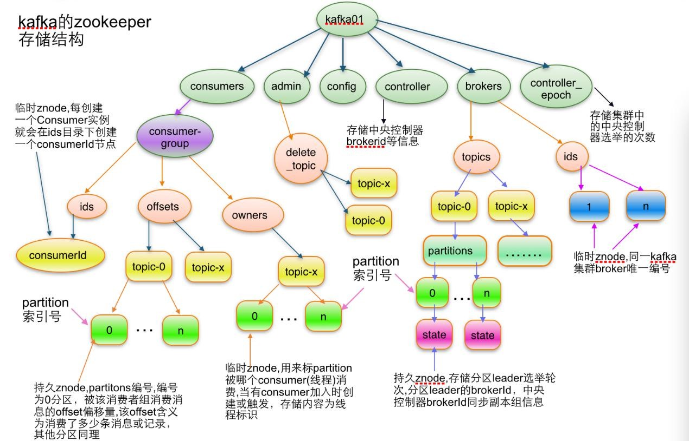

**1.5.2 Kafka** 的机器数量

>   Kafka 机器数量 = 2 \*（峰值生产速度 \* 副本数 / 100）+ 1

### 1.5.3 副本数设定

>   一般我们设置成 2 个或 3 个，很多企业设置为 2 个。

>   副本的优势：提高可靠性；副本劣势：增加了网络 IO 传输

### 1.5.4 Kafka 压测

>   Kafka
>   官方自带压力测试脚本（kafka-consumer-perf-test.sh、kafka-producer-perf-test.sh）。

Kafka 压测时，可以查看到哪个地方出现了瓶颈（CPU，内存，网络 IO）。一般都是网络
IO 达到瓶颈。

**1.5.5 Kafka** 日志保存时间

>   默认保存 7 天；生产环境建议 3 天

### 1.5.6 Kafka 中数据量计算

>   每天总数据量 100g，每天产生 1 亿条日志， 10000 万/24/60/60=1150
>   条/每秒钟平均每秒钟：1150 条低谷每秒钟：50 条

>   高峰每秒钟：1150 条\*（2-20 倍）=2300 条-23000 条每条日志大小：0.5k-2k（取
>   1k）每秒多少数据量：2.0M - 20MB

>   **1.5.7 Kafka** 的硬盘大小

>   每天的数据量 100g \* 2 个副本 \* 3 天 / 70%

### 1.5.8 Kafka 监控

>   公司自己开发的监控器；

>   开源的监控器：KafkaManager、KafkaMonitor、KafkaEagle

### 1.5.9 Kakfa 分区数

1.  创建一个只有 1 个分区的 topic

2.  测试这个 topic 的 producer 吞吐量和 consumer 吞吐量。

3.  假设他们的值分别是 Tp 和 Tc，单位可以是 MB/s。

4.  然后假设总的目标吞吐量是 Tt，那么分区数=Tt / min（Tp，Tc）

    例如：producer 吞吐量=20m/s；consumer 吞吐量=50m/s，期望吞吐量
    100m/s；分区数=100 / 20 = 5 分区

    <https://blog.csdn.net/weixin_42641909/article/details/89294698>

    分区数一般设置为：3-10 个

**1.5.10** 多少个 **Topic**

>   通常情况：多少个日志类型就多少个 Topic。也有对日志类型进行合并的。

### 1.5.11 Kafka 的 ISR 副本同步队列

ISR（In-Sync Replicas），副本同步队列。ISR 中包括 Leader 和 Follower。如果
Leader 进程挂掉，会在 ISR 队列中选择一个服务作为新的 Leader。有
replica.lag.max.messages（延迟条数）和
replica.lag.time.max.ms（延迟时间）两个参数决定一台服务是否可以加入 ISR
副本队列，在 0.10 版本移除了 replica.lag.max.messages
参数，防止服务频繁的进去队列。

任意一个维度超过阈值都会把 Follower 剔除出 ISR，存入 OSR（Outof-Sync
Replicas）列表，新加入的 Follower 也会先存放在 OSR 中。

### 1.5.12 Kafka 分区分配策略

>   在 Kafka 内部存在两种默认的分区分配策略：Range 和 RoundRobin。

Range 是默认策略。Range 是对每个 Topic 而言的（即一个 Topic 一个 Topic
分），首先对同一个 Topic
里面的分区按照序号进行排序，并对消费者按照字母顺序进行排序。然后用 Partitions
分区的个数除以消费者线程的总数来决定每个消费者线程消费几个分区。如果除不尽，那么前面几个消费者线程将会多消费一个分区。

例如：我们有 10 个分区，两个消费者（C1，C2），3 个消费者线程，10 / 3 = 3
而且除不尽。

>   C1-0 将消费 0, 1, 2, 3 分区

>   C2-0 将消费 4, 5, 6 分区 C2-1 将消费 7, 8, 9 分区

第一步：将所有主题分区组成 TopicAndPartition 列表，然后对 TopicAndPartition
列表按照 hashCode 进行排序，最后按照轮询的方式发给每一个消费线程。

### 1.5.13 Kafka 挂掉

1.  Flume 记录

2.  日志有记录

3.  短期没事

### 1.5.14 丢不丢数据

>   Ack = 0，相当于异步发送，消息发送完毕即 offset 增加，继续生产。

>   Ack = 1，leader 收到 leader replica 对一个消息的接受 ack 才增加
>   offset，然后继续生产。 Ack = -1，leader 收到所有 replica 对一个消息的接受
>   ack 才增加 offset，然后继续生产。

### 1.5.15 Kafka 数据重复

>   幂等性 + ack-1 + 事务

>   Kafka 数据重复，可以再下一级：SparkStreaming、redis 或者 Hive 中 dwd
>   层去重，去重

的手段：分组、按照 id 开窗只取第一个值；

#### **1.5.16 Kafka** 消息数据积压，**Kafka** 消费能力不足怎么处理？

1.  如果是 Kafka 消费能力不足，则可以考虑增加 Topic
    的分区数，并且同时提升消费组的消费者数量，消费者数 =
    分区数。（两者缺一不可）

2.  如果是下游的数据处理不及时：提高每批次拉取的数量。批次拉取数据过少（拉取数据/处理时间
    \< 生产速度），使处理的数据小于生产的数据，也会造成数据积压。

### 1.5.17 Kafka 参数优化

1.  **Broker** 参数配置（**server.properties**）

    1.  日志保留策略配置

        \# 保留三天，也可以更短 （log.cleaner.delete.retention.ms）
        log.retention.hours=72

    2.  Replica相关配置

        default.replication.factor:1 默认副本1个

| 3、网络通信延时 replica.socket.timeout.ms:30000 \#当集群之间网络不稳定时,调大该参数 replica.lag.time.max.ms=600000\# 如果网络不好,或者kafka集群压力较大 会出现副本丢失,然后会频繁复制副本,导致集群压力更大,此时可以调大该参数 |
|-------------------------------------------------------------------------------------------------------------------------------------------------------------------------------------------------------------------------------|

>   ,

1.  **Producer** 优化（**producer.properties**）

    compression.type:none gzip snappy lz4
    \#默认发送不进行压缩，推荐配置一种适合的压缩算法，可以大幅度的减缓网络压力和
    Broker的存储压力。

2.  **Kafka** 内存调整（kafka-server-start.sh）

    默认内存1个G，生产环境尽量不要超过6个G。

    export KAFKA_HEAP_OPTS="-Xms4g -Xmx4g"

### 1.5.18 高效读写数据

1.  **Kafka** 本身是分布式集群，同时采用分区技术，并发度高。

2.  顺序写磁盘

Kafka 的 producer 生产数据，要写入到 log
文件中，写的过程是一直追加到文件末端，为顺序写。官网有数据表明，同样的磁盘，顺序写能到
600M/s，而随机写只有 100K/s。

1.  零复制技术

Kafka 对于消息体的大小默认为单条最大值是 1M
但是在我们应用场景中，常常会出现一条消息大于 1M，如果不对 Kafka
进行配置。则会出现生产者无法将消息推送到 Kafka 或

消费者无法去消费 Kafka 里面的数据，这时我们就要对 Kafka
进行以下配置：server.properties

>   replica.fetch.max.bytes: 1048576 broker可复制的消息的最大字节数, 默认为

>   1M message.max.bytes: 1000012 kafka 会接收单个消息size的最大限制， 默认为

>   1M左右

>   注意：message.max.bytes 必须小于等于 replica.fetch.max.bytes，否则就会导致
>   replica 之

间数据同步失败。

### 1.5.20 Kafka 过期数据清理

>   保证数据没有被引用（没人消费他）

>   日志清理保存的策略只有 delete 和 compact 两种

>   log.cleanup.policy = delete 启用删除策略 log.cleanup.policy = compact
>   启用压缩策略

>   https://www.jianshu.com/p/fa6adeae8eb5

### 1.5.21 Kafka 可以按照时间消费数据

Map\<TopicPartition, OffsetAndTimestamp\> startOffsetMap =

>   KafkaUtil.fetchOffsetsWithTimestamp(topic, sTime, kafkaProp);

**1.5.22** 消费者角度考虑是拉取数据还是推送数据

>   拉取数据

### 1.5.23 Kafka 中的数据是有序的吗

>   单分区内有序；多分区，分区与分区间无序；扩展：

>   

>   这个 key 的作用是为消息选择存储分区，key 可以为空，当指定 key
>   且不为空的时候，

Kafka 是根据 key 的 hash 值与分区数取模来决定数据存储到那个分区。

>   

>   有序解决方案：同一张表的数据 放到 同一个 分区

>   =\> ProducerRecord 里传入 key，会根据 key 取 hash 算出分区号

>   =\> key 使用表名，如果有库名，拼接上库名

## 1.6 Hive

### 1.6.1 Hive 的架构

>   Hive 元数据默认存储在 derby 数据库，不支持多客户端访问，所以将元数据存储在

MySQl，支持多客户端访问。

>   

### 1.6.2 Hive 和数据库比较

>   Hive 和数据库除了拥有类似的查询语言，再无类似之处。

1.  数据存储位置

    Hive 存储在 HDFS 。数据库将数据保存在块设备或者本地文件系统中。

2.  数据更新

    Hive 中不建议对数据的改写。而数据库中的数据通常是需要经常进行修改的，

3.  执行延迟

Hive
执行延迟较高。数据库的执行延迟较低。当然，这个是有条件的，即数据规模较小，当数据规模大到超过数据库的处理能力的时候，Hive
的并行计算显然能体现出优势。

1.  数据规模

    Hive 支持很大规模的数据计算；数据库可以支持的数据规模较小。

#### **1.6.3** 内部表和外部表

>   元数据、原始数据

1.  删除数据时：

    内部表：元数据、原始数据，全删除

    外部表：元数据 只删除

2.  在公司生产环境下，什么时候创建内部表，什么时候创建外部表？

    在公司中绝大多数场景都是外部表。

    自己使用的临时表，才会创建内部表；

### 1.6.4 4 个 By 区别

1.  Order By：全局排序，只有一个 Reducer；

2.  Sort By：分区内有序；

3.  Distrbute By：类似 MR 中 Partition，进行分区，结合 sort by 使用。

4.  Cluster By：当 Distribute by 和 Sorts by 字段相同时，可以使用 Cluster by
    方式。Cluster by 除了具有 Distribute by 的功能外还兼具 Sort by
    的功能。但是排序只能是升序排序，不能指定排序规则为 ASC 或者 DESC。

    在生产环境中 Order By 用的比较少，容易导致 OOM。

    在生产环境中 Sort By + Distrbute By 用的多。

### 1.6.5 系统函数

1.  date_add、date_sub 函数（加减日期）

2.  next_day 函数（周指标相关）

3.  date_format 函数（根据格式整理日期）

4.  last_day 函数（求当月最后一天日期）

5.  collect_set 函数

6.  get_json_object 解析 json 函数 7）NVL（表达式 1，表达式 2）如果表达式 1
    为空值，NVL 返回值为表达式 2 的值，否则返回表达式 1 的值。

### 1.6.6 自定义 UDF、UDTF 函数

1.  在项目中是否自定义过 UDF、UDTF
    函数，以及用他们处理了什么问题，及自定义步骤？

    1.  用 UDF 函数解析公共字段；用 UDTF 函数解析事件字段。

    2.  自定义 UDF：继承 UDF，重写 evaluate 方法

    3.  自定义 UDTF：继承自 GenericUDTF，重写 3
        个方法：initialize(自定义输出的列名和类型)，process（将结果返回
        forward(result)），close

2.  为什么要自定义 UDF/UDTF？

    因为自定义函数，可以自己埋点 Log 打印日志，出错或者数据异常，方便调试。

### 1.6.7 窗口函数

1.  Rank

    1.  RANK() 排序相同时会重复，总数不会变

    2.  DENSE_RANK() 排序相同时会重复，总数会减少

    3.  ROW_NUMBER() 会根据顺序计算

2.  OVER()：指定分析函数工作的数据窗口大小，这个数据窗口大小可能会随着行的变而变化

    1.  CURRENT ROW：当前行

        （2）n PRECEDING：往前 n 行数据

        （3） n FOLLOWING：往后 n 行数据

        （ 4 ） UNBOUNDED ：起点， UNBOUNDED PRECEDING 表示从前面的起点，

UNBOUNDED FOLLOWING 表示到后面的终点

1.  LAG(col,n)：往前第 n 行数据

    1.  LEAD(col,n)：往后第 n 行数据

    2.  NTILE(n)：把有序分区中的行分发到指定数据的组中，各个组有编号，编号从 1

开始，对于每一行，NTILE 返回此行所属的组的编号。注意：n 必须为 int 类型。

1.  手写 **TopN**

### 1.6.8 Hive 优化

1.  **MapJoin**

如果不指定 MapJoin 或者不符合 MapJoin 的条件，那么 Hive 解析器会将 Join
操作转换成 Common Join，即：在 Reduce 阶段完成 join。容易发生数据倾斜。可以用
MapJoin 把小表全部加载到内存在 map 端进行 join，避免 reducer 处理。

1.  行列过滤

    列处理：在 SELECT 中，只拿需要的列，如果有，尽量使用分区过滤，少用 SELECT
    \*。

    行处理：在分区剪裁中，当使用外关联时，如果将副表的过滤条件写在 Where 后面，

那么就会先全表关联，之后再过滤。

1.  列式存储

2.  采用分区技术

3.  合理设置 **Map** 数

    mapred.min.split.size: 指的是数据的最小分割单元大小；min 的默认值是 1B

    mapred.max.split.size: 指的是数据的最大分割单元大小；max 的默认值是 256MB

通过调整 max 可以起到调整 map 数的作用，减小 max 可以增加 map 数，增大 max
可以减少 map 数。

>   需要提醒的是，直接调整 mapred.map.tasks 这个参数是没有效果的。

>   <https://www.cnblogs.com/swordfall/p/11037539.html>

1.  合理设置 **Reduce** 数

    Reduce 个数并不是越多越好

    1.  过多的启动和初始化 Reduce 也会消耗时间和资源；

    2.  另外，有多少个
        Reduce，就会有多少个输出文件，如果生成了很多个小文件，那么如果这些小文件作为下一个任务的输入，则也会出现小文件过多的问题；

        在设置 Reduce 个数的时候也需要考虑这两个原则：处理大数据量利用合适的
        Reduce

数；使单个 Reduce 任务处理数据量大小要合适；

1.  小文件如何产生的？

    1.  动态分区插入数据，产生大量的小文件，从而导致 map 数量剧增；

    2.  reduce 数量越多，小文件也越多（reduce 的个数和输出文件是对应的）；

    3.  数据源本身就包含大量的小文件。

2.  小文件解决方案

    1.  在 Map 执行前合并小文件，减少 Map 数：CombineHiveInputFormat
        具有对小文件进行合并的功能（系统默认的格式）。HiveInputFormat
        没有对小文件合并功能。

    2.  **merge**

        // 输出合并小文件

SET hive.merge.mapfiles = true; -- 默认true，在map-only任务结束时合并小文件

SET hive.merge.mapredfiles = true; --
默认false，在map-reduce任务结束时合并小文件

SET hive.merge.size.per.task = 268435456; -- 默认256M

SET hive.merge.smallfiles.avgsize = 16777216; --
当输出文件的平均大小小于16m该值时，启动一个独立的map-reduce任务进行文件merge

1.  开启 **JVM** 重用

set mapreduce.job.jvm.numtasks=10

1.  开启 **map** 端 **combiner**（不影响最终业务逻辑）

set hive.map.aggr=true；

1.  压缩（选择快的）设置 map
    端输出、中间结果压缩。（不完全是解决数据倾斜的问题，但是减少了 IO
    读写和网络传输，能提高很多效率）

set hive.exec.compress.intermediate=true --启用中间数据压缩 set
mapreduce.map.output.compress=true --启用最终数据压缩 set
mapreduce.map.outout.compress.codec=…; --设置压缩方式

1.  采用 **tez** 引擎或者 **spark** 引擎

### 1.6.9 Hive 解决数据倾斜方法

1.  数据倾斜长啥样？

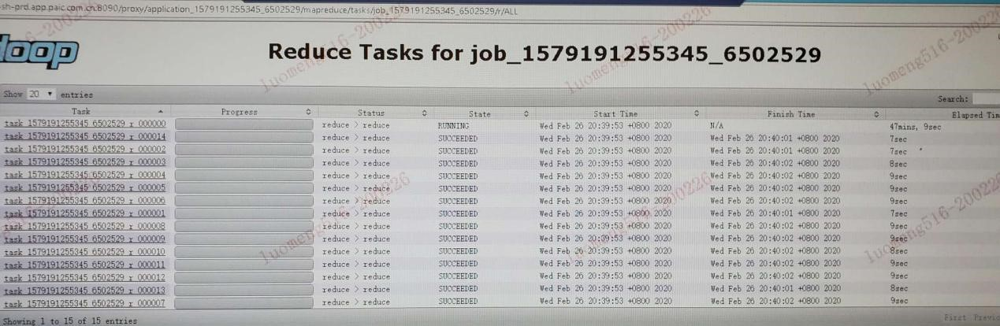

1.  怎么产生的数据倾斜？

2.  不同数据类型关联产生数据倾斜

情形：比如用户表中 user_id 字段为 int，log 表中 user_id 字段 string 类型。当按照
user_id 进行两个表的 Join 操作时。

>   解决方式：把数字类型转换成字符串类型 select \* from users a left outer join
>   logs b

>   on a.usr_id = cast(b.user_id as string)

>   bug 记录：https://www.jianshu.com/p/2181e00d74dc

1.  控制空值分布在生产环境经常会用大量空值数据进入到一个 reduce
    中去，导致数据倾斜。

    解决办法：

自定义分区，将为空的 key
转变为字符串加随机数或纯随机数，将因空值而造成倾斜的数据分不到多个 Reducer。

>   注意：对于异常值如果不需要的话，最好是提前在 where
>   条件里过滤掉，这样可以使计

算量大大减少

**3**）解决数据倾斜的方法？

1.  **group by** 注：group by 优于 distinct group

    解决方式：采用 sum() group by 的方式来替换 count(distinct)完成计算。

2.  **mapjoin**

3.  开启数据倾斜时负载均衡

    set hive.groupby.skewindata=true;

    思想：就是先随机分发并处理，再按照 key group by 来分发处理。

    操作：当选项设定为 true，生成的查询计划会有两个 MRJob。

第一个 MRJob 中，Map 的输出结果集合会随机分布到 Reduce 中，每个 Reduce
做部分聚合操作，并输出结果，这样处理的结果是相同的 GroupBy Key
有可能被分发到不同的

Reduce 中，从而达到负载均衡的目的；

第二个 MRJob 再根据预处理的数据结果按照 GroupBy Key 分布到 Reduce
中（这个过程可以保证相同的原始 GroupBy Key 被分布到同一个 Reduce
中），最后完成最终的聚合操作。

点评：它使计算变成了两个 mapreduce，先在第一个中在 shuffle 过程 partition
时随机给 key 打标记，使每个 key 随机均匀分布到各个 reduce
上计算，但是这样只能完成部分计算，因为相同 key 没有分配到相同 reduce 上。

所以需要第二次的 mapreduce，这次就回归正常
shuffle，但是数据分布不均匀的问题在第一次 mapreduce
已经有了很大的改善，因此基本解决数据倾斜。因为大量计算已经在第一次 mr
中随机分布到各个节点完成。

>   （**4**）设置多个 **reduce** 个数

#### **1.6.10 Hive** 里边字段的分隔符用的什么？为什么用**\\t**？有遇到过字段里边有**\\t** 的情况吗，怎么处理的？

hive 默认的字段分隔符为 ascii 码的控制符\\001（\^A）,建表的时候用 fields
terminated by '\\001'。注意：如果采用\\t 或者\\001
等为分隔符，需要要求前端埋点和 javaEE
后台传递过来的数据必须不能出现该分隔符，通过代码规范约束。一旦传输过来的数据含有分隔符，需要在前一级数据中转义或者替换（ETL）。

可以设置参数（导入 HDFS 同样有效）：

>   \--hive-drop-import-delims 导入到 hive 时删除 \\n, \\r, \\001

>   \--hive-delims-replacement 导入到 hive 时用自定义的字符替换掉 \\n, \\r, \\001

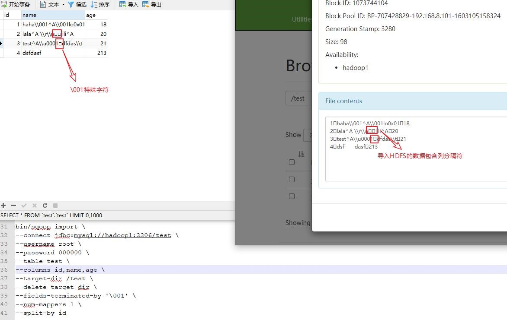

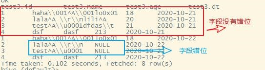

Tez 可以将多个有依赖的作业转换为一个作业，这样只需写一次
HDFS，且中间节点较少，从而大大提升作业的计算性能。

>   Mr/tez/spark 区别：

Mr 引擎：多 job
串联，基于磁盘，落盘的地方比较多。虽然慢，但一定能跑出结果。一般处理，周、月、年指标。

Spark 引擎：虽然在 Shuffle 过程中也落盘，但是并不是所有算子都需要
Shuffle，尤其是多算子过程，中间过程不落盘 DAG 有向无环图。
兼顾了可靠性和效率。一般处理天指标。

>   Tez 引擎：完全基于内存。 注意：如果数据量特别大，慎重使用。容易
>   OOM。一般用于快速出结果，数据量比较小的场景。

### 1.6.12 MySQL 元数据备份

1.  **MySQL** 之元数据备份（项目中遇到的问题）

元数据备份（重点，如数据损坏，可能整个集群无法运行，至少要保证每日零点之后备份到其它服务器两个复本）

>    Keepalived 或者用 mycat

1.  MySQL utf8 超过字节数问题

    MySQL 的 utf8 编码最多存储 3
    个字节，当数据中存在表情号、特色符号时会占用超过

3 个字节数的字节，那么会出现错误 Incorrect string value:
'\\xF0\\x9F\\x91\\x91\\xE5\\xB0...' 解决办法：将 utf8 修改为 utf8mb4

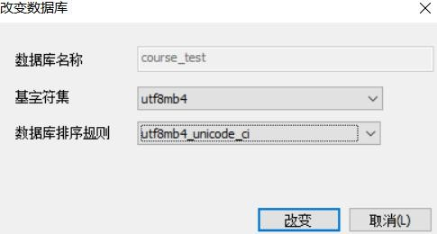

再使用 SHOW VARIABLES LIKE '%char%'; 命令查看参数

>   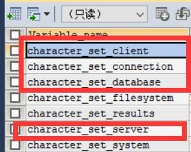

确保这几个参数的 value 值为 utf8mb4 如果不是使用 set 命令修改如：set
character_set_server = utf8mb4;

### 1.6.13 Union 与 Union all 区别

1.  union 会将联合的结果集去重，效率较 union all 差

2.  union all 不会对结果集去重，所以效率高

## 1.7 Sqoop

### 1.7.1 Sqoop 参数

/opt/module/sqoop/bin/sqoop import \\

\--connect \\

\--username \\

\--password \\

\--target-dir \\

\--delete-target-dir \\

\--num-mappers \\

\--fields-terminated-by \\

\--query "\$2" ' and \$CONDITIONS;'

### 1.7.2 Sqoop 导入导出 Null 存储一致性问题

>   Hive 中的 Null 在底层是以“\\N”来存储，而 MySQL 中的 Null 在底层就是
>   Null，为了

保证数据两端的一致性。在导出数据时采用--input-null-string
和--input-null-non-string 两个参数。导入数据时采用--null-string
和--null-non-string。

### 1.7.3 Sqoop 数据导出一致性问题

场景 1：如 Sqoop 在导出到 Mysql 时，使用 4 个 Map 任务，过程中有 2
个任务失败，那此时 MySQL 中存储了另外两个 Map
任务导入的数据，此时老板正好看到了这个报表数据。而开发工程师发现任务失败后，会调试问题并最终将全部数据正确的导入
MySQL，那

后面老板再次看报表数据，发现本次看到的数据与之前的不一致，这在生产环境是不允许的。

>   官网：http://sqoop.apache.org/docs/1.4.6/SqoopUserGuide.html

Since Sqoop breaks down export process into multiple transactions, it is
possible that a failed export job may result in partial data being committed to
the database. This can further lead to subsequent jobs failing due to insert
collisions in some cases, or lead to
duplicateddatainothers.Youcanovercomethisproblembyspecifying a staging table via
the --staging-table option which acts as an auxiliary table that is used to
stage exported data. The staged data is finally moved to the destination table
in a single transaction.

>   –staging-table 方式

sqoop export --connect jdbc:mysql://192.168.137.10:3306/user_behavior --username
root --password 123456 --table app_cource_study_report --columns
watch_video_cnt,complete_video_cnt,dt --fields-terminated-by "\\t" --export-dir
"/user/hive/warehouse/tmp.db/app_cource_study_analysis\_\${day}"

\--staging-table app_cource_study_report_tmp --clear-staging-table
\--input-null-string '\\N'

**1.7.4 Sqoop** 底层运行的任务是什么

>   只有 Map 阶段，没有 Reduce 阶段的任务。默认是 4 个 MapTask。

### 1.7.5 Sqoop 一天导入多少数据

>   100 万日活=》10 万订单，1 人 10 条，每天 1g 左右业务数据 Sqoop 每天将 1G
>   的数据量导入到数仓。

#### **1.7.6 Sqoop** 数据导出的时候一次执行多长时间

>   每天晚上 00:10 开始执行，Sqoop 任务一般情况 20-30
>   分钟的都有。取决于数据量（11:11，

6:18 等活动在 1 个小时左右）。

#### **1.7.7 Sqoop** 在导入数据的时候数据倾斜

>   Sqoop 参数撇嘴： split-by：按照自增主键来切分表的工作单元。
>   num-mappers：启动 N 个 map 来并行导入数据，默认 4 个；

### 1.7.8 Sqoop 数据导出 Parquet（项目中遇到的问题）

Ads 层数据用 Sqoop 往 MySql 中导入数据的时候，如果用了
orc（Parquet）不能导入，需转化成 text 格式

1.  创建临时表，把 Parquet 中表数据导入到临时表，把临时表导出到目标表用于可视化

2.  ads 层建表的时候就不要建 Parquet 表

## 1.8 Azkaban

>   **1.8.1** 每天集群运行多少指标**?**

>   每天跑 100 多个指标，有活动时跑 200 个左右。

### 1.8.2 任务挂了怎么办？

1.  运行成功或者失败都会发邮件、发钉钉、集成自动打电话（项目中遇到的问题）

2.  最主要的解决方案就是重新跑。

3.  报警网站 <http://www.onealert.com/>

## 1.9 HBase

### 1.9.1 HBase 存储结构

### 1.9.2 RowKey 设计原则

1.  rowkey 长度原则

2.  rowkey 散列原则

3.  rowkey 唯一原则

### 1.9.3 RowKey 如何设计

1.  生成随机数、hash、散列值

2.  字符串反转

### 1.9.4 Phoenix 二级索引（讲原理）

>   

>   phoenix的安装与二级索引建立.doc

## 1.10 Scala

**1.10.1** 开发环境

要求掌握必要的 Scala 开发环境搭建技能。

### 1.10.2 变量和数据类型

掌握 var 和 val 的区别

掌握数值类型（Byte、Short、Int、Long、Float、Double、Char）之间的转换关系

**1.10.3** 流程控制

掌握 if-else、for、while 等必要的流程控制结构，掌握如何实现 break、continue
的功能。

**1.10.4** 函数式编程

掌握高阶函数、匿名函数、函数柯里化、函数参数以及函数至简原则。

**1.10.5** 面向对象

掌握 Scala 与 Java 继承方面的区别、单例对象（伴生对象）、特质的用法及功能。

**1.10.6** 集合

掌握常用集合的使用、集合常用的计算函数。

**1.10.7** 模式匹配

掌握模式匹配的用法

**1.10.8** 异常

掌握异常常用操作即可

**1.10.9** 隐式转换

掌握隐式方法、隐式参数、隐式类，以及隐式解析机制

**1.10.10** 泛型

掌握泛型语法

## 1.11 Spark Core & SQL

### 1.11.1 Spark 解决什么问题

>   回顾：Hadoop 主要解决，海量数据的存储和海量数据的分析计算。

>   Spark 主要解决海量数据的分析计算。

#### **1.11.2 Spark** 为什么会有自己的资源调度器

>   Hadoop 的 Yarn 框架比 Spark 框架诞生的晚，所以 Spark
>   自己也设计了一套资源调度框

架。

### 1.11.3 Spark 运行模式

1.  Local：运行在一台机器上。 测试用。

2.  Standalone：是 Spark 自身的一个调度系统。
    对集群性能要求非常高时用。国内很少使用。

3.  Yarn：采用 Hadoop 的资源调度器。 国内大量使用。

4.  Mesos：国内很少使用。

### 1.11.4 Spark 常用端口号

>   1）4040 spark-shell 任务端口

>   2）7077 内部通讯端口。 类比 Hadoop 的 8020/9000

>   3）8080 查看任务执行情况端口。 类比 Hadoop 的 8088

>   4）18080 历史服务器。类比 Hadoop 的 19888

>   注意：由于 Spark 只负责计算，所有并没有 Hadoop 中存储数据的端口 50070

#### **1.11.5** 简述 **Spark** 的架构与作业提交流程（画图讲解，注明各个部分的作用）（重点）

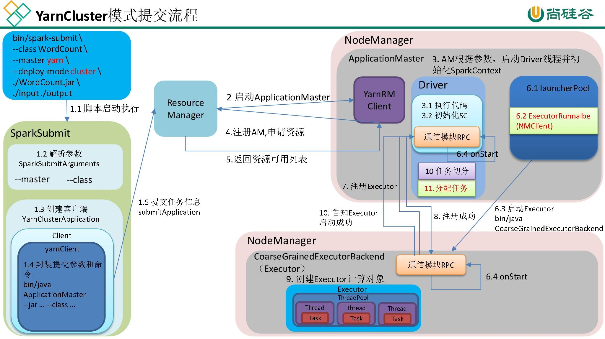

**1.11.6 Spark** 任务使用什么进行提交，**JavaEE** 界面还是脚本

>   Shell 脚本。

### 1.11.7 Spark 提交作业参数（重点）

>   参考答案：

>   https://blog.csdn.net/gamer_gyt/article/details/79135118

1.  在提交任务时的几个重要参数

    executor-cores —— 每个 executor 使用的内核数，默认为 1，官方建议 2-5 个，我

    们企业是 4 个

    num-executors —— 启动 executors 的数量，默认为 2 executor-memory —— executor
    内存大小，默认 1G driver-cores —— driver 使用内核数，默认为 1 driver-memory
    —— driver 内存大小，默认 512M

2.  边给一个提交任务的样式

    spark-submit \\

\--master local[5] \\

\--driver-cores 2 \\

>   \--driver-memory 8g \\

>   \--executor-cores 4 \\

>   \--num-executors 10 \\

>   \--executor-memory 8g \\

>   \--class PackageName.ClassName XXXX.jar \\

>   \--name "Spark Job Name" \\

InputPath \\

>   OutputPath

### 1.11.8 RDD 五大属性

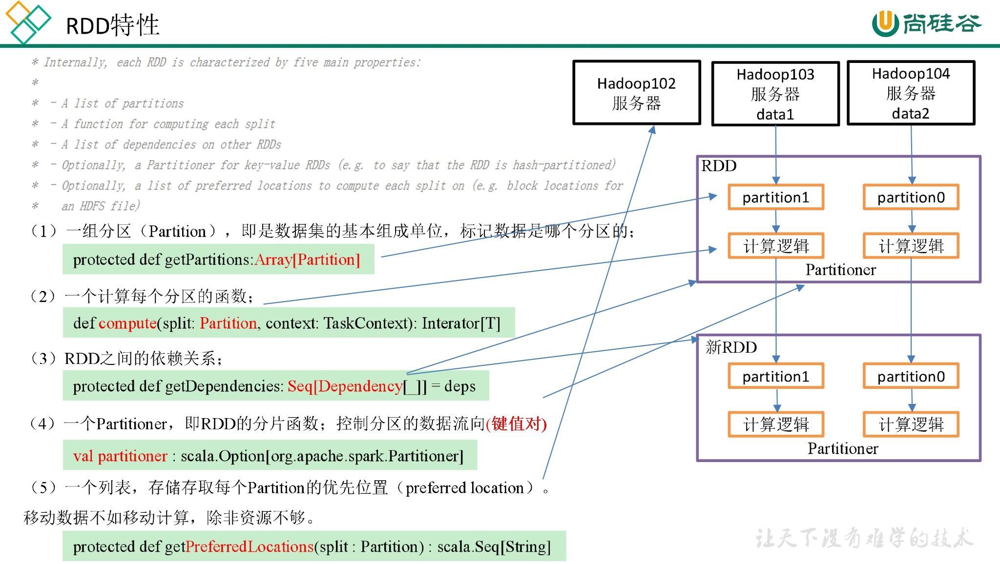

### 1.11.9 Spark 的 transformation 算子（不少于 8 个）（重点）

1.  单 Value

    1.  map

    2.  mapPartitions

    3.  mapPartitionsWithIndex

    4.  flatMap

    5.  glom

    6.  groupBy

    7.  filter

    8.  sample

    9.  distinct

    10. coalesce

    11. repartition

    12. sortBy

    13. pipe

2.  双 vlaue

    1.  intersection

    2.  union

    3.  subtract

    4.  zip

3.  Key-Value

    1.  partitionBy

    2.  reduceByKey

    3.  groupByKey

    4.  aggregateByKey

    5.  foldByKey

    6.  combineByKey

    7.  sortByKey

    8.  mapValues

    9.  join

    10. cogroup

### 1.11.10 Spark 的 action 算子（不少于 6 个）（重点）

1.  reduce：

2.  collect:

3.  count

4.  first：

5.  take：

6.  takeOrdered

7.  aggregate：

8.  fold

9.  countByKey：

10. save

11. foreach：

    **1.11.11 map** 和 **mapPartitions** 区别 1）map：每次处理一条数据

    2）mapPartitions：每次处理一个分区数据

### 1.11.12 Repartition 和 Coalesce 区别

1.  关系：

    两者都是用来改变 RDD 的 partition 数量的，repartition 底层调用的就是
    coalesce 方法：

coalesce(numPartitions, shuffle = true)

1.  区别：

    repartition 一定会发生 shuffle，coalesce 根据传入的参数来判断是否发生
    shuffle 一般情况下增大 rdd 的 partition 数量使用 repartition，减少 partition
    数量时使用 coalesce

### 1.11.13 reduceByKey 与 groupByKey 的区别

>   reduceByKey：具有预聚合操作
>   groupByKey：没有预聚合在不影响业务逻辑的前提下，优先采用 reduceByKey。

**1.11.14 reduceByKey**、**foldByKey**、**aggregateByKey**、**combineByKey**

## 区别

>   ReduceByKey 没有初始值 分区内和分区间逻辑相同 foldByKey 有初始值
>   分区内和分区间逻辑可以相同 aggregateByKey 有初始值
>   分区内和分区间逻辑可以不同 combineByKey 初始可以变化结构
>   分区内和分区间逻辑不同

### 1.11.15 Kryo 序列化

Kryo 序列化比 Java 序列化更快更紧凑，但 Spark 默认的序列化是 Java 序列化并不是
Spark 序列化，因为 Spark
并不支持所有序列化类型，而且每次使用都必须进行注册。注册只针对于 RDD。在
DataFrames 和 DataSet 当中自动实现了 Kryo 序列化。

**1.11.16 Spark** 中的血缘（笔试重点）

>   宽依赖和窄依赖。有 Shuffle 的是宽依赖。

### 1.11.17 Spark 任务的划分

1.  Application：初始化一个 SparkContext 即生成一个 Application；

2.  Job：一个 Action 算子就会生成一个 Job；

3.  Stage：Stage 等于宽依赖的个数加 1；

4.  Task：一个 Stage 阶段中，最后一个 RDD 的分区个数就是 Task 的个数。

# 1.11.18 cache 缓存级别

DataFrame 的 cache 默认采用 MEMORY_AND_DISK RDD 的 cache 默认方式采用
MEMORY_ONLY

# 1.11.19 释放缓存和缓存

>   缓存：(1)dataFrame.cache (2)sparkSession.catalog.cacheTable(“tableName”)
>   释放缓存：(1)dataFrame.unpersist
>   (2)sparkSession.catalog.uncacheTable(“tableName”)

#### **1.11.20** 缓存和检查点区别

1.  Cache 缓存只是将数据保存起来，不切断血缘依赖。Checkpoint
    检查点切断血缘依赖。

2.  Cache 缓存的数据通常存储在磁盘、内存等地方，可靠性低。Checkpoint
    的数据通常存储在 HDFS 等容错、高可用的文件系统，可靠性高。

3.  建议对 checkpoint()的 RDD 使用 Cache 缓存，这样 checkpoint 的 job 只需从
    Cache

缓存中读取数据即可，否则需要再从头计算一次 RDD。

### 1.11.21 Spark 分区 1）默认采用 Hash 分区

>   缺点：可能导致每个分区中数据量的不均匀，极端情况下会导致某些分区拥有 RDD 的

全部数据。

1.  Ranger 分区：

    要求 RDD 中的 KEY 类型必须可以排序。

2.  自定义分区

    根据需求，自定义分区。

### 1.11.22 Spark 累加器

### 1.11.23 Spark 广播变量

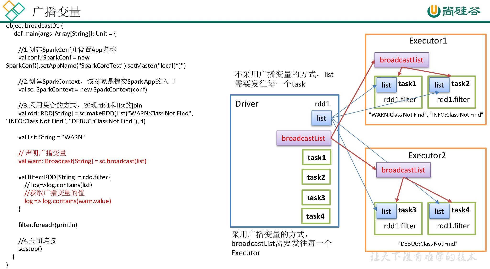

**1.11.24 SparkSQL** 中 **RDD**、**DataFrame**、**DataSet** 三者的转换（笔

## 试重点）

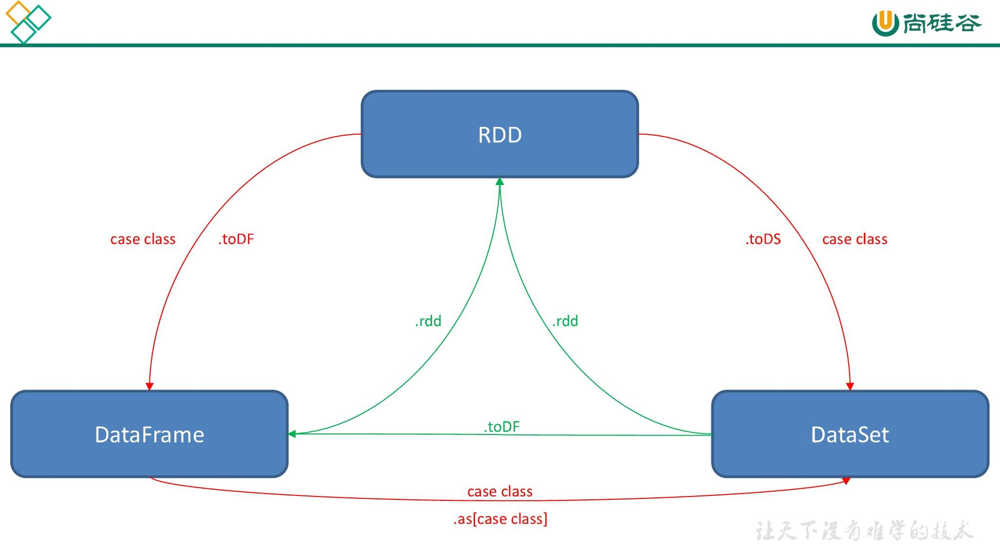

**1.11.9** 请列举会引起 **Shuffle** 过程的 **Spark** 算子，并简述功能。

>   reduceBykey： groupByKey： …ByKey:

**1.11.15** 当 **Spark** 涉及到数据库的操作时，如何减少 **Spark**
运行中的数据库连接数？

>   使用 foreachPartition 代替 foreach，在 foreachPartition 内获取数据库的连接。

**1.11.16** 如何使用 **Spark** 实现 **TopN** 的获取（描述思路或使用伪代码）

## （重点）

方法1：

1.  按照key对数据进行聚合（groupByKey）

2.  将value转换为数组，利用scala的sortBy或者sortWith进行排序（mapValues）数据量太大，会OOM。

方法2：

1.  取出所有的key

2.  对key进行迭代，每次取出一个key利用spark的排序算子进行排序方法3：

3.  自定义分区器，按照key进行分区，使不同的key进到不同的分区

4.  对每个分区运用spark的排序算子进行排序

### 1.11.17 京东：调优之前与调优之后性能的详细对比（例如调整 map 个数，map 个数之前多少、之后多少，有什么提升）

这里举个例子。比如我们有几百个文件，会有几百个map出现，读取之后进行join操作，会非常的慢。这个时候我们可以进行coalesce操作，比如240个map，我们合成60个
map，也就是窄依赖。这样再shuffle，过程产生的文件数会大大减少。提高join的时间性能。

# 1.11.23 Spark Shuffle 默认并行度

参数 spark.sql.shuffle.partitions 决定 默认并行度 200

### 1.11.27 控制 Spark reduce 缓存调优 shuffle

spark.reducer.maxSizeInFilght 此参数为 reduce task
能够拉取多少数据量的一个参数默认 48MB，当集群资源足够时，增大此参数可减少 reduce
拉取数据量的次数，从而达到优化 shuffle 的效果，一般调大为
96MB,，资源够大可继续往上调。

spark.shuffle.file.buffer 此参数为每个 shuffle
文件输出流的内存缓冲区大小，调大此参数可以减少在创建 shuffle
文件时进行磁盘搜索和系统调用的次数，默认参数为 32k 一般调大为

64k。

### 1.11.10 Spark 内核源码（重点）

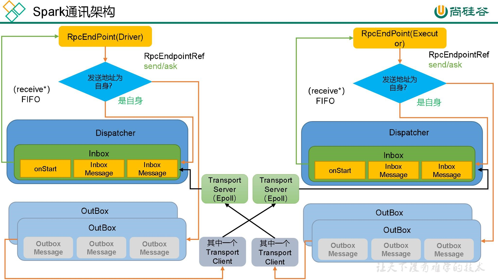

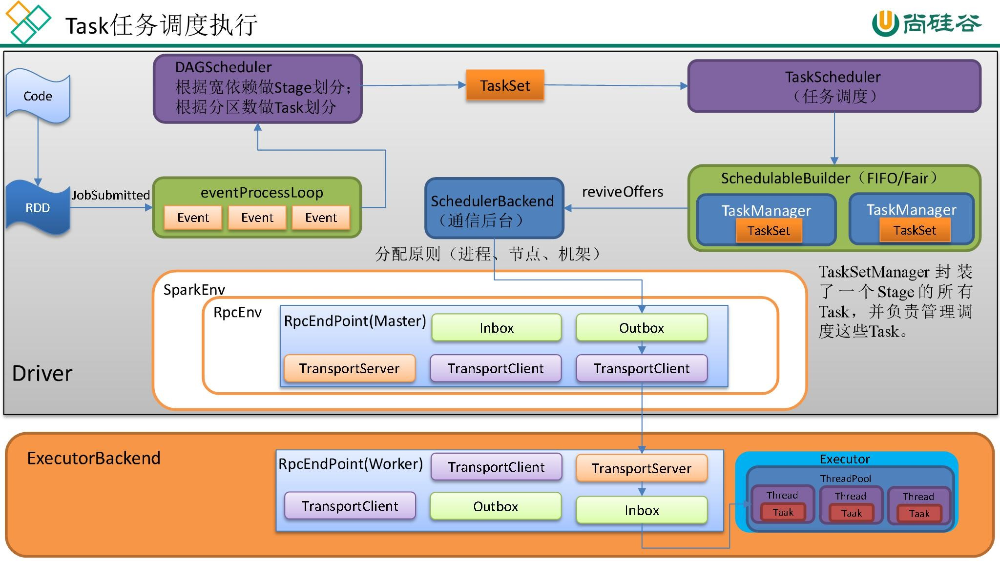

### 1.12 Spark Streaming

**1.12.1 Spark Streaming** 第一次运行不丢失数据

kafka 参数 auto.offset.reset 参数设置成 earliest 从最初始偏移量开始消费数据

#### **1.12.2 Spark Streaming** 精准一次消费

1.  手动维护偏移量

2.  处理完业务数据后，再进行提交偏移量操作

极端情况下，如在提交偏移量时断网或停电会造成 spark
程序第二次启动时重复消费问题，所以在涉及到金额或精确性非常高的场景会使用事物保证精准一次消费

#### **1.12.3 Spark Streaming** 控制每秒消费数据的速度

通过 spark.streaming.kafka.maxRatePerPartition 参数来设置 Spark Streaming 从
kafka 分区每秒

拉取的条数

#### **1.12.4 Spark Streaming** 背压机制

把 spark.streaming.backpressure.enabled 参数设置为 ture,开启背压机制后 Spark
Streaming 会根据延迟动态去 kafka 消费数据,上限由
spark.streaming.kafka.maxRatePerPartition 参数控制，

所以两个参数一般会一起使用

#### **1.12.5 Spark Streaming** 一个 **stage** 耗时

Spark Streaming stage 耗时由最慢的 task 决定,所以数据倾斜时某个 task
运行慢会导致整个 Spark Streaming 都运行非常慢。

#### **1.12.6 Spark Streaming** 优雅关闭

把 spark.streaming.stopGracefullyOnShutdown 参数设置成 ture,Spark 会在 JVM
关闭时正常关闭 StreamingContext,而不是立马关闭

Kill 命令：yarn application -kill 后面跟 applicationid

#### **1.12.7 Spark Streaming** 默认分区个数

Spark Streaming 默认分区个数与所对接的 kafka topic 分区个数一致，Spark Streaming
里一般不会使用 repartition 算子增大分区，因为 repartition 会进行 shuffle
增加耗时

**1.12.8 SparkStreaming** 有哪几种方式消费 **Kafka** 中的数据，它们之

## 间的区别是什么？

一、基于Receiver的方式这种方式使用Receiver来获取数据。Receiver是使用Kafka的高层次Consumer
API
来实现的。receiver从Kafka中获取的数据都是存储在SparkExecutor的内存中的（如果突然数据暴增，大量batch堆积，很容易出现内存溢出的问题），然后Spark
Streaming启动的job会去处理那些数据。

>   然而，在默认的配置下，这种方式可能会因为底层的失败而丢失数据。如果要启用高可

靠机制，让数据零丢失，就必须启用SparkStreaming的预写日志机制（WriteAhead Log，
WAL）。该机制会同步地将接收到的Kafka数据写入分布式文件系统（比如HDFS）上的预写日志中。所以，即使底层节点出现了失败，也可以使用预写日志中的数据进行恢复。二、基于Direct的方式

>   这种新的不基于Receiver的直接方式，是在Spark 1.3中引入的，从而能够确保更加

健壮的机制。替代掉使用Receiver来接收数据后，这种方式会周期性地查询Kafka，来获得每个topic+partition的最新的offset，从而定义每个batch的offset的范围。当处理数据的job启动时，就会使用Kafka的简单consumerapi来获取Kafka指定offset范围的

数据。

优点如下：

简化并行读取：如果要读取多个partition，不需要创建多个输入DStream然后对它们进行union操作。Spark会创建跟Kafka
partition一样多的RDD
partition，并且会并行从Kafka中读取数据。所以在Kafkapartition和RDDpartition之间，有一个一对一的映射关系。

>   高性能：如果要保证零数据丢失，在基于receiver的方式中，需要开启WAL机制。这

种方式其实效率低下，因为数据实际上被复制了两份，Kafka自己本身就有高可靠的机制，会对数据复制一份，而这里又会复制一份到WAL中。而基于direct的方式，不依赖Receiver，不需要开启WAL机制，只要Kafka中作了数据的复制，那么就可以通过Kafka的副本进行恢复。

>   一次且仅一次的事务机制。

三、对比：

基于receiver的方式，是使用Kafka的高阶API来在ZooKeeper中保存消费过的offset
的。这是消费Kafka数据的传统方式。这种方式配合着WAL机制可以保证数据零丢失的高可靠性，但是却无法保证数据被处理一次且仅一次，可能会处理两次。因为Spark和ZooKeeper
之间可能是不同步的。

>   基于direct的方式，使用kafka的简单api，SparkStreaming自己就负责追踪消费的

offset，并保存在checkpoint中。Spark自己一定是同步的，因此可以保证数据是消费一次且仅消费一次。

>   在实际生产环境中大都用Direct方式

### 1.12.9 简述 SparkStreaming 窗口函数的原理（重点）

窗口函数就是在原来定义的SparkStreaming计算批次大小的基础上再次进行封装，每次计算多个批次的数据，同时还需要传递一个滑动步长的参数，用来设置当次计算任务完成之后下一次从什么地方开始计算。图中time1就是SparkStreaming计算批次大小，虚线框以及实线大框就是窗口的大小，必须为批次的整数倍。虚线框到大实线框的距离（相隔多少批次），就是滑动步长。

### 1.13 数据倾斜

>   公司一：总用户量 1000 万，5 台 64G 内存的服务器。公司二：总用户量 10
>   亿，1000 台 64G 内存的服务器。

1.公司一的数据分析师在做 join
的时候发生了数据倾斜，会导致有几百万用户的相关数据集中到了一台服务器上，几百万的用户数据，说大也不大，正常字段量的数据的话
64G 还是能轻松处理掉的。

2.公司二的数据分析师在做 join 的时候也发生了数据倾斜，可能会有 1
个亿的用户相关数据集中到了一台机器上了（相信我，这很常见）。这时候一台机器就很难搞定了，最后会很难算出结果。

#### **1.13.1** 数据倾斜表现

1.  hadoop 中的数据倾斜表现：

    -   有一个多几个 Reduce 卡住，卡在 99.99%，一直不能结束。

    -   各种 container 报错 OOM

    -   异常的 Reducer 读写的数据量极大，至少远远超过其它正常的 Reducer

    -   伴随着数据倾斜，会出现任务被 kill 等各种诡异的表现。

2.  hive 中数据倾斜

    一般都发生在 Sql 中 group by 和 join on 上，而且和数据逻辑绑定比较深。

3.  Spark 中的数据倾斜

    Spark 中的数据倾斜，包括 Spark Streaming 和 Spark Sql，表现主要有下面几种：

    -   Executor lost，OOM，Shuffle 过程出错；

    -   Driver OOM；

    -   单个 Executor 执行时间特别久，整体任务卡在某个阶段不能结束；

    -   正常运行的任务突然失败；

##### 1.13.2 数据倾斜产生原因

>   我们以 Spark 和 Hive 的使用场景为例。

>   他们在做数据运算的时候会涉及到，count distinct、group by、join on
>   等操作，这些都会

触发 Shuffle 动作。一旦触发 Shuffle，所有相同 key 的值就会被拉到一个或几个
Reducer 节点上，容易发生单点计算问题，导致数据倾斜。

>   一般来说，数据倾斜原因有以下几方面：

1.  **key** 分布不均匀；

1.  建表时考虑不周

    我们举一个例子，就说数据默认值的设计吧，假设我们有两张表：
    user（用户信息表）：userid，register_ip

    ip（IP 表）：ip，register_user_cnt

这可能是两个不同的人开发的数据表。如果我们的数据规范不太完善的话，会出现一种情况：

>   user 表中的 register_ip 字段，如果获取不到这个信息，我们默认为 null；

但是在 ip 表中，我们在统计这个值的时候，为了方便，我们把获取不到 ip
的用户，统一认为他们的 ip 为 0。

两边其实都没有错的，但是一旦我们做关联了，这个任务会在做关联的阶段，也就是 sql
的 on 的阶段卡死。

1.  业务数据激增比如订单场景，我们在某一天在北京和上海两个城市多了强力的推广，结果可能是这两个城市的订单量增长了
    10000%，其余城市的数据量不变。

    然后我们要统计不同城市的订单情况，这样，一做 group
    操作，可能直接就数据倾斜了。

##### 1.13.3 解决数据倾斜思路

>   很多数据倾斜的问题，都可以用和平台无关的方式解决，比如更好的数据预处理，异常

值的过滤等。因此，解决数据倾斜的重点在于对数据设计和业务的理解，这两个搞清楚了，数据倾斜就解决了大部分了。

1.  业务逻辑

我们从业务逻辑的层面上来优化数据倾斜，比如上面的两个城市做推广活动导致那两个城市数据量激增的例子，我们可以单独对这两个城市来做
count，单独做时可用两次
MR，第一次打散计算，第二次再最终聚合计算。完成后和其它城市做整合。

1.  程序层面

    比如说在 Hive 中，经常遇到 count(distinct)操作，这样会导致最终只有一个
    Reduce 任务。

我们可以先 group by，再在外面包一层
count，就可以了。比如计算按用户名去重后的总用户量：

1.  优化前 只有一个 reduce，先去重再 count 负担比较大： select
    name,count(distinct name)from user;

    1.  优化后

        // 设置该任务的每个 job 的 reducer 个数为 3 个。Hive 默认-1，自动推断。

        set mapred.reduce.tasks=3;

        // 启动两个 job，一个负责子查询(可以有多个 reduce)，另一个负责
        count(1)： select count(1) from (select name from user group by name)
        tmp;

2.  调参方面

    Hadoop 和 Spark 都自带了很多的参数和机制来调节数据倾斜，合理利用它们就能解决

大部分问题。

1.  从业务和数据上解决数据倾斜

很多数据倾斜都是在数据的使用上造成的。我们举几个场景，并分别给出它们的解决方案。

-   有损的方法：找到异常数据，比如 ip 为 0 的数据，过滤掉

    -   无损的方法：对分布不均匀的数据，单独计算

    -   先对 key 做一层 hash，先将数据随机打散让它的并行度变大，再汇集

    -   数据预处理

##### 1.13.4 定位导致数据倾斜代码

>   Spark 数据倾斜只会发生在 shuffle 过程中。

这里给大家罗列一些常用的并且可能会触发 shuffle
操作的算子：distinct、groupByKey、
reduceByKey、aggregateByKey、join、cogroup、repartition 等。

>   出现数据倾斜时，可能就是你的代码中使用了这些算子中的某一个所导致的。

## 1.13.4.1 某个 task 执行特别慢的情况

>   首先要看的，就是数据倾斜发生在第几个 stage 中：

如果是用 yarn-client 模式提交，那么在提交的机器本地是直接可以看到 log，可以在
log 中找到当前运行到了第几个 stage；

如果是用 yarn-cluster 模式提交，则可以通过 Spark Web UI 来查看当前运行到了第几个
stage。

此外，无论是使用 yarn-client 模式还是 yarn-cluster 模式，我们都可以在 Spark Web
UI 上深入看一下当前这个 stage 各个 task 分配的数据量，从而进一步确定是不是 task
分配的数据不均匀导致了数据倾斜。

>   看 task 运行时间和数据量 task 运行时间

比如下图中，倒数第三列显示了每个 task 的运行时间。明显可以看到，有的 task
运行特别快，只需要几秒钟就可以运行完；而有的 task
运行特别慢，需要几分钟才能运行完，此时单从运行时间上看就已经能够确定发生数据倾斜了。

>   task 数据量

>   此外，倒数第一列显示了每个 task 处理的数据量，明显可以看到，运行时间特别短的

task 只需要处理几百 KB 的数据即可，而运行时间特别长的 task 需要处理几千 KB
的数据，处理的数据量差了 10 倍。此时更加能够确定是发生了数据倾斜。

>   推断倾斜代码知道数据倾斜发生在哪一个 stage 之后，接着我们就需要根据 stage
>   划分原理，推算出来发生倾斜的那个 stage
>   对应代码中的哪一部分，这部分代码中肯定会有一个 shuffle 类算子。

精准推算 stage 与代码的对应关系，需要对 Spark
的源码有深入的理解，这里我们可以介绍一个相对简单实用的推算方法：只要看到 Spark
代码中出现了一个 shuffle 类算子或者是 Spark SQL 的 SQL 语句中出现了会导致
shuffle 的语句（比如 group by
语句），那么就可以判定，以那个地方为界限划分出了前后两个 stage。

>   这里我们就以如下单词计数来举例。

val conf = new SparkConf()val sc = new SparkContext(conf)val lines =
sc.textFile("hdfs://...")val words = lines.flatMap(_.split(" "))val pairs =
words.map((_, 1))val wordCounts = pairs.reduceByKey(\_ +
\_)wordCounts.collect().foreach(println(_))

在整个代码中只有一个 reduceByKey 是会发生 shuffle
的算子，也就是说这个算子为界限划分出了前后两个 stage：

stage0，主要是执行从 textFile 到 map 操作，以及 shuffle write 操作（对 pairs RDD
中的数据进行分区操作，每个 task 处理的数据中，相同的 key
会写入同一个磁盘文件内）。

>   stage1，主要是执行从 reduceByKey 到 collect 操作，以及 stage1 的各个 task
>   一开始运行，

就会首先执行 shuffle read 操作（会从 stage0 的各个 task
所在节点拉取属于自己处理的那些 key，然后对同一个 key 进行全局性的聚合或 join
等操作，在这里就是对 key 的 value 值进行累加）

stage1 在执行完 reduceByKey 算子之后，就计算出了最终的 wordCounts
RDD，然后会执行 collect 算子，将所有数据拉取到 Driver 上，供我们遍历和打印输出。

>   123456789

通过对单词计数程序的分析，希望能够让大家了解最基本的 stage 划分的原理，以及
stage 划分后 shuffle 操作是如何在两个 stage
的边界处执行的。然后我们就知道如何快速定位出发生数据倾斜的 stage
对应代码的哪一个部分了。

比如我们在 Spark Web UI 或者本地 log 中发现，stage1 的某几个 task
执行得特别慢，判定 stage1 出现了数据倾斜，那么就可以回到代码中，定位出 stage1
主要包括了 reduceByKey 这个 shuffle
类算子，此时基本就可以确定是是该算子导致了数据倾斜问题。

>   此时，如果某个单词出现了 100 万次，其他单词才出现 10 次，那么 stage1 的某个
>   task

就要处理 100 万数据，整个 stage 的速度就会被这个 task 拖慢。

## 1.13.4.2 某个 task 莫名其妙内存溢出的情况

这种情况下去定位出问题的代码就比较容易了。我们建议直接看 yarn-client 模式下本地
log 的异常栈，或者是通过 YARN 查看 yarn-cluster 模式下的 log
中的异常栈。一般来说，通过异常栈信息就可以定位到你的代码中哪一行发生了内存溢出。然后在那行代码附近找找，一般也会有
shuffle 类算子，此时很可能就是这个算子导致了数据倾斜。

但是大家要注意的是，不能单纯靠偶然的内存溢出就判定发生了数据倾斜。因为自己编写的代码的
bug，以及偶然出现的数据异常，也可能会导致内存溢出。因此还是要按照上面所讲的方法，通过
Spark Web UI 查看报错的那个 stage 的各个 task
的运行时间以及分配的数据量，才能确定是否是由于数据倾斜才导致了这次内存溢出。

### 1.13.5 查看导致数据倾斜的 key 分布情况

先对 pairs 采样 10%的样本数据，然后使用 countByKey 算子统计出每个 key
出现的次数，最后在客户端遍历和打印样本数据中各个 key 的出现次数。

>   val sampledPairs = pairs.sample(false, 0.1)

>   val sampledWordCounts = sampledPairs.countByKey()
>   sampledWordCounts.foreach(println(_))

**1.13.6 Spark** 数据倾斜的解决方案

## 1.13.6.1 使用 Hive ETL 预处理数据

### 1.13.6.1.1 适用场景

导致数据倾斜的是 Hive 表。如果该 Hive 表中的数据本身很不均匀（比如某个 key
对应了 100 万数据，其他 key 才对应了 10 条数据），而且业务场景需要频繁使用 Spark
对 Hive 表执行某个分析操作，那么比较适合使用这种技术方案。

### 1.13.6.1.2 实现思路

此时可以评估一下，是否可以通过 Hive 来进行数据预处理（即通过 Hive ETL
预先对数据按照 key 进行聚合，或者是预先和其他表进行 join），然后在 Spark
作业中针对的数据源就不是原来的 Hive 表了，而是预处理后的 Hive
表。此时由于数据已经预先进行过聚合或 join 操作了，那么在 Spark
作业中也就不需要使用原先的 shuffle 类算子执行这类操作了。

### 1.13.6.1.3 方案实现原理

这种方案从根源上解决了数据倾斜，因为彻底避免了在 Spark 中执行 shuffle
类算子，那么肯定就不会有数据倾斜的问题了。但是这里也要提醒一下大家，这种方式属于治标不治本。因为毕竟数据本身就存在分布不均匀的问题，所以
Hive ETL 中进行 group by 或者 join 等 shuffle 操作时，还是会出现数据倾斜，导致
Hive ETL 的速度很慢。我们只是把数据倾斜的发生提前到了 Hive ETL 中，避免 Spark
程序发生数据倾斜而已。

### 1.13.6.1.4 方案优缺点

优点：实现起来简单便捷，效果还非常好，完全规避掉了数据倾斜，Spark
作业的性能会大幅度提升。

>   缺点：治标不治本，Hive ETL 中还是会发生数据倾斜。

### 1.13.6.1.5 方案实践经验

在一些 Java 系统与 Spark 结合使用的项目中，会出现 Java 代码频繁调用 Spark
作业的场景，而且对 Spark
作业的执行性能要求很高，就比较适合使用这种方案。将数据倾斜提前到上游的 Hive
ETL，每天仅执行一次，只有那一次是比较慢的，而之后每次 Java 调用 Spark
作业时，执行速度都会很快，能够提供更好的用户体验。

### 1.13.6.1.6 项目实践经验

>   在美团·点评的交互式用户行为分析系统中使用了这种方案，该系统主要是允许用户通

过 Java Web 系统提交数据分析统计任务，后端通过 Java 提交 Spark
作业进行数据分析统计。要求 Spark 作业速度必须要快，尽量在 10
分钟以内，否则速度太慢，用户体验会很差。所以我们将有些 Spark 作业的 shuffle
操作提前到了 Hive ETL 中，从而让 Spark 直接使用预处理的 Hive
中间表，尽可能地减少 Spark 的 shuffle
操作，大幅度提升了性能，将部分作业的性能提升了 6 倍以上。

## 1.13.6.2 过滤少数导致倾斜的 key

### 1.13.6.2.1 方案适用场景

如果发现导致倾斜的 key
就少数几个，而且对计算本身的影响并不大的话，那么很适合使用这种方案。比如 99%的
key 就对应 10 条数据，但是只有一个 key 对应了 100 万数据，从而导致了数据倾斜。

### 1.13.6.2.2 方案实现思路

如果我们判断那少数几个数据量特别多的
key，对作业的执行和计算结果不是特别重要的话，那么干脆就直接过滤掉那少数几个
key。

比如，在 Spark SQL 中可以使用 where 子句过滤掉这些 key 或者在 Spark Core 中对
RDD 执行 filter 算子过滤掉这些 key。

如果需要每次作业执行时，动态判定哪些 key
的数据量最多然后再进行过滤，那么可以使用 sample 算子对 RDD
进行采样，然后计算出每个 key 的数量，取数据量最多的 key 过滤掉即可。

### 1.13.6.2.3 方案实现原理

将导致数据倾斜的 key 给过滤掉之后，这些 key
就不会参与计算了，自然不可能产生数据倾斜。

### 1.13.6.2.4 方案优缺点

>   优点：实现简单，而且效果也很好，可以完全规避掉数据倾斜。

缺点：适用场景不多，大多数情况下，导致倾斜的 key
还是很多的，并不是只有少数几个。

### 1.13.6.2.5 方案实践经验

在项目中我们也采用过这种方案解决数据倾斜。有一次发现某一天 Spark
作业在运行的时候突然 OOM 了，追查之后发现，是 Hive 表中的某一个 key
在那天数据异常，导致数据量暴增。因此就采取每次执行前先进行采样，计算出样本中数据量最大的几个
key 之后，直接在程序中将那些 key 给过滤掉。

## 1.13.6.3 提高 shuffle 操作的并行度

### 1.13.6.3.1 方案适用场景

如果我们必须要对数据倾斜迎难而上，那么建议优先使用这种方案，因为这是处理数据倾斜最简单的一种方案。

### 1.13.6.3.2 方案实现思路

>   在对 RDD 执行 shuffle 算子时，给 shuffle 算子传入一个参数，比如
>   reduceByKey(1000)，

该参数就设置了这个 shuffle 算子执行时 shuffle read task 的数量，即
spark.sql.shuffle.partitions，该参数代表了 shuffle read task 的并行度，默认是
200，对于很多场景来说都有点过小。

### 1.13.6.3.3 方案实现原理

>   增加 shuffle read task 的数量，可以让原本分配给一个 task 的多个 key
>   分配给多个 task，

从而让每个 task 处理比原来更少的数据。举例来说，如果原本有 5 个 key，每个 key
对应 10 条数据，这 5 个 key 都是分配给一个 task 的，那么这个 task 就要处理 50
条数据。

而增加了 shuffle read task 以后，每个 task 就分配到一个 key，即每个 task 就处理
10 条数据，那么自然每个 task 的执行时间都会变短了。具体原理如下图所示。

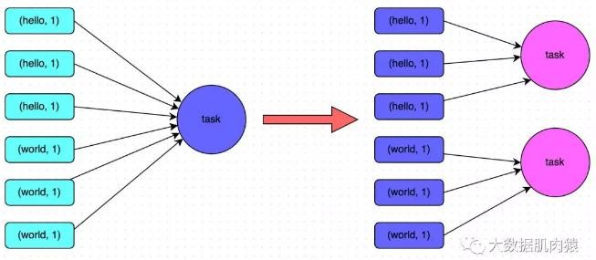

### 1.13.6.3.4 方案优缺点

>   优点：实现起来比较简单，可以有效缓解和减轻数据倾斜的影响。

>   缺点：只是缓解了数据倾斜而已，没有彻底根除问题，根据实践经验来看，其效果有限。

### 1.13.6.3.5 方案实践经验

该方案通常无法彻底解决数据倾斜，因为如果出现一些极端情况，比如某个 key
对应的数据量有 100 万，那么无论你的 task 数量增加到多少，这个对应着 100 万数据的
key 肯定还是会分配到一个 task
中去处理，因此注定还是会发生数据倾斜的。所以这种方案只能说是在发现数据倾斜时尝试使用的第一种手段，尝试去用最简单的方法缓解数据倾斜而已，或者是和其他方案结合起来使用。

## 1.13.6.4 两阶段聚合（局部聚合+全局聚合）

>   **1.13.6.4.1 方案适用场景**对 RDD 执行 reduceByKey 等聚合类 shuffle
>   算子或者在 Spark SQL 中使用 group by 语句进行分组聚合时，比较适用这种方案。
>   **1.13.6.4.2 方案实现思路**

>   这个方案的核心实现思路就是进行两阶段聚合：第一次是局部聚合，先给每个 key
>   都打上一个随机数，比如 10 以内的随机数，此时原

先一样的 key 就变成不一样的了，比如(hello, 1) (hello, 1) (hello, 1) (hello,
1)，就会变成(1_hello,

1) (1_hello, 1) (2_hello, 1) (2_hello, 1)。

>   接着对打上随机数后的数据，执行 reduceByKey
>   等聚合操作，进行局部聚合，那么局部

聚合结果，就会变成了(1_hello, 2) (2_hello, 2)。

然后将各个 key
的前缀给去掉，就会变成(hello,2)(hello,2)，再次进行全局聚合操作，就可以得到最终结果了，比如(hello,
4)。

>   示例代码如下：

>   // 第一步，给 RDD 中的每个 key 都打上一个随机前缀。

>   JavaPairRDD\<String, Long\> randomPrefixRdd = rdd.mapToPair( new
>   PairFunction\<Tuple2\<Long,Long\>, String, Long\>() { private static final
>   long serialVersionUID = 1L;

>   @Override public Tuple2\<String, Long\> call(Tuple2\<Long, Long\> tuple)
>   throws Exception { Random random = new Random();

>   int prefix = random.nextInt(10); return new Tuple2\<String, Long\>(prefix +
>   "_" + tuple._1, tuple._2);

>   }

>   });

// 第二步，对打上随机前缀的 key 进行局部聚合。

>   JavaPairRDD\<String, Long\> localAggrRdd = randomPrefixRdd.reduceByKey( new
>   Function2\<Long, Long, Long\>() { private static final long serialVersionUID
>   = 1L;

>   @Override

>   public Long call(Long v1, Long v2) throws Exception { return v1 + v2;

>   }

>   });

// 第三步，去除 RDD 中每个 key 的随机前缀。

>   JavaPairRDD\<Long, Long\> removedRandomPrefixRdd = localAggrRdd.mapToPair(
>   new PairFunction\<Tuple2\<String,Long\>, Long, Long\>() { private static
>   final long serialVersionUID = 1L;

>   @Override public Tuple2\<Long, Long\> call(Tuple2\<String, Long\> tuple)
>   throws Exception { long originalKey = Long.valueOf(tuple._1.split("_")[1]);
>   return new Tuple2\<Long, Long\>(originalKey, tuple._2);

>   }

>   });

// 第四步，对去除了随机前缀的 RDD 进行全局聚合。

>   JavaPairRDD\<Long, Long\> globalAggrRdd =
>   removedRandomPrefixRdd.reduceByKey( new Function2\<Long, Long, Long\>() {
>   private static final long serialVersionUID = 1L;

>   @Override public Long call(Long v1, Long v2) throws Exception { return v1 +
>   v2;

>   }

>   });

### 1.13.6.4.3 方案实现原理

将原本相同的 key 通过附加随机前缀的方式，变成多个不同的 key，就可以让原本被一个
task 处理的数据分散到多个 task 上去做局部聚合，进而解决单个 task
处理数据量过多的问题。接着去除掉随机前缀，再次进行全局聚合，就可以得到最终的结果。具体原理见下图。

>   

### 1.13.6.4.4 方案优缺点

>   优点

对于聚合类的 shuffle
操作导致的数据倾斜，效果是非常不错的。通常都可以解决掉数据倾斜，或者至少是大幅度缓解数据倾斜，将
Spark 作业的性能提升数倍以上。

>   缺点

仅仅适用于聚合类的 shuffle 操作，适用范围相对较窄。如果是 join 类的 shuffle
操作，还得用其他的解决方案。

## 1.13.6.5 将 reduce join 转为 map join

### 1.13.6.5.1 方案适用场景

在对 RDD 使用 join 类操作，或者是在 Spark SQL 中使用 join 语句时，而且 join
操作中的一个 RDD 或表的数据量比较小（比如几百 M 或者一两 G），比较适用此方案。

### 1.13.6.5.2 方案实现思路

不使用 join 算子进行连接操作，而使用 Broadcast 变量与 map 类算子实现 join
操作，进而完全规避掉 shuffle 类的操作，彻底避免数据倾斜的发生和出现。将较小 RDD
中的数据直接通过 collect 算子拉取到 Driver 端的内存中来，然后对其创建一个
Broadcast 变量，广播给其他 Executor 节点；

>   接着对另外一个 RDD 执行 map 类算子，在算子函数内，从 Broadcast
>   变量中获取较小

RDD 的全量数据，与当前 RDD 的每一条数据按照连接 key 进行比对，如果连接 key
相同的话，那么就将两个 RDD 的数据用你需要的方式连接起来。

>   示例如下：

>   // 首先将数据量比较小的 RDD 的数据，collect 到 Driver 中来。

List\<Tuple2\<Long, Row\>\> rdd1Data = rdd1.collect()

// 然后使用 Spark 的广播功能，将小 RDD 的数据转换成广播变量，这样每个 Executor
就只有一份 RDD 的数据。

// 可以尽可能节省内存空间，并且减少网络传输性能开销。

final Broadcast\<List\<Tuple2\<Long, Row\>\>\> rdd1DataBroadcast =
sc.broadcast(rdd1Data);

// 对另外一个 RDD 执行 map 类操作，而不再是 join 类操作。

>   JavaPairRDD\<String, Tuple2\<String, Row\>\> joinedRdd = rdd2.mapToPair( new
>   PairFunction\<Tuple2\<Long,String\>, String, Tuple2\<String, Row\>\>() {
>   private static final long serialVersionUID = 1L;

>   @Override public Tuple2\<String, Tuple2\<String, Row\>\> call(Tuple2\<Long,
>   String\> tuple) throws Exception {

>   // 在算子函数中，通过广播变量，获取到本地 Executor 中的 rdd1 数据。

>   List\<Tuple2\<Long, Row\>\> rdd1Data = rdd1DataBroadcast.value();

>   // 可以将 rdd1 的数据转换为一个 Map，便于后面进行 join 操作。

>   Map\<Long, Row\> rdd1DataMap = new HashMap\<Long, Row\>(); for(Tuple2\<Long,
>   Row\> data : rdd1Data) { rdd1DataMap.put(data._1, data._2);

>   }

>   // 获取当前 RDD 数据的 key 以及 value。

>   String key = tuple._1;

>   String value = tuple._2;

>   // 从 rdd1 数据 Map 中，根据 key 获取到可以 join 到的数据。

>   Row rdd1Value = rdd1DataMap.get(key); return new Tuple2\<String,
>   String\>(key, new Tuple2\<String, Row\>(value,

rdd1Value));

>   }

>   });

// 这里得提示一下。

// 上面的做法，仅仅适用于 rdd1 中的 key 没有重复，全部是唯一的场景。

// 如果 rdd1 中有多个相同的 key，那么就得用 flatMap 类的操作，在进行 join
的时候不能用 map，而是得遍历 rdd1 所有数据进行 join。

// rdd2 中每条数据都可能会返回多条 join 后的数据。

### 1.13.6.5.3 方案实现原理

普通的 join 是会走 shuffle 过程的，而一旦 shuffle，就相当于会将相同 key
的数据拉取到一个 shuffle read task 中再进行 join，此时就是 reduce join。

>   但是如果一个 RDD 是比较小的，则可以采用广播小 RDD 全量数据+map 算子来实现与

join 同样的效果，也就是 map join，此时就不会发生 shuffle
操作，也就不会发生数据倾斜。

具体原理如下图所示。

### 1.13.6.5.4 方案优缺点

优点：对 join 操作导致的数据倾斜，效果非常好，因为根本就不会发生
shuffle，也就根本不会发生数据倾斜。

缺点：适用场景较少，因为这个方案只适用于一个大表和一个小表的情况。毕竟我们需要将小表进行广播，此时会比较消耗内存资源，driver
和每个 Executor 内存中都会驻留一份小 RDD 的全量数据。如果我们广播出去的 RDD
数据比较大，比如 10G
以上，那么就可能发生内存溢出了。因此并不适合两个都是大表的情况。

## 1.13.6.6 采样倾斜 key 并分拆 join 操作

### 1.13.6.6.1 方案适用场景

两个 RDD/Hive 表进行 join
的时候，如果数据量都比较大，无法采用“解决方案五”，那么此时可以看一下两个
RDD/Hive 表中的 key 分布情况。

如果出现数据倾斜，是因为其中某一个 RDD/Hive 表中的少数几个 key
的数据量过大，而另一个 RDD/Hive 表中的所有 key
都分布比较均匀，那么采用这个解决方案是比较合适的。

### 1.13.6.6.2 方案实现思路

对包含少数几个数据量过大的 key 的那个 RDD，通过 sample
算子采样出一份样本来，然后统计一下每个 key 的数量，计算出来数据量最大的是哪几个
key。

然后将这几个 key 对应的数据从原来的 RDD 中拆分出来，形成一个单独的 RDD，并给每个
key 都打上 n 以内的随机数作为前缀；

>   而不会导致倾斜的大部分 key 形成另外一个 RDD。

接着将需要 join 的另一个 RDD，也过滤出来那几个倾斜 key
对应的数据并形成一个单独的 RDD，将每条数据膨胀成 n 条数据，这 n
条数据都按顺序附加一个 0\~n 的前缀；

>   不会导致倾斜的大部分 key 也形成另外一个 RDD。

再将附加了随机前缀的独立 RDD 与另一个膨胀 n 倍的独立 RDD 进行
join，此时就可以将原先相同的 key 打散成 n 份，分散到多个 task 中去进行 join 了。

>   而另外两个普通的 RDD 就照常 join 即可。

>   最后将两次 join 的结果使用 union 算子合并起来即可，就是最终的 join 结果。

>   示例如下：

>   // 首先从包含了少数几个导致数据倾斜 key 的 rdd1 中，采样 10%的样本数据。

JavaPairRDD\<Long, String\> sampledRDD = rdd1.sample(false, 0.1);

// 对样本数据 RDD 统计出每个 key 的出现次数，并按出现次数降序排序。

// 对降序排序后的数据，取出 top 1 或者 top 100 的数据，也就是 key 最多的前 n
个数据。

// 具体取出多少个数据量最多的 key，由大家自己决定，我们这里就取 1 个作为示范。

// 每行数据变为\<key,1\>

>   JavaPairRDD\<Long, Long\> mappedSampledRDD = sampledRDD.mapToPair( new
>   PairFunction\<Tuple2\<Long,String\>, Long, Long\>() { private static final
>   long serialVersionUID = 1L;

>   @Override public Tuple2\<Long, Long\> call(Tuple2\<Long, String\> tuple)
>   throws Exception { return new Tuple2\<Long, Long\>(tuple._1, 1L);

>   }

>   });

// 按 key 累加行数

>   JavaPairRDD\<Long, Long\> countedSampledRDD = mappedSampledRDD.reduceByKey(
>   new Function2\<Long, Long, Long\>() { private static final long
>   serialVersionUID = 1L;

>   @Override public Long call(Long v1, Long v2) throws Exception { return v1 +
>   v2;

>   }

>   });

// 反转 key 和 value,变为\<value,key\>

>   JavaPairRDD\<Long, Long\> reversedSampledRDD = countedSampledRDD.mapToPair(
>   new PairFunction\<Tuple2\<Long,Long\>, Long, Long\>() { private static final
>   long serialVersionUID = 1L;

>   @Override public Tuple2\<Long, Long\> call(Tuple2\<Long, Long\> tuple)
>   throws Exception { return new Tuple2\<Long, Long\>(tuple._2, tuple._1);

>   }

>   });

// 以行数排序 key，取最多行数的 key

final Long skewedUserid = reversedSampledRDD.sortByKey(false).take(1).get(0)._2;

// 从 rdd1 中分拆出导致数据倾斜的 key，形成独立的 RDD。

>   JavaPairRDD\<Long, String\> skewedRDD = rdd1.filter( new
>   Function\<Tuple2\<Long,String\>, Boolean\>() { private static final long
>   serialVersionUID = 1L;

>   @Override public Boolean call(Tuple2\<Long, String\> tuple) throws Exception
>   { return tuple._1.equals(skewedUserid);

>   }

>   });

// 从 rdd1 中分拆出不导致数据倾斜的普通 key，形成独立的 RDD。

>   JavaPairRDD\<Long, String\> commonRDD = rdd1.filter( new
>   Function\<Tuple2\<Long,String\>, Boolean\>() { private static final long
>   serialVersionUID = 1L;

>   @Override public Boolean call(Tuple2\<Long, String\> tuple) throws Exception
>   { return !tuple._1.equals(skewedUserid);

>   }

>   });

// rdd2，就是那个所有 key 的分布相对较为均匀的 rdd。

// 这里将 rdd2 中，前面获取到的 key 对应的数据，过滤出来，分拆成单独的 rdd，并对
rdd 中的数据使用 flatMap 算子都扩容 100 倍。

// 对扩容的每条数据，都打上 0～100 的前缀。

>   JavaPairRDD\<String, Row\> skewedRdd2 = rdd2.filter( new
>   Function\<Tuple2\<Long,Row\>, Boolean\>() { private static final long
>   serialVersionUID = 1L;

>   @Override public Boolean call(Tuple2\<Long, Row\> tuple) throws Exception {
>   return tuple._1.equals(skewedUserid);

>   }

>   }).flatMapToPair(new PairFlatMapFunction\<Tuple2\<Long,Row\>, String,
>   Row\>() { private static final long serialVersionUID = 1L;

>   @Override public Iterable\<Tuple2\<String, Row\>\> call(

>   Tuple2\<Long, Row\> tuple) throws Exception {

>   Random random = new Random();

>   List\<Tuple2\<String, Row\>\> list = new ArrayList\<Tuple2\<String,
>   Row\>\>(); for(int i = 0; i \< 100; i++) { list.add(new Tuple2\<String,
>   Row\>(i + "_" + tuple._1, tuple._2));

>   }

>   return list;

>   }

>   });

// 将 rdd1 中分拆出来的导致倾斜的 key 的独立 rdd，每条数据都打上 100
以内的随机前缀。

// 然后将这个 rdd1 中分拆出来的独立 rdd，与上面 rdd2 中分拆出来的独立 rdd，进行
join。

>   JavaPairRDD\<Long, Tuple2\<String, Row\>\> joinedRDD1 = skewedRDD.mapToPair(
>   new PairFunction\<Tuple2\<Long,String\>, String, String\>() { private static
>   final long serialVersionUID = 1L;

>   @Override public Tuple2\<String, String\> call(Tuple2\<Long, String\> tuple)
>   throws Exception { Random random = new Random();

>   int prefix = random.nextInt(100); return new Tuple2\<String, String\>(prefix
>   \+ "_" + tuple._1, tuple._2);

>   }

>   })

>   .join(skewedUserid2infoRDD)

.mapToPair(new PairFunction\<Tuple2\<String,Tuple2\<String,Row\>\>, Long,

Tuple2\<String, Row\>\>() {

>   private static final long serialVersionUID = 1L;

>   @Override public Tuple2\<Long, Tuple2\<String, Row\>\> call( Tuple2\<String,
>   Tuple2\<String, Row\>\> tuple) throws Exception { long key =
>   Long.valueOf(tuple._1.split("_")[1]);

return new Tuple2\<Long, Tuple2\<String, Row\>\>(key,

tuple._2);

>   }

>   });

// 将 rdd1 中分拆出来的包含普通 key 的独立 rdd，直接与 rdd2 进行 join。

JavaPairRDD\<Long, Tuple2\<String, Row\>\> joinedRDD2 = commonRDD.join(rdd2);

// 将倾斜 key join 后的结果与普通 key join 后的结果，uinon 起来。

// 就是最终的 join 结果。

JavaPairRDD\<Long, Tuple2\<String, Row\>\> joinedRDD =
joinedRDD1.union(joinedRDD2);

### 1.13.6.6.3 方案实现原理

对于 join 导致的数据倾斜，如果只是某几个 key 导致了倾斜，可以将少数几个 key
分拆成独立 RDD，并附加随机前缀打散成 n 份去进行 join，此时这几个 key
对应的数据就不会集中在少数几个 task 上，而是分散到多个 task 进行 join
了。具体原理见下图。

### 1.13.6.6.4 方案优缺点

优点：对于 join 导致的数据倾斜，如果只是某几个 key
导致了倾斜，采用该方式可以用最有效的方式打散 key 进行
join。而且只需要针对少数倾斜 key 对应的数据进行扩容 n
倍，不需要对全量数据进行扩容。避免了占用过多内存。

>   缺点：如果导致倾斜的 key 特别多的话，比如成千上万个 key
>   都导致数据倾斜，那么这

种方式也不适合。

## 1.13.6.7 使用随机前缀和扩容 RDD 进行 join

### 1.13.6.7.1 方案适用场景

如果在进行 join 操作时，RDD 中有大量的 key 导致数据倾斜，那么进行分拆 key
也没什么意义，此时就只能使用最后一种方案来解决问题了。

### 1.13.6.7.2 方案实现思路

该方案的实现思路基本和“解决方案六”类似，首先查看 RDD/Hive
表中的数据分布情况，找到那个造成数据倾斜的 RDD/Hive 表，比如有多个 key
都对应了超过 1 万条数据。然后将该 RDD 的每条数据都打上一个 n 以内的随机前缀。

同时对另外一个正常的 RDD 进行扩容，将每条数据都扩容成 n
条数据，扩容出来的每条数据都依次打上一个 0\~n 的前缀。最后将两个处理后的 RDD
进行 join 即可。

>   示例代码如下：

>   // 首先将其中一个 key 分布相对较为均匀的 RDD 膨胀 100 倍。

>   JavaPairRDD\<String, Row\> expandedRDD = rdd1.flatMapToPair( new
>   PairFlatMapFunction\<Tuple2\<Long,Row\>, String, Row\>() { private static
>   final long serialVersionUID = 1L;

>   @Override public Iterable\<Tuple2\<String, Row\>\> call(Tuple2\<Long, Row\>
>   tuple) throws Exception {

>   List\<Tuple2\<String, Row\>\> list = new ArrayList\<Tuple2\<String,
>   Row\>\>(); for(int i = 0; i \< 100; i++) { list.add(new Tuple2\<String,
>   Row\>(0 + "_" + tuple._1, tuple._2));

>   }

>   return list;

>   }

>   });

// 其次，将另一个有数据倾斜 key 的 RDD，每条数据都打上 100 以内的随机前缀。

>   JavaPairRDD\<String, String\> mappedRDD = rdd2.mapToPair( new
>   PairFunction\<Tuple2\<Long,String\>, String, String\>() { private static
>   final long serialVersionUID = 1L;

>   @Override public Tuple2\<String, String\> call(Tuple2\<Long, String\> tuple)
>   throws Exception { Random random = new Random();

>   int prefix = random.nextInt(100); return new Tuple2\<String, String\>(prefix
>   \+ "_" + tuple._1, tuple._2);

>   }

>   });

// 将两个处理后的 RDD 进行 join 即可。

JavaPairRDD\<String, Tuple2\<String, Row\>\> joinedRDD =
mappedRDD.join(expandedRDD);

### 1.13.6.7.3 方案实现原理

将原先一样的 key 通过附加随机前缀变成不一样的 key，然后就可以将这些处理后的“不同
key”分散到多个 task 中去处理，而不是让一个 task 处理大量的相同 key。

该方案与“解决方案六”的不同之处就在于，上一种方案是尽量只对少数倾斜 key
对应的数据进行特殊处理，由于处理过程需要扩容 RDD，因此上一种方案扩容 RDD
后对内存的占用并不大；而这一种方案是针对有大量倾斜 key 的情况，没法将部分 key
拆分出来进行单独处理，因此只能对整个 RDD 进行数据扩容，对内存资源要求很高。

### 1.13.6.7.4 方案优缺点

优点：对 join
类型的数据倾斜基本都可以处理，而且效果也相对比较显著，性能提升效果非常不错。

缺点：该方案更多的是缓解数据倾斜，而不是彻底避免数据倾斜。而且需要对整个 RDD
进行扩容，对内存资源要求很高。

### 1.13.6.7.5 方案实践经验

曾经开发一个数据需求的时候，发现一个 join
导致了数据倾斜。优化之前，作业的执行时间大约是 60
分钟左右；使用该方案优化之后，执行时间缩短到 10 分钟左右，性能提升了 6 倍。

## 1.13.6.8 多种方案组合使用

在实践中发现，很多情况下，如果只是处理较为简单的数据倾斜场景，那么使用上述方案中的某一种基本就可以解决。但是如果要处理一个较为复杂的数据倾斜场景，那么可能需要将多种方案组合起来使用。

>   比如说，我们针对出现了多个数据倾斜环节的 Spark 作业，可以先运用解决方案一

HiveETL 预处理和过滤少数导致倾斜的 k，预处理一部分数据，并过滤一部分数据来缓解；

>   其次可以对某些 shuffle
>   操作提升并行度，优化其性能；最后还可以针对不同的聚合或 join
>   操作，选择一种方案来优化其性能。

>   大家需要对这些方案的思路和原理都透彻理解之后，在实践中根据各种不同的情况，灵

活运用多种方案，来解决自己的数据倾斜问题。

### 1.13.7 Spark 数据倾斜处理小结

### 1.14 Flink

#### **1.14.1** 简单介绍一下 **Flink**

>   Flink 是一个框架和分布式处理引擎，用于对无界和有界数据流进行有状态计算。并且

Flink 提供了数据分布、容错机制以及资源管理等核心功能。Flink 提供了诸多高抽象层的

API 以便用户编写分布式任务：

DataSet API，
对静态数据进行批处理操作，将静态数据抽象成分布式的数据集，用户可以方便地使用
Flink 提供的各种操作符对分布式数据集进行处理，支持 Java、Scala 和 Python。

DataStream
API，对数据流进行流处理操作，将流式的数据抽象成分布式的数据流，用户可以方便地对分布式数据流进行各种操作，支持
Java 和 Scala。

Table API，对结构化数据进行查询操作，将结构化数据抽象成关系表，并通过类 SQL 的
DSL 对关系表进行各种查询操作，支持 Java 和 Scala。

此外，Flink 还针对特定的应用领域提供了领域库，例如： Flink ML，Flink
的机器学习库，提供了机器学习 Pipelines API 并实现了多种机器学习算法。
Gelly，Flink 的图计算库，提供了图计算的相关 API 及多种图计算算法实现。

#### **1.14.2 Flink** 跟 **Spark Streaming** 的区别

这个问题是一个非常宏观的问题，因为两个框架的不同点非常之多。但是在面试时有非常重要的一点一定要回答出来：**Flink**
是标准的实时处理引擎，基于事件驱动。而 **Spark**

**Streaming** 是微批（**Micro-Batch**）的模型。

>   下面我们就分几个方面介绍两个框架的主要区别：

1.  架构模型 Spark Streaming
    在运行时的主要角色包括：Master、Worker、Driver、Executor，

Flink 在运行时主要包含：Jobmanager、Taskmanager 和 Slot。

1.  任务调度 Spark Streaming 连续不断的生成微小的数据批次，构建有向无环图 DAG，

Spark Streaming 会依次创建 DStreamGraph、JobGenerator、JobScheduler。Flink
根据用户提交的代码生成 StreamGraph，经过优化生成 JobGraph，然后提交给 JobManager
进行处理，

JobManager 会根据 JobGraph 生成 ExecutionGraph，ExecutionGraph 是 Flink
调度最核心的数据结构，JobManager 根据 ExecutionGraph 对 Job 进行调度。

1.  时间机制 Spark Streaming 支持的时间机制有限，只支持处理时间。 Flink
    支持了流处理程序在时间上的三个定义：处理时间、事件时间、注入时间。同时也支持
    watermark 机制来处理滞后数据。

2.  容错机制对于 Spark Streaming 任务，我们可以设置
    checkpoint，然后假如发生故障并重启，我们可以从上次 checkpoint
    之处恢复，但是这个行为只能使得数据不丢失，可能会重复处理，不能做到恰好一次处理语义。Flink
    则使用两阶段提交协议来解决这个问题。

##### 1.14.3 Flink 集群有哪些角色？各自有什么作用？

>   

>   Flink 程序在运行时主要有 TaskManager，JobManager，Client 三种角色。

>   JobManager 扮演着集群中的管理者 Master
>   的角色，它是整个集群的协调者，负责接收

Flink Job，协调检查点，Failover 故障恢复等，同时管理 Flink 集群中从节点
TaskManager。

>   TaskManager 是实际负责执行计算的 Worker，在其上执行 Flink Job 的一组
>   Task，每个

TaskManager
负责管理其所在节点上的资源信息，如内存、磁盘、网络，在启动的时候将资源的状态向
JobManager 汇报。

>   Client 是 Flink 程序提交的客户端，当用户提交一个 Flink
>   程序时，会首先创建一个 Client，

该 Client 首先会对用户提交的 Flink 程序进行预处理，并提交到 Flink
集群中处理，所以 Client 需要从用户提交的 Flink 程序配置中获取 JobManager
的地址，并建立到 JobManager 的连接，将 Flink Job 提交给 JobManager。

##### 1.14.4 公司怎么提交的实时任务，有多少 Job Manager？

1.  我们使用 yarn session 模式提交任务；另一种方式是每次提交都会创建一个新的
    Flink 集群，为每一个 job
    提供资源，任务之间互相独立，互不影响，方便管理。任务执行完成之后创建的集群也会消失。线上命令脚本如下：

    bin/yarn-session.sh -n 7 -s 8 -jm 3072 -tm 32768 -qu root.\*.\* -nm \*-\* -d

    其中申请 7 个 taskManager，每个 8 核，每个 taskmanager 有 32768M 内存。

2.  集群默认只有一个 Job Manager。但为了防止单点故障，我们配置了高可用。对于
    standlone 模式，我们公司一般配置一个主 Job Manager，两个备用 Job
    Manager，然后结合 ZooKeeper 的使用，来达到高可用；对于 yarn 模式，yarn 在
    Job Mananger 故障会自动进行重启，所以只需要一个，我们配置的最大重启次数是 10
    次。

###### **1.14.5 Flink** 的并行度了解吗？**Flink** 的并行度设置是怎样的？

>   Flink 中的任务被分为多个并行任务来执行，其中每个并行的实例处理一部分数据。这

>   些并行实例的数量被称为并行度。我们在实际生产环境中可以从四个不同层面设置并行度：操作算子层面(Operator
>   Level)

>   执行环境层面(Execution Environment Level) 客户端层面(Client Level)

>   系统层面(System Level)

>   需要注意的优先级：算子层面\>环境层面\>客户端层面\>系统层面。

**1.14.6 Flink** 的 **Checkpoint** 存在哪里

>   可以是内存，文件系统，或者 RocksDB。

##### 1.14.7 Flink 的三种时间语义

Event
Time：是事件创建的时间。它通常由事件中的时间戳描述，例如采集的日志数据中，每一条日志都会记录自己的生成时间，Flink
通过时间戳分配器访问事件时间戳。

>   Ingestion Time：是数据进入 Flink 的时间。

Processing
Time：是每一个执行基于时间操作的算子的本地系统时间，与机器相关，默认的时间属性就是
Processing Time。

##### 1.14.8 说说 Flink 中的窗口

>   来一张官网经典的图：

>   

Flink 支持两种划分窗口的方式，按照 time 和
count。如果根据时间划分窗口，那么它就是一个 time-window
如果根据数据划分窗口，那么它就是一个 count-window。flink
支持窗口的两个重要属性（size 和 interval）如果 size=interval,那么就会形成
tumbling-window(无重叠数据) 如果 size\>interval,那么就会形成
sliding-window(有重叠数据) 如果 size\< interval,

那么这种窗口将会丢失数据。比如每 5 秒钟，统计过去 3
秒的通过路口汽车的数据，将会漏掉 2 秒钟的数据。通过组合可以得出四种基本窗口：
time-tumbling-window 无 重 叠 数 据 的 时 间 窗 口 ， 设 置 方 式 举 例 ：

timeWindow(Time.seconds(5))

>   time-sliding-window 有 重 叠 数 据 的 时 间 窗 口 ， 设 置 方 式 举 例 ：

timeWindow(Time.seconds(5), Time.seconds(3))

>   count-tumbling-window 无重叠数据的数量窗口，设置方式举例：countWindow(5)
>   count-sliding-window 有重叠数据的数量窗口，设置方式举例：countWindow(5,3)

#### **1.14.9 Exactly-Once** 的保证

下级存储支持事务：Flink
可以通过实现两阶段提交和状态保存来实现端到端的一致性语义。 分为以下几个步骤：

1.  开始事务（beginTransaction）创建一个临时文件夹，来写把数据写入到这个文件夹里面

2.  预提交（preCommit）将内存中缓存的数据写入文件并关闭

3.  正式提交（commit）将之前写完的临时文件放入目标目录下。这代表着最终的数据会有一些延迟

4.  丢弃（abort）丢弃临时文件

5.  若失败发生在预提交成功后，正式提交前。可以根据状态来提交预提交的数据，也可删除预提交的数据。

    下级存储不支持事务：

    具体实现是幂等写入，需要下级存储具有幂等性写入特性。

##### 1.14.10 说一下 Flink 状态机制

Flink
在做计算的过程中经常需要存储中间状态，来避免数据丢失和状态恢复。选择的状态存储策略不同，会影响状态持久化如何和
checkpoint 交互。

>   Flink 提 供 了 三 种 状 态 存 储 方 式 ： MemoryStateBackend 、
>   FsStateBackend 、

RocksDBStateBackend。

#### **1.14.11 Flink** 中的 **Watermark** 机制

>   Watermark 是一种衡量 Event Time 进展的机制，可以设定延迟触发

Watermark 是用于处理乱序事件的，而正确的处理乱序事件，通常用 Watermark 机制结合
window 来实现；

数据流中的 Watermark 用于表示 timestamp 小于 Watermark
的数据，都已经到达了，因此，window 的执行也是由 Watermark 触发的。

##### 1.14.12 Flink 分布式快照的原理是什么

Flink
的容错机制的核心部分是制作分布式数据流和操作算子状态的一致性快照。这些快照充当一致性
checkpoint，系统可以在发生故障时回滚。 Flink
用于制作这些快照的机制在“分布式数据流的轻量级异步快照”中进行了描述。
它受到分布式快照的标准

Chandy-Lamport 算法的启发，专门针对 Flink 的执行模型而定制。

>   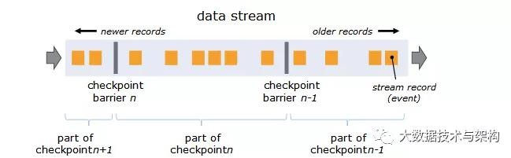

barriers 在数据流源处被注入并行数据流中。快照 n 的 barriers
被插入的位置（我们称之为 Sn）是快照所包含的数据在数据源中最大位置。

例如，在 Apache Kafka 中，此位置将是分区中最后一条记录的偏移量。 将该位置 Sn
报告给 checkpoint 协调器（Flink 的 JobManager）。

然后 barriers 向下游流动。当一个中间操作算子从其所有输入流中收到快照 n 的
barriers 时，它会为快照 n 发出 barriers 进入其所有输出流中。

一旦 sink 操作算子（流式 DAG 的末端）从其所有输入流接收到 barriers n，它就向
checkpoint 协调器确认快照 n 完成。

在所有 sink 确认快照后，意味快照着已完成。一旦完成快照 n，job
将永远不再向数据源请求 Sn
之前的记录，因为此时这些记录（及其后续记录）将已经通过整个数据流拓扑，也即是已经被处理结束。

##### 1.14.13 介绍一下 Flink 的 CEP 机制

>   CEP 全称为 Complex Event Processing，复杂事件处理

>   Flink CEP 是在 Flink 中实现的复杂事件处理（CEP）库

>   CEP 允许在无休止的事件流中检测事件模式，让我们有机会掌握数据中重要的部分

>   一个或多个由简单事件构成的事件流通过一定的规则匹配，然后输出用户想得到的数据

—— 满足规则的复杂事件

###### **1.14.14 Flink CEP** 编程中当状态没有到达的时候会将数据保存在哪里？

在流式处理中，CEP 当然是要支持 EventTime
的，那么相对应的也要支持数据的迟到现象，也就是 watermark 的处理逻辑。CEP
对未匹配成功的事件序列的处理，和迟到数据是类似的。在 Flink CEP
的处理逻辑中，状态没有满足的和迟到的数据，都会存储在一个 Map
数据结构中，也就是说，如果我们限定判断事件序列的时长为 5
分钟，那么内存中就会存储

5 分钟的数据，这在我看来，也是对内存的极大损伤之一。

第 **2** 章项目架构

**2.1** 提高自信

>   云上数据仓库解决方案：<https://www.aliyun.com/solution/datavexpo/datawarehouse>

>   

**2.2** 数仓概念

数据仓库的输入数据源和输出系统分别是什么？

输入系统：埋点产生的用户行为数据、JavaEE
后台产生的业务数据、个别公司有爬虫数据。

>   输出系统：报表系统、用户画像系统、推荐系统

**2.3** 系统数据流程设计

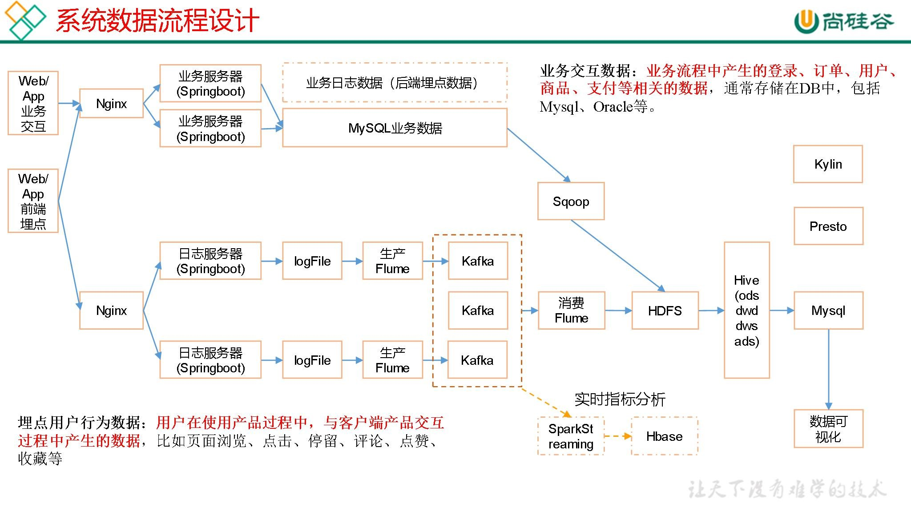

**2.4** 框架版本选型

1.  Apache：运维麻烦，组件间兼容性需要自己调研。（一般大厂使用，技术实力雄厚，有专业的运维人员）

    1.  CDH6.3.2：国内使用最多的版本，但 CM
        不开源，但其实对中、小公司使用来说没有影响（建议使用）10000 美金一个节点
        CDP7.0

    2.  HDP：开源，可以进行二次开发，但是没有 CDH 稳定，国内使用较少

## Apache框架版本

| 产品                  | 旧版本   | 新版本       | 版本新增                                                                                                                                                                                                |
|-----------------------|----------|--------------|---------------------------------------------------------------------------------------------------------------------------------------------------------------------------------------------------------|
| Hadoop                | 2.7.2    | 3.1.3        | HDFS的web端口号由50070变为9870，客户端访问端口号9820/8020/9000                                                                                                                                          |
| Zookeeper             | 3.4.10   | 3.5.7        |                                                                                                                                                                                                         |
| Mysql                 | 5.6.24   | 5.7.16       | ①原生json支持：不需要遍历所有字符串、通过虚拟列的功能对json的数据进行索引 ②多源复制：多主一从 ③InnoDB优化：为innoDB_buffer_pool_size、 innoDB_log_file_size、innoDB_flush_method提 供了更加合适的默认值 |
| Hive                  | 1.2.1    | 3.1.2        | （没有查到，查到的都是说不再支持mr引擎）                                                                                                                                                                |
| Flume                 | 1.7.0    | 1.9.0        |                                                                                                                                                                                                         |
| Kafka                 | 0.11-0.2 | \_2.11-2.4.1 | ①kafka 0.9版本之前，offset保存在Zookeeper 中；从0.9版本开始，consumer自己维护了一个 offset ②允许使用者从最近的副本中获取                                                                                |
| Kafka Eagle           | 1.3.7    | 1.4.5        |                                                                                                                                                                                                         |
| Azkaban               | 2.5.0    | 3.84.4       | 集成了给用户打电话的功能                                                                                                                                                                                |
| Spark                 | 2.1.1    | 3.0.0        | 不支持scala 2.11.x，升级为2.12.x                                                                                                                                                                        |
| Hbase                 | 1.3.1    | 2.0.5        |                                                                                                                                                                                                         |
| Phoenix               | 4.14.1   | 5.0.0        | 支持Apache HBase 2.0                                                                                                                                                                                    |
| Redis                 | 3.2.5    | 3.2.5        |                                                                                                                                                                                                         |
| Canal                 | 1.1.2    | 1.1.2        |                                                                                                                                                                                                         |
| ElasticSearch+Kiba na | 6.3.1    | 6.3.1        |                                                                                                                                                                                                         |

Azkaban、hive、kylin 需要重新编译

**2.5** 服务器选型

服务器使用物理机还是云主机？

1.  机器成本考虑：

    1.  物理机：以 128G 内存，20 核物理 CPU，40 线程，8THDD 和 2TSSD
        硬盘，单台报价 4W 出头，惠普品牌。一般物理机寿命 5 年左右。

        1.  云主机，以阿里云为例，差不多相同配置，每年 5W

2.  运维成本考虑：

    1.  物理机：需要有专业的运维人员（1 万\*13
        个月）、电费（商业用户）、安装空调

        1.  云主机：很多运维工作都由阿里云已经完成，运维相对较轻松

3.  企业选择

    1.  金融有钱公司选择阿里云（上海）

        1.  中小公司、为了融资上市，选择阿里云，拉倒融资后买物理机。

        2.  有长期打算，资金比较足，选择物理机。

**2.6** 集群规模

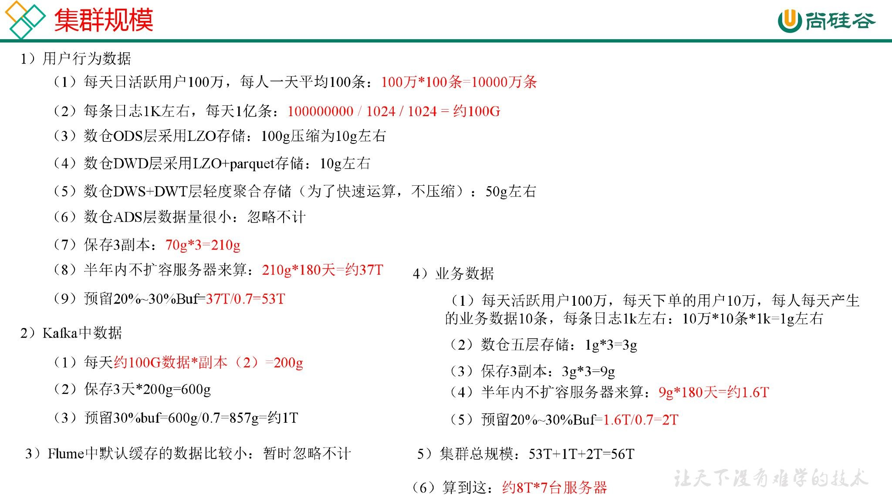

20 核物理 CPU 40 线程 \* 7 = 280 线程内存 128g \* 7 台 = 896g （计算任务内存
700g，其他安装框架需要内存）

128m =》1g 内存

>   =》

87g 数据 、700g 内存

根据数据规模大家集群

| 1  | 2  | 3  | 4  | 5  | 6  | 7  | 8     | 9     | 10    |
|----|----|----|----|----|----|----|-------|-------|-------|
| nn | nn | dn | dn | dn | dn | dn | dn    | dn    | dn    |
|    |    | rm | rm | nm | nm | nm | nm    | nm    | nm    |
|    |    | nm | nm |    |    |    |       |       |       |
|    |    |    |    |    |    |    | zk    | zk    | zk    |
|    |    |    |    |    |    |    | kafka | kafka | kafka |
|    |    |    |    |    |    |    | Flume | Flume | flume |

Hbase Hbase Hbase

hive hive mysql mysql spark spark

ES ES

1.  消耗内存的分开；

2.  kafka 、zk 、flume 传输数据比较紧密的放在一起；
    3）客户端尽量放在一到两台服务器上，方便外部访问；

**2.7** 人员配置参考

### 2.7.1 整体架构

属于研发部/技术部/数据部，我们属于大数据组，其他还有后端项目组，前端组、测试组、UI
组等。其他的还有产品部、运营部、人事部、财务部、行政部等。

>   大数据开发工程师=\>大数据组组长=》项目经理=\>部门经理=》技术总监 CTO

#### **2.7.2** 你们部门的职级等级，晋升规则

>   职级就分初级，中级，高级。晋升规则不一定，看公司效益和职位空缺。

>   京东：T1、T2 应届生；T3 14k 左右 T4 18K 左右 T5 24k-28k
>   左右阿里：p5、p6、p7、p8

#### **2.7.3** 人员配置参考

>   小型公司（3 人左右）：组长 1 人，剩余组员无明确分工，并且可能兼顾 javaEE
>   和前端。

中小型公司（3\~6 人左右）：组长 1 人，离线 2 人左右，实时 1
人左右（离线一般多于实时），组长兼顾和 javaEE、前端。

中型公司（5\~10 人左右）：组长 1 人，离线 3\~5 人左右（离线处理、数仓），实时 2
人左右，组长和技术大牛兼顾和 javaEE、前端。

>   中大型公司（10\~20 人左右）：组长 1 人，离线 5\~10
>   人（离线处理、数仓），实时 5 人

左右，JavaEE1 人左右（负责对接 JavaEE 业务），前端 1
人（有或者没有人单独负责前端）。

（发展比较良好的中大型公司可能大数据部门已经细化拆分，分成多个大数据组，分别负责不同业务）

上面只是参考配置，因为公司之间差异很大，例如 ofo 大数据部门只有 5
个人左右，因此根据所选公司规模确定一个合理范围，在面试前必须将这个人员配置考虑清楚，回答时要非常确定。

>   IOS 多少人 安卓多少人 前端多少人 JavaEE 多少人 测试多少人

（IOS、安卓） 1-2 个人 前端 1-3 个人； JavaEE 一般是大数据的 1-1.5
倍，测试：有的有，有的没有。1 个左右。 产品经理 1 个、产品助理 1-2 个，运营 1-3
个

>   公司划分：

>   0-50 小公司 50-500 中等 500-1000 大公司

1000 以上 大厂 领军的存在第 **3** 章数仓分层

**3.1** 数据仓库建模（绝对重点）

**3.1.1** 建模工具是什么？

>   PowerDesigner/SQLYog/EZDML

### 3.1.2 ODS 层

1.  保持数据原貌不做任何修改，起到备份数据的作用。

2.  数据采用压缩，减少磁盘存储空间（例如：原始数据 100G，可以压缩到 10G 左右）

3.  创建分区表，防止后续的全表扫描

### 3.1.3 DWD 层

>   DWD 层需构建维度模型，一般采用星型模型，呈现的状态一般为星座模型。

>   维度建模一般按照以下四个步骤：选择业务过程→声明粒度→确认维度→确认事实

1.  选择业务过程

    在业务系统中，如果业务表过多，挑选我们感兴趣的业务线，比如下单业务，支付业务，

退款业务，物流业务，一条业务线对应一张事实表。如果小公司业务表比较少，建议选择所有业务线。

1.  声明粒度数据粒度指数据仓库的数据中保存数据的细化程度或综合程度的级别。

声明粒度意味着精确定义事实表中的一行数据表示什么，应该尽可能选择最小粒度，以此来应各种各样的需求。

>   典型的粒度声明如下：订单当中的每个商品项作为下单事实表中的一行，粒度为每次每周的订单次数作为一行，粒度为每周。每月的订单次数作为一行，粒度为每月。

如果在 DWD
层粒度就是每周或者每月，那么后续就没有办法统计细粒度的指标了。所有建议采用最小粒度。

1.  确定维度

维度的主要作用是描述业务是事实，主要表示的是“谁，何处，何时”等信息。例如：时间维度、用户维度、地区维度等常见维度。

1.  确定事实此处的“事实”一词，指的是业务中的度量值，例如订单金额、下单次数等。

在 DWD
层，以业务过程为建模驱动，基于每个具体业务过程的特点，构建最细粒度的明细层事实表。事实表可做适当的宽表化处理。

通过以上步骤，结合本数仓的业务事实，得出业务总线矩阵表如下表所示。业务总线矩阵的原则，主要是根据维度表和事实表之间的关系，如果两者有关联则使用√标记。

表 业务总线矩阵表

时间 用户 地区 商品 优惠券 活动 编码 度量值

| 订单       | √ | √ | √ |   |   | √ | 件数/金额 |
|------------|---|---|---|---|---|---|-----------|
| 订单详情   | √ |   | √ | √ |   |   | 件数/金额 |
| 支付       | √ |   | √ |   |   |   | 次数/金额 |
| 加购       | √ | √ |   | √ |   |   | 件数/金额 |
| 收藏       | √ | √ |   | √ |   |   | 个数      |
| 评价       | √ | √ |   | √ |   |   | 个数      |
| 退款       | √ | √ |   | √ |   |   | 件数/金额 |
| 优惠券领用 | √ | √ |   |   | √ |   | 个数      |

根据维度建模中的星型模型思想，将维度进行退化。例如下图所示：地区表和省份表退化为地区维度表，商品表、品类表、spu
表、商品三级分类、商品二级分类、商品一级分类表退化为商品维度表，活动信息表和活动规则表退化为活动维度表。

>   至此，数仓的维度建模已经完毕，DWS、DWT 和 ADS 和维度建模已经没有关系了。

DWS 和 DWT
都是建宽表，宽表都是按照主题去建。主题相当于观察问题的角度。对应着维度表。

### 3.1.4 DWS 层

DWS 层统计各个主题对象的当天行为，服务于 DWT 层的主题宽表。如图所示，DWS
层的宽表字段，是站在不同维度的视角去看事实表，重点关注事实表的度量值，通过与之关联的事实表，获得不同的事实表的度量值。

### 3.1.5 DWT 层

以分析的主题对象为建模驱动，基于上层的应用和产品的指标需求，构建主题对象的全量宽表。

>   DWT 层主题宽表都记录什么字段？

如图所示，每个维度关联的不同事实表度量值以及首次、末次时间、累积至今的度量值、累积某个时间段的度量值。

### 3.1.6 ADS 层

分别对设备主题、会员主题、商品主题和营销主题进行指标分析，其中营销主题是用户主题和商品主题的跨主题分析案例

**3.2 ODS** 层做了哪些事？

1.  保持数据原貌，不做任何修改

2.  压缩采用 LZO，压缩比是 100g 数据压缩完 10g 左右。

3.  创建分区表

**3.3 DWD** 层做了哪些事？

### 3.3.1 数据清洗

1.  空值去除

2.  过滤核心字段无意义的数据，比如订单表中订单 id 为 null，支付表中支付 id
    为空（3）将用户行为宽表和业务表进行数据一致性处理 select case when a is null
    then b else a end as JZR,

    ... from A

### 3.3.2 清洗的手段

>   HQL、MR、SparkSQL、Kettle、Python（项目中采用 sql 进行清除）

**3.3.3** 清洗掉多少数据算合理

>   1 万条数据清洗掉 1 条。

**3.3.4** 脱敏

>   对手机号、身份证号等敏感数据脱敏

**3.3.5** 维度退化

>   对业务数据传过来的表进行维度退化和降维。（商品一级二级三级、省市县、年月日）

**3.3.6** 压缩 **LZO**

**3.3.7** 列式存储 **parquet**

**3.4 DWS** 层做了哪些事？

### 3.4.1 DWS 层有 3-5 张宽表（处理 100-200 个指标 70%以上的需求）

具体宽表名称：用户行为宽表，用户购买商品明细行为宽表，商品宽表，购物车宽表，物流宽表、登录注册、售后等。

**3.4.2** 哪个宽表最宽？大概有多少个字段？

>   最宽的是用户行为宽表。大概有 60-100 个字段

#### **3.4.3** 具体用户行为宽表字段名称

评论、打赏、收藏、关注--商品、关注--人、点赞、分享、好价爆料、文章发布、活跃、签到、补签卡、幸运屋、礼品、金币、电商点击、gmv

>   CREATE TABLE \`app_usr_interact\`(

>   \`stat_dt\` date COMMENT '互动日期',

>   \`user_id\` string COMMENT '用户id',

>   \`nickname\` string COMMENT '用户昵称',

>   \`register_date\` string COMMENT '注册日期',

>   \`register_from\` string COMMENT '注册来源',

>   \`remark\` string COMMENT '细分渠道',

>   \`province\` string COMMENT '注册省份',

>   \`pl_cnt\` bigint COMMENT '评论次数',

>   \`ds_cnt\` bigint COMMENT '打赏次数',

>   \`sc_add\` bigint COMMENT '添加收藏',

>   \`sc_cancel\` bigint COMMENT '取消收藏',

>   \`gzg_add\` bigint COMMENT '关注商品',

>   \`gzg_cancel\` bigint COMMENT '取消关注商品',

>   \`gzp_add\` bigint COMMENT '关注人',

>   \`gzp_cancel\` bigint COMMENT '取消关注人',

>   \`buzhi_cnt\` bigint COMMENT '点不值次数',

>   \`zhi_cnt\` bigint COMMENT '点值次数',

>   \`zan_cnt\` bigint COMMENT '点赞次数',

>   \`share_cnts\` bigint COMMENT '分享次数',

>   \`bl_cnt\` bigint COMMENT '爆料数',

>   \`fb_cnt\` bigint COMMENT '好价发布数',

>   \`online_cnt\` bigint COMMENT '活跃次数',

>   \`checkin_cnt\` bigint COMMENT '签到次数',

>   \`fix_checkin\` bigint COMMENT '补签次数',

>   \`house_point\` bigint COMMENT '幸运屋金币抽奖次数',

>   \`house_gold\` bigint COMMENT '幸运屋积分抽奖次数',

>   \`pack_cnt\` bigint COMMENT '礼品兑换次数',

>   \`gold_add\` bigint COMMENT '获取金币',

>   \`gold_cancel\` bigint COMMENT '支出金币',

>   \`surplus_gold\` bigint COMMENT '剩余金币',

>   \`event\` bigint COMMENT '电商点击次数',

>   \`gmv_amount\` bigint COMMENT 'gmv',

>   \`gmv_sales\` bigint COMMENT '订单数')

>   PARTITIONED BY ( \`dt\` string)

**3.5 ADS** 层分析过哪些指标

#### **3.5.1** 分析过的指标（一分钟至少说出 **30** 个指标）

日活、月活、周活、留存、留存率、新增（日、周、年）、转化率、流失、回流、七天内连续
3 天登录（点赞、收藏、评价、购买、加购、下单、活动）、连续 3 周（月）登录、
GMV、复购率、复购率排行、点赞、评论、收藏、领优惠价人数、使用优惠价、沉默、值不值得买、退款人数、退款率
topn 热门商品产品经理最关心的：留转 G 复活

### 3.5.2 留转 G 复活指标

1.  活跃

    日活：100 万 ；周活是日活的 1.1-1.3 倍；月活：是日活的 2-3 倍 300
    万总注册的用户多少？1000 万-3000 万之间

2.  GMV

    GMV：每天 10 万订单 （50 – 100 元） 500 万-1000 万

10%-20% 100 万-200 万（人员：程序员、人事、行政、财务、房租、收电费）

1.  复购率

    某日常商品复购；（手纸、面膜、牙膏）10%-20%

    电脑、显示器、手表 1%

2.  转化率

| 商品详情 =》 加购物车 =》下单                                                                                                                                                                                                                               | =》 支付 |
|-------------------------------------------------------------------------------------------------------------------------------------------------------------------------------------------------------------------------------------------------------------|----------|
|  5%-10% 60-70% （5）留存率 1/2/3、周留存、月留存搞活动： 10-20% **3.5.3** 哪个商品卖的好？ 面膜、手纸，每天销售 5000 个 **3.6 ADS** 层手写指标 **3.6.1** 如何分析用户活跃？ 在启动日志中统计不同设备 id 出现次数。去重 **3.6.2** 如何分析用户新增？**vivo** | 90%-95%  |

用活跃用户表 left join 用户新增表，用户新增表中 mid 为空的即为用户新增。

#### **3.6.3** 如何分析用户 **1** 天留存？

留存用户=前一天新增 join 今天活跃用户留存率=留存用户/前一天新增

#### **3.6.4** 如何分析沉默用户？

(登录时间为 7 天前，且只出现过一次) 按照设备 id 对日活表分组，登录次数为
1，且是在一周前登录。

**3.6.5** 如何分析本周回流用户？

本周活跃 left join 本周新增 left join 上周活跃，且本周新增 id 和上周活跃 id 都为
null

#### **3.6.6** 如何分析流失用户？

(登录时间为 7 天前) 按照设备 id 对日活表分组，且七天内没有登录过。

**3.6.7** 如何分析最近连续 **3** 周活跃用户数？

按照设备 id 对周活进行分组，统计次数大于 3 次。

#### **3.6.8** 如何分析最近七天内连续三天活跃用户数？

1.  查询出最近 7 天的活跃用户，并对用户活跃日期进行排名

2.  计算用户活跃日期及排名之间的差值3）对同用户及差值分组，统计差值个数

4）将差值相同个数大于等于 3 的数据取出，然后去重(去的是什么重???)，即为连续 3
天及以上活跃的用户

7 天连续收藏、点赞、购买、加购、付款、浏览、商品点击、退货

1 个月连续 7 天连续两周：

**3.7** 分析过最难的指标

#### **3.7.1** 最近连续 **3** 周活跃用户

#### **3.7.2** 最近 **7** 天连续 **3** 天活跃用户数

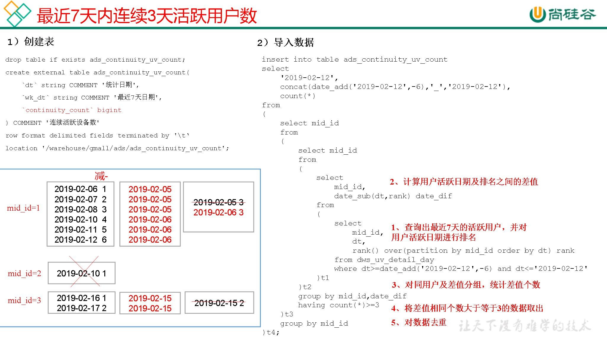

**3.7.3** 运费分摊

**3.7.4** 城市备注

第 **4** 章生产经验**—**业务

**4.1** 电商常识

## 4.1.1 SKU 和 SPU

>   SKU：一台银色、128G 内存的、支持联通网络的 iPhoneX

>   SPU：iPhoneX

>   Tm_id：品牌 Id 苹果，包括 IPHONE，耳机，MAC 等

### 4.1.2 订单表跟订单详情表区别？

>   订单表的订单状态会变化，订单详情表不会，因为没有订单状态。

订单表记录 user_id，订单 id 订单编号，订单的总金额
order_status，支付方式，订单状态等。

订单详情表记录 user_id，商品 sku_id ，具体的商品信息（商品名称 sku_name，价格
order_price，数量 sku_num）

**4.2** 埋点行为数据基本格式**(**基本字段**)**

我们要收集和分析的数据主要包括页面数据、事件数据、曝光数据、启动数据和错误数据。

## 4.2.1 页面

>   页面数据主要记录一个页 面的用户访问情况，包括访问时间、停留时间、页面路径等

信息。

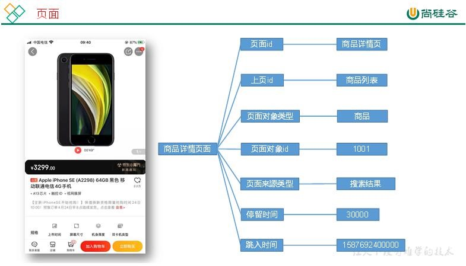

>   所有页面 id 如下

>   home("首页"), category("分类页"), discovery("发现页"), top_n("热门排行"),
>   favor("收藏页"), search("搜索页"), good_list("商品列表页"),
>   good_detail("商品详情"), good_spec("商品规格"), comment("评价"),
>   comment_done("评价完成"), comment_list("评价列表"), cart("购物车"),
>   trade("下单结算"), payment("支付页面"), payment_done("支付完成"),
>   orders_all("全部订单"), orders_unpaid("订单待支付"),
>   orders_undelivered("订单待发货"), orders_unreceipted("订单待收货"),
>   orders_wait_comment("订单待评价"), mine("我的"), activity("活动"),
>   login("登录"), register("注册");

>   所有页面对象类型如下：

>   sku_id("商品skuId"), keyword("搜索关键词"), sku_ids("多个商品skuId"),
>   activity_id("活动id"), coupon_id("购物券id");

>   所有来源类型如下：

>   promotion("商品推广"), recommend("算法推荐商品"), query("查询结果商品"),
>   activity("促销活动");

## 4.2.2 事件

事件数据主要记录应用内一个具体操作行为，包括操作类型、操作对象、操作对象描述等信息。

>   所有动作类型如下：

>   favor_add("添加收藏"), favor_canel("取消收藏"), cart_add("添加购物车"),
>   cart_remove("删除购物车"), cart_add_num("增加购物车商品数量"),
>   cart_minus_num("减少购物车商品数量"), trade_add_address("增加收货地址"),
>   get_coupon("领取优惠券");

>   注：对于下单、支付等业务数据，可从业务数据库获取。

>   所有动作目标类型如下：

>   sku_id("商品"), coupon_id("购物券");

## 4.2.3 曝光

>   曝光数据主要记录页面所曝光的内容，包括曝光对象，曝光类型等信息。

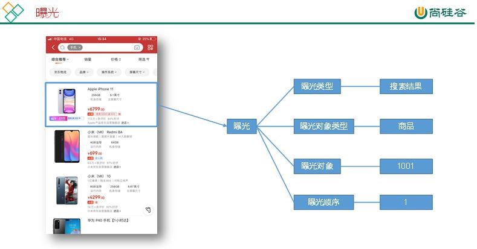

>   所有曝光类型如下：

>   promotion("商品推广"), recommend("算法推荐商品"), query("查询结果商品"),
>   activity("促销活动");

>   所有曝光对象类型如下：

>   sku_id("商品skuId"), activity_id("活动id");

## 4.2.4 启动

>   启动数据记录应用的启动信息。

所有启动入口类型如下：

>   icon("图标"), notification("通知"), install("安装后启动");

## 4.2.5 错误

>   错误数据记录应用使用过程中的错误信息，包括错误编号及错误信息。

### 4.2.6 埋点数据日志格式

>   我们的日志结构大致可分为两类，一是普通页面埋点日志，二是启动日志。

普通页面日志结构如下，每条日志包含了，当前页面的页面信息，所有事件（动作）、所有曝光信息以及错误信息。除此之外，还包含了一系列公共信息，包括设备信息，地理位置，应用信息等，即下边的
common 字段。

| { "common": { -- 公共信息  "ar": "230000", -- 地区编码  "ba": "iPhone", -- 手机品牌  "ch": "Appstore", -- 渠道  "md": "iPhone 8", -- 手机型号 "mid": "YXfhjAYH6As2z9Iq", -- 设备id  "os": "iOS 13.2.9", -- 操作系统  "uid": "485", -- 会员id  "vc": "v2.1.134" -- app版本号 }, "actions": [ --动作(事件) { "action_id": "favor_add", --动作id  "item": "3", --目标id  "item_type": "sku_id", --目标类型  "ts": 1585744376605 --动作时间戳 } ]， "displays": [ {  "displayType": "query", -- 曝光类型  "item": "3", -- 曝光对象id  "item_type": "sku_id", -- 曝光对象类型  "order": 1 --出现顺序 }, { "displayType": "promotion", "item": "6", "item_type": "sku_id", "order": 2 }, { "displayType": "promotion", "item": "9", "item_type": "sku_id", "order": 3 }, |
|--------------------------------------------------------------------------------------------------------------------------------------------------------------------------------------------------------------------------------------------------------------------------------------------------------------------------------------------------------------------------------------------------------------------------------------------------------------------------------------------------------------------------------------------------------------------------------------------------------------------------------------------------------------------------------------------------------------------------------------------------------------------|
| { "displayType": "recommend", "item": "6", "item_type": "sku_id", "order": 4 }, { "displayType": "query ", "item": "6", "item_type": "sku_id", "order": 5 } ], "page": { --页面信息  "during_time": 7648, -- 持续时间毫秒  "item": "3", -- 目标id  "item_type": "sku_id", -- 目标类型  "last_page_id": "login", -- 上页类型 "page_id": "good_detail", -- 页面ID "sourceType": "promotion" -- 来源类型 }, "err":{ --错误  "error_code": "1234", --错误码  "msg": "\*\*\*\*\*\*\*\*\*\*\*" --错误信息 }, "ts": 1585744374423 --跳入时间戳 }                                                                                                                                                                                                                          |

启动日志结构相对简单，主要包含公共信息，启动信息和错误信息。

| { "common": { "ar": "370000", "ba": "Honor", "ch": "wandoujia", "md": "Honor 20s", "mid": "eQF5boERMJFOujcp", "os": "Android 11.0", "uid": "76", "vc": "v2.1.134" }, "start": { "entry": "icon", --icon手机图标安装后启动 "loading_time": 18803, --启动加载时间  "open_ad_id": 7, --广告页ID  "open_ad_ms": 3449, -- 广告总共播放时间 "open_ad_skip_ms": 1989 -- 用户跳过广告时点 }, "err":{ --错误  "error_code": "1234", --错误码  "msg": "\*\*\*\*\*\*\*\*\*\*\*" --错误信息 }, "ts": 1585744304000 } | notice 通知 | install |
|----------------------------------------------------------------------------------------------------------------------------------------------------------------------------------------------------------------------------------------------------------------------------------------------------------------------------------------------------------------------------------------------------------------------------------------------------------------------------------------------------------|-------------|---------|

**4.3** 电商业务流程

1.  记住表与表之间的关系

2.  每个表记住 2-3 个字段

**4.4** 维度表和事实表（重点）

## 4.4.1 维度表

>   维度表：一般是对事实的描述信息。每一张维表对应现实世界中的一个对象或者概念。

例如：用户、商品、日期、地区等。

## 4.4.2 事实表

事实表中的每行数据代表一个业务事件（下单、支付、退款、评价等）。“事实”这个术语表示的是业务事件的度量值（可统计次数、个数、件数、金额等），例如，订单事件中的下单金额。

>   每一个事实表的行包括：具有可加性的数值型的度量值、与维表相连接的外键、通常具

有两个和两个以上的外键、外键之间表示维表之间多对多的关系。

1.  事务型事实表

以每个事务或事件为单位，例如一个销售订单记录，一笔支付记录等，作为事实表里的一行数据。一旦事务被提交，事实表数据被插入，数据就不再进行更改，其更新方式为增量更新。

1.  周期型快照事实表

周期型快照事实表中不会保留所有数据，只保留固定时间间隔的数据，例如每天或者

每月的销售额，或每月的账户余额等。

1.  累积型快照事实表

累计快照事实表用于跟踪业务事实的变化。例如，数据仓库中可能需要累积或者存储订单从下订单开始，到订单商品被打包、运输、和签收的各个业务阶段的时间点数据来跟踪订单声明周期的进展情况。当这个业务过程进行时，事实表的记录也要不断更新。

| 订单 **id** | 用户 **id** | 下单时间 | 打包时间 | 发货时间 | 签收时间 | 订单金额 |
|-------------|-------------|----------|----------|----------|----------|----------|
|             |             | 3-8      | 3-8      | 3-9      | 3-10     |          |

1.  同步策略（重点）

实体表，维度表统称维度表，每日全量或者每月（更长时间）全量事务型事实表：每日增量周期性事实表：拉链表

1.  关系型数据库范式理论

    1NF：属性不可再分割（例如不能存在 5 台电脑的属性，坏处：表都没法用）

2NF：不能存在部分函数依赖（例如主键（学号+课名）--\>成绩，姓名，但学号--》姓名，所以姓名部分依赖于主键（学号+课名），所以要去除，坏处：数据冗余）

>   3NF：不能存在传递函数依赖（学号--》宿舍种类--》价钱，坏处：数据冗余和增删异

常）

MySQL 关系模型：关系模型主要应用与 OLTP
系统中，为了保证数据的一致性以及避免冗余，所以大部分业务系统的表都是遵循第三范式的。

>   Hive 维度模型：维度模型主要应用于 OLAP 系统中，因为关系模型虽然冗余少，

但是在大规模数据，跨表分析统计查询过程中，会造成多表关联，这会大大降低执行效率。所以
HIVE
把相关各种表整理成两种：事实表和维度表两种。所有维度表围绕着事实表进行解释。

**4.7** 数据模型

>   雪花模型、星型模型和星座模型

>   （在维度建模的基础上又分为三种模型：星型模型、雪花模型、星座模型。）

>   星型模型（一级维度表），雪花（多级维度），星座模型（星型模型+多个事实表）

**4.8**
拉链表（重点）拉链表处理的业务场景：主要处理缓慢变化维的业务场景。（用户表、订单表）

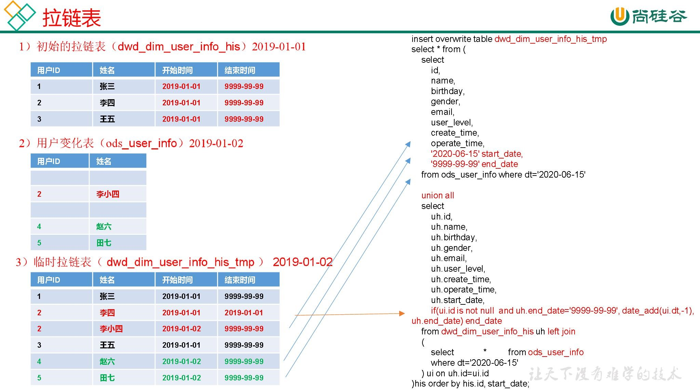

**4.9** 即席查询数据仓库

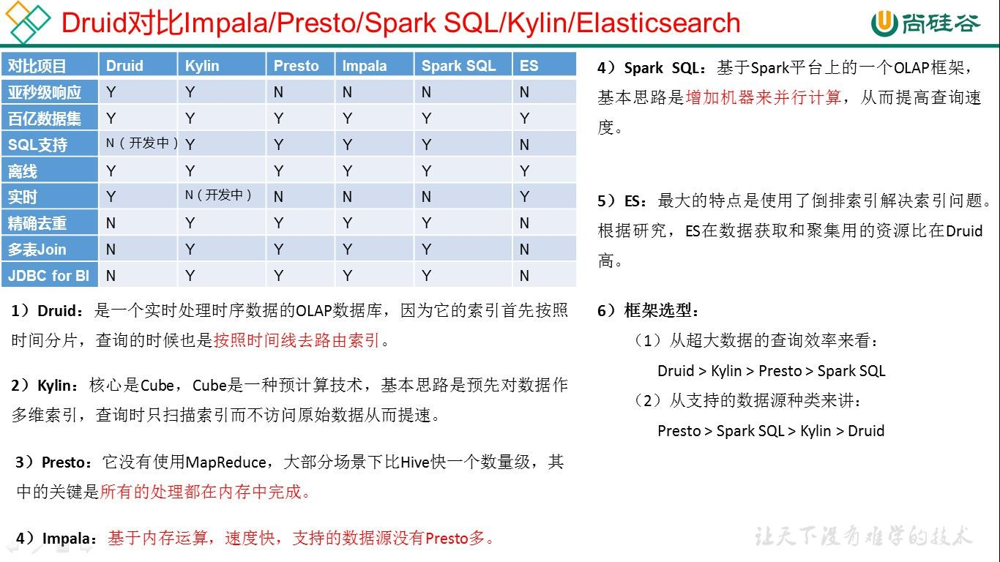

Kylin: T+1

Impala: CDH

Presto: Apache 版本框架

**4.10** 数据仓库每天跑多少张表，大概什么时候运行，运行多久？

基本一个项目建一个库，表格个数为初始的原始数据表格加上统计结果表格的总数。（一般
70-100 张表格）

用户行为 5 张；业务数据 23 张表 =》ods 24 =》dwd=\>20 张=》dws 6 张宽表=\>dwt6
张宽表=\>ads=》30 张 =》86 张

>   每天 0：10 开始运行。=》sqoop 20-30 分钟：1 点：=》 5-6
>   个小时运行完指标所有离线数据报表控制在 8 小时之内大数据实时处理部分控制在 5
>   分钟之内。（分钟级别、秒级别）如果是实时推荐系统，需要秒级响应

**4.11** 活动的话，数据量会增加多少？怎么解决？

>   日活增加 50%，GMV 增加多少。（留转 G 复活）情人节，促销手纸。

>   集群资源都留有预量。11.11，6.18，数据量过大，提前动态增加服务器。

**4.12** 并发峰值多少？大概哪个时间点？

高峰期晚上 7-12 点。Kafka 里面 20m/s 2 万/s 并发峰值在 1-2 万人

**4.13** 数仓中使用的哪种文件存储格式

常用的包括：textFile，rcFile，ORC，Parquet，一般企业里使用 ORC 或者
Parquet，因为是列式存储，且压缩比非常高，所以相比于
textFile，查询速度快，占用硬盘空间少

**4.14** 哪张表最费时间，有没有优化

>   用户行为宽表，数据量过大。数据倾斜的相关优化手段。（hadoop、hive、spark）

**4.14** 哪张表数据量最大，是多少

>   用户行为数据：100g(1 亿条)/5 = 2 千万 \* 2-3 倍
>   动作、曝光、页面故障、启动业务数据：详情（20-30 万条）
>   \-》加购-》下单-》支付-》物流

**4.15** 用什么工具做权限管理

Ranger 或 Sentry （用户认证
kerberos（张三、李四、王五）=\>表级别权限（张三、李四）、字段级别权限（李四））

**4.16** 数仓当中数据多久删除一次

1.  部分公司永久不删

2.  有一年、两年“删除”一次的，这里面说的删除是，先将超时数据压缩下载到单独

安装的磁盘上。然后删除集群上数据。 很少有公司不备份数据，直接删除的。

第 **5** 章生产经验**--**测试上线相关

**5.1** 测试相关

**5.1.1** 公司有多少台测试服务器？

>   测试服务器一般三台

## 5.1.2 测试环境什么样？

>   有钱的公司和生产环境电脑配置一样。

>   一般公司测试环境的配置是生产的一半。

**5.1.3** 测试数据哪来的？

>   一部分自己写 Java
>   程序自己造（更灵活），一部分从生产环境上取一部分（更真实）。

## 5.1.4 如何保证写的 sql 正确性

先在 mysql 的业务库里面把结果计算出来；在给你在 ads
层计算的结果进行比较；需要造一些特定的测试数据，测试。

>   从生产环境抓取一部分数据，数据有多少你是知道的，运算完毕应该符合你的预期。

>   离线数据和实时数据分析的结果比较。（日活 1 万 实时 10100），倾向取离线。

## 5.1.5 测试之后如何上线？

大公司：上线的时候，将脚本打包，提交
git。先发邮件抄送经理和总监，运维。运维负责上线。

小公司：跟项目经理说一下，项目经理技术把关，项目经理通过了就可以上线了。风险意识。

>   所谓的上线就是编写脚本，并在 azkaban 中进行作业调度。

**5.2** 项目实际工作流程

>   以下是活跃用户需求的整体开发流程。

产品经理负责收集需求：需求来源与客户反馈、老板的意见第 **1**
步：确定指标的业务口径

由产品经理主导，找到提出该指标的运营负责人沟通。首先要问清楚指标是怎么定义的，比如活跃用户是指启动过
APP 的用户。设备 id 还是用户 id。

邮件/需求文档-》不要口头第 **2** 步：需求评审

由产品经理主导设计原型，对于活跃主题，我们最终要展示的是最近 **n**
天的活跃用户数变化趋势
，效果如下图所示。此处大数据开发工程师、后端开发工程师、前端开发工程师一同参与，一起说明整个功能的价值和详细的操作流程，确保大家理解的一致。

>   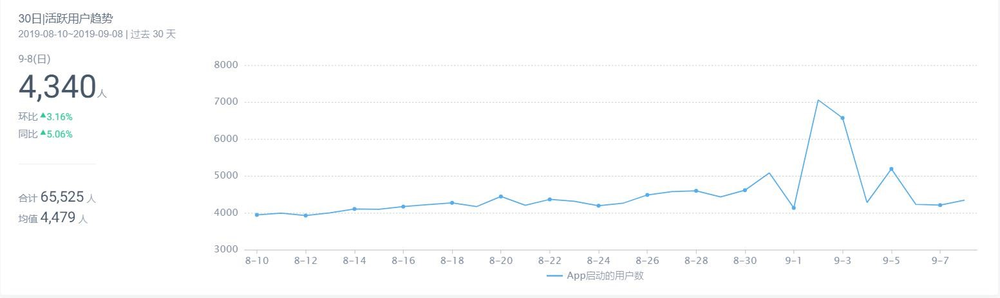

第 **3** 步：大数据开发

大数据开发工程师，通过数据同步的工具如 Flume、Sqoop 等将数据同步到 ODS
层，然后就是一层一层的通过 SQL 计算到 DWD、DWS
层，最后形成可为应用直接服务的数据填充到 ADS 层。

第 **4** 步：后端开发

>   后端工程师负责，为大数据工程师提供业务数据接口；

>   同时还负责读取 ADS 层分析后，写入 MySQL 中的数据。

第 **5** 步：前端开发

>   前端工程师负责，前端埋点。

>   对分析后的结果数据进行可视化展示。

第 **6** 步：联调

此时大数据开发工程师、前端开发工程师、后端开发工程师都要参与进来。此时会要求大数据开发工程师基于历史的数据执行计算任务，大数据开发工程师承担数据准确性的校验。前后端解决用户操作的相关
BUG 保证不出现低级的问题完成自测。

第 **7** 步：测试

>   测试工程师对整个大数据系统进行测试。测试的手段包括，边界值、等价类等。

提交测试异常的软件有：禅道、**bugzila**（测试人员记录测试问题
1.0，输入是什么，结果是什么，跟预期不一样-\>需要开发人员解释，是一个
bug，下一个版本解决 1.1-\>测试人员再测试。测试 1.1ok-\>测试经理关闭 bug）

1 周开发写代码 =》2 周测试时间第 **8** 步：上线

>   运维工程师会配合我们的前后端开发工程师更新最新的版本到服务器。此时产品经理要

找到该指标的负责人长期跟进指标的准确性。重要的指标还要每过一个周期内部再次验证，从而保证数据的准确性。

**5.3** 项目中实现一个需求大概多长时间

>   刚入职第一个需求大概需要7天左右。

>   对业务熟悉后，平均一天一个需求。

>   影响时间的因素：测试服务器购买获取环境准备、对业务熟悉、开会讨论需求、表的权

限申请、测试等。新员工培训（公司规章制度、代码规范）

**5.4** 项目在 **3**
年内迭代次数，每一个项目具体是如何迭代的。公司版本迭代多久一次，迭代到哪个版本

>   瀑布式开发、敏捷开发

>   差不多一个月会迭代一次。每月都有节日（元旦、春节、情人节、3.8
>   妇女节、端午节、

618、国庆、中秋、1111/6.1/5.1、生日、周末）新产品、新区域

>   就产品或我们提出优化需求，然后评估时间。每周我们都会开会做下周计划和本周总结。

（日报、周报、月报、季度报、年报）需求1周的时间，周三一定完成。周四周五（帮同事写代码、自己学习工作额外的技术）

>   有时候也会去预研一些新技术。Flink hudi

>   5.1.2

>   5是大版本号：必须是重大升级

>   1：一般是核心模块变动

>   2：一般版本变化

**5.5** 项目开发中每天做什么事

1.  新需求（活动、优化、新产品、新市场）。 60%

    1.  故障分析：数仓的任何步骤出现问题，需要查看问题，比如日活，月活下降或快速上升等。20%

    2.  新技术的预言（比如flink、数仓建模、数据质量、元数据管理）10%

    3.  其临时任务 10%

    4.  晨会-》10做操-》讨论中午吃什么-》12点出去吃1点-》睡到2点-》3点茶歇水果-》晚上吃啥-》吃加班餐-》开会-》晚上6点吃饭-》7点开始干活-10点-》11点

**5.6** 实时项目数据计算

## 5.6.1 跑实时任务，怎么分配内存和 CPU 资源

128m 数据对应 1g 内存

1 个 Kafka 分区对应 1 个 CPU

## 5.6.2 跑实时任务，每天数据量多少？

用户行为：实时任务用到了用户行为多少张表（20g） 100g/5
张表业务数据：实时任务用到了业务数据多少张表（34m） 1g/30
张表活动、风控、销售、流量

第 **6** 章生产经验**—**技术

**6.1** 可视化报表工具

Echarts（百度开源）、kibana（开源）、Tableau（功能强大的收费软件）、Superset（功能一般免费）、QuickBI（阿里云收费的离线）、DataV（阿里云收费的实时）

**6.2** 集群监控工具

>   Zabbix+ Grafana

**6.3** 项目中遇到的问题怎么解决的（重点**\*\*\*\*\***）

Shell 中 Flume 停止脚本

Hadoop 宕机

Hadoop 解决数据倾斜方法

集群资源分配参数（项目中遇到的问题）

HDFS 小文件处理

Hadoop 优化

Flume 挂掉 Flume 优化

Kafka 挂掉 Kafka 丢失

Kafka 数据重复

Kafka 消息数据积压

Kafka 优化

Kafka 单条日志传输大小

自定义 UDF、UDTF 函数

Hive 优化

Hive 解决数据倾斜方法

7 天内连续 3 次活跃分摊备注

Sqoop 空值、一致性、数据倾斜

Azkaban 任务挂了怎么办？ Azkaban 故障报警

Spark 数据倾斜

Spark 优化

SparkStreaming 精确一次性消费

## 6.4 Linux+Shell+Hadoop+ZK+Flume+kafka+Hive+Sqoop+Azkaban 那些事

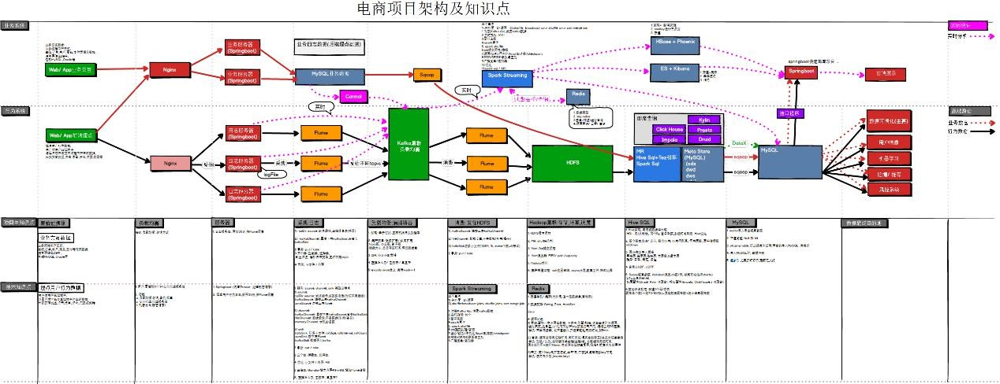

第 **7** 章生产经验**—**热点问题

**7.1** 元数据管理（**Atlas** 血缘系统）

依赖关系能够做到：表级别和字段级别用处：作业执行失败，评估他的影响范围。
主要用于表比较多的公司。

版本问题：

>   0.84 版本：2019-06-21

>   2.0 版本：2019-05-13

框架版本：

Apache 0.84 2.0

CDH 2.0

## 7.2 数据质量监控（Griffin）

### 7.2.1 监控原则

1.  单表数据量监控

    一张表的记录数在一个已知的范围内，或者上下浮动不会超过某个阈值

    -   SQL 结果：var 数据量 = select count（\*）from 表 where 时间等过滤条件

    -   报警触发条件设置：如果数据量不在[数值下限, 数值上限]， 则触发报警

    -   同比增加：如果((本周的数据量 - 上周的数据量)/上周的数据量\*100)不在
        [比例下

        线，比例上限]，则触发报警

    -   环比增加：如果((今天的数据量 - 昨天的数据量)/昨天的数据量\*100)不在
        [比例下

        线，比例上限]，则触发报警

    -   报警触发条件设置一定要有。如果没有配置的阈值，不能做监控日活、周活、月活、留存（日周月）、转化率（日、周、月）GMV（日、周、月）复购率（日周月）
        30%

2.  单表空值检测

    某个字段为空的记录数在一个范围内，或者占总量的百分比在某个阈值范围内

    -   目标字段：选择要监控的字段，不能选“无”

    -   SQL 结果：var 异常数据量 = select count(\*) from 表 where 目标字段 is
        null

    -   单次检测：如果(异常数据量)不在[数值下限, 数值上限]，则触发报警

3.  单表重复值检测

    一个或多个字段是否满足某些规则

    -   目标字段：第一步先正常统计条数；select count(\*) form 表；

    -   第二步，去重统计；select count(\*) from 表 group by 某个字段

    -   第一步的值和第二步不的值做减法，看是否在上下线阀值之内

    -   单次检测：如果(异常数据量)不在[数值下限, 数值上限]， 则触发报警

4.  单表值域检测

    一个或多个字段没有重复记录

    -   目标字段：选择要监控的字段，支持多选

    -   检测规则：填写“目标字段”要满足的条件。其中\$1 表示第一个目标字段，\$2
        表示第二个目标字段，以此类推。上图中的“检测规则”经过渲染后变为“delivery_fee
        = delivery_fee_base+delivery_fee_extra”

    -   阈值配置与“空值检测”相同

5.  跨表数据量对比

    主要针对同步流程，监控两张表的数据量是否一致

    -   SQL 结果：count(本表) - count(关联表)

    -   阈值配置与“空值检测”相同

#### **7.2.2** 数据质量实现

>   

>   尚硅谷大数据项目

>   之电商数仓（9质量

## 7.3 权限管理（Ranger）

>   

>   尚硅谷大数据项目

>   之电商数仓（8权限

**7.4** 数据治理

>   包括：数据质量管理、元数据管理、权限管理（ranger sentry）。

CDH cloudmanager-》sentry； HDP ambari=\>ranger

>   数据治理是一个复杂的系统工程，涉及到企业和单位多个领域，既要做好顶层设计，又

>   要解决好统一标准、统一流程、统一管理体系等问题，同时也要解决好数据采集、数据清洗、数据对接和应用集成等相关问题。

>   数据治理实施要点主要包含数据规划、制定数据标准、整理数据、搭建数据管理工具、

>   构建运维体系及推广贯标六大部分，其中数据规划是纲领、制定数据标准是基础、整理数据是过程、搭建数据管理工具是技术手段、构建运维体系是前提，推广贯标是持续保障。

>   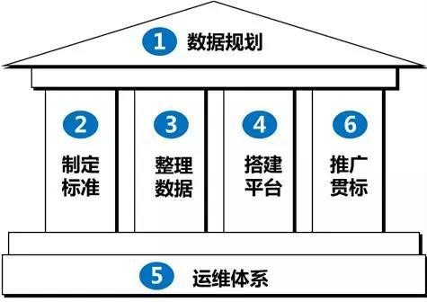

**7.5** 数据中台

>   <https://mp.weixin.qq.com/s/nXI0nSSOneteIClA7dming>

### 7.5.1 什么是中台？

在传统 IT
企业，项目的物理结构是什么样的呢？无论项目内部的如何复杂，都可分为“前台”和“后台”这两部分。

>   什么是前台？

首先，这里所说的“前台”和“前端”并不是一回事。所谓前台即包括各种和用户直接交互的界面，比如
web 页面，手机
app；也包括服务端各种实时响应用户请求的业务逻辑，比如商品查询、订单系统等等。

>   什么是后台？

>   后台并不直接面向用户，而是面向运营人员的配置管理系统，比如商品管理、物

>   流管理、结算管理。后台为前台提供了一些简单的配置。

>   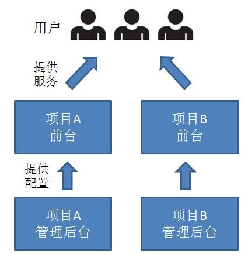

**7.5.2** 传统项目痛点痛点：重复造轮子。

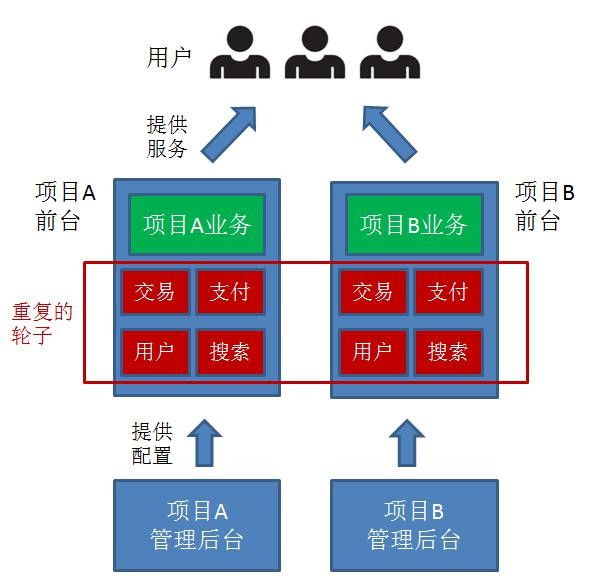

### 7.5.3 各家中台

1.  SuperCell 公司

    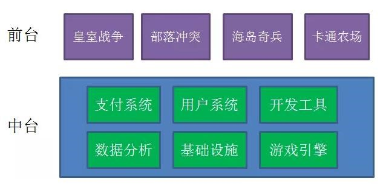

2.  阿里巴巴提出了“大中台，小前台”的战略

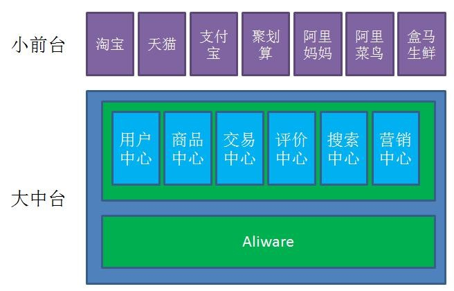

1.  华为提出了“平台炮火支撑精兵作战”的战略

#### **7.5.4** 中台具体划分

1.  业务中台

    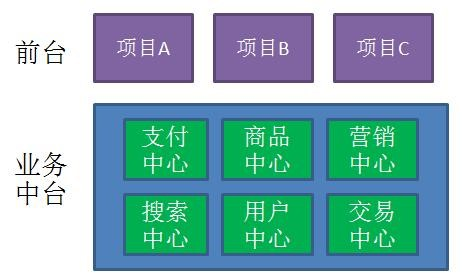

2.  技术中台

    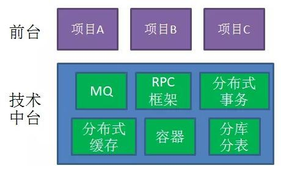

3.  数据中台

    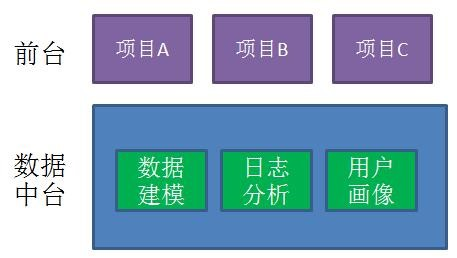

4.  算法中台

    

#### **7.5.5** 中台使用场景

1.  从 **0** 到 **1** 的阶段，没有必要搭建中台。

从 0 到 1
的创业型公司，首要目的是生存下去，以最快的速度打造出产品，证明自身的市场价值。

>   这个时候，让项目野蛮生长才是最好的选择。如果不慌不忙地先去搭建中台，恐

>   怕中台还没搭建好，公司早就饿死了。

1.  从 **1** 到 **N** 的阶段，适合搭建中台。

当企业有了一定规模，产品得到了市场的认可，这时候公司的首要目的不再是活下去，而是活的更好。

>   这个时候，趁着项目复杂度还不是特别高，可以考虑把各项目的通用部分下沉，

>   组建中台，以方便后续新项目的尝试和旧项目的迭代。

1.  从 **N** 到 **N+1** 的阶段，搭建中台势在必行。

当企业已经有了很大的规模，各种产品、服务、部门错综复杂，这时候做架构调整会比较痛苦。

但是长痛不如短痛，为了项目的长期发展，还是需要尽早调整架构，实现平台化，以免日后越来越难以维护。

## 7.6 数据湖

数据湖（Data
Lake）是一个存储企业的各种各样原始数据的大型仓库，其中的数据可供存取、处理、分析及传输。
**hudi**

>   目前，Hadoop 是最常用的部署数据湖的技术，所以很多人会觉得数据湖就是

>   Hadoop 集群。数据湖是一个概念，而 Hadoop 是用于实现这个概念的技术。

>   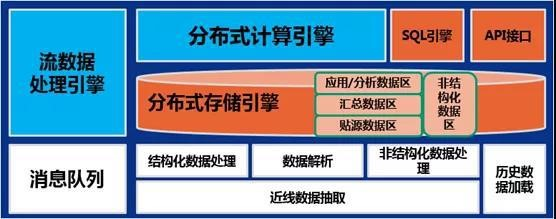

数据仓库 数据湖

>   主要处理历史的、结构化的数据，而且
>   能处理所有类型的数据，如结构化数据，这些数据必须与数据仓库事先定义的模
>   非结构化数据，半结构化数据等，数据型吻合。
>   的类型依赖于数据源系统的原始数据格式。非结构化数据（语音、图片、视频

>   等）

>   数据仓库分析的指标都是产品经理提前
>   根据海量的数据，挖掘出规律，反应给规定好的。按需分析数据。（日活、新增、
>   运营部门。

留存、转化率） 拥有非常强的计算能力用于处理数据。

>   数据挖掘

## 7.7 埋点

>   免费的埋点：上课演示。

>   收费的埋点：神策 <https://mp.weixin.qq.com/s/Xp3-alWF4XHvKDP9rNWCoQ>

>   目前主流的埋点方式，有代码埋点（前端/后端）、可视化埋点、全埋点三种。

代码埋点是通过调用埋点 SDK
函数，在需要埋点的业务逻辑功能位置调用接口，上报埋点数据。例如，我们对页面中的某个按钮埋点后，当这个按钮被点击时，可以在这个按钮对应的
OnClick 函数里面调用 SDK 提供的数据发送接口，来发送数据。

可视化埋点只需要研发人员集成采集
SDK，不需要写埋点代码，业务人员就可以通过访问分析平台的“圈选”功能，来“圈”出需要对用户行为进行捕捉的控件，并对该事件进行命名。圈选完毕后，这些配置会同步到各个用户的终端上，由采集
SDK 按照圈选的配置自动进行用户行为数据的采集和发送。

>   全埋点是通过在产品中嵌入
>   SDK，前端自动采集页面上的全部用户行为事件，上报埋点数据，相当于做了一个统一的埋点。然后再通过界面配置哪些数据需要在系统里面进行分析。

**7.8** 电商运营经验

### 7.8.1 电商 8 类基本指标

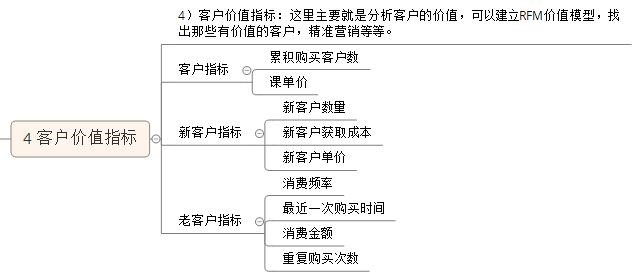

>   8）市场竞争指标：主要分析市场份额以及网站排名，进一步进行调整

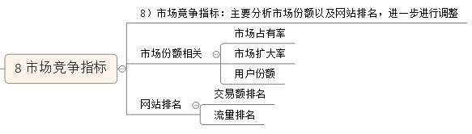

### 7.8.2 直播指标

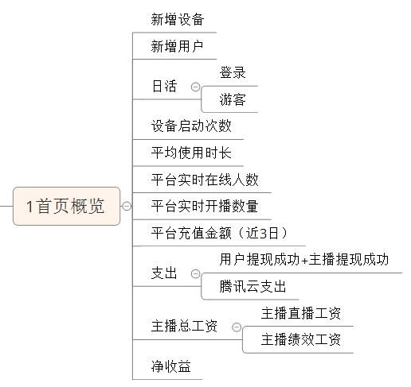

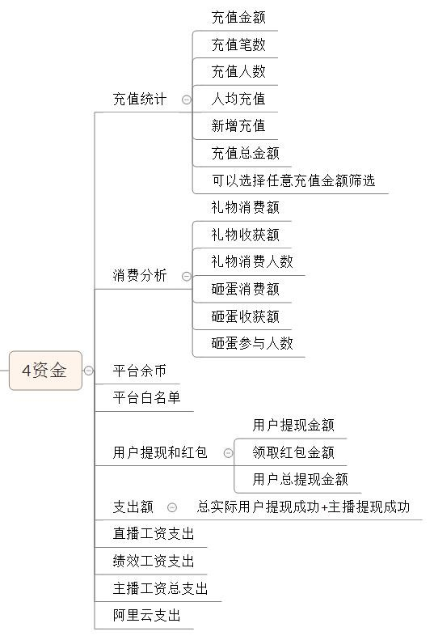

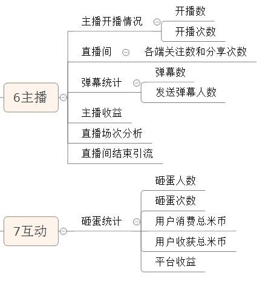

第 **8** 章手写代码

**8.1** 基本算法

## 8.1.1 冒泡排序

/\*\*

\* 冒泡排序 时间复杂度 O(n\^2) 空间复杂度O(1)

\*/ public class BubbleSort { public static void bubbleSort(int[] data) {

| System.out.println("开始排序"); int arrayLength = data.length; for (int i = 0; i \< arrayLength -                                                                                                                                                                  | 1;                   | i++) {        |   |
|--------------------------------------------------------------------------------------------------------------------------------------------------------------------------------------------------------------------------------------------------------------------|----------------------|---------------|---|
| boolean flag = false; for (int j = 0; j \< arrayLength                                                                                                                                                                                                             | -                    | 1 - i; j++) { |   |
| if(data[j] \> data[j + 1]){ int temp = data[j + 1]; data[j + 1] = data[j]; data[j] = temp; flag = true; } } System.out.println(java.util.Arrays.toStri if (!flag) break; } } public static void main(String[] args) { int[] data = { 9, -16, 21, 23, -30, -49, 21, | ng(data)); 30, 30 }; |               |   |
|  System.out.println(" 排 序                                                                                                                                                                                                                                        |  之 前               |  ： \\n"      | + |
| java.util.Arrays.toString(data)); bubbleSort(data);  System.out.println(" 排 序 java.util.Arrays.toString(data)); } }                                                                                                                                              |  之 后               |  ： \\n"      | + |

## 8.1.2 二分查找

图 4-二分查找核心思路实现代码：

| /\*\* \* 二分查找 时间复杂度O(log2n);空间复杂度O(1) \*/ def binarySearch(arr:Array[Int],left:Int,right:Int,findVal:Int): Int={ if(left\>right){//递归退出条件，找不到，返回-1 -1 } val midIndex = (left+right)/2 if (findVal \< arr(midIndex)){//向左递归查找 binarySearch(arr,left,midIndex-1,findVal) }else if(findVal \> arr(midIndex)){//向右递归查找 binarySearch(arr,midIndex+1,right,findVal) }else{//查找到，返回下标 midIndex } } |
|--------------------------------------------------------------------------------------------------------------------------------------------------------------------------------------------------------------------------------------------------------------------------------------------------------------------------------------------------------------------------------------------------------------------------------------------|

拓展需求：当一个有序数组中，有多个相同的数值时，如何将所有的数值都查找到。

代码实现如下：

>   /\*

>   {1,8, 10, 89, 1000, 1000，1234}
>   当一个有序数组中，有多个相同的数值时，如何将所有的数值都查找到，比如这里的
>   1000.

>   //分析

1.  返回的结果是一个可变数组 ArrayBuffer

2.  在找到结果时，向左边扫描，向右边扫描 [条件]

| 3. 找到结果后，就加入到ArrayBuffer \*/ def binarySearch2(arr: Array[Int], l: Int, r: Int, findVal: Int): ArrayBuffer[Int] = { //找不到条件? if (l \> r) { return ArrayBuffer() } val midIndex = (l + r) / 2 val midVal = arr(midIndex) if (midVal \> findVal) { //向左进行递归查找 binarySearch2(arr, l, midIndex - 1, findVal) } else if (midVal \< findVal) { //向右进行递归查找 binarySearch2(arr, midIndex + 1, r, findVal) } else { println("midIndex=" + midIndex) //定义一个可变数组 val resArr = ArrayBuffer[Int]() //向左边扫描 var temp = midIndex - 1 breakable { while (true) { if (temp \< 0 \|\| arr(temp) != findVal) { break() } if (arr(temp) == findVal) { resArr.append(temp) } temp -= 1 } } //将中间这个索引加入 resArr.append(midIndex) //向右边扫描 temp = midIndex + 1 breakable { while (true) { if (temp \> arr.length - 1 \|\| arr(temp) != findVal) { break() } if (arr(temp) == findVal) { resArr.append(temp) } temp += 1 } } return resArr } |
|-----------------------------------------------------------------------------------------------------------------------------------------------------------------------------------------------------------------------------------------------------------------------------------------------------------------------------------------------------------------------------------------------------------------------------------------------------------------------------------------------------------------------------------------------------------------------------------------------------------------------------------------------------------------------------------------------------------------------------------------------------------------------------------------------------------------------------------------------------------------------------------------------------------------------------------------------------------------------------|

## 8.1.3 快排

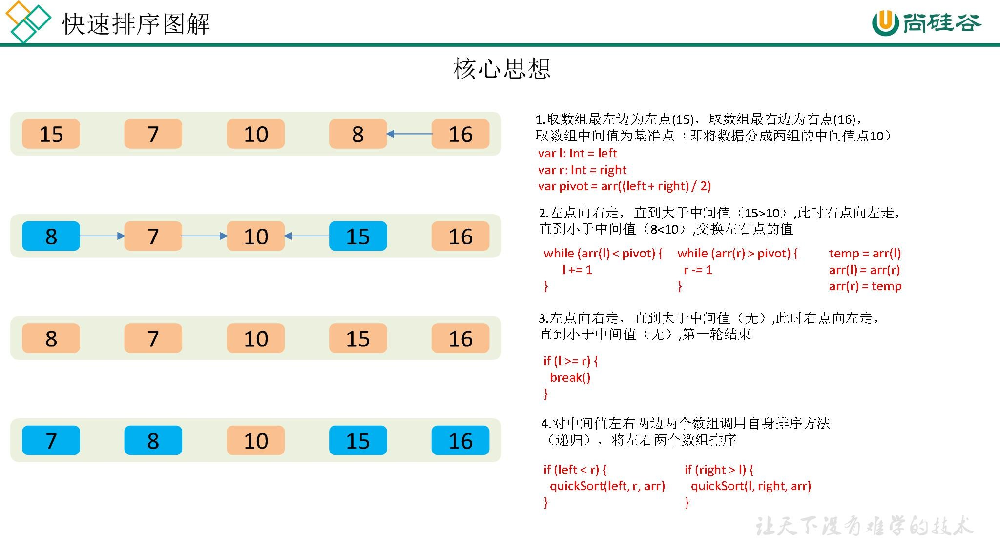

图 1-快速排序核心思想代码实现：

| /\*\* 快排 时间复杂度:平均时间复杂度为O(nlogn) 空间复杂度:O(logn)，因为递归栈空间的使用问题 \*/ def quickSort(list: List[Int]): List[Int] = list match { case Nil =\> Nil case List() =\> List() case head :: tail =\> val (left, right) = tail.partition(\_ \< head) quickSort(left) ::: head :: quickSort(right) } |
|----------------------------------------------------------------------------------------------------------------------------------------------------------------------------------------------------------------------------------------------------------------------------------------------------------------------|

## 8.1.4 归并

>   图 2-归并排序核心思想

核心思想：不断的将大的数组分成两个小数组，直到不能拆分为止，即形成了单个值。此时使用合并的排序思想对已经有序的数组进行合并，合并为一个大的数据，不断重复此过程，直到最终所有数据合并到一个数组为止。

>   

>   图 3-归并排序“治”流程

代码实现：

>   /\*\*

-   快排

-   时间复杂度:O(nlogn)

-   空间复杂度:O(n)

| \*/ defmerge(left:List[Int],right:List[Int]):List[Int]=(left,right) match { case (Nil, \_) =\> right case (_, Nil) =\> left case (x :: xTail, y :: yTail) =\> if (x \<= y) x :: merge(xTail, right) else y :: merge(left, yTail) } |
|------------------------------------------------------------------------------------------------------------------------------------------------------------------------------------------------------------------------------------|

## 8.1.5 二叉树之 Scala 实现

1.  二叉树概念

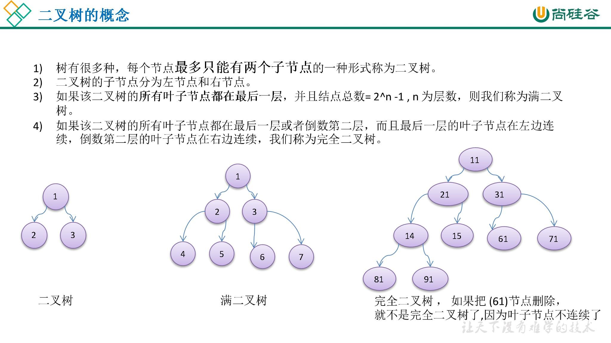

1.  二叉树的特点

    1.  树执行查找、删除、插入的时间复杂度都是 O(logN)

        1.  遍历二叉树的方法包括前序、中序、后序

        2.  非平衡树指的是根的左右两边的子节点的数量不一致

        3.  在非空二叉树中，第 i 层的结点总数不超过 , i\>=1；

        4.  深度为 h 的二叉树最多有个结点(h\>=1)，最少有 h 个结点；

        5.  对于任意一棵二叉树，如果其叶结点数为 N0，而度数为 2 的结点总数为
            N2，则

N0=N2+1；

1.  二叉树的 Scala 代码实现

    定义节点以及前序、中序、后序遍历

    class TreeNode(treeNo:Int){

    val no = treeNo var left:TreeNode = null

| var right:TreeNode = null //后序遍历 def postOrder():Unit={ //向左递归输出左子树 if(this.left != null){ this.left.postOrder } //向右递归输出右子树 if (this.right != null) { this.right.postOrder } //输出当前节点值 printf("节点信息 no=%d \\n",no) } //中序遍历 def infixOrder():Unit={ //向左递归输出左子树 if(this.left != null){ this.left.infixOrder() } //输出当前节点值 printf("节点信息 no=%d \\n",no) //向右递归输出右子树 if (this.right != null) { this.right.infixOrder() } } //前序遍历 def preOrder():Unit={ //输出当前节点值 printf("节点信息 no=%d \\n",no) //向左递归输出左子树 if(this.left != null){ this.left.postOrder() } //向右递归输出右子树 if (this.right != null) { this.right.preOrder() } } //后序遍历查找 def postOrderSearch(no:Int): TreeNode = { //向左递归输出左子树 var resNode:TreeNode = null if (this.left != null) { |
|--------------------------------------------------------------------------------------------------------------------------------------------------------------------------------------------------------------------------------------------------------------------------------------------------------------------------------------------------------------------------------------------------------------------------------------------------------------------------------------------------------------------------------------------------------------------------------------------------------------------------------------------------------------------------------------------------------------------------------------------------------------------------------------------------------------------------------------------------------------|

| resNode = this.left.postOrderSearch(no) } if (resNode != null) { return resNode } if (this.right != null) { resNode = this.right.postOrderSearch(no) } if (resNode != null) { return resNode } println("ttt\~\~") if (this.no == no) { return this } resNode } //中序遍历查找 def infixOrderSearch(no:Int): TreeNode = { var resNode : TreeNode = null //先向左递归查找 if (this.left != null) { resNode = this.left.infixOrderSearch(no) } if (resNode != null) { return resNode } println("yyy\~\~") if (no == this.no) { return this } //向右递归查找 if (this.right != null) { resNode = this.right.infixOrderSearch(no) } return resNode } //前序查找 def preOrderSearch(no:Int): TreeNode = { if (no == this.no) { return this } //向左递归查找 var resNode : TreeNode = null if (this.left != null) { resNode = this.left.preOrderSearch(no) } if (resNode != null){ return resNode } //向右边递归查找 |
|---------------------------------------------------------------------------------------------------------------------------------------------------------------------------------------------------------------------------------------------------------------------------------------------------------------------------------------------------------------------------------------------------------------------------------------------------------------------------------------------------------------------------------------------------------------------------------------------------------------------------------------------------------------------------------------------------------------------------------------------------------------------------------------------------------------------------------------------------------------------------------------------------------------|
| if (this.right != null) { resNode = this.right.preOrderSearch(no) } return resNode } //删除节点 //删除节点规则 //1如果删除的节点是叶子节点，则删除该节点 //2如果删除的节点是非叶子节点，则删除该子树 def delNode(no:Int): Unit = { //首先比较当前节点的左子节点是否为要删除的节点 if (this.left != null && this.left.no == no) { this.left = null return } //比较当前节点的右子节点是否为要删除的节点 if (this.right != null && this.right.no == no) { this.right = null return } //向左递归删除 if (this.left != null) { this.left.delNode(no) } //向右递归删除 if (this.right != null) { this.right.delNode(no) } } }                                                                                                                                                                                                                                                                                       |

>   定义二叉树，前序、中序、后序遍历，前序、中序、后序查找，删除节点

| class BinaryTree{ var root:TreeNode = null //后序遍历 def postOrder(): Unit = { if (root != null){ root.postOrder() }else { println("当前二叉树为空，不能遍历") } } //中序遍历 def infixOrder(): Unit = { if (root != null){ root.infixOrder() }else { println("当前二叉树为空，不能遍历") }                                                                                                                                                                                                                                                                                                                                                                                                                          |
|-----------------------------------------------------------------------------------------------------------------------------------------------------------------------------------------------------------------------------------------------------------------------------------------------------------------------------------------------------------------------------------------------------------------------------------------------------------------------------------------------------------------------------------------------------------------------------------------------------------------------------------------------------------------------------------------------------------------------|
| } //前序遍历 def preOrder(): Unit = { if (root != null){ root.preOrder() }else { println("当前二叉树为空，不能遍历") } } //后序遍历查找 def postOrderSearch(no:Int): TreeNode = { if (root != null) { root.postOrderSearch(no) }else{ null } } //中序遍历查找 def infixOrderSeacher(no:Int): TreeNode = { if (root != null) { return root.infixOrderSearch(no) }else { return null } } //前序查找 def preOrderSearch(no:Int): TreeNode = { if (root != null) { return root.preOrderSearch(no) }else{ //println("当前二叉树为空，不能查找") return null } } //删除节点 def delNode(no:Int): Unit = { if (root != null) { //先处理一下root是不是要删除的 if (root.no == no){ root = null }else { root.delNode(no) } } } |

**8.2** 开发代码

## 8.2.1 手写 Spark-WordCount

val conf: SparkConf =

| new SparkConf().setMaster("local[\*]").setAppName("WordCount") val sc = new SparkContext(conf) sc.textFile("/input") .flatMap(_.split(" ")) .map((_, 1)) .reduceByKey(\_ + \_) .saveAsTextFile("/output") sc.stop() |
|---------------------------------------------------------------------------------------------------------------------------------------------------------------------------------------------------------------------|

## 8.3 手写 HQL

**8.3.1** 手写 **HQL** 第 **1** 题

表结构：uid,subject_id,score

求：找出所有科目成绩都大于某一学科平均成绩的学生数据集如下

| 1001 | 01 90 |
|------|-------|
| 1001 | 02 90 |
| 1001 | 03 90 |
| 1002 | 01 85 |
| 1002 | 02 85 |
| 1002 | 03 70 |
| 1003 | 01 70 |
| 1003 | 02 70 |
| 1003 | 03 85 |

1.  建表语句

    create table score( uid string, subject_id string, score int)

row format delimited fields terminated by '\\t';

1.  求出每个学科平均成绩

| select uid, score, avg(score) over(partition by subject_id) avg_score from score;t1 |
|-------------------------------------------------------------------------------------|

1.  根据是否大于平均成绩记录 flag，大于则记为 0 否则记为 1

| select uid, if(score\>avg_score,0,1) flag from t1;t2 |
|------------------------------------------------------|

1.  根据学生 id 进行分组统计 flag 的和，和为 0 则是所有学科都大于平均成绩

select uid from

| t2 group by uid having sum(flag)=0; |
|-------------------------------------|

1.  最终 SQL

| select uid from (select uid, if(score\>avg_score,0,1) flag from (select uid, score, avg(score) over(partition by subject_id) avg_score from score)t1)t2 group by uid having sum(flag)=0; |
|------------------------------------------------------------------------------------------------------------------------------------------------------------------------------------------|

>   **8.3.2** 手写 **HQL** 第 **2** 题我们有如下的用户访问数据

| userId | visitDate | visitCount |
|--------|-----------|------------|
| u01    | 2017/1/21 | 5          |
| u02    | 2017/1/23 | 6          |
| u03    | 2017/1/22 | 8          |
| u04    | 2017/1/20 | 3          |
| u01    | 2017/1/23 | 6          |
| u01    | 2017/2/21 | 8          |
| U02    | 2017/1/23 | 6          |
| U01    | 2017/2/22 | 4          |

>   要求使用 SQL 统计出每个用户的累积访问次数，如下表所示：

| 用户 id | 月份    | 小计 | 累积 |
|---------|---------|------|------|
| u01     | 2017-01 | 11   | 11   |
| u01     | 2017-02 | 12   | 23   |
| u02     | 2017-01 | 12   | 12   |
| u03     | 2017-01 | 8    | 8    |
| u04     | 2017-01 | 3    | 3    |

数据集

| u01 | 2017/1/21 | 5 |
|-----|-----------|---|
| u02 | 2017/1/23 | 6 |
| u03 | 2017/1/22 | 8 |
| u04 | 2017/1/20 | 3 |
| u01 | 2017/1/23 | 6 |
| u01 | 2017/2/21 | 8 |
| u02 | 2017/1/23 | 6 |
| u01 | 2017/2/22 | 4 |

1.  创建表

| create table action (userId string, visitDate string, visitCount int) row format delimited fields terminated by "\\t"; |
|------------------------------------------------------------------------------------------------------------------------|

1.  修改数据格式

| select userId, date_format(regexp_replace(visitDate,'/','-'),'yyyy-MM') mn, visitCount from action;t1 |
|-------------------------------------------------------------------------------------------------------|

1.  计算每人单月访问量

| select userId, mn, sum(visitCount) mn_count from t1 group by userId,mn;t2 |
|---------------------------------------------------------------------------|

1.  按月累计访问量

| select userId, mn, mn_count, sum(mn_count) over(partition by userId order by mn) from t2; |
|-------------------------------------------------------------------------------------------|

1.  最终 SQL

| select userId, mn, mn_count, sum(mn_count) over(partition by userId order by mn) from ( select userId,                                                          |
|-----------------------------------------------------------------------------------------------------------------------------------------------------------------|
| mn, sum(visitCount) mn_count from (select userId, date_format(regexp_replace(visitDate,'/','-'),'yyyy-MM') mn, visitCount from action)t1 group by userId,mn)t2; |

### 8.3.3 手写 HQL 第 3 题

>   有 50W 个京东店铺，每个顾客访客访问任何一个店铺的任何一个商品时都会产生一条

访问日志，访问日志存储的表名为 Visit，访客的用户 id 为
user_id，被访问的店铺名称为 shop，

请统计：

1.  每个店铺的 UV（访客数）

2.  每个店铺访问次数 top3 的访客信息。输出店铺名称、访客 id、访问次数

数据集

u1 a u2 b u1 b u1 a u3 c u4 b u1 a u2 c u5 b u4 b u6 c u2 c u1 b u2 a u2 a u3 a
u5 a u5 a u5 a

1.  建表

create table visit(user_id string,shop string) row format delimited fields
terminated by '\\t';

1.  每个店铺的 UV（访客数）

selectshop,count(distinctuser_id)fromvisitgroupbyshop;

1.  每个店铺访问次数 top3 的访客信息。输出店铺名称、访客 id、访问次数

2.  查询每个店铺被每个用户访问次数

select shop,user_id,count(\*) ct

from visit group by shop,user_id;t1

1.  计算每个店铺被用户访问次数排名

select shop,user_id,ct,rank() over(partition by shop order by ct) rk from t1;t2

1.  取每个店铺排名前 3 的

select shop,user_id,ct

from t2 where rk\<=3;

1.  最终 SQL

| select shop, user_id, ct from (select shop, user_id, ct, rank() over(partition by shop order by ct) rk from (select shop, user_id, count(\*) ct from visit group by shop, user_id)t1 )t2 where rk\<=3; |
|--------------------------------------------------------------------------------------------------------------------------------------------------------------------------------------------------------|

### 8.3.4 手写 HQL 第 4 题

已知一个表 STG.ORDER，有如下字段:Date，Order_id，User_id，amount。请给出 sql
进行统计:数据样例:2017-01-01,10029028,1000003251,33.57。

1.  给出 2017 年每个月的订单数、用户数、总成交金额。

2.  给出 2017 年 11 月的新客数(指在 11 月才有第一笔订单) 建表

create table order_tab(dt string,order_id string,user_id

string,amount decimal(10,2)) row format delimited fields terminated by '\\t';

1.  给出 2017 年每个月的订单数、用户数、总成交金额。

| select date_format(dt,'yyyy-MM'), count(order_id), count(distinct user_id), sum(amount) from order_tab where date_format(dt,'yyyy')='2017' group by date_format(dt,'yyyy-MM'); |
|--------------------------------------------------------------------------------------------------------------------------------------------------------------------------------|

1.  给出 2017 年 11 月的新客数(指在 11 月才有第一笔订单)

| select count(user_id) from order_tab group by user_id having date_format(min(dt),'yyyy-MM')='2017-11'; |
|--------------------------------------------------------------------------------------------------------|

### 8.3.5 手写 HQL 第 5 题

有日志如下，请写出代码求得所有用户和活跃用户的总数及平均年龄。（活跃用户指连续两天都有访问记录的用户）日期
用户 年龄

数据集

2019-02-11,test_1,23

2019-02-11,test_2,19

2019-02-11,test_3,39

2019-02-11,test_1,23

2019-02-11,test_3,39

2019-02-11,test_1,23

2019-02-12,test_2,19

2019-02-13,test_1,23

2019-02-15,test_2,19

2019-02-16,test_2,19

1.  建表

create table user_age(dt string,user_id string,age int)row format delimited
fields terminated by ',';

1.  按照日期以及用户分组，按照日期排序并给出排名

    select dt, user_id, min(age) age,

| rank() over(partition by user_id order by dt) rk from user_age group by dt,user_id;t1 |
|---------------------------------------------------------------------------------------|

1.  计算日期及排名的差值

| select user_id, age, date_sub(dt,rk) flag from t1;t2 |
|------------------------------------------------------|

1.  过滤出差值大于等于 2 的，即为连续两天活跃的用户

| select user_id, min(age) age from t2 group by user_id,flag having count(\*)\>=2;t3 |
|------------------------------------------------------------------------------------|

1.  对数据进行去重处理（一个用户可以在两个不同的时间点连续登录），例如：a 用户在
    1 月 10 号 1 月 11 号以及 1 月 20 号和 1 月 21 号 4 天登录。

select user_id, min(age) age from t3

>   group by user_id;t4

1.  计算活跃用户（两天连续有访问）的人数以及平均年龄

| select count(\*) ct, cast(sum(age)/count(\*) as decimal(10,2)) from t4; |
|-------------------------------------------------------------------------|

1.  对全量数据集进行按照用户去重

select user_id, min(age) age from user_age

>   group by user_id;t5

1.  计算所有用户的数量以及平均年龄

select

>   count(\*) user_count,

>   cast((sum(age)/count(\*)) as decimal(10,1)) from

>   t5;

1.  将第 5 步以及第 7 步两个数据集进行 union all 操作

| select 0 user_total_count, 0 user_total_avg_age, count(\*) twice_count, cast(sum(age)/count(\*) as decimal(10,2)) twice_count_avg_age from ( select user_id, min(age) age from (select user_id, min(age) age from ( select user_id, age, date_sub(dt,rk) flag from ( select dt, user_id, min(age) age, rank() over(partition by user_id order by dt) rk from user_age group by dt,user_id )t1 )t2 group by user_id,flag having count(\*)\>=2)t3 group by user_id )t4 union all |
|--------------------------------------------------------------------------------------------------------------------------------------------------------------------------------------------------------------------------------------------------------------------------------------------------------------------------------------------------------------------------------------------------------------------------------------------------------------------------------|

| select count(\*) user_total_count, cast((sum(age)/count(\*)) as decimal(10,1)), 0 twice_count, 0 twice_count_avg_age from ( select user_id, min(age) age from user_age group by user_id )t5;t6 |
|------------------------------------------------------------------------------------------------------------------------------------------------------------------------------------------------|

1.  求和并拼接为最终 SQL

| select sum(user_total_count), sum(user_total_avg_age), sum(twice_count), sum(twice_count_avg_age) from (select 0 user_total_count, 0 user_total_avg_age, count(\*) twice_count, cast(sum(age)/count(\*) twice_count_avg_age from ( select user_id, min(age) age                                                                                                         | as  | decimal(10,2)) |   |
|-------------------------------------------------------------------------------------------------------------------------------------------------------------------------------------------------------------------------------------------------------------------------------------------------------------------------------------------------------------------------|-----|----------------|---|
| from (select user_id, min(age)                                                                                                                                                                                                                                                                                                                                          | age |                |   |
| from ( select user_id, age, date_sub(dt,rk) flag from ( select dt, user_id, min(age) age,                                                                                                                                                                                                                                                                               |     |                |   |
| rank() over(partition by user_id order by dt) rk from user_age group by dt,user_id )t1 )t2 group by user_id,flag having count(\*)\>=2)t3 group by user_id )t4 union all select count(\*) user_total_count, cast((sum(age)/count(\*)) as decimal(10,1)), 0 twice_count, 0 twice_count_avg_age from ( select user_id, min(age) age from user_age group by user_id )t5)t6; |     |                |   |

### 8.3.6 手写 HQL 第 6 题

>   请用 sql 写出所有用户中在今年 10 月份第一次购买商品的金额，表 ordertable
>   字段（购

买用户：userid，金额：money，购买时间：paymenttime(格式：2017-10-01)，订单
id：orderid）

1.  建表

    create table ordertable( userid string, money int, paymenttime string,
    orderid string)

row format delimited fields terminated by '\\t';

1.  查询出

| select userid, min(paymenttime) paymenttime                                                                                                                                                                                                                     |
|-----------------------------------------------------------------------------------------------------------------------------------------------------------------------------------------------------------------------------------------------------------------|
| from ordertable where date_format(paymenttime,'yyyy-MM')='2017-10' group by userid;t1                                                                                                                                                                           |
| select t1.userid, t1.paymenttime, od.money from t1 join ordertable od on t1.userid=od.userid and t1.paymenttime=od.paymenttime;                                                                                                                                 |
| select t1.userid, t1.paymenttime, od.money from (select userid, min(paymenttime) paymenttime from ordertable where date_format(paymenttime,'yyyy-MM')='2017-10' group by userid)t1 join ordertable od on t1.userid=od.userid and t1.paymenttime=od.paymenttime; |

>   **8.3.7** 手写 **HQL** 第 **7** 题有一个线上服务器访问日志格式如下（用 sql
>   答题）

| 时间                  | 接口             | ip 地址     |
|-----------------------|------------------|-------------|
| 2016-11-09 11：22：05 | /api/user/login  | 110.23.5.33 |
| 2016-11-09 11：23：10 | /api/user/detail | 57.3.2.16   |

>   .....

>   2016-11-09 23：59：40 /api/user/login 200.6.5.166 求 11 月 9 号下午 14
>   点（14-15 点），访问 api/user/login 接口的 top10 的 ip 地址

数据集

| 2016-11-09 | 14:22:05 | /api/user/login  | 110.23.5.33 |
|------------|----------|------------------|-------------|
| 2016-11-09 | 11:23:10 | /api/user/detail | 57.3.2.16   |
| 2016-11-09 | 14:59:40 | /api/user/login  | 200.6.5.166 |
| 2016-11-09 | 14:22:05 | /api/user/login  | 110.23.5.34 |
| 2016-11-09 | 14:22:05 | /api/user/login  | 110.23.5.34 |
| 2016-11-09 | 14:22:05 | /api/user/login  | 110.23.5.34 |
| 2016-11-09 | 11:23:10 | /api/user/detail | 57.3.2.16   |
| 2016-11-09 | 23:59:40 | /api/user/login  | 200.6.5.166 |
| 2016-11-09 | 14:22:05 | /api/user/login  | 110.23.5.34 |
| 2016-11-09 | 11:23:10 | /api/user/detail | 57.3.2.16   |
| 2016-11-09 | 23:59:40 | /api/user/login  | 200.6.5.166 |
| 2016-11-09 | 14:22:05 | /api/user/login  | 110.23.5.35 |
| 2016-11-09 | 14:23:10 | /api/user/detail | 57.3.2.16   |
| 2016-11-09 | 23:59:40 | /api/user/login  | 200.6.5.166 |
| 2016-11-09 | 14:59:40 | /api/user/login  | 200.6.5.166 |
| 2016-11-09 | 14:59:40 | /api/user/login  | 200.6.5.166 |

1.  建表

    create table ip( time string, interface string, ip string)

row format delimited fields terminated by '\\t';

1.  最终 SQL

| select ip, interface, count(\*) ct from ip where date_format(time,'yyyy-MM-dd HH')\>='2016-11-09 14' and date_format(time,'yyyy-MM-dd HH')\<='2016-11-09 15' and interface='/api/user/login' group by ip,interface order by ct desc limit 2;t1 |
|------------------------------------------------------------------------------------------------------------------------------------------------------------------------------------------------------------------------------------------------|

### 8.3.8 手写 SQL 第 8 题

>   有一个账号表如下，请写出 SQL 语句，查询各自区组的 money 排名前十的账号（分组

取前 10）

1.  建表（MySQL）

| CREATE TABLE \`account\` ( \`dist_id\` int（11）DEFAULT NULL COMMENT '区组id', \`account\` varchar（100）DEFAULT NULL COMMENT '账号', \`gold\` int（11）DEFAULT 0 COMMENT '金币'）; |
|-------------------------------------------------------------------------------------------------------------------------------------------------------------------------------------|

1.  最终 SQL

| select \* from account as a where (select count(distinct(a1.gold)) from account as a1 where a1.dist_id=a.dist_id and a1.gold\>a.gold)\<3; |
|-------------------------------------------------------------------------------------------------------------------------------------------|

### 8.3.9 手写 HQL 第 9 题

1.  有三张表分别为会员表（member）销售表（sale）退货表（regoods）

    1.  会员表有字段 memberid（会员 id，主键）credits（积分）；

    2.  销售表有字段 memberid（会员 id，外键）购买金额（MNAccount）；

    3.  退货表中有字段 memberid（会员 id，外键）退货金额（RMNAccount）。

2.  业务说明

    1.  销售表中的销售记录可以是会员购买，也可以是非会员购买。（即销售表中的
        memberid 可以为空）；

    2.  销售表中的一个会员可以有多条购买记录；

    3.  退货表中的退货记录可以是会员，也可是非会员；

    4.  一个会员可以有一条或多条退货记录。

查询需求：分组查出销售表中所有会员购买金额，同时分组查出退货表中所有会员的退货金额，把会员
id
相同的购买金额-退款金额得到的结果更新到表会员表中对应会员的积分字段（credits）

数据集

| sale 50.3 56.5 235 1001 23.6 1005 56.2 25.6 33.5 regoods 20.1 23.6 1001 10.1 23.5 10.2 1005 0.8 |
|-------------------------------------------------------------------------------------------------|

1.  建表

create table member(memberid string,credits double) row format delimited fields
terminated by '\\t';

create table sale(memberid string,MNAccount double) row format delimited fields
terminated by '\\t';

create table regoods(memberid string,RMNAccount double) row format delimited
fields terminated by '\\t';

1.  最终 SQL

| insert into table member select t1.memberid, MNAccount-RMNAccount from (select memberid, sum(MNAccount) MNAccount from sale where memberid!='' group by memberid )t1 join (select memberid, sum(RMNAccount) RMNAccount |
|------------------------------------------------------------------------------------------------------------------------------------------------------------------------------------------------------------------------|
| from regoods where memberid!='' group by memberid )t2 on t1.memberid=t2.memberid;                                                                                                                                      |

### 8.3.10 手写 HQL 第 10 题

1.用一条SQL语句查询出每门课都大于80分的学生姓名

| name | kecheng | fenshu |
|------|---------|--------|
| 张三 | 语文    | 81     |
| 张三 | 数学    | 75     |
| 李四 | 语文    | 76     |
| 李四 | 数学    | 90     |
| 王五 | 语文    | 81     |
| 王五 | 数学    | 100    |
| 王五 | 英语    | 90     |

A:selectdistinctnamefromtablewherenamenotin(selectdistinctnamefromtable where
fenshu\<=80)

B：select name from table group by name having min(fenshu)\>80

2\. 学生表 如下:

自动编号 学号 姓名 课程编号 课程名称 分数 1 2005001 张三 0001 数学 69

1.  2005002 李四 0001 数学 89

2.  2005001 张三 0001 数学 69

删除除了自动编号不同, 其他都相同的学生冗余信息

A: delete tablename where 自动编号 not in(select min(自动编号) from tablename

group by学号, 姓名, 课程编号, 课程名称, 分数)

3.一个叫team的表，里面只有一个字段name,一共有4条纪录，分别是a,b,c,d,对应四个球队，现在四个球队进行比赛，用一条sql语句显示所有可能的比赛组合.

答：select a.name, b.name from team a, team b where a.name \< b.name

4.面试题：怎么把这样一个

year month amount

1991 1 1.1

1991 2 1.2

1991 3 1.3

1.  4 1.4

2.  1 2.1

1992 2 2.2

1992 3 2.3

1992 4 2.4

查成这样一个结果 year m1 m2 m3 m4

1.  1.1 1.2 1.3 1.4

2.  2.1 2.2 2.3 2.4

答案

select year,

(select amount from aaa m where month=1 and m.year=aaa.year) as m1,

(select amount from aaa m where month=2 and m.year=aaa.year) as m2,

(select amount from aaa m where month=3 and m.year=aaa.year) as m3, (select
amount from aaa m where month=4 and m.year=aaa.year) as m4 from aaa group by
year

\*\*\*\*\*\*\*\*\*\*\*\*\*\*\*\*\*\*\*\*\*\*\*\*\*\*\*\*\*\*\*\*\*\*\*\*\*\*\*\*\*\*\*\*\*\*\*\*\*\*\*\*\*\*\*\*\*\*\*\*\*\*\*\*\*\*\*\*\*

5.说明：复制表(只复制结构,源表名：a新表名：b)

SQL: select \* into b from a where 1\<\>1 (where1=1，拷贝表结构和数据内容)

ORACLE:create table b

>   As

>   Select \* from a where 1=2

[\<\>（不等于）(SQL Server Compact)

比较两个表达式。
当使用此运算符比较非空表达式时，如果左操作数不等于右操作数，则结果为 TRUE。
否则，结果为 FALSE。]

6\. 原表:

courseid coursename score

\-------------------------------------

1.  java 70

2.  oracle 90

3.  xml 40

4.  jsp 30

5.  servlet 80

\-------------------------------------

为了便于阅读,查询此表后的结果显式如下(及格分数为60):

courseid coursename score mark

\---------------------------------------------------

1.  java 70 pass

2.  oracle 90 pass

3.  xml 40 fail

4.  jsp 30 fail

5.  servlet 80 pass

\---------------------------------------------------

写出此查询语句

select courseid, coursename ,score ,if(score\>=60, "pass","fail") as mark from
course

7.表名：购物信息

| 购物人 | 商品名称 | 数量 |
|--------|----------|------|
| A      | 甲       | 2    |
| B      | 乙       | 4    |
| C      | 丙       | 1    |
| A      | 丁       | 2    |
| B      | 丙       | 5    |

……

给出所有购入商品为两种或两种以上的购物人记录

答：select \* from 购物信息 where 购物人 in (select 购物人 from 购物信息 group
by 购物人 having count(\*) \>= 2);

8.

info 表

date result

2005-05-09 win

2005-05-09 lose

2005-05-09 lose

2005-05-09 lose

2005-05-10 win

2005-05-10 lose

2005-05-10 lose

如果要生成下列结果, 该如何写sql语句?

>   win lose

2005-05-09 2 2

2005-05-10 1 2

答案：

1.  select date, sum(case when result = "win" then 1 else 0 end) as "win",
    sum(case when result = "lose" then 1 else 0 end) as "lose" from info group
    by date;

2.  select a.date, a.result as win, b.result as lose from

(select date, count(result) as result from info where result = "win" group by
date) as a join

(select date, count(result) as result from info where result = "lose" group by
date) as b on a.date = b.date;

### 8.3.11 手写 HQL 第 11 题

>   有一个订单表order。已知字段有：order_id(订单ID),user_id(用户ID),amount(金

额), pay_datetime(付费时间),channel_id(渠道ID),dt(分区字段)。

1.  在Hive中创建这个表。

2.  查询dt=‘2018-09-01‘里每个渠道的订单数，下单人数（去重），总金额。

3.  查询dt=‘2018-09-01‘里每个渠道的金额最大3笔订单。

4.  有一天发现订单数据重复，请分析原因

    create external table order( order_id int, user_id int, amount double,
    pay_datatime timestamp, channel_id int )partitioned by(dt string) row format
    delimited fields terminated by '\\t';

    select count(order_id), count(distinct(user_id)) sum(amount)

    from order

    where dt="2019-09-01"

    select order_id channel_id channel_id_amount

    from( select order_id channel_id, amount,

    max(amount) over(partition by channel_id) min(amount) over(partition by
    channel_id) row_number() over( partition by channel_id order by amount desc

    )rank from order

    where dt="2019-09-01"

    )t where t.rank\<4

    订单属于业务数据，在关系型数据库中不会存在数据重复
    hive建表时也不会导致数据重复，我推测是在数据迁移时，迁移失败导致重复迁移数据冗余了

    t_order订单表 order_id,//订单id item_id, //商品id create_time,//下单时间
    amount//下单金额

    t_item商品表 item_id,//商品id item_name,//商品名称 category//品类

    t_item商品表 item_id,//商品id item_name,//名称 category_1,//一级品类
    category_2,//二级品类

5.  最近一个月，销售数量最多的10个商品

    select item\_id, count(order_id)a from

    t_order

    where dataediff(create_time,current_date)\<=30

    group by

    item_id

    order by a desc;

6.  最近一个月，每个种类里销售数量最多的10个商品

    \#一个订单对应一个商品 一个商品对应一个品类

    with(

    select

    order_id, item_id, item_name, category

    from t_order

    join t_item

    on t_order.item_id = t_item.item_id

    ) t

    select

    order_id, item_id, item_name, category, count(item_id)over(

    partition by category

    )item_count from

    t

    group by category order by item_count desc limit 10;
    计算平台的每一个用户发过多少日记、获得多少点赞数

    with t3 as( select \* from t1 left join t2 on t1.log_id = t2.log_id

    ) select uid,//用户Id

    count(log_id)over(partition by uid)log_cnt,//

    count(like_uid)over(partition by log_id)liked_cnt//获得多少点赞数

    from t3

    处理产品版本号 1、需求A:找出T1表中最大的版本号思路：列转行 切割版本号
    一列变三列主版本号 子版本号 阶段版本号

    with t2 as(//转换 select

    v_id v1,//版本号 v_id v2 //主

    from t1

    lateral view explode(v2) tmp as v2

    )

    select //第一层 找出第一个 v1, max(v2)

    from t2

    —————————————————————————————————————

————————————————————————— 1、需求A:找出T1表中最大的版本号

>   select

>   v_id,//版本号

>   max(split(v_id,".")[0]) v1,//主版本不会为空

>   max(if(split(v_id,".")[1]="",0,split(v_id,".")[1]))v2,//取出子版本并判

断是否为空，并给默认值

>   max(if(split(v_id,".")[2]="",0,split(v_id,".")[2]))v3//取出阶段版本并判

>   断是否为空，并给默认值 from t1

>   2、需求B：计算出如下格式的所有版本号排序，要求对于相同的版本号，顺序号并列：
>   select v_id,

>   rank() over(partition by v_id order by v_id)seq

>   from t1

第 **9** 章 **JavaSE**

## 9.1 HashMap 底层源码，数据结构

hashMap 的底层结构在 jdk1.7 中由数组+链表实现，在 jdk1.8
中由数组+链表+红黑树实现，以数组+链表的结构为例。

**JDK1.8** 之前 **Put** 方法：

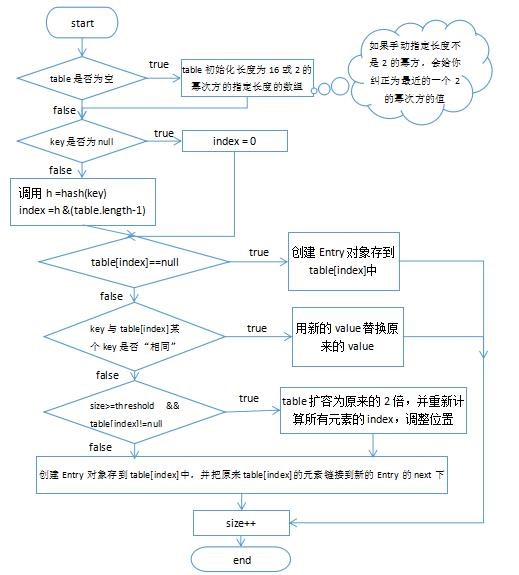

**JDK1.8** 之后 **Put** 方法：

**9.2 Java** 自带哪几种线程池？

1.  **newCachedThreadPool**

创建一个可缓存线程池，如果线程池长度超过处理需要，可灵活回收空闲线程，若无可回收，则新建线程。这种类型的线程池特点是：

工作线程的创建数量几乎没有限制（其实也有限制的，数目为 Interger. MAX_VALUE）,
这样可灵活的往线程池中添加线程。如果长时间没有往线程池中提交任务，即如果工作线程空闲了指定的时间（默认为
1
分钟），则该工作线程将自动终止。终止后，如果你又提交了新的任务，则线程池重新创建一个工作线程。

在使用 CachedThreadPool
时，一定要注意控制任务的数量，否则，由于大量线程同时运行，很有会造成系统瘫痪。

1.  **newFixedThreadPool**

创建一个指定工作线程数量的线程池。每当提交一个任务就创建一个工作线程，如果工作线程数量达到线程池初始的最大数，则将提交的任务存入到池队列中。FixedThreadPool
是一个典型且优秀的线程池，它具有线程池提高程序效率和节省创建线程时所耗的开销的优点。但是，在线程池空闲时，即线程池中没有可运行任务时，它不会释放工作线程，还会占用一定的系统资源。

1.  **newSingleThreadExecutor**

创建一个单线程化的
Executor，即只创建唯一的工作者线程来执行任务，它只会用唯一的工作线程来执行任务，保证所有任务按照指定顺序（FIFO,
LIFO,
优先级）执行。如果这个线程异常结束，会有另一个取代它，保证顺序执行。单工作线程最大的特点是可保证顺序地执行各个任务，并且在任意给定的时间不会有多个线程是活动的。

1.  **newScheduleThreadPool**

创建一个定长的线程池，而且支持定时的以及周期性的任务执行，支持定时及周期性任务执行。延迟
3 秒执行。

## 9.3 HashMap 和 HashTable 区别

1.  线程安全性不同

    HashMap 是线程不安全的，HashTable 是线程安全的，其中的方法是 Synchronize
    的，

在多线程并发的情况下，可以直接使用 HashTabl，但是使用 HashMap
时必须自己增加同步处理。

1.  是否提供 contains 方法

HashMap 只有 containsValue 和 containsKey 方法；HashTable 有
contains、containsKey 和 containsValue 三个方法，其中 contains 和 containsValue
方法功能相同。

1.  key 和 value 是否允许 null 值

Hashtable 中，key 和 value 都不允许出现 null 值。HashMap 中，null
可以作为键，这样的键只有一个；可以有一个或多个键所对应的值为 null。

1.  数组初始化和扩容机制

HashTable 在不指定容量的情况下的默认容量为 11，而 HashMap 为 16，Hashtable
不要求底层数组的容量一定要为 2 的整数次幂，而 HashMap 则要求一定为 2
的整数次幂。

Hashtable 扩容时，将容量变为原来的 2 倍加 1，而 HashMap 扩容时，将容量变为原来的
2 倍。

## 9.4 TreeSet 和 HashSet 区别

HashSet 是采用 hash 表来实现的。其中的元素没有按顺序排列，add()、remove()以及
contains()等方法都是复杂度为 O(1)的方法。

>   TreeSet 是采用树结构实现（红黑树算法）。元素是按顺序进行排列，但是
>   add()、remove()

以及 contains()等方法都是复杂度为 O(log
(n))的方法。它还提供了一些方法来处理排序的 set，如
first()，last()，headSet()，tailSet()等等。

## 9.5 String buffer 和 String build 区别

1.  StringBuffer 与 StringBuilder 中的方法和功能完全是等价的。

2.  只是 StringBuffer 中的方法大都采用了 synchronized
    关键字进行修饰，因此是线程安全的，而 StringBuilder
    没有这个修饰，可以被认为是线程不安全的。

3.  在单线程程序下，StringBuilder 效率更快，因为它不需要加锁，不具备多线程安全而
    StringBuffer 则每次都需要判断锁，效率相对更低

## 9.6 Final、Finally、Finalize

final：修饰符（关键字）有三种用法：修饰类、变量和方法。修饰类时，意味着它不能再派生出新的子类，即不能被继承，因此它和
abstract
是反义词。修饰变量时，该变量使用中不被改变，必须在声明时给定初值，在引用中只能读取不可修改，即为常量。修饰方法时，也同样只能使用，不能在子类中被重写。

finally：通常放在 try…catch
的后面构造最终执行代码块，这就意味着程序无论正常执行还是发生异常，这里的代码只要
JVM 不关闭都能执行，可以将释放外部资源的代码写在 finally 块中。

finalize：Object 类中定义的方法，Java 中允许使用 finalize()
方法在垃圾收集器将对象从内存中清除出去之前做必要的清理工作。这个方法是由垃圾收集器在销毁对象时调用的，通过重写
finalize() 方法可以整理系统资源或者执行其他清理工作。

## 9.7 ==和 Equals 区别

>   == : 如果比较的是基本数据类型，那么比较的是变量的值

>   如果比较的是引用数据类型，那么比较的是地址值（两个对象是否指向同一块内存）
>   equals:如果没重写 equals 方法比较的是两个对象的地址值。

>   如果重写了 equals 方法后我们往往比较的是对象中的属性的内容 equals 方法是从
>   Object 类中继承的，默认的实现就是使用==

>   

第 **10** 章 **Redis**

**10.1** 缓存穿透、缓存雪崩、缓存击穿

1.  缓存穿透是指查询一个一定不存在的数据。由于缓存命不中时会去查询数据库，查不到数据则不写入缓存，这将导致这个不存在的数据每次请求都要到数据库去查询，造成缓存穿透。

解决方案：

>   1是将空对象也缓存起来，并给它设置一个很短的过期时间，最长不超过 5 分钟

>   ② 采用布隆过滤器，将所有可能存在的数据哈希到一个足够大的 bitmap 中，一个一定

不存在的数据会被这个 bitmap 拦截掉，从而避免了对底层存储系统的查询压力

1.  如果缓存集中在一段时间内失效，发生大量的缓存穿透，所有的查询都落在数据库上，就会造成缓存雪崩。

解决方案：

>   尽量让失效的时间点不分布在同一个时间点

1.  缓存击穿，是指一个 key 非常热点，在不停的扛着大并发，当这个 key
    在失效的瞬间，持续的大并发就穿破缓存，直接请求数据库，就像在一个屏障上凿开了一个洞。

解决方案：

>   可以设置 key 永不过期

## 10.2 哨兵模式

主从复制中反客为主的自动版，如果主机 Down
掉，哨兵会从从机中选择一台作为主机，并将它设置为其他从机的主机，而且如果原来的主机再次启动的话也会成为从机。

## 10.3 数据类型

| string            | 字符串                      |
|-------------------|-----------------------------|
| list              | 可以重复的集合              |
| set               | 不可以重复的集合            |
| hash              | 类似于 Map\<String,String\> |
| zset(sorted set） | 带分数的 set                |

## 10.4 持久化

1.  **RDB 持久化：**

    **在指定的时间间隔内持久化**

    **服务 shutdown 会自动持久化**

**③ 输入 bgsave 也会持久化**

1.  **AOF : 以日志形式记录每个更新操作**

    Redis 重新启动时读取这个文件，重新执行新建、修改数据的命令恢复数据。

    保存策略：推荐（并且也是默认）的措施为每秒持久化一次，这种策略可以兼顾速度和安全性。

    缺点：

    1.  比起 RDB 占用更多的磁盘空间

    2.  恢复备份速度要慢

    3.  每次读写都同步的话，有一定的性能压力

    4.  存在个别 Bug，造成恢复不能**选择策略：**

        官方推荐：

如果对数据不敏感，可以选单独用 RDB；不建议单独用 AOF，因为可能出现
Bug;如果只是做纯内存缓存，可以都不用

## 11.5 悲观锁

执行操作前假设当前的操作肯定（或有很大几率）会被打断（悲观）。基于这个假设，我们在做操作前就会把相关资源锁定，不允许自己执行期间有其他操作干扰。

## 11.6 乐观锁

执行操作前假设当前操作不会被打断（乐观）。基于这个假设，我们在做操作前不会锁定资源，万一发生了其他操作的干扰，那么本次操作将被放弃。Redis
使用的就是乐观锁。

第 **11** 章 **MySql**

## 11.1 MyISAM 与 InnoDB 的区别

| 对比项 | **MyISAM**                                               | **InnoDB**                                                                     |
|--------|----------------------------------------------------------|--------------------------------------------------------------------------------|
| 外键   | 不支持                                                   | 支持                                                                           |
| 事务   | 不支持                                                   | 支持                                                                           |
| 行表锁 | 表锁，即使操作一条记录也会锁住整个表，不适合高并发的操作 | 行锁**,**操作时只锁某一行，不对其它行有影响， 适合高并发的操作                 |
| 缓存   | 只缓存索引，不缓存真实数据                               | 不仅缓存索引还要缓存真实数据，对内存要求较高，而且内存大小对性能有决定性的影响 |

## 11.2 索引优化

数据结构：B+Tree

一般来说能够达到range就可以算是优化了 idx name_deptId
口诀（两个法则加6种索引失效的情况）全值匹配我最爱，最左前缀要遵守；带头大哥不能死，中间兄弟不能断；索引列上少计算，范围之后全失效；

>   LIKE百分写最右，覆盖索引不写\*；不等空值还有OR，索引影响要注意；

>   VAR引号不可丢，SQL优化有诀窍。

## 11.3 b-tree 和 b+tree 的区别

1.  B-树的关键字、索引和记录是放在一起的，
    B+树的非叶子节点中只有关键字和指向下一个节点的索引，记录只放在叶子节点中。

2.  在B-树中，越靠近根节点的记录查找时间越快，只要找到关键字即可确定记录的存在；而B+树中每个记录的查找时间基本是一样的，都需要从根节点走到叶子节点，而且在叶子节点中还要再比较关键字。

**11.4 redis** 是单线程的，为什么那么快

1)完全基于内存，绝大部分请求是纯粹的内存操作，非常快速。

2)数据结构简单，对数据操作也简单，Redis中的数据结构是专门进行设计的

3)采用单线程，避免了不必要的上下文切换和竞争条件，也不存在多进程或者多线程导致的切换而消耗
CPU，不用去考虑各种锁的问题，不存在加锁释放锁操作，没有因为可能出现死锁而导致的性能消耗

4)使用多路I/O复用模型，非阻塞IO

5)使用底层模型不同，它们之间底层实现方式以及与客户端之间通信的应用协议不一样，

Redis直接自己构建了VM 机制
，因为一般的系统调用系统函数的话，会浪费一定的时间去移动和请求

## 11.5 MySQL 的事务

一、事务的基本要素（ACID）

1.  原子性（Atomicity）：事务开始后所有操作，要么全部做完，要么全部不做，不可能停滞在中间环节。事务执行过程中出错，会回滚到事务开始前的状态，所有的操作就像没有发生一样。也就是说事务是一个不可分割的整体，就像化学中学过的原子，是物质构成的基本单位

2.  一致性（Consistency）：事务开始前和结束后，数据库的完整性约束没有被破坏
    。比如

A向B转账，不可能A扣了钱，B却没收到。
3、隔离性（Isolation）：同一时间，只允许一个事务请求同一数据，不同的事务之间彼此没有任何干扰。比如A正在从一张银行卡中取钱，在A取钱的过程结束前，B不能向这张卡转账。

4、持久性（Durability）：事务完成后，事务对数据库的所有更新将被保存到数据库，不能回滚。

二、事务的并发问题

1.  脏读：事务A读取了事务B更新的数据，然后B回滚操作，那么A读取到的数据是脏数据

2.  不可重复读：事务 A 多次读取同一数据，事务 B
    在事务A多次读取的过程中，对数据作了更新并提交，导致事务A多次读取同一数据时，结果
    不一致

3.  幻读：系统管理员A将数据库中所有学生的成绩从具体分数改为ABCDE等级，但是系统管理员B就在这个时候插入了一条具体分数的记录，当系统管理员A改结束后发现还有一条记录没有改过来，就好像发生了幻觉一样，这就叫幻读。

小结：不可重复读的和幻读很容易混淆，不可重复读侧重于修改，幻读侧重于新增或删除。

解决不可重复读的问题只需锁住满足条件的行，解决幻读需要锁表

三、MySQL事务隔离级别

| 事务隔离级别                 | 脏读 | 不可重复读 | 幻读 |
|------------------------------|------|------------|------|
| 读未提交（read-uncommitted） | 是   | 是         | 是   |
| 不可重复读（read-committed） | 否   | 是         | 是   |
| 可重复读（repeatable-read）  | 否   | 否         | 是   |
| 串行化（serializable）       | 否   | 否         | 否   |

第 **12** 章 **JVM**

**12.1 JVM** 内存分哪几个区，每个区的作用是什么**?**

java 虚拟机主要分为以下几个区:

1.  方法区：

    1.  有时候也成为永久代，在该区内很少发生垃圾回收，但是并不代表不发生
        GC，在这里进行的 GC 主要是对方法区里的常量池和对类型的卸载

        1.  方法区主要用来存储已被虚拟机加载的类的信息、常量、静态变量和即时编译器编译后的代码等数据。

        2.  该区域是被线程共享的。

        3.  方法区里有一个运行时常量池，用于存放静态编译产生的字面量和符号引用。该常量池具有动态性，也就是说常量并不一定是编译时确定，运行时生成的常量也会存在这个常量池中。

2.  虚拟机栈:

    1.  虚拟机栈也就是我们平常所称的栈内存,它为 java
        方法服务，每个方法在执行的时候都会创建一个栈帧，用于存储局部变量表、操作数栈、动态链接和方法出口等信息。

        1.  虚拟机栈是线程私有的，它的生命周期与线程相同。

        2.  局部变量表里存储的是基本数据类型、returnAddress
            类型（指向一条字节码指令的地址）和对象引用，这个对象引用有可能是指向对象起始地址的一个指针，也有可能是代表对象的句柄或者与对象相关联的位置。局部变量所需的内存空间在编译器间确定

        3.  操作数栈的作用主要用来存储运算结果以及运算的操作数，它不同于局部变量表通过索引来访问，而是压栈和出栈的方式

        4.  每个栈帧都包含一个指向运行时常量池中该栈帧所属方法的引用，持有这个引用是为了支持方法调用过程中的动态连接.动态链接就是将常量池中的符号引用在运行期转化为直接引用。

3.  本地方法栈：

    本地方法栈和虚拟机栈类似，只不过本地方法栈为 Native 方法服务。

4.  堆：

java
堆是所有线程所共享的一块内存，在虚拟机启动时创建，几乎所有的对象实例都在这里创建，因此该区域经常发生垃圾回收操作。

1.  程序计数器：

内存空间小，字节码解释器工作时通过改变这个计数值可以选取下一条需要执行的字节码指令，分支、循环、跳转、异常处理和线程恢复等功能都需要依赖这个计数器完成。该内存区域是唯一一个
java 虚拟机规范没有规定任何 OOM 情况的区域。

**12.2 Java** 类加载过程**?**

Java 类加载需要经历一下几个过程：

1.  加载加载时类加载的第一个过程，在这个阶段，将完成一下三件事情： a.
    通过一个类的全限定名获取该类的二进制流。

    1.  将该二进制流中的静态存储结构转化为方法去运行时数据结构。

        1.  在内存中生成该类的 Class 对象，作为该类的数据访问入口。

2.  验证

验证的目的是为了确保 Class
文件的字节流中的信息不回危害到虚拟机.在该阶段主要完成以下四钟验证:

1.  文件格式验证：验证字节流是否符合 Class
    文件的规范，如主次版本号是否在当前虚拟机范围内，常量池中的常量是否有不被支持的类型.

    1.  元数据验证:对字节码描述的信息进行语义分析，如这个类是否有父类，是否集成了不被继承的类等。

        1.  字节码验证：是整个验证过程中最复杂的一个阶段，通过验证数据流和控制流的分析，确定程序语义是否正确，主要针对方法体的验证。如：方法中的类型转换是否正确，跳转指令是否正确等。

        2.  符号引用验证：这个动作在后面的解析过程中发生，主要是为了确保解析动作能正确执行。

        3.  准备

准备阶段是为类的静态变量分配内存并将其初始化为默认值，这些内存都将在方法区中进行分配。准备阶段不分配类中的实例变量的内存，实例变量将会在对象实例化时随着对象一起分配在
Java 堆中。

1.  解析

该阶段主要完成符号引用到直接引用的转换动作。解析动作并不一定在初始化动作完成之前，也有可能在初始化之后。

1.  初始化

初始化时类加载的最后一步，前面的类加载过程，除了在加载阶段用户应用程序可以通过自定义类加载器参与之外，其余动作完全由虚拟机主导和控制。到了初始化阶段，才真正开始执行类中定义的
Java 程序代码。

**12.3 java** 中垃圾收集的方法有哪些**?**

1.  引用计数法 应用于：微软的COM/ActionScrip3/Python等

    a) 如果对象没有被引用，就会被回收，缺点：需要维护一个引用计算器

2.  复制算法 年轻代中使用的是Minor GC，这种GC算法采用的是复制算法(Copying)

    1.  效率高，缺点：需要内存容量大，比较耗内存

        1.  使用在占空间比较小、刷新次数多的新生区

3.  标记清除 老年代一般是由标记清除或者是标记清除与标记整理的混合实现

    a) 效率比较低，会差生碎片。

4.  标记压缩 老年代一般是由标记清除或者是标记清除与标记整理的混合实现

    a) 效率低速度慢，需要移动对象，但不会产生碎片。

5.  标记清除压缩标记清除-标记压缩的集合，多次GC后才Compact a)
    使用于占空间大刷新次数少的养老区，是3 4的集合体

**12.4** 如何判断一个对象是否存活**?(**或者 **GC** 对象的判定方法**)**

判断一个对象是否存活有两种方法:

1.  引用计数法

2.  可达性算法(引用链法)

**12.5** 什么是类加载器，类加载器有哪些**?**

实现通过类的权限定名获取该类的二进制字节流的代码块叫做类加载器。

主要有一下四种类加载器:

1.  启动类加载器(Bootstrap ClassLoader)用来加载 java 核心类库，无法被 java
    程序直接引用。

2.  扩展类加载器(extensions class loader):它用来加载 Java 的扩展库。Java
    虚拟机的实现

    会提供一个扩展库目录。该类加载器在此目录里面查找并加载 Java 类。

3.  系统类加载器（system class loader）也叫应用类加载器：它根据 Java
    应用的类路径（CLASSPATH）来加载 Java 类。一般来说，Java
    应用的类都是由它来完成加载的。

    可以通过 ClassLoader.getSystemClassLoader()来获取它。

4.  用户自定义类加载器，通过继承 java.lang.ClassLoader 类的方式实现。

**12.6** 简述 **Java** 内存分配与回收策略以及 **Minor GC** 和 **Major GC**

## （full GC）

内存分配：

1.  栈区：栈分为 java 虚拟机栈和本地方法栈

2.  堆区：堆被所有线程共享区域，在虚拟机启动时创建，唯一目的存放对象实例。堆区是
    gc 的主要区域，通常情况下分为两个区块年轻代和年老代。更细一点年轻代又分为
    Eden 区，主要放新创建对象，From survivor 和 To survivor 保存 gc
    后幸存下的对象，默认情况下各自占比 8:1:1。

3.  方法区：被所有线程共享区域，用于存放已被虚拟机加载的类信息，常量，静态变量等数据。被
    Java 虚拟机描述为堆的一个逻辑部分。习惯是也叫它永久代（permanment
    generation）

4.  程序计数器：当前线程所执行的行号指示器。通过改变计数器的值来确定下一条指令，比如循环，分支，跳转，异常处理，线程恢复等都是依赖计数器来完成。线程私有的。

回收策略以及 **Minor GC** 和 **Major GC**：

1.  对象优先在堆的 Eden 区分配。

2.  大对象直接进入老年代。

3.  长期存活的对象将直接进入老年代。

当 Eden 区没有足够的空间进行分配时，虚拟机会执行一次 Minor GC.Minor GC
通常发生在新生代的 Eden 区，在这个区的对象生存期短，往往发生 GC
的频率较高，回收速度比较快;Full Gc/Major GC 发生在老年代，一般情况下，触发老年代
GC 的时候不会触发 Minor GC,但是通过配置，可以在 Full GC 之前进行一次 Minor GC
这样可以加快老年代的回收速度。

第 **13** 章 **JUC**

### 13.1 Synchronized 与 Lock 的区别

1.  Synchronized 能实现的功能 Lock 都可以实现，而且 Lock 比 Synchronized
    更好用，更灵活。

2.  Synchronized 可以自动上锁和解锁；Lock 需要手动上锁和解锁

### 13.2 Runnable 和 Callable 的区别

1.  Runnable 接口中的方法没有返回值；Callable 接口中的方法有返回值

2.  Runnable 接口中的方法没有抛出异常；Callable 接口中的方法抛出了异常

3.  Runnable 接口中的落地方法是 call 方法；Callable 接口中的落地方法是 run 方法

    1.  什么是分布式锁

当在分布式模型下，数据只有一份（或有限制），此时需要利用锁的技术控制某一时刻修改数据的进程数。分布式锁可以将标记存在内存，只是该内存不是某个进程分配的内存而是公共内存，如
Redis，通过 set (key,value,nx,px,timeout)方法添加分布式锁。

1.  什么是分布式事务

分布式事务指事务的参与者、支持事务的服务器、资源服务器以及事务管理器分别位于不同的分布式系统的不同节点之上。简单的说，就是一次大的操作由不同的小操作组成，这些小的操作分布在不同的服务器上，且属于不同的应用，分布式事务需要保证这些小操作要么全部成功，要么全部失败。

第 **14** 章面试说明

**14.1** 面试过程最关键的是什么？

1.  大大方方的聊，放松

2.  体现优势，避免劣势

**14.2** 面试时该怎么说？

1.  语言表达清楚

    1.  思维逻辑清晰，表达流畅

    2.  一二三层次表达

2.  所述内容不犯错

    1.  不说前东家或者自己的坏话

    2.  往自己擅长的方面说

    3.  实质，对考官来说，内容听过，就是自我肯定；没听过，那就是个学习的过程。

## 14.3 面试技巧

### 14.3.1 六个常见问题

1.  你的优点是什么？

    大胆的说出自己各个方面的优势和特长

2.  你的缺点是什么？

    不要谈自己真实问题；用“缺点”衬托自己的优点

3.  你的离职原因是什么？

    -   不说前东家坏话，哪怕被伤过

    -   合情合理合法

    -   不要说超过 1 个以上的原因

4.  您对薪资的期望是多少？

    -   非终面不深谈薪资

    -   只说区间，不说具体数字

    -   底线是不低于当前薪资

    -   非要具体数字，区间取中间值，或者当前薪资的+20%

5.  您还有什么想问的问题？

    -   这是体现个人眼界和层次的问题

    -   问题本身不在于面试官想得到什么样的答案，而在于你跟别的应聘者的对比

    -   标准答案：

        公司希望我入职后的 3-6
        个月内，给公司解决什么样的问题公司（或者对这个部门）未来的战略规划是什么样子的？

        以你现在对我的了解，您觉得我需要多长时间融入公司？

6.  您最快多长时间能入职？

    一周左右，如果公司需要，可以适当提前。

### 14.3.2 两个注意事项

1.  职业化的语言

2.  职业化的形象

#### **14.3.3** 自我介绍（控制在 **4** 分半以内，不超过 **5** 分钟）

1.  个人基本信息

2.  工作履历时间、公司名称、任职岗位、主要工作内容、工作业绩、离职原因

3.  深度沟通（也叫压力面试）刨根问底下沉式追问（注意是下沉式，而不是发散式的）基本技巧：往自己熟悉的方向说

第 **15** 章 **LeetCode** 题目精选

>   [https://labuladong.gitbook.io/algo/di-ling-zhang-bi-du-xi-lie/xue-xi-shu-ju-jie-gou-he-suan-fa-de](https://labuladong.gitbook.io/algo/di-ling-zhang-bi-du-xi-lie/xue-xi-shu-ju-jie-gou-he-suan-fa-de-gao-xiao-fang-fa)gao-xiao-fang-fa

## 15.1 两数之和

问题链接：https://leetcode-cn.com/problems/two-sum/

### 15.1.1 问题描述

给定一个整数数组 nums 和一个目标值
target，请你在该数组中找出和为目标值的那两个整数，并返回他们的数组下标。

>   你可以假设每种输入只会对应一个答案。但是，你不能重复利用这个数组中同样的元素。

>   \`\`\`

>   给定 nums = [2, 7, 11, 15], target = 9

>   因为 nums[0] + nums[1] = 2 + 7 = 9 所以返回 [0, 1]

>   \`\`\`

### 15.1.2 参考答案

>   \`\`\`java

>   class Solution { public int[] twoSum(int[] nums, int target) { Map\<Integer,
>   Integer\> map = new HashMap\<\>(); for (int i = 0; i \< nums.length; i++) {
>   int complement = target - nums[i]; if (map.containsKey(complement)) { return
>   new int[] { map.get(complement), i };

>   } map.put(nums[i], i);

>   } throw new IllegalArgumentException("No two sum solution"); }

>   }

>   \`\`\`

## 15.2 爬楼梯

问题链接：https://leetcode-cn.com/problems/climbing-stairs/

### 15.2.1 问题描述

假设你正在爬楼梯。需要 n 阶你才能到达楼顶。

每次你可以爬 1 或 2 个台阶。你有多少种不同的方法可以爬到楼顶呢？注意：给定 n
是一个正整数。

示例 1：

\`\`\`

输入： 2 输出： 2 解释： 有两种方法可以爬到楼顶。

1.  1 阶 + 1 阶 2. 2 阶

\`\`\`

示例 2：

\`\`\`

输入： 3

输出： 3 解释： 有三种方法可以爬到楼顶。 1. 1 阶 + 1 阶 + 1 阶

1.  1 阶 + 2 阶

2.  2 阶 + 1 阶

\`\`\`

### 15.2.2 参考答案

\`\`\`java public class Solution { public int climbStairs(int n) { if (n == 1) {

>   return 1; } int[] dp = new int[n + 1]; dp[1] = 1; dp[2] = 2; for (int i = 3;
>   i \<= n; i++) { dp[i] = dp[i - 1] + dp[i - 2];

>   } return dp[n];

>   }

}

\`\`\`

**15.3** 翻转二叉树

链接：https://leetcode-cn.com/problems/invert-binary-tree/

### 15.3.1 问题描述

翻转一棵二叉树。示例：

输入：

\`\`\`

>   4

/ \\

2 7

/ \\ / \\

1 3 6 9

\`\`\`

输出：

\`\`\`

>   4

/ \\

7 2

/ \\ / \\

9 6 3 1

\`\`\`

### 15.3.2 参考答案

\`\`\`java public TreeNode invertTree(TreeNode root) { if (root == null) {
return null;

>   }

>   TreeNode right = invertTree(root.right); TreeNode left =
>   invertTree(root.left); root.left = right; root.right = left; return root;

}

\`\`\`

## 15.4 反转链表

链接：https://leetcode-cn.com/problems/reverse-linked-list/

### 15.4.1 问题描述

反转一个单链表。

示例:

\`\`\`

输入: 1-\>2-\>3-\>4-\>5-\>NULL 输出: 5-\>4-\>3-\>2-\>1-\>NULL

\`\`\`

### 15.4.2 参考答案

\`\`\`java public ListNode reverseList(ListNode head) {

>   ListNode prev = null; ListNode curr = head; while (curr != null) { ListNode
>   nextTemp = curr.next; curr.next = prev; prev = curr; curr = nextTemp; }
>   return prev;

}

\`\`\`

## 15.5 LRU 缓存机制

链接：https://leetcode-cn.com/problems/lru-cache/

### 15.5.1 问题描述

运用你所掌握的数据结构，设计和实现一个 LRU (最近最少使用)
缓存机制。它应该支持以下操作： 获取数据 get 和 写入数据 put 。

获取数据 get(key) - 如果密钥 (key)
存在于缓存中，则获取密钥的值（总是正数），否则返回 -1。

写入数据 put(key, value) -
如果密钥不存在，则写入其数据值。当缓存容量达到上限时，它应该在写入新数据之前删除最近最少使用的数据值，从而为新的数据值留出空间。

>   进阶: 你是否可以在 O(1) 时间复杂度内完成这两种操作？

示例:

\`\`\`

LRUCache cache = new LRUCache( 2 /\* 缓存容量 \*/ );

cache.put(1, 1); cache.put(2, 2);

| cache.get(1);    | // 返回 1                  |
|------------------|----------------------------|
| cache.put(3, 3); | // 该操作会使得密钥 2 作废 |
| cache.get(2);    | // 返回 -1 (未找到)        |
| cache.put(4, 4); | // 该操作会使得密钥 1 作废 |
| cache.get(1);    | // 返回 -1 (未找到)        |
| cache.get(3);    | // 返回 3                  |
| cache.get(4);    | // 返回 4                  |

\`\`\`

### 15.5.2 参考答案

\`\`\`java

>   class LRUCache extends LinkedHashMap\<Integer, Integer\>{ private int
>   capacity;

>   public LRUCache(int capacity) { super(capacity, 0.75F, true); this.capacity
>   = capacity;

>   }

>   public int get(int key) { return super.getOrDefault(key, -1);

>   }

>   public void put(int key, int value) { super.put(key, value);

>   }

>   @Override protected boolean removeEldestEntry(Map.Entry\<Integer, Integer\>
>   eldest) { return size() \> capacity;

>   }

}

/\*\*

-   LRUCache 对象会以如下语句构造和调用:

-   LRUCache obj = new LRUCache(capacity);

-   int param_1 = obj.get(key);

-   obj.put(key,value);

    \*/

\`\`\`

**15.6** 最长回文子串

链接：https://leetcode-cn.com/problems/longest-palindromic-substring/

### 15.6.1 问题描述

给定一个字符串 s，找到 s 中最长的回文子串。你可以假设 s 的最大长度为 1000。示例
1：

\`\`\`

输入: "babad" 输出: "bab"

注意: "aba" 也是一个有效答案。

\`\`\`

示例 2：

\`\`\`

输入: "cbbd" 输出: "bb"

\`\`\`

### 15.6.2 参考答案

\`\`\`java public String longestPalindrome(String s) { if (s == null \|\|
s.length() \< 1) return ""; int start = 0, end = 0; for (int i = 0; i \<
s.length(); i++) { int len1 = expandAroundCenter(s, i, i); int len2 =
expandAroundCenter(s, i, i + 1); int len = Math.max(len1, len2); if (len \> end
\- start) { start = i - (len - 1) / 2; end = i + len / 2;

>   }

>   } return s.substring(start, end + 1);

}

>   private int expandAroundCenter(String s, int left, int right) { int L =
>   left, R = right; while (L \>= 0 && R \< s.length() && s.charAt(L) ==
>   s.charAt(R)) {

>   L--;

>   R++; } return R - L - 1;

}

\`\`\`

**15.7** 有效的括号

链接：https://leetcode-cn.com/problems/valid-parentheses/

### 15.7.1 问题描述

>   给定一个只包括 '('，')'，'{'，'}'，'['，']' 的字符串，判断字符串是否有效。

>   有效字符串需满足： 1. 左括号必须用相同类型的右括号闭合。

>   2\. 左括号必须以正确的顺序闭合。

>   注意空字符串可被认为是有效字符串。

示例 1:

\`\`\`

输入: "()" 输出: true

\`\`\`

示例 2:

\`\`\`

输入: "()[]{}" 输出: true

\`\`\`

示例 3:

\`\`\`

输入: "(]" 输出: false

\`\`\`

示例 4:

\`\`\`

输入: "([)]" 输出: false

\`\`\`

示例 5:

\`\`\`

输入: "{[]}" 输出: true

\`\`\`

### 15.7.2 参考答案

\`\`\`java class Solution {

>   // Hash table that takes care of the mappings. private HashMap\<Character,
>   Character\> mappings; // Initialize hash map with mappings. This simply
>   makes the code easier to read. public Solution() { this.mappings = new
>   HashMap\<Character, Character\>();

>   this.mappings.put(')', '('); this.mappings.put('}', '{');
>   this.mappings.put(']', '[');

>   }

>   public boolean isValid(String s) {

>   // Initialize a stack to be used in the algorithm. Stack\<Character\> stack
>   = new Stack\<Character\>();

>   for (int i = 0; i \< s.length(); i++) { char c = s.charAt(i);

>   // If the current character is a closing bracket. if
>   (this.mappings.containsKey(c)) {

>   // Get the top element of the stack. If the stack is empty, set a dummy
>   value of '\#' char topElement = stack.empty() ? '\#' : stack.pop();

>   // If the mapping for this bracket doesn't match the stack's top element,
>   return false. if (topElement != this.mappings.get(c)) { return false;

>   }

>   } else {

>   // If it was an opening bracket, push to the stack.

>   stack.push(c);

>   }

>   }

>   // If the stack still contains elements, then it is an invalid expression.
>   return stack.isEmpty();

>   }

}

\`\`\`

**15.8** 数组中的第 **K** 个最大元素

链接：https://leetcode-cn.com/problems/kth-largest-element-in-an-array/

### 15.8.1 问题描述

在未排序的数组中找到第 k 个最大的元素。请注意，你需要找的是数组排序后的第 k
个最大的元素，而不是第 k 个不同的元素。

示例 1:

\`\`\`

输入: [3,2,1,5,6,4] 和 k = 2

输出: 5

\`\`\`

示例 2:

\`\`\`

输入: [3,2,3,1,2,4,5,5,6] 和 k = 4

输出: 4

\`\`\`

说明:

你可以假设 k 总是有效的，且 1 ≤ k ≤ 数组的长度。

### 15.8.2 参考答案

\`\`\`java

import java.util.Random; class Solution { int [] nums;

>   public void swap(int a, int b) { int tmp = this.nums[a]; this.nums[a] =
>   this.nums[b]; this.nums[b] = tmp; }

>   public int partition(int left, int right, int pivot_index) { int pivot =
>   this.nums[pivot_index]; // 1. move pivot to end swap(pivot_index, right);
>   int store_index = left;

>   // 2. move all smaller elements to the left for (int i = left; i \<= right;
>   i++) { if (this.nums[i] \< pivot) { swap(store_index, i); store_index++;

>   }

>   }

>   // 3. move pivot to its final place swap(store_index, right);

>   return store_index;

>   }

>   public int quickselect(int left, int right, int k_smallest) {

>   /\*

>   Returns the k-th smallest element of list within left..right.

>   \*/

>   if (left == right) // If the list contains only one element, return
>   this.nums[left]; // return that element

>   // select a random pivot_index

>   Random random_num = new Random();

>   int pivot_index = left + random_num.nextInt(right - left);

>   pivot_index = partition(left, right, pivot_index);

>   // the pivot is on (N - k)th smallest position if (k_smallest ==
>   pivot_index) return this.nums[k_smallest]; // go left side else if
>   (k_smallest \< pivot_index) return quickselect(left, pivot_index - 1,
>   k_smallest);

>   // go right side return quickselect(pivot_index + 1, right, k_smallest);

>   }

>   public int findKthLargest(int[] nums, int k) { this.nums = nums; int size =
>   nums.length;

>   // kth largest is (N - k)th smallest

>   return quickselect(0, size - 1, size - k);

>   }

}

\`\`\`

## 15.9 实现 Trie (前缀树)

### 15.9.1 问题描述

实现一个 Trie (前缀树)，包含 insert, search, 和 startsWith 这三个操作。示例:

\`\`\`

Trie trie = new Trie();

trie.insert("apple");

trie.search("apple"); // 返回 true trie.search("app"); // 返回 false
trie.startsWith("app"); // 返回 true

trie.insert("app");

trie.search("app"); // 返回 true

\`\`\`

说明:

-   你可以假设所有的输入都是由小写字母 a-z 构成的。

-   保证所有输入均为非空字符串。

### 15.9.2 参考答案

\`\`\`java class Trie { private TrieNode root;

>   public Trie() {

>   root = new TrieNode();

>   }

>   // Inserts a word into the trie. public void insert(String word) { TrieNode
>   node = root; for (int i = 0; i \< word.length(); i++) { char currentChar =
>   word.charAt(i); if (!node.containsKey(currentChar)) { node.put(currentChar,
>   new TrieNode());

>   } node = node.get(currentChar);

>   } node.setEnd();

>   }

>   // search a prefix or whole key in trie and // returns the node where search
>   ends private TrieNode searchPrefix(String word) { TrieNode node = root; for
>   (int i = 0; i \< word.length(); i++) { char curLetter = word.charAt(i); if
>   (node.containsKey(curLetter)) { node = node.get(curLetter);

>   } else {

>   return null;

>   } } return node; }

>   // Returns if the word is in the trie. public boolean search(String word) {
>   TrieNode node = searchPrefix(word); return node != null && node.isEnd();

>   }

}

\`\`\`

## 15.10 编辑距离

链接：https://leetcode-cn.com/problems/edit-distance/

### 15.10.1 问题描述

给定两个单词 word1 和 word2，计算出将 word1 转换成 word2 所使用的最少操作数 。

你可以对一个单词进行如下三种操作：

1.  插入一个字符

2.  删除一个字符

3.  替换一个字符

示例 1:

\`\`\`

输入: word1 = "horse", word2 = "ros"

输出: 3 解释:

horse -\> rorse (将 'h' 替换为 'r') rorse -\> rose (删除 'r') rose -\> ros (删除
'e')

\`\`\`

示例 2:

\`\`\`

输入: word1 = "intention", word2 = "execution"

输出: 5 解释:

intention -\> inention (删除 't') inention -\> enention (将 'i' 替换为 'e')
enention -\> exention (将 'n' 替换为 'x') exention -\> exection (将 'n' 替换为
'c') exection -\> execution (插入 'u')

\`\`\`

### 15.10.2 参考答案

\`\`\`java class Solution { public int minDistance(String word1, String word2) {
int n = word1.length(); int m = word2.length();

>   // if one of the strings is empty if (n \* m == 0) return n + m;

>   // array to store the convertion history int [][] d = new int[n + 1][m + 1];

>   // init boundaries

>   for (int i = 0; i \< n + 1; i++) {

>   d[i][0] = i; } for (int j = 0; j \< m + 1; j++) {

>   d[0][j] = j;

>   }

>   // DP compute for (int i = 1; i \< n + 1; i++) { for (int j = 1; j \< m + 1;
>   j++) { int left = d[i - 1][j] + 1; int down = d[i][j - 1] + 1; int left_down
>   = d[i - 1][j - 1]; if (word1.charAt(i - 1) != word2.charAt(j - 1)) left_down
>   \+= 1; d[i][j] = Math.min(left, Math.min(down, left_down));

>   } } return d[n][m];

>   }

}

\`\`\`
